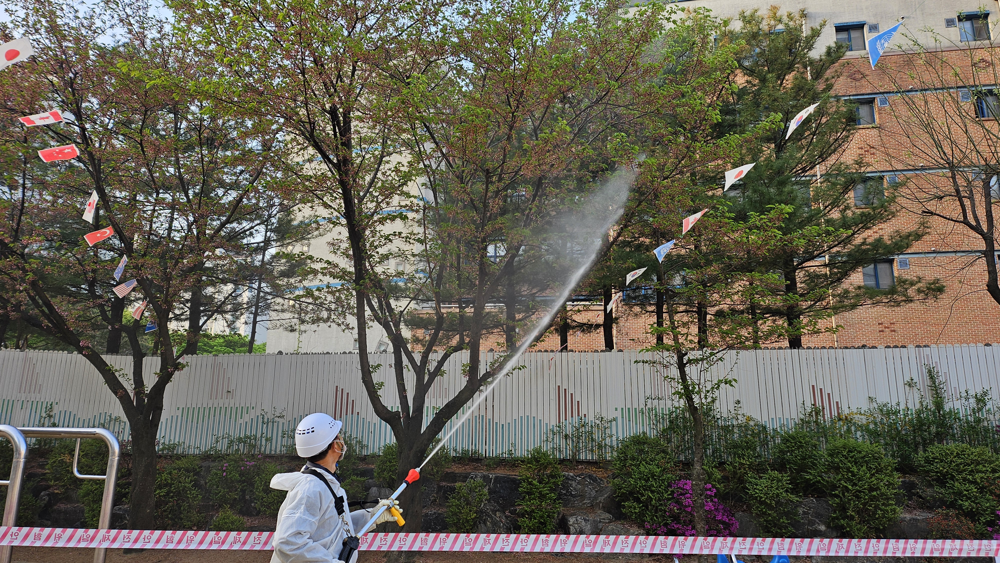
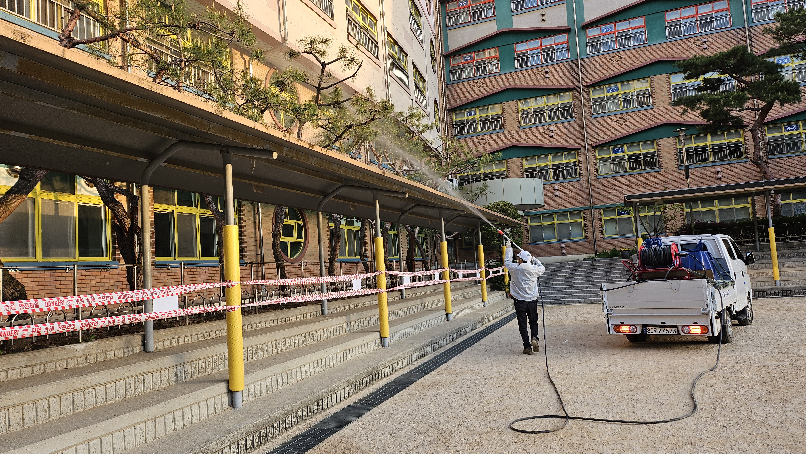
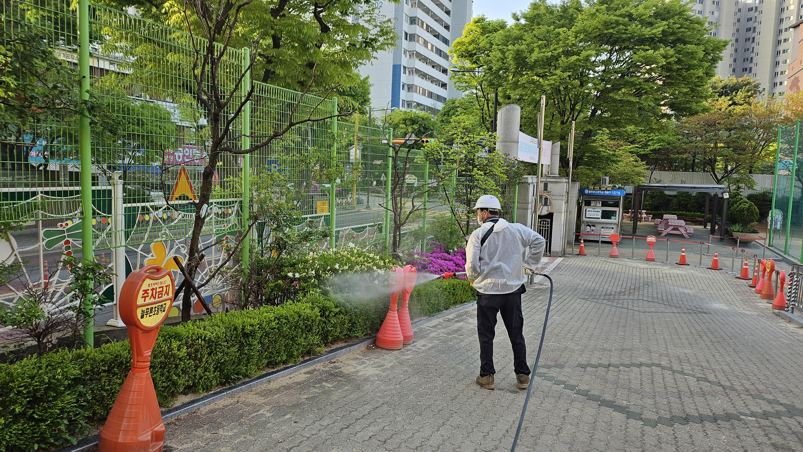
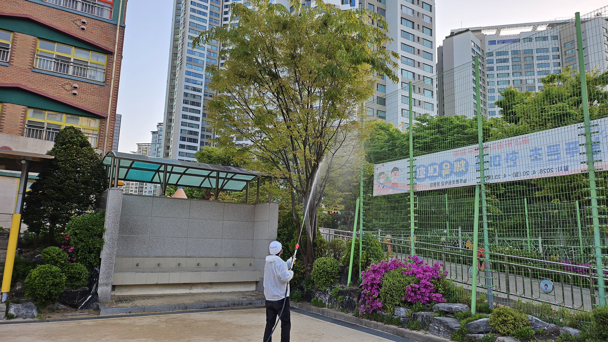
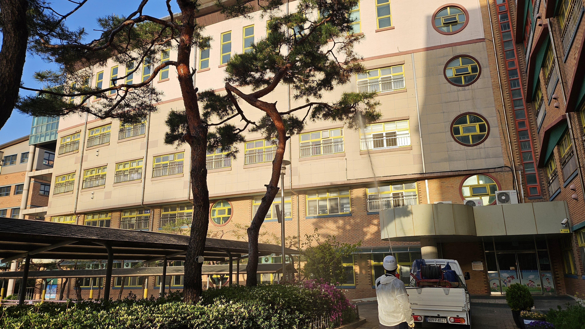
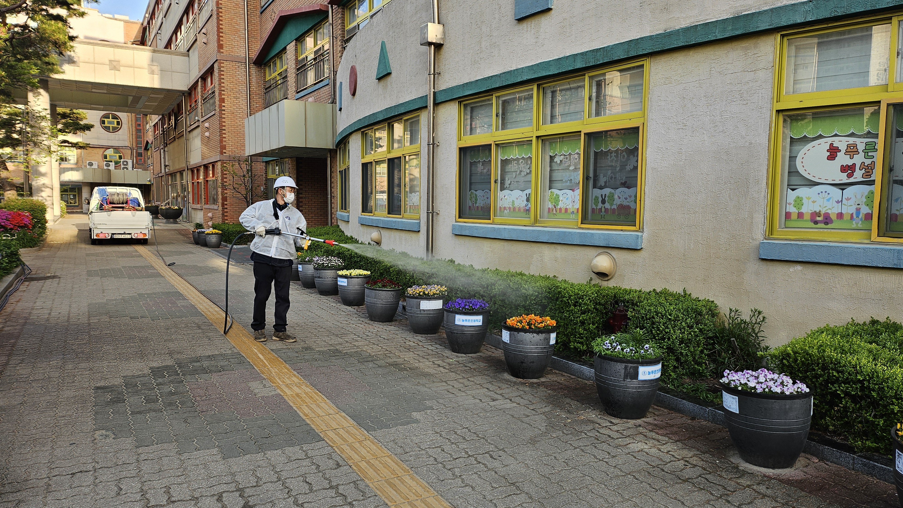
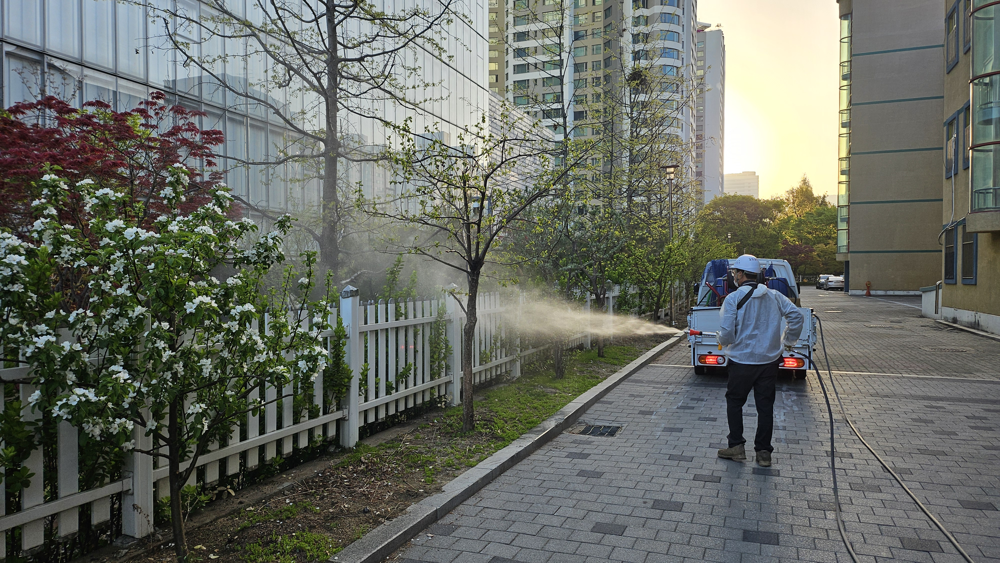
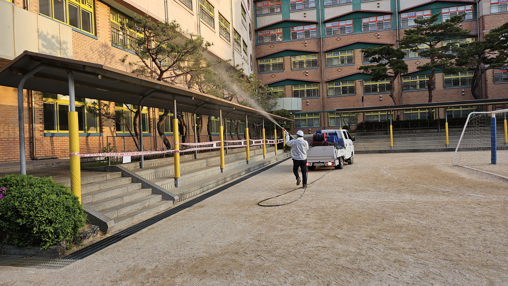

## 공사 개요

| 구분           | 내용                                                          |
| -------------- | ------------------------------------------------------------- |
| 대상지         | 성남시 늘푸른초등학교 교내 전역(운동장 경계부·통학로·교사동 주변) |
| 작업 일자      | 2026년 4월 18일(토요일)                                        |
| 작업 내용      | 교목 수관 및 관목 병해충 방제 약제 살포, 작업 구역 통제        |
| 투입 장비      | 1톤 방제차량(약액 탱크·호스릴), 동력분무기, 고압 살포건        |
| 안전 조치      | 홍백 안전띠 설치, 라바콘·주차금지 표지 배치                    |
| 주요 대상 수종 | 벚나무, 소나무, 단풍나무, 철쭉류, 회양목 생울타리              |

봄철 학교 방제의 표적은 분명합니다. 벚나무에 붙는 **진딧물**과 **깍지벌레**, 철쭉의 **방패벌레**, 회양목의 **명나방**입니다. 이들은 모두 4월 중하순에 월동 개체가 활동을 시작하거나 약충이 부화합니다. 이 시기를 놓치면 5월 이후 성충기에 고농도로 여러 번 쳐야 하고, 그만큼 수목과 학교 환경에 부담이 갑니다.

---

## 작업은 통제선에서 시작한다

학교 방제는 살포보다 **구획 통제**가 먼저입니다. 사진에서 살포 지점 앞을 가로지르는 홍백 안전띠가 그 역할을 합니다. 주말이라 학생은 없지만, 운동장을 개방하는 학교에서는 외부 이용자가 언제든 들어옵니다.

방제차량은 운동장 쪽에 거점을 잡고 호스를 늘려 작업했습니다. 학교 안은 차량 진입 동선이 좁아, 차를 자주 옮기는 것보다 **호스 길이로 반경을 확보하는 편**이 안전하고 빠릅니다.

통학로처럼 보행 동선과 겹치는 구간은 라바콘과 주차금지 표지로 물리적 경계를 만들었습니다. 안전띠는 시선을 끌지만 넘어 들어올 수 있고, 콘은 차량까지 막습니다.

---

## 대상별 살포

벚나무는 이 학교에서 가장 개체 수가 많고 피해도 빠르게 드러나는 수종입니다. 진딧물이 붙으면 **감로**가 아래로 떨어져 그을음병이 따라오고, 그 아래 놓인 벤치와 놀이시설이 끈적해집니다. 신초와 잎 뒷면에 약액이 닿도록 아래에서 위로 밀어 올려 살포했습니다.

소나무는 수관이 높고 침엽이 촘촘해 약액이 겉에서 튕겨 나가기 쉽습니다. 노즐 압력을 올려 침엽 사이로 밀어 넣고, 가지 기부와 수피 틈까지 젖도록 시간을 더 씁니다.

회양목 생울타리는 **회양목명나방**이 표적입니다. 유충이 신초를 거미줄처럼 얽고 그 안에서 잎을 갉아 먹기 때문에, 겉면만 적시면 안쪽 유충에게 약액이 닿지 않습니다. 살대를 생울타리 속으로 넣어 안쪽부터 적시고 겉면을 마감했습니다.

개화 중인 수목은 취급이 다릅니다. 꽃이 활짝 핀 상태에서 살충제를 직접 뒤집어씌우면 방화곤충 피해가 생깁니다. 개화부는 피하고 **신초와 잎, 수간 위주로** 살포 범위를 좁혔습니다.

마지막은 운동장 쪽에서 회랑 지붕 너머 교사동 주변 수목까지 원거리 살포로 마무리했습니다.

---

## 시공 결과 및 후속 관리

교내 교목·관목·생울타리 전역의 1차 방제를 완료했습니다. 후속 관리는 다음과 같이 잡았습니다.

1. **2주 후 육안 예찰** — 벚나무 신초와 철쭉 잎 뒷면에서 잔존 개체를 확인하고, 밀도가 남아 있으면 부분 보완 방제를 시행합니다.
2. **장마 전 살균 방제** — 습도가 오르면 흰가루병·점무늬병 발생 확률이 높아지므로 시기를 별도로 잡습니다.
3. **여름철 미국흰불나방** — 군서기 유충은 가지 단위로 잘라 내는 물리적 제거가 약제보다 효율적입니다. 발견 즉시 제거 요청을 받습니다.

**💡 나무의사의 관리 팁**

학교 방제에서 가장 흔한 실수는 **꽃이 예쁠 때 치는 것**입니다. 벚꽃이 만개했을 때 살포하면 보기에는 방제를 열심히 한 것 같지만, 정작 진딧물 약충은 아직 부화 전이거나 이미 성충으로 넘어간 뒤입니다. 개화기보다 **낙화 직후 신초가 올라오는 시점**이 봄철 흡즙성 해충 방제의 적기입니다.

---

## 시공·진단 의뢰 문의

**느티나무병원 협동조합** — 산림청 등록 1종 나무병원 · 조경식재공사업

- 전화 **031-752-6000**
- 팩스 031-752-6001
- 이메일 coopneuti@naver.com
- 본점 경기도 성남시 수정구 태평로 104

학교 수목 방제는 진단 → 처방 → 시행 → 사후 예찰의 순서로 진행하며, 시행일은 학사 일정에 맞춰 조율합니다. 교내 수목 관리, 예초·제초, 화단 조성까지 연간 단위로 묶어 계약하면 회차별 적기 대응이 쉬워집니다. 교육지원청·관공서 **수의계약**은 실적증명서와 자격·면허 증빙을 견적서와 함께 제공합니다.

_(본 게시물의 사진은 모두 실제 시공 현장에서 촬영한 것입니다.)_
