## 공사 개요

| 구분      | 내용                                                            |
| --------- | ---------------------------------------------------------------- |
| 대상지    | 성남시장례문화사업소 진입로 절토 사면 및 주차장 녹지대            |
| 작업 기간 | 2026년 6월 3일 현장 조사 → 6월 4일 사면 정리 → 6월 5일 돌쌓기·식재 |
| 작업 내용 | 사면 지장물 정리, 자연석 메쌓기, 상토 보충, 철쭉류 식재, 관수     |
| 주요 식재 | 철쭉류(영산홍 등) 관목                                            |
| 안전 조치 | 작업 구간 라바콘 배치, 보도측 호스 정리                           |

경사면 식재는 평지 식재와 다른 문제부터 풀어야 합니다. **심을 자리를 만드는 일이 먼저**입니다. 흙이 계속 흘러내리는 사면에 관목을 꽂아 두면, 첫 장맛비에 뿌리분째 밀려 내려와 보도와 측구를 덮습니다. 이번 공사는 사면 하단에 자연석을 쌓아 토압을 받아 준 뒤, 그 위에 철쭉류를 식재하는 순서로 진행했습니다.

---

## 현장 상태 — 나지 사면과 흘러내린 토사

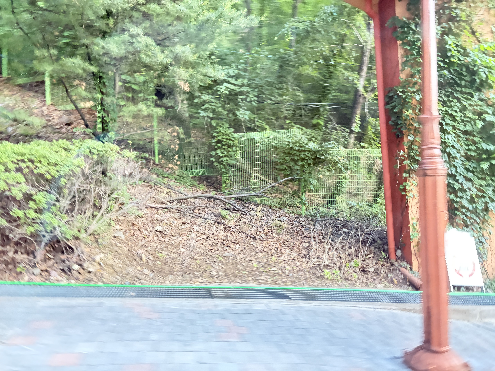

진입로를 따라 이어지는 절토 사면입니다. 상부 수목에서 떨어진 낙엽과 마른 가지가 쌓여 있을 뿐, 지표를 잡아 줄 지피나 관목이 없습니다. 이런 상태의 사면은 다음 순서로 무너집니다.

1. 비가 오면 표층 흙이 씻겨 내려가 **보도와 배수 그레이팅에 퇴적**됩니다.
2. 표층이 깎이면서 상부 수목의 뿌리가 노출됩니다.
3. 노출된 뿌리가 건조 피해를 입고, 사면은 더 빠르게 깎입니다.

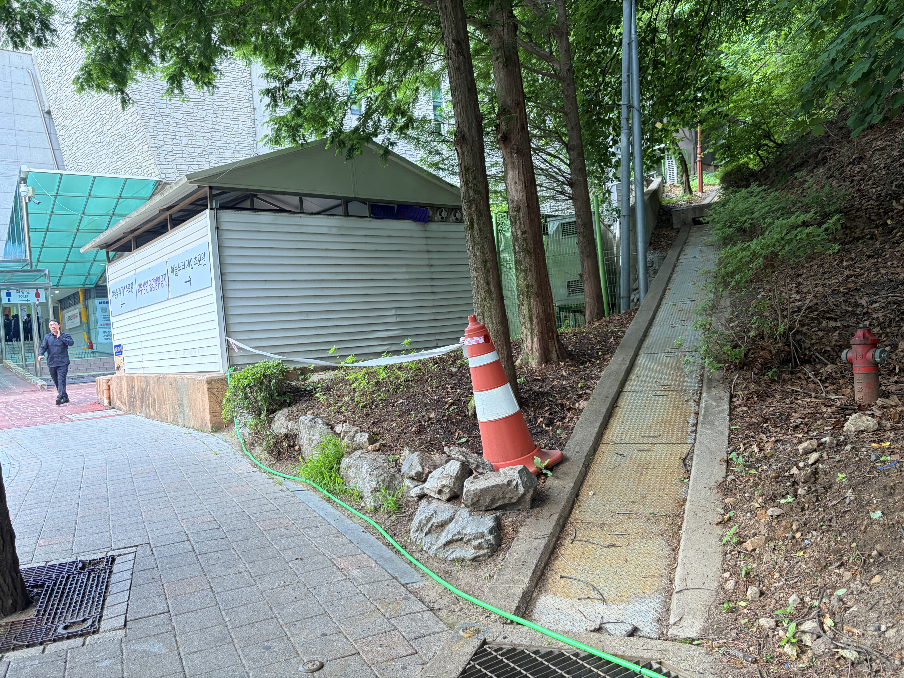

사면 하단은 보도와 배수 측구에 바로 접합니다. 흘러내린 흙이 측구를 막으면 강우 시 물이 보도로 넘치므로, 이 구간은 경관보다 **배수 기능 확보**가 먼저입니다.

작업은 사면의 낙엽층과 마른 가지, 죽은 관목을 걷어 내는 것에서 시작했습니다. 이 층을 남겨 둔 채 흙을 덮으면 유기물이 분해되면서 지반이 꺼지고, 식재한 관목이 기울어집니다.

---

## 자연석 쌓기 — 흙을 잡는 공정

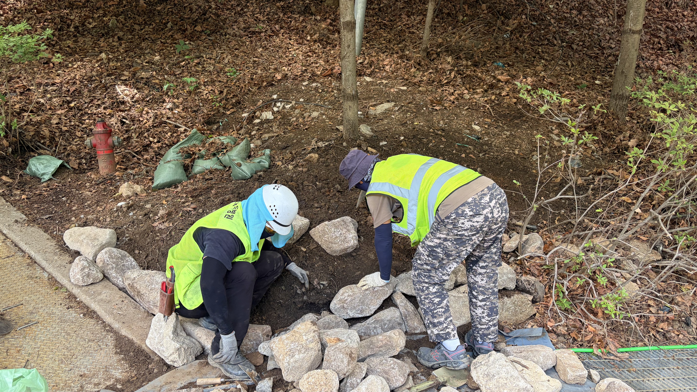

사면 하단에 자연석을 쌓았습니다. 모르타르를 쓰지 않는 **메쌓기**입니다. 돌 사이 틈으로 사면의 지하수가 빠져나가야 배면에 수압이 차지 않기 때문입니다. 틈을 막아 버리면 비가 온 뒤 배면 수압에 밀려 쌓아 놓은 돌이 통째로 배부름 현상을 일으킵니다.

쌓을 때는 세 가지를 지킵니다.

- **큰 돌을 아래로** — 하중이 아래로 모이도록 하고, 위로 갈수록 작은 돌로 마감합니다.
- **면을 맞물리게** — 돌 하나가 최소 두 개의 돌에 걸치도록 어긋물려 쌓습니다.
- **뒤로 기울여** — 사면 쪽으로 약간 눕혀 쌓아야 토압을 등으로 받습니다.

돌 뒤쪽에는 걷어 낸 흙 대신 배수와 보수가 함께 되는 흙을 채워 관목 뿌리가 자리 잡을 층을 만들었습니다.

---

## 식재 — 뿌리분이 흙에 붙어야 끝난다

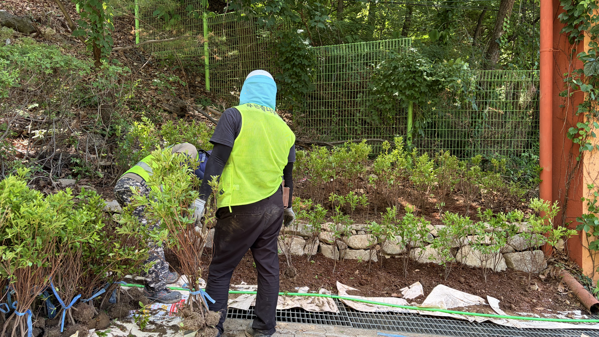

돌쌓기 위 흙에 철쭉류를 식재했습니다. 사면 식재에서 가장 흔한 실패는 **구덩이만 파고 뿌리분을 얹는 것**입니다. 경사면에서는 뿌리분 위쪽에 공극이 남기 쉽고, 그 틈으로 물이 빠지면서 뿌리가 마릅니다.

- 식재 구덩이는 뿌리분 지름의 1.5배 이상으로 파고, 경사 방향 위쪽을 더 깊게 잡아 수평 자리를 만듭니다.
- 뿌리분을 앉힌 뒤 흙을 넣으면서 **손으로 눌러 공극을 없앱니다**.
- 심은 뒤 물을 충분히 주어 흙 입자가 뿌리에 밀착되도록 합니다. 이 물주기는 수분 공급이 아니라 공극을 메우는 공정입니다.

식재 밀도는 지표가 2~3년 안에 덮이는 것을 기준으로 잡습니다. 처음부터 빽빽하게 심으면 당장은 보기 좋지만 통풍이 나빠 장마철에 아랫가지부터 무릅니다.

---

## 구간별 시공 전후

사면을 세 구간으로 나누어 순차 시공했습니다. 같은 지점에서 촬영한 시공 전후 사진입니다.

### 진입로 하단 구간

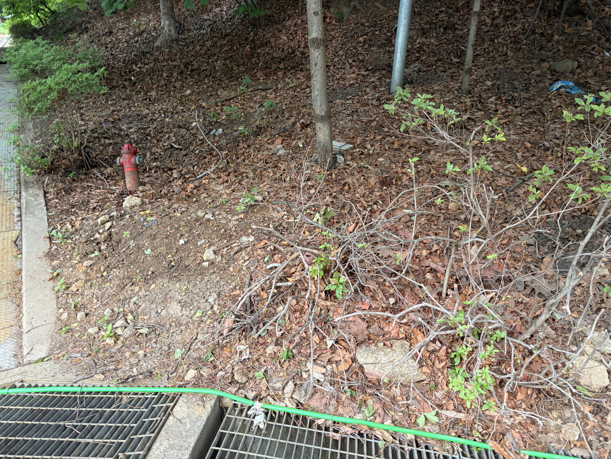
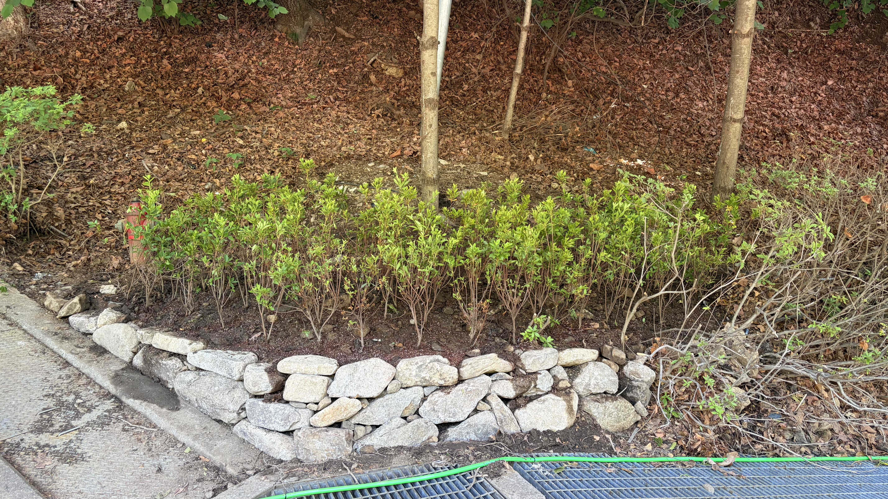

흙을 받아 줄 경계가 생기면서 보도와 사면의 선이 분명해졌습니다.

### 담쟁이 기둥 구간

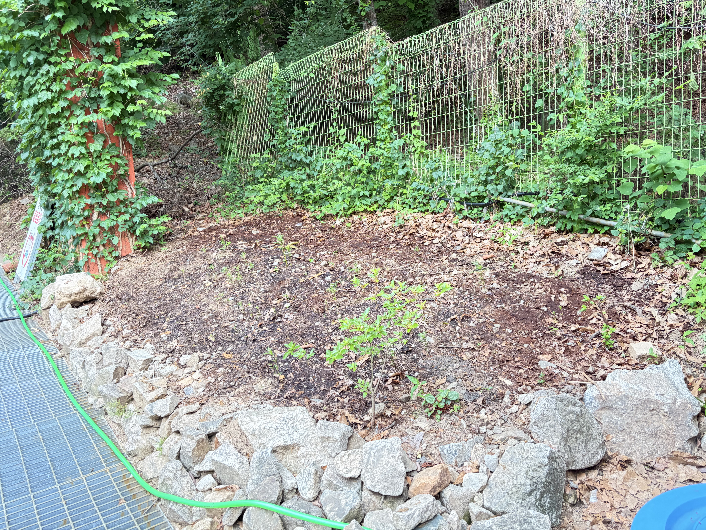
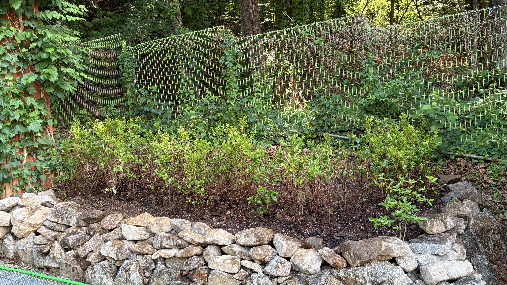

기존에 놓여 있던 돌은 버리지 않고 다시 쌓았습니다. 현장에 있던 석재를 재사용하면 자재비와 반출 비용이 함께 줄고, 주변 경관과 색이 어긋나지 않습니다.

### 상부 사면 구간

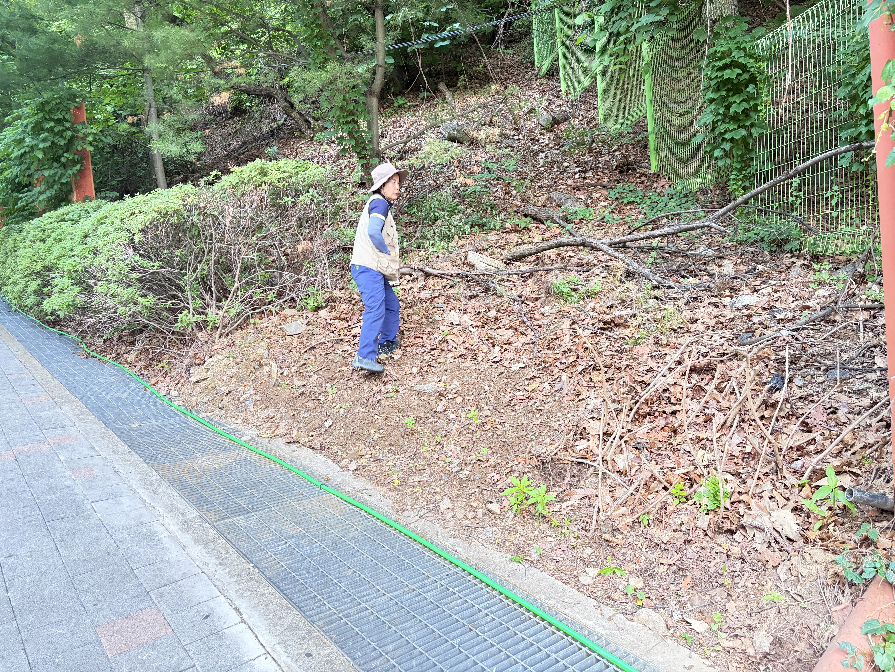
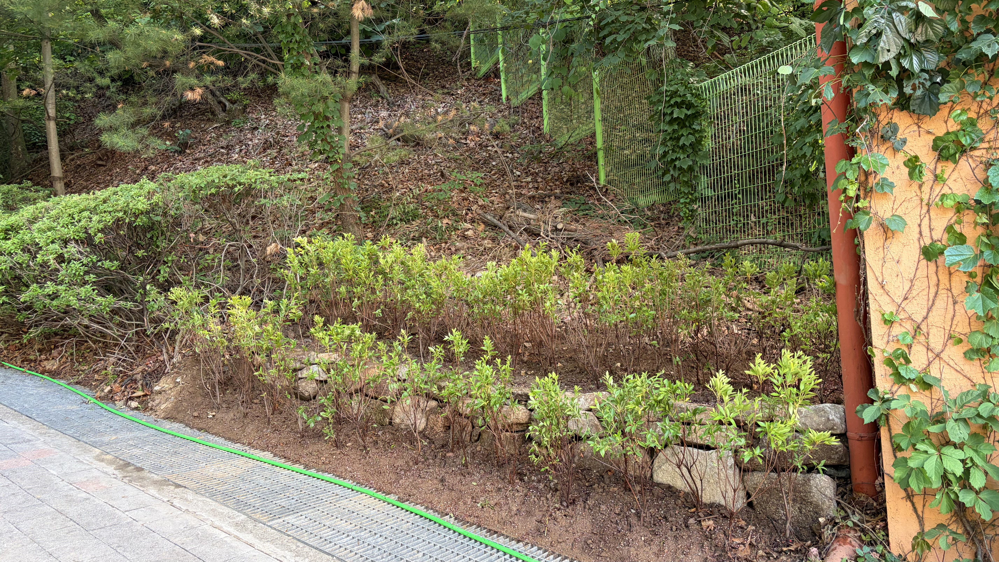

---

## 주차장 녹지대 보식

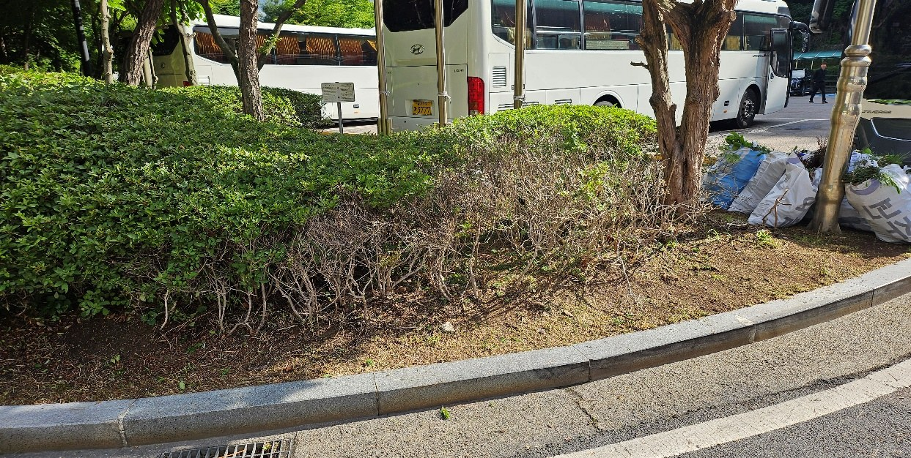
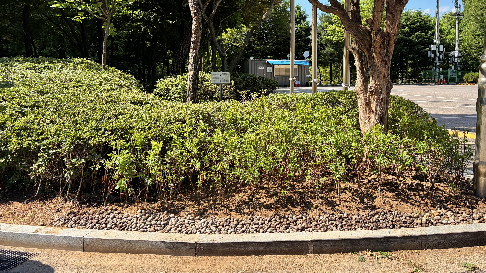

주차장 옆 녹지대는 오래된 철쭉 군락의 앞줄이 비어 있었습니다. 오래된 철쭉은 아래쪽 가지가 목질화되면서 잎이 위쪽에만 남고, 아랫부분이 줄기만 드러납니다. 전체를 걷어 내는 대신 **앞줄에만 보식**하고 지표에 자갈을 포설해 흙 튐과 잡초 발생을 함께 잡았습니다.

**💡 전문가의 관리 팁**

사면 식재의 성패는 식재 후 **첫 한 달의 관수**에서 갈립니다. 경사면은 물을 줘도 표면을 타고 흘러 내려가 뿌리분까지 닿지 않습니다. 한 번에 많이 주는 대신 **짧게 여러 번 나눠 주어** 물이 스며들 시간을 확보해야 합니다. 뿌리분 상단이 지표보다 살짝 낮게 앉아 있으면 물이 고여 스며들기 쉬워지므로, 식재할 때 이 단차를 만들어 두는 편이 이후 관리를 크게 줄여 줍니다.

---

## 시공·진단 의뢰 문의

**느티나무병원 협동조합** — 산림청 등록 1종 나무병원 · 조경식재공사업

- 전화 **031-752-6000**
- 팩스 031-752-6001
- 이메일 coopneuti@naver.com
- 본점 경기도 성남시 수정구 태평로 104

사면 정비와 관목 식재는 흙을 잡는 공정과 심는 공정을 함께 설계해야 합니다. 현장 조사 후 사면 경사·토질·배수 조건에 맞춰 자연석 쌓기, 식생 매트, 지피 식재 중 적합한 방식을 제안하고 개소별 수량을 반영한 견적을 드립니다. 관공서·공공기관 **수의계약**은 실적증명서와 자격·면허 증빙을 견적서와 함께 제공합니다.

_(본 게시물의 사진은 모두 실제 시공 현장에서 촬영한 것입니다.)_
