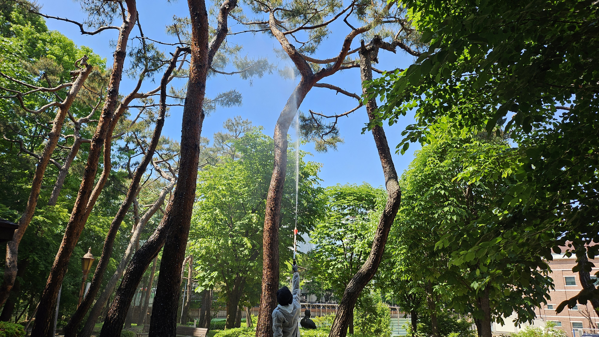
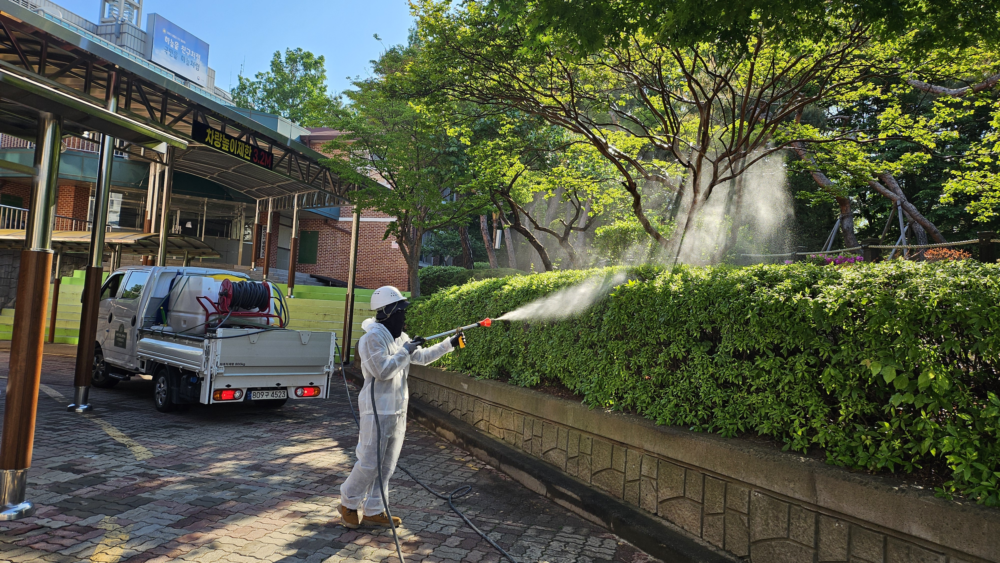
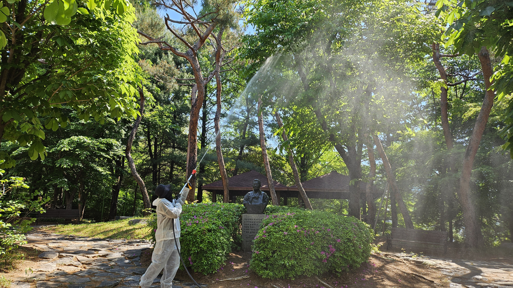
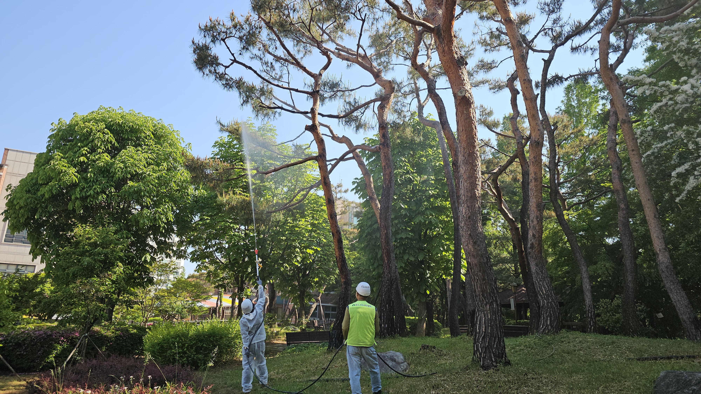
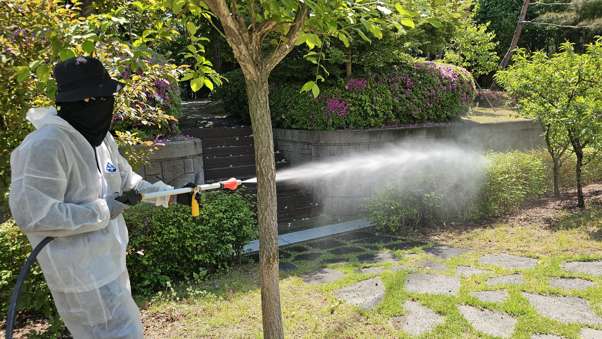
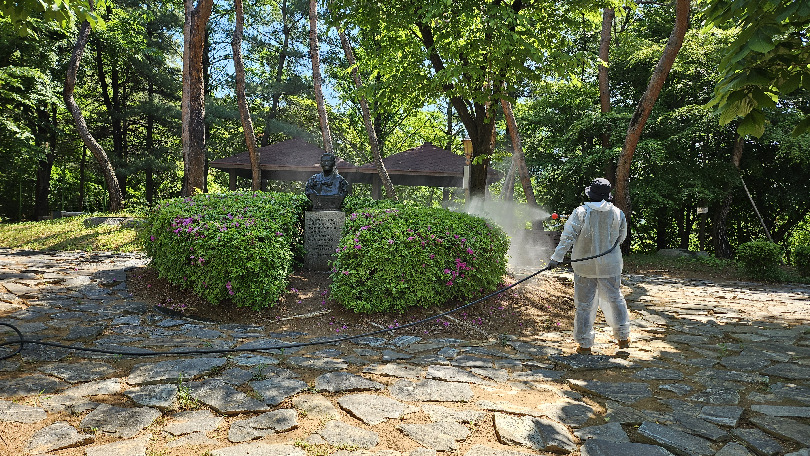
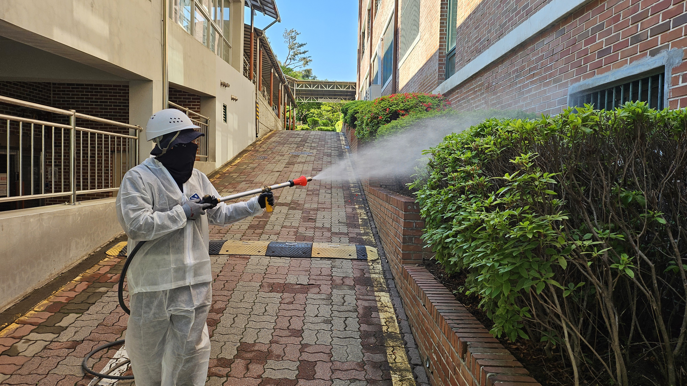
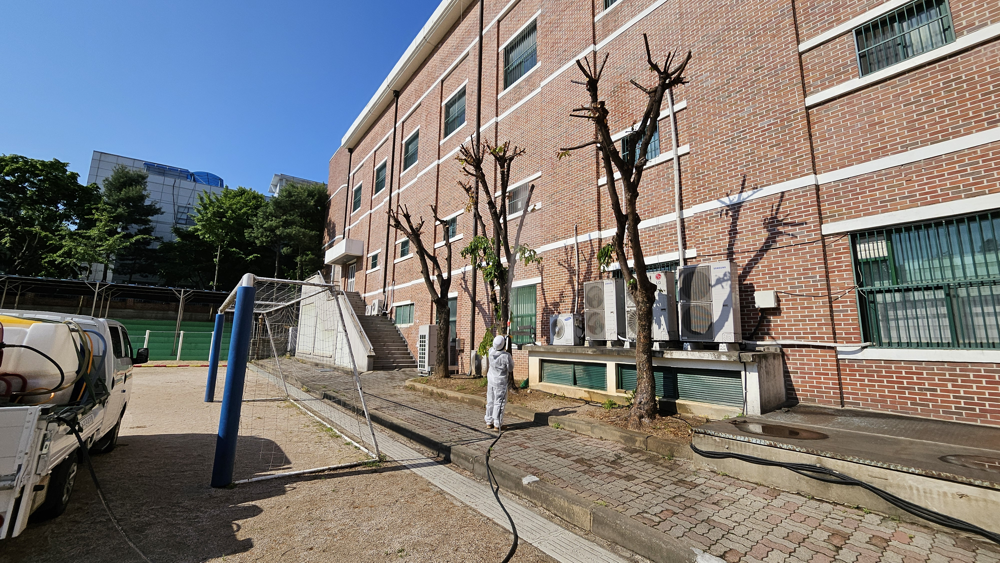

## 공사 개요

| 구분           | 내용                                                            |
| -------------- | --------------------------------------------------------------- |
| 대상지         | 성남시 수도여자고등학교 교정 전역(전정원·후정·주차장·경계부)     |
| 작업 일자      | 2026년 5월 5일(공휴일) 1일 시공                                  |
| 작업 내용      | 수관 및 관목 병해충 방제 약제 살포, 살포 구역 출입 통제          |
| 투입 장비      | 1톤 방제차량(약액 탱크·호스릴), 동력분무기, 고압 살포건, 신축 살대 |
| 주요 대상 수종 | 소나무, 느티나무, 벚나무, 단풍나무, 철쭉류, 사철나무 생울타리    |

학교 방제에서 가장 먼저 정하는 것은 약제가 아니라 **날짜**입니다. 학생과 교직원이 교정에 있는 동안에는 수관 상부 살포를 할 수 없습니다. 약액이 비산하는 범위가 살포 지점에서 십여 미터에 이르기 때문입니다. 수도여자고등학교 방제를 어린이날 휴일 하루로 잡고, 그날 안에 교정 전역을 끝내는 것을 전제로 인원과 동선을 짰습니다.

---

## 현장 조건 — 교정 안에 숲이 있다

이 학교의 교정은 일반적인 화단 수준이 아닙니다. 수령이 오래된 소나무와 느티나무가 군락을 이루고, 그 아래로 판석 산책로와 정자, 석축 화단이 이어집니다. 나무가 많다는 것은 곧 **수관 상부까지 약액을 올려야 하는 대상목이 많다**는 뜻입니다.

- 교목 수관고가 높아 손분무기로는 상부에 약액이 닿지 않습니다.
- 수관이 서로 겹쳐 있어 한 그루씩 돌면 살포 시간이 배로 늘어납니다.
- 산책로·정자·벤치가 곳곳에 있어 살포 후 잔류 구간 통제가 필요합니다.

그래서 배낭분무기가 아니라 **1톤 방제차량에 약액 탱크와 호스릴을 얹고** 작업했습니다. 차량을 거점에 세우고 호스를 최대한 늘려 반경 안의 수목을 처리한 뒤, 차량을 다음 거점으로 옮기는 방식입니다. 약액 조제 농도를 한 탱크 단위로 일정하게 유지할 수 있고, 작업자가 무게를 지지 않으므로 살대를 높이 들어 수관 상부를 정확히 겨눌 수 있습니다.

---

## 살포 순서 — 위에서 아래로, 안쪽에서 바깥으로

살포는 **교목 수관 → 관목 → 지피** 순서로 내려옵니다. 반대로 하면 아래를 먼저 처리해 놓고 위에서 떨어진 약액과 낙하물이 그 위를 덮어, 하부 약액 부착량이 흐트러집니다.

방향은 안쪽에서 바깥쪽으로 잡습니다. 작업자가 이미 약액이 묻은 구간을 다시 통과하지 않도록 동선을 한 방향으로 흘려보내는 것이 원칙입니다.

소나무 군락처럼 수관이 맞닿은 구간은 한 사람이 아니라 **두 지점에서 동시에** 살포합니다. 한쪽에서만 쏘면 반대편 가지 뒷면이 사각으로 남습니다. 응애와 깍지벌레는 잎과 가지의 그늘진 면에 자리 잡기 때문에, 사각이 남으면 그 구역에서 다시 밀도가 회복됩니다.

살포 인원은 전원 방제복·모자·마스크·장갑을 착용합니다. 학교 현장이라 하루 만에 끝내야 하는 만큼 개인 노출 시간이 길어지므로, 보호구는 편의가 아니라 필수 조건입니다.

---

## 수종별로 노리는 대상이 다르다

철쭉류는 **철쭉방패벌레**가 주 대상입니다. 5월 초는 월동한 성충이 산란을 마치고 약충이 부화하기 시작하는 시기로, 약충기에 맞추면 낮은 농도로도 밀도를 잡을 수 있습니다. 방패벌레는 잎 뒷면에 붙으므로 관목은 위에서 덮는 것만으로 부족하고, **군락 옆면과 아래에서 밀어 넣듯** 살포해야 잎 뒷면에 약액이 닿습니다.

생울타리도 같습니다. 겉면만 젖고 속은 마른 채로 남으면, 밀식된 가지 안쪽에서 살아남은 개체가 2주 안에 다시 번집니다.

교목은 수종별로 대상이 갈립니다.

- **소나무** — 솔껍질깍지벌레, 응애류. 가지와 침엽 기부까지 약액이 흘러들어야 합니다.
- **벚나무·느티나무** — 진딧물, 미국흰불나방 유충. 신초와 잎 뒷면이 표적입니다.
- **단풍나무** — 진딧물과 흰가루병. 병해가 겹치면 살균제를 함께 조제합니다.

후정 주차장 쪽은 강전정으로 가지를 짧게 잘라 낸 낙엽교목이 늘어서 있습니다. 절단면이 많은 나무는 병원균 침입 경로가 열려 있는 상태이므로, 살충제와 함께 절단부를 겨냥한 살균 처리를 병행했습니다.

---

## 시공 결과

교정 전역의 교목·관목·생울타리 살포를 하루 안에 마쳤습니다. 살포가 끝난 구역은 표면 약액이 마를 때까지 출입을 통제하고, 다음 등교일 이전에 완전히 건조되도록 오전~오후 이른 시간에 작업을 집중했습니다.

방제는 이 한 번으로 끝나지 않습니다. 5월 살포로 1세대 밀도를 잡고, 장마 전후에 발생하는 곰팡이성 병해와 여름철 2세대 해충을 겨냥한 차기 방제 시점을 사후 예찰로 다시 잡습니다.

**💡 나무의사의 관리 팁**

학교·유치원 방제는 **약제 선정보다 시행 시기 조율이 먼저**입니다. 재실 인원이 있는 날에는 수관 상부 살포를 피하고, 부득이한 경우 관목·지피만 저압으로 처리한 뒤 교목은 휴일에 별도 시행하는 편이 안전합니다. 연간 계약이라면 방학과 공휴일을 기준으로 2~3회차를 미리 배치해 두면, 해충 발생 시기와 학사 일정이 맞지 않아 적기를 놓치는 일이 줄어듭니다.

---

## 시공·진단 의뢰 문의

**느티나무병원 협동조합** — 산림청 등록 1종 나무병원 · 조경식재공사업

- 전화 **031-752-6000**
- 팩스 031-752-6001
- 이메일 coopneuti@naver.com
- 본점 경기도 성남시 수정구 태평로 104

학교 수목 방제는 나무의사의 진단과 처방을 근거로 약제·농도·시기를 정하고, 학사 일정에 맞춰 시행일을 조율합니다. 교정 전역 1일 시공, 연간 2~3회차 계약, 사후 예찰까지 함께 수행합니다. 교육지원청·관공서 **수의계약**은 실적증명서와 자격·면허 증빙을 견적서와 함께 제공합니다.

_(본 게시물의 사진은 모두 실제 시공 현장에서 촬영한 것입니다.)_
