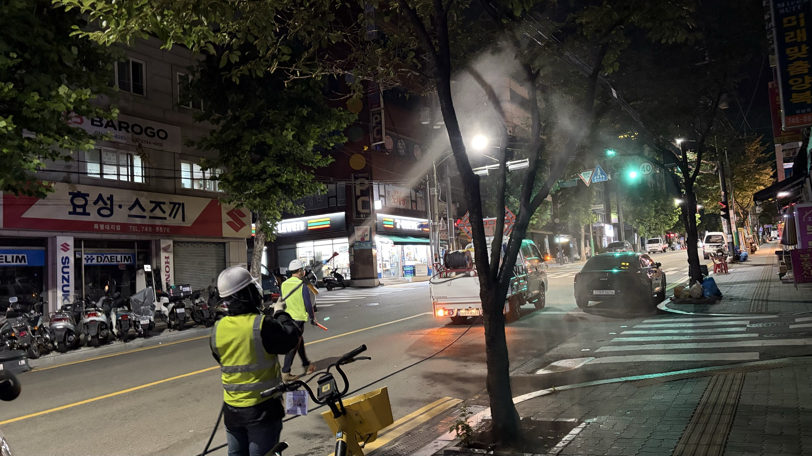
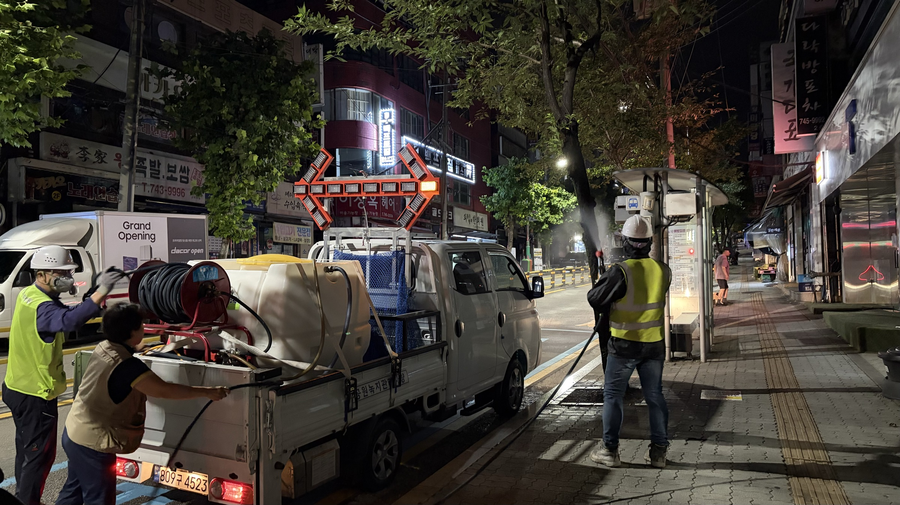
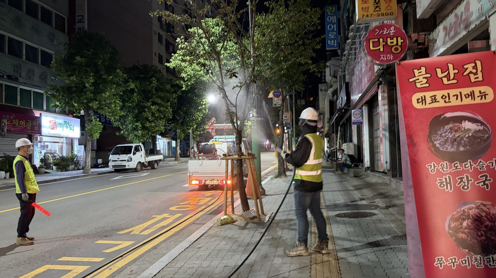
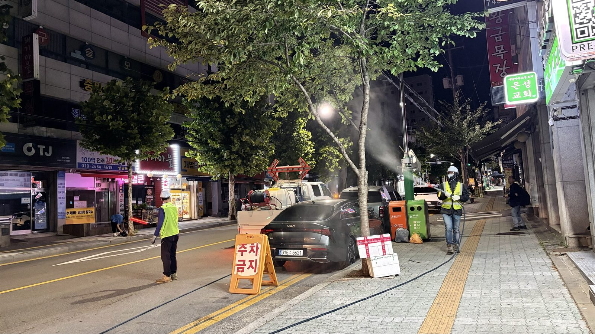
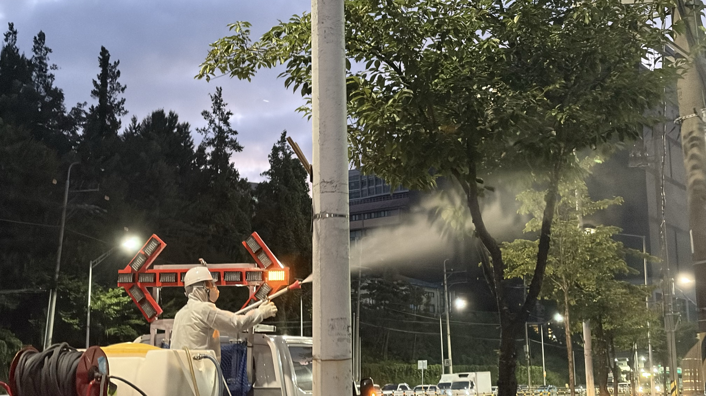
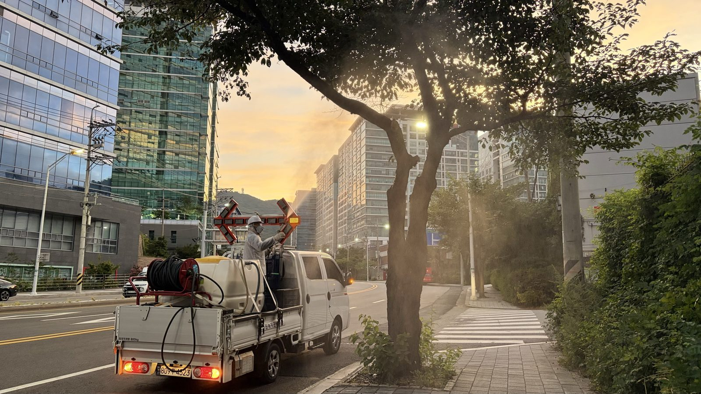
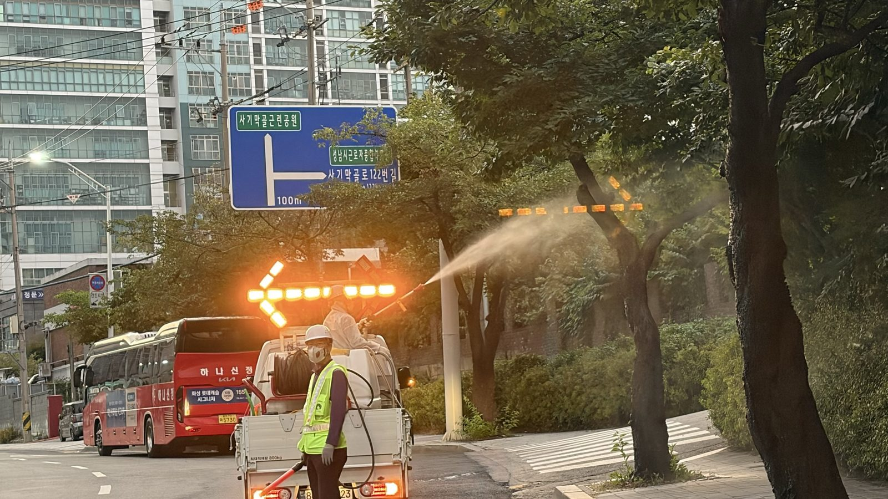

## 공사 개요

| 구분           | 내용                                                                     |
| -------------- | ------------------------------------------------------------------------ |
| 대상지         | 성남시 중원구 순환로 등 가로변 및 조경수 식재 구간                       |
| 작업 시간      | 2026년 8월 13일 04:00 ~ 06:00(통행 많은 구간, 통행 개시 이전 종료)       |
| 작업 내용      | 가로수·조경수 유리나방 방제 수간 약제 살포                               |
| 투입 장비      | 1톤 방제차량(약액 탱크·호스릴·경광 표지판), 고압 살포건                   |
| 안전 조치      | 이동식 화살표 전광 표지판, 수신호봉 신호수                               |
| 주요 대상 수종 | 은행나무, 느티나무, 벚나무 등 가로수와 도로변 조경 관목                  |

가로수 방제는 대상지가 도로 위에 있다는 점에서 공원·학교 방제와 성격이 다릅니다. 살포 자체는 같지만, **차량과 보행자가 다니는 공간에서 약액을 뿌린다**는 조건이 시간대와 장비 구성을 전부 바꿔 놓습니다. 그래서 통행량과 보행량이 많은 구간만 통행이 끊기는 새벽 시간대로 따로 편성했습니다.

---

## 통행 많은 구간을 새벽에 하는 이유

통행이 많은 구간에서 새벽 살포는 세 가지를 동시에 해결합니다.

1. **차량·보행 통행량이 최저** — 살포 반경 안에 사람이 들어올 확률이 가장 낮은 시간대입니다.
2. **바람이 잔잔함** — 일출 전은 대기가 안정되어 있어 약액 비산 거리가 짧습니다. 낮에 부는 바람은 약액을 인접 상가와 주차 차량까지 날려 보냅니다.
3. **기온이 낮음** — 한여름 낮에 살포하면 약액이 잎에 닿기 전에 증발하거나, 고온에서 약해(藥害)가 생깁니다.

같은 약제, 같은 농도라도 **언제 뿌렸느냐**에 따라 잎에 남는 약량이 달라집니다.

작업은 방제차량 세팅에서 시작합니다. 적재함의 약액 탱크에서 호스릴을 통해 살포건까지 이어지는 계통을 점검하고, 압력을 확인한 뒤 첫 구간으로 이동합니다.

---

## 도로 위 작업의 안전 구성

살포 인원과 **신호수는 항상 한 조**로 움직입니다. 살포하는 사람은 살대 끝과 수간만 보고 있어서 뒤에서 오는 차량을 인지하지 못합니다. 신호수가 후방을 맡고, 차량 지붕의 화살표 전광 표지판이 차로 변경을 유도합니다.

보도 쪽은 현장에 이미 설치되어 있던 주차금지 표지와 라바콘을 기준선으로 삼아 작업 구간을 잡습니다. 새벽에도 보행자와 배달 이륜차는 다니므로, 살포 지점 전후로 여유를 두고 구획을 잡습니다.

---

## 수간을 충분히 적신다

가로수는 지하고가 높아 줄기 상부까지 거리가 있습니다. 지상에서 살대를 들어도 줄기 상부와 주지 분기점까지 약액이 닿지 않는 개체는, **차량 적재함 위에서 살포 위치를 높여** 처리합니다. 도로 폭이 확보되고 신호수가 후방을 통제한 상태에서만 가능한 방식입니다.

이번 방제의 대상은 **유리나방류**입니다. 유리나방은 줄기와 굵은 가지의 상처·갈라진 틈에 알을 낳고, 부화한 유충이 껍질 아래 목질부로 파고듭니다. 일단 침입하면 약액이 닿지 않으므로, **유충이 들어가기 전에 수간 표면을 적셔 두는 것**이 방제의 핵심입니다.

살포는 줄기 위쪽에서 아래로 흘려 내립니다. 위에서 젖은 약액이 수피를 타고 내려오면서 갈라진 틈과 상처 부위까지 적십니다.

하늘이 밝아지고 버스 운행이 시작될 무렵 마지막 구간을 마쳤습니다. 통행량이 올라오기 전에 장비를 철수하고 표지를 걷는 것까지가 이 작업의 공정에 포함됩니다.

---

## 시공 결과 및 후속 관리

계획 구간의 가로수·조경수 수간 살포를 통행 개시 이전에 완료했습니다.

- **잔류 확인** — 살포 직후 보도 표면에 떨어진 약액은 마르면서 흔적이 남을 수 있으므로, 상가 밀집 구간은 살포량을 조절하고 노즐 각도를 도로 반대편으로 잡았습니다.
- **사후 예찰** — 2주 후 대상 구간을 다시 돌며 줄기의 침입공과 배설물·수액 유출 흔적을 확인하고, 필요 구간만 보완 방제합니다.

**💡 나무의사의 관리 팁**

가로수 방제에서 **바람은 약제보다 중요한 변수**입니다. 풍속이 초속 3m를 넘으면 약액이 표적을 벗어나 인접 차량·건물로 날아가고, 정작 잎에 남는 양은 절반 이하로 떨어집니다. 방제 효과와 민원 발생이 동시에 결정되는 조건이므로, 일정을 잡을 때 날짜보다 **시간대와 풍속**을 먼저 확인하는 편이 낫습니다.

---

## 시공·진단 의뢰 문의

**느티나무병원 협동조합** — 산림청 등록 1종 나무병원 · 조경식재공사업

- 전화 **031-752-6000**
- 팩스 031-752-6001
- 이메일 coopneuti@naver.com
- 본점 경기도 성남시 수정구 태평로 104

가로수 병해충 방제는 나무의사의 처방을 근거로 약제·시기·농도를 정하고, 도로 여건에 맞춰 신호수 배치와 시간대를 편성합니다. 노선 단위 연간 방제 계획 수립과 사후 예찰까지 함께 수행합니다. 관공서·공공기관 **수의계약**은 실적증명서와 자격·면허 증빙을 견적서와 함께 제공합니다.

_(본 게시물의 사진은 모두 실제 시공 현장에서 촬영한 것입니다.)_
