## 공사 개요

| 구분      | 내용                                                                  |
| --------- | ----------------------------------------------------------------------- |
| 대상지    | 성남시차량등록사업소 진입 도로변 및 보도변 신설 화단                      |
| 작업 기간 | 2026년 3월 31일 불량토 굴착·반출 → 4월 1일 객토 포설·1차 식재 → 4월 7일 2차 식재 |
| 작업 내용 | 건설잔재 혼합토 굴착·반출, 객토 반입·포설, 토심 검측, 관목·상록수 식재, 도로 청소 |
| 투입 장비 | 소형 굴착기(휠 타입), 덤프트럭, 외발 수레, 강관 살수 세척                  |
| 주요 식재 | 원추형 상록 침엽수(서양측백류), 황금측백, 포복형 향나무류, 회양목          |
| 안전 조치 | 신호수 배치, 도로 방수포 양생, 주차금지 표지·라바콘                        |

화단 조성은 심는 일보다 **흙을 바꾸는 일**이 공사의 대부분을 차지합니다. 준공 직후 부지의 화단은 겉보기에 정리된 것처럼 보여도, 안쪽은 건축 공사에서 남은 자갈과 콘크리트 조각이 섞인 흙인 경우가 많습니다. 이번 공사도 그랬습니다.

---

## 현장 상태 — 옹벽은 섰지만 안은 잔재였다

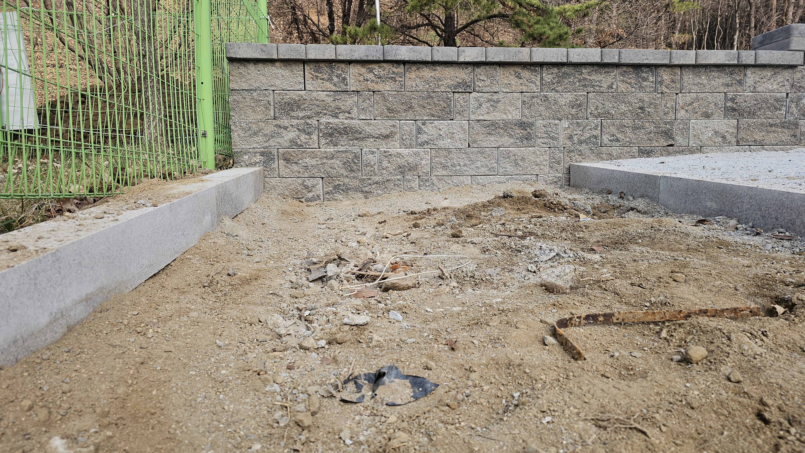

블록 옹벽과 경계석은 이미 설치되어 있었습니다. 문제는 그 안을 채운 흙이었습니다. 자갈과 콘크리트 파편, 비닐 조각이 섞인 **건설잔재 혼합토**입니다. 이 상태로 식재하면 다음 세 가지가 순서대로 일어납니다.

1. 뿌리가 뻗을 공극이 없어 **뿌리분 밖으로 뿌리가 나가지 못합니다**.
2. 잔재가 물길을 막아 강우 후 화단 안에 물이 갇힙니다.
3. 유효토심이 부족해 여름 가뭄에 먼저 마릅니다.

식재 자체는 하루면 끝나지만, 이 흙을 그대로 두면 1~2년 안에 절반이 고사합니다.

---

## 불량토 굴착과 객토 반입

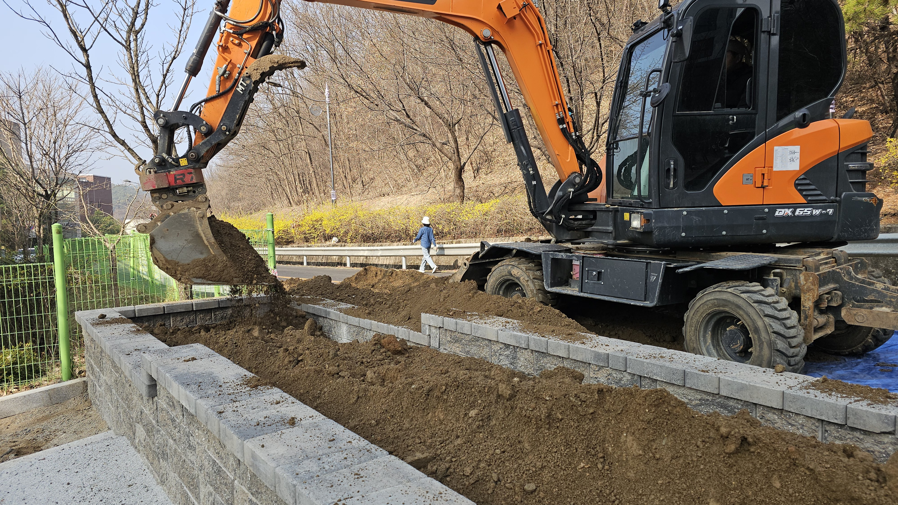

소형 굴착기로 화단 내부의 불량토를 걷어 냈습니다. 도로에는 **파란 방수포를 먼저 깔고** 그 위에 파낸 흙을 야적했습니다. 아스팔트에 직접 흙을 쌓으면 상차 후에도 잔토와 흙물이 남아, 청소에 드는 시간이 굴착 시간보다 길어집니다.

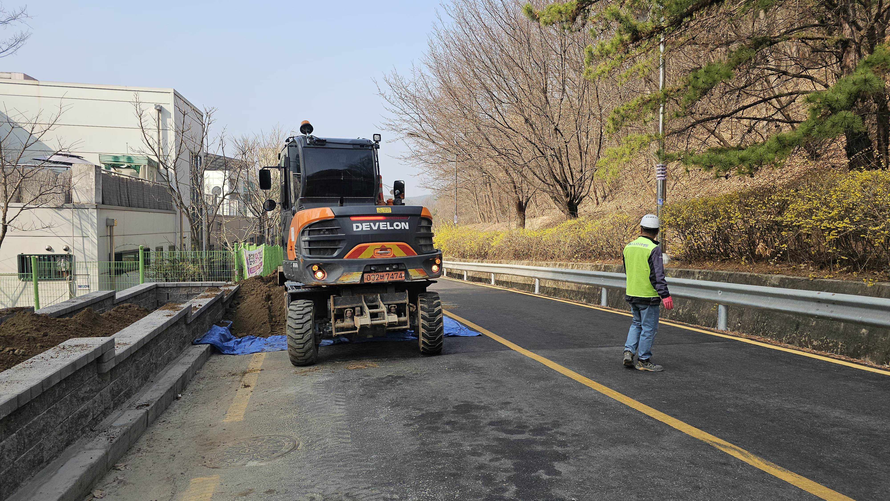

작업 구간이 진입 도로와 겹치므로 신호수를 상시 배치했습니다. 차량등록사업소는 민원인 차량이 계속 드나드는 시설이라 도로를 완전히 막을 수 없습니다. 한 차로를 열어 두고 신호수가 교대로 통과시키는 방식으로 진행했습니다.

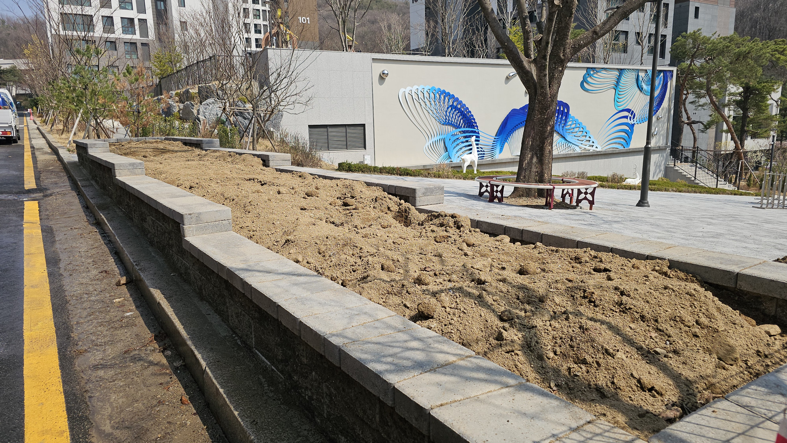

잔재를 걷어 낸 자리에 객토를 반입해 포설했습니다. 관목과 상록수를 심을 화단이므로 유효토심을 확보하는 것이 목표입니다.

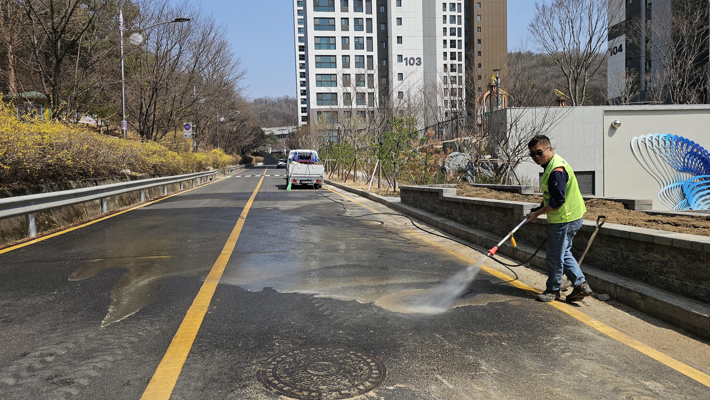

당일 작업이 끝나면 노면을 물로 씻어 냈습니다. 잔토가 마르면 분진이 되고, 비가 오면 진흙이 되어 민원으로 돌아옵니다. 도로를 쓰는 공사는 **원상 복구까지가 그날의 공정**입니다.

---

## 검측 — 눈으로 보지 않고 재서 확인한다

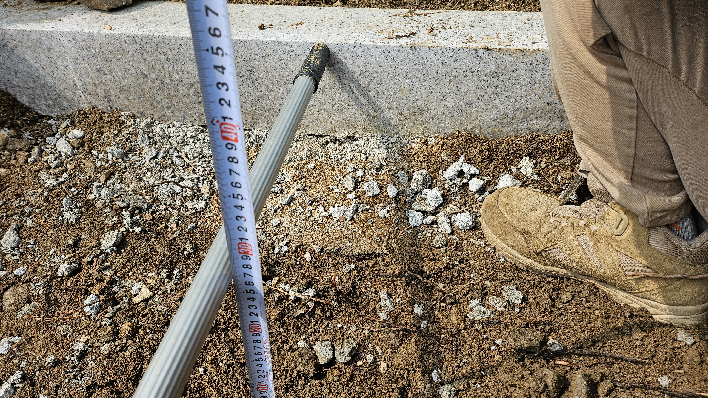

객토를 포설한 뒤 접이식 자를 꽂아 **깊이를 실측**했습니다. 화단 조성에서 가장 흔한 하자는 "겉에만 좋은 흙을 덮은" 경우입니다. 표층 20cm만 객토이고 그 아래가 원래의 잔재층이면, 뿌리가 그 경계에서 멈추고 옆으로만 자랍니다. 실측은 그 경계가 없는지 확인하는 절차입니다.

반입 수목도 규격을 확인하고 받습니다.

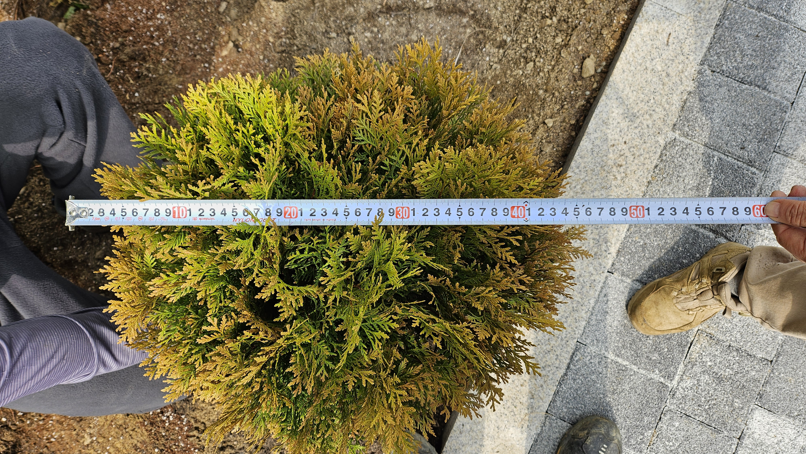

관목은 **수관폭**으로 규격을 확인합니다. 설계 수량이 맞아도 규격이 작으면 식재 후 화단이 채워지지 않고, 빈자리를 메우려고 밀식하면 몇 해 뒤 통풍 불량으로 하부 가지가 죽습니다.

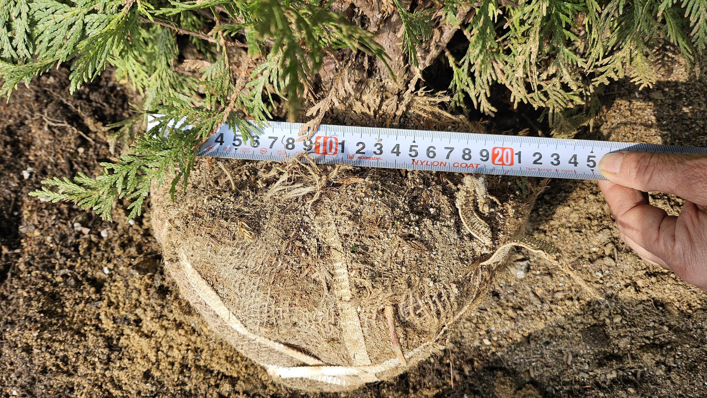

뿌리분도 같이 봅니다. 분이 작으면 잔뿌리가 잘려 나간 것이고, 활착률이 떨어집니다. 새끼줄로 단단히 감겨 분이 깨지지 않은 상태인지도 함께 확인합니다.

---

## 반입과 식재

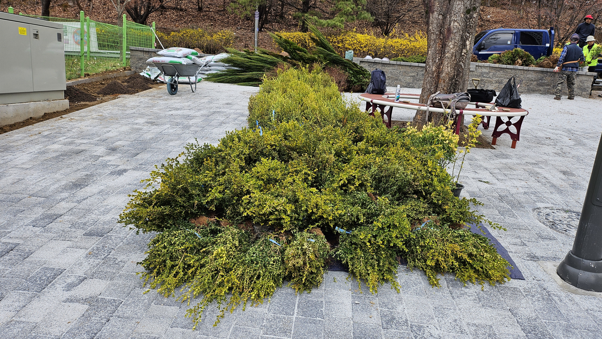

수목은 식재 당일 아침에 반입해 보도블록 위에 야적했습니다. 뿌리분이 마르지 않도록 그늘에 두고, 반입 순서와 식재 순서를 맞춰 대기 시간을 줄입니다.

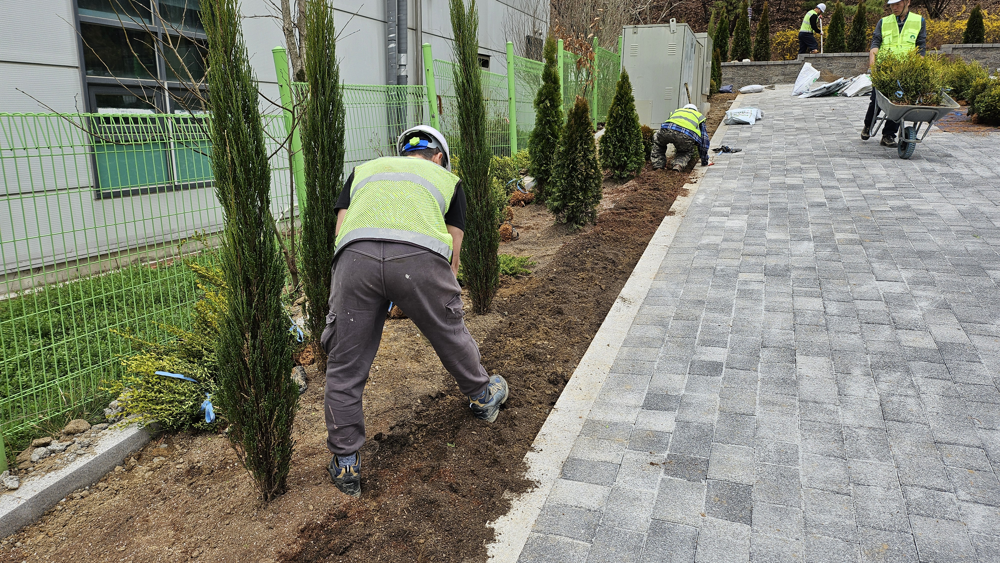

식재는 **골격목 → 관목 → 지피** 순서로 잡습니다. 원추형 상록 침엽수를 일정 간격으로 세워 화단의 리듬을 먼저 만들고, 그 사이를 황금측백과 포복형 향나무류, 회양목으로 채웠습니다. 상록수 위주로 구성한 것은 이 화단이 **연중 보이는 진입로 화단**이기 때문입니다. 낙엽 관목만으로 채우면 겨울 동안 다시 나지처럼 보입니다.

---

## 시공 전후

### 도로변 옹벽 화단

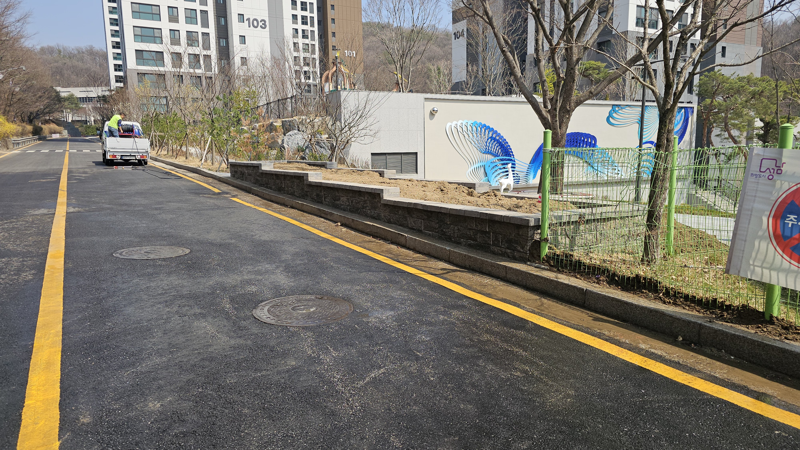
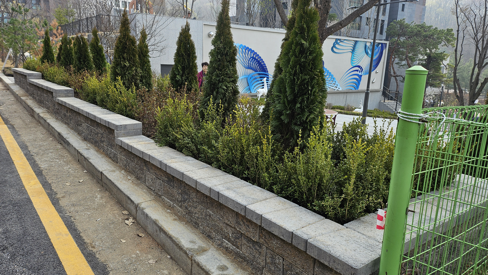

### 보도변 화단

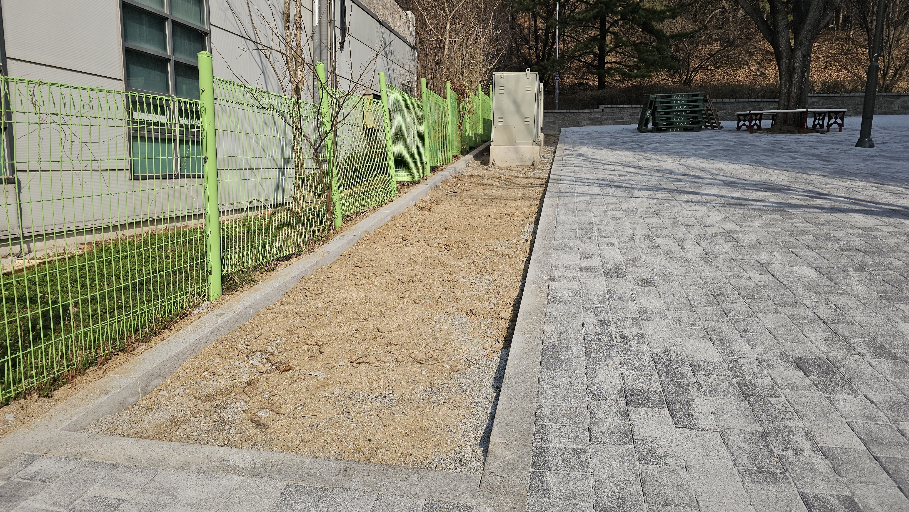
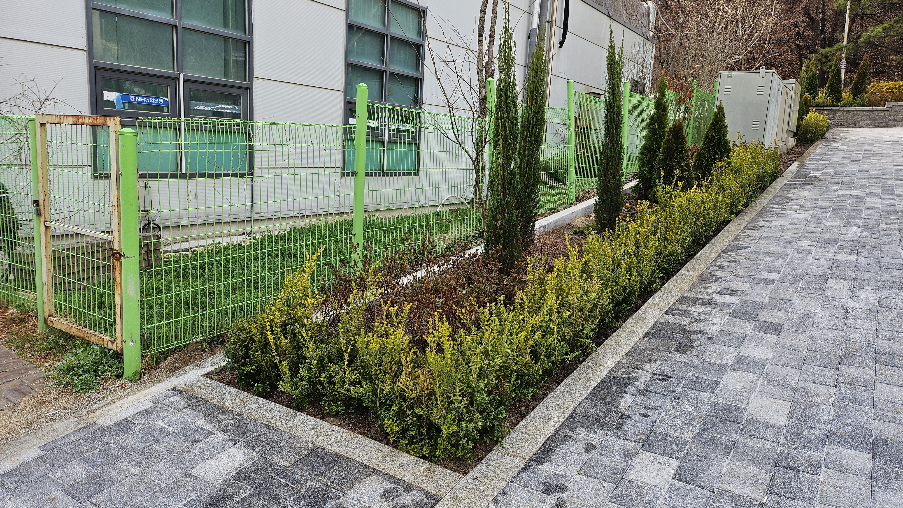

화단이 채워지면서 도로와 보행로의 경계가 시각적으로 분명해졌습니다. 진입로 화단은 장식이기 이전에 **동선을 구분하는 시설**입니다.

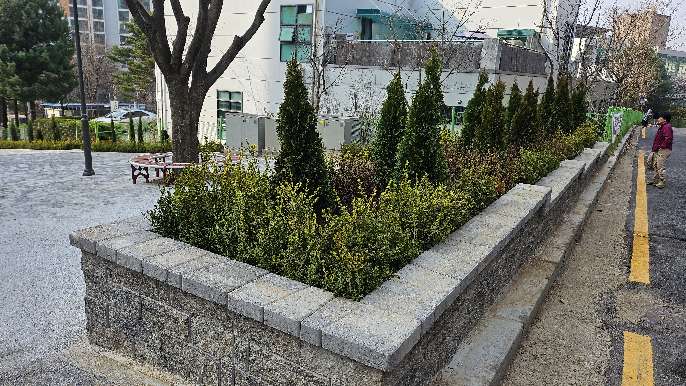

**💡 전문가의 관리 팁**

신축·리모델링 부지의 화단은 **흙을 의심하는 것부터** 시작해야 합니다. 겉흙 한 삽을 떠서 자갈과 콘크리트 조각이 나오면, 식재 전에 굴착·객토가 반드시 선행되어야 합니다. 이 과정을 생략하고 심으면 첫해 여름을 넘기지 못하는 개체가 나오고, 보식 비용이 애초의 객토 비용을 넘깁니다. 견적을 비교할 때 식재 수량만 볼 것이 아니라 **객토량과 유효토심이 명시되어 있는지** 확인하시기 바랍니다.

---

## 시공·진단 의뢰 문의

**느티나무병원 협동조합** — 산림청 등록 1종 나무병원 · 조경식재공사업

- 전화 **031-752-6000**
- 팩스 031-752-6001
- 이메일 coopneuti@naver.com
- 본점 경기도 성남시 수정구 태평로 104

화단 조성은 현장 토양 조사 → 불량토 처리 계획 → 객토·식재 설계 순으로 잡습니다. 청사·사업소 진입로처럼 통행을 막을 수 없는 현장은 신호수 배치와 구간 분할 시공으로 민원을 줄이며 진행합니다. 관공서·공공기관 **수의계약**은 실적증명서와 자격·면허 증빙을 견적서와 함께 제공합니다.

_(본 게시물의 사진은 모두 실제 시공 현장에서 촬영한 것입니다.)_
