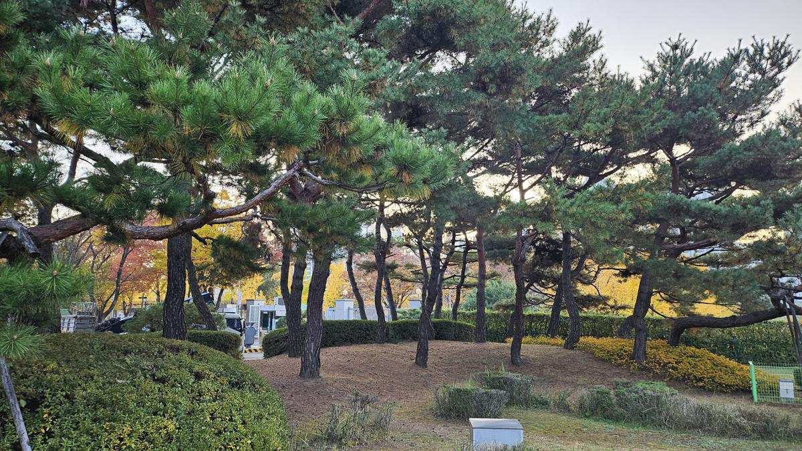
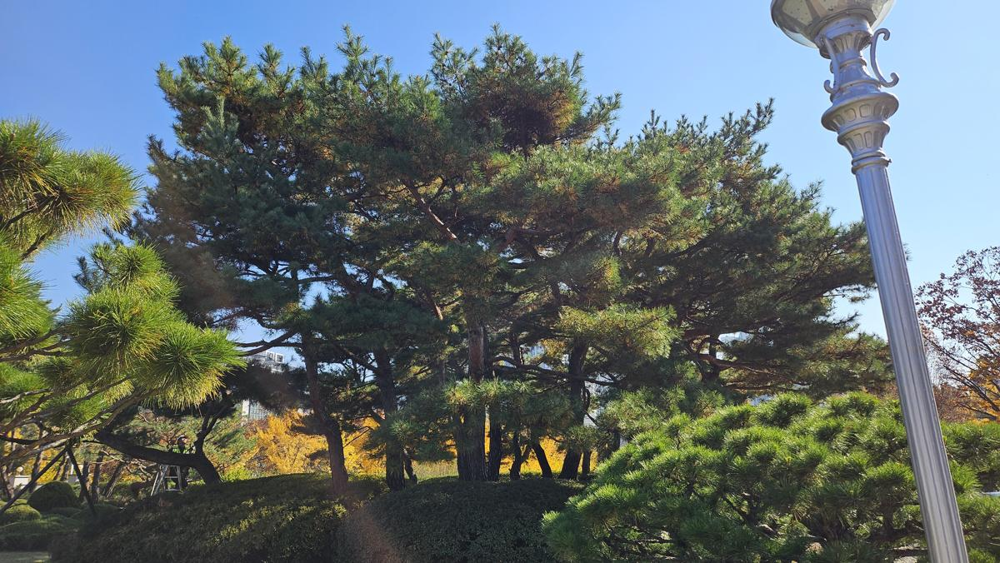
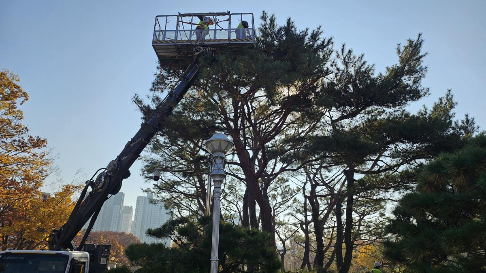
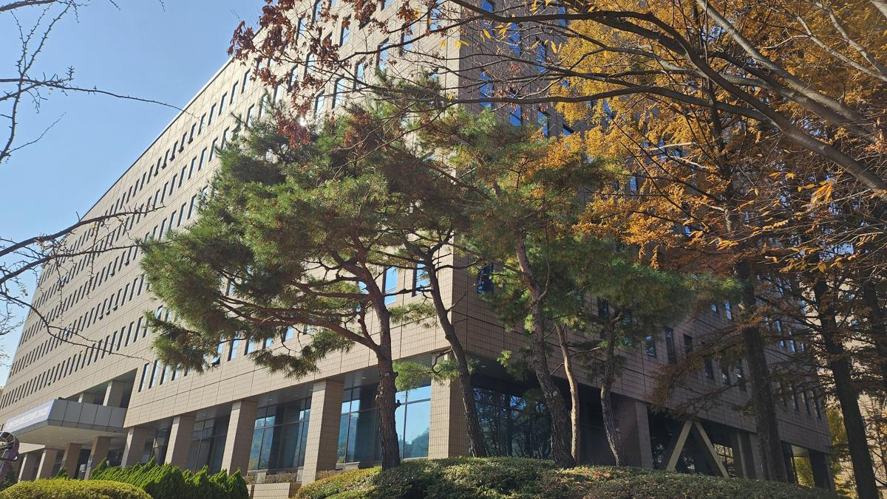
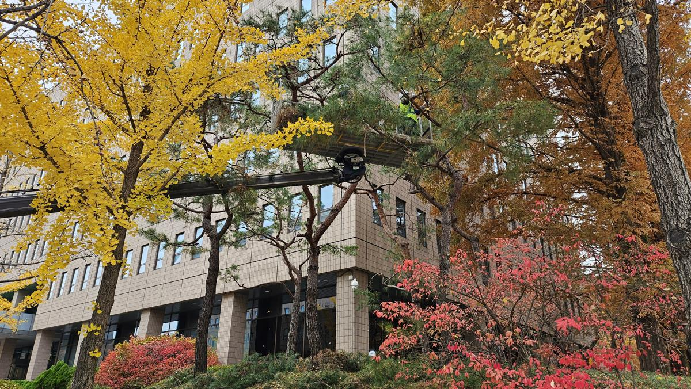

안녕하세요. 수목의 생태적 건강을 진단하고 공간의 가치를 설계하는 **전략적 조경 컨설턴트, 나무의사**입니다.

대한민국의 행정 중심지 중 하나인 **정부과천청사**는 그 상징성만큼이나 조경 관리의 수준이 기관의 신뢰도와 직결되는 곳입니다. 특히 '백목지왕(百木之王)'이라 불리는 소나무는 공공기관의 기개와 품격을 나타내는 핵심 요소입니다.

단순히 길게 자란 가지를 치는 '청소' 개념을 넘어, 나무의 생리적 균형을 맞추고 시각적 경관을 극대화한 **2024년 과천청사 소나무 전정 프로젝트**의 현장을 기록합니다.

---

### **[현장 문제] 과밀화된 수관과 생태적 불균형**

작업 전 소나무들은 수년간 축적된 묵은 잎과 도장지(웃자란 가지)로 인해 수관 내부가 매우 답답한 상태였습니다.

_작업 전 전경: 가지가 엉켜 통기성이 저하되고, 하단부 가지에 햇빛이 도달하지 못해 고사지가 발생하기 직전의 모습입니다._

수관(나무의 잎과 가지가 퍼진 부분)이 지나치게 밀폐되면 **통기성 저하**로 인해 응애나 진딧물 같은 흡즙성 해충이 번식하기 최적의 환경이 됩니다. 또한, 내부 광량 부족은 소나무 특유의 아름다운 곡선미를 가리고 나무를 쇠약하게 만드는 원인이 됩니다.

---

### **[전문가 진단 및 계획] 수형의 미학과 생리적 건강의 교차점**

나무의사로서 이번 전정의 핵심을 세 가지로 설정했습니다.

1.  **수관 내부 투광률 확보**: 햇빛이 지표면과 수관 안쪽까지 깊숙이 스며들게 하여 하단 가지의 세력을 유지합니다.
2.  **통기성 개선**: 바람의 길을 열어 병해충 발생 빈도를 과학적으로 낮춥니다.
3.  **수형의 위계 설정**: 정부 청사의 권위와 안정감에 어울리도록 하향지(아래로 처진 가지)와 교차지를 정리하여 단정한 실루엣을 구현합니다.

---

### **[시공 과정] 고소작업차를 활용한 정밀 수술**

공공기관의 대형 소나무는 높이가 상당하므로 안전과 정밀도를 위해 고소작업차(스카이차)를 투입했습니다.

_고소작업차를 이용해 수관 상단부부터 하단부로 내려오며 전정을 진행합니다. 이는 전체적인 수형의 밸런스를 잡기에 가장 효율적인 방식입니다._

_숙련된 전정사가 가지 하나하나의 생장 방향을 고려하며 작업 중입니다. 불필요한 도장지를 제거하고, 소나무 특유의 '마디'가 돋보이도록 정밀하게 가다듬습니다._

단순히 자르는 것이 아니라, 나무의 에너지가 건강한 가지로 집중될 수 있도록 '선택과 집중'의 과정을 거칩니다. 전정 단면은 매끄럽게 처리하여 자가 치유를 돕고 부후균 침입을 방지합니다.

---

### **[결과 및 관리 팁] 되찾은 생명력과 공간의 품격**

수일간의 정밀 작업 끝에 과천청사의 소나무들은 본연의 고고한 자태를 되찾았습니다.

_작업 후 모습: 하늘이 비칠 정도로 수관이 맑아졌습니다. 이제 바람과 햇빛이 나무 전체를 감싸며 생태적 활력을 불어넣을 것입니다._

_청사 건물과 조화를 이루는 소나무의 실루엣. 건강하게 관리된 녹지는 방문객에게 심리적 안정감을 주며 기관의 관리 역량을 시각적으로 증명합니다._

**💡 나무의사의 관리 팁:**
전정 직후에는 나무가 일시적으로 스트레스를 받을 수 있습니다. 이 시기에 적절한 **수관주사**나 **토양 관주**를 통해 영양을 공급하면, 내년 봄 더욱 짙고 푸른 엽색을 감상하실 수 있습니다.

---

### **[가치] 지속 가능한 관리가 공간의 미래를 바꿉니다**

조경은 설치 예술이 아닌 **'살아있는 생명체와의 공존'**입니다. 오늘 진행한 전정 작업은 단순히 보기 좋게 만드는 것을 넘어, 이 소나무들이 향후 수십 년간 청사의 역사를 함께할 수 있도록 체력을 보강하는 과정이었습니다.

정부기관, 학교, 아파트 단지의 수목은 그곳에 거주하는 사람들의 삶의 질을 결정하는 소중한 자산입니다. **전문적인 진단과 정교한 시공**이 뒷받침될 때, 비로소 녹지는 단순한 배경을 넘어 공간의 가치를 높이는 전략적 자산이 됩니다.

당신의 공간에 있는 나무들은 지금 건강하게 숨 쉬고 있습니까?
**지속 가능한 미래를 위한 수목 관리, 전문가와 상의하십시오.**

---

**[상담 및 의뢰 문의]**
전략적 조경 컨설턴트 / 나무의사
_(본 포스팅에 사용된 모든 사진은 실제 시공 현장에서 촬영되었습니다.)_
