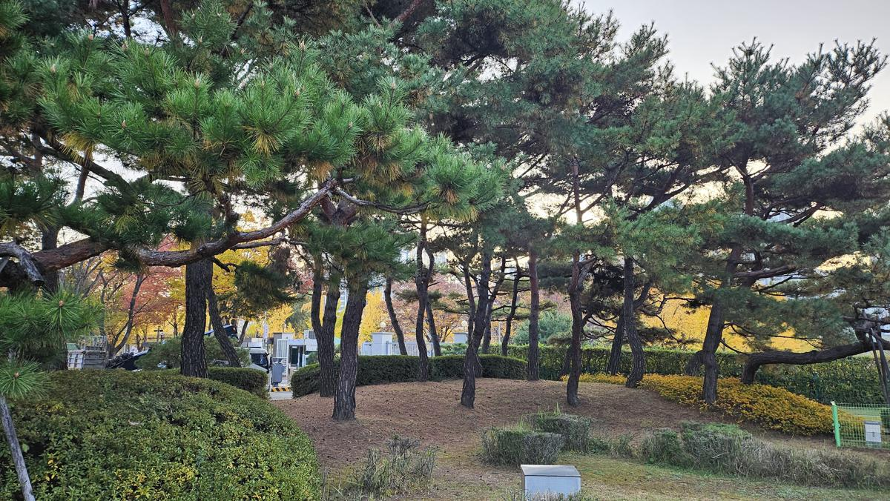
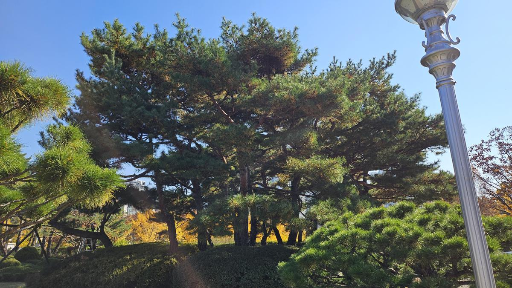
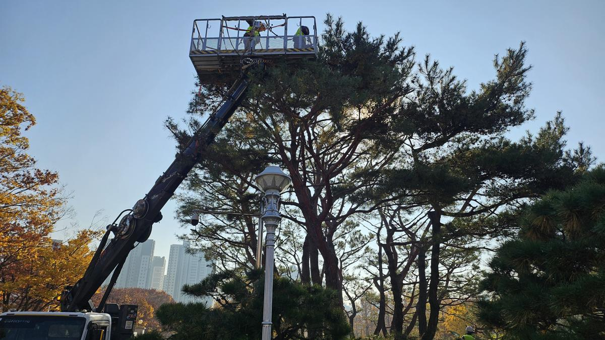
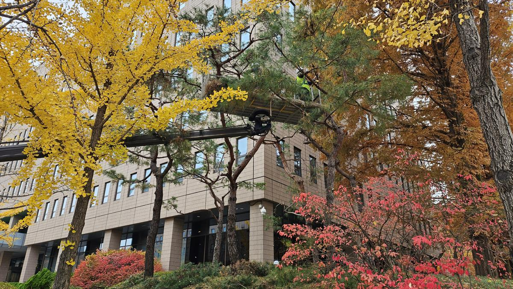
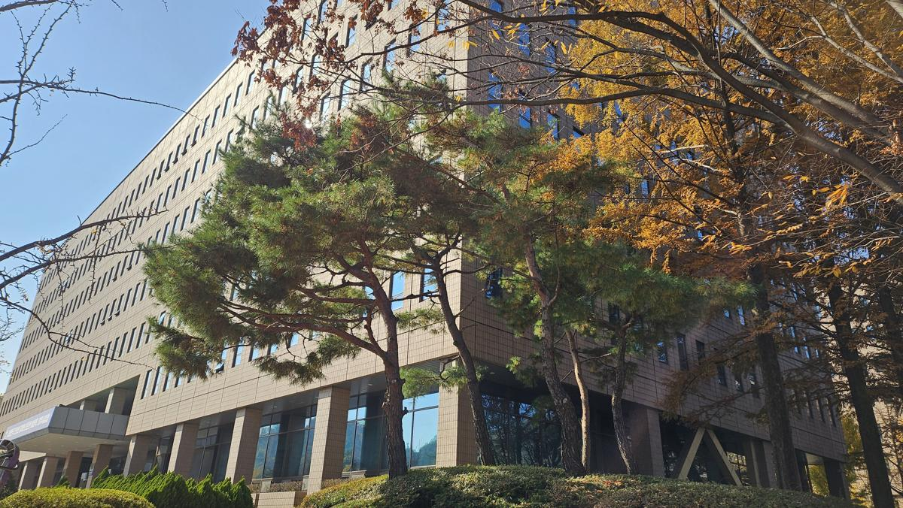

## 공사 개요

| 구분      | 내용                                                               |
| --------- | ------------------------------------------------------------------ |
| 대상지    | 정부과천청사 일원                                                  |
| 작업 기간 | 2024년 11월 8일 ~ 11월 14일 (5일간)                                |
| 작업 내용 | 소나무 정밀 전정(솎음·순 정리), 고사지 및 도장지 제거, 잔재물 처리 |
| 투입 장비 | 고소작업차(스카이차), 전정가위·전정톱                              |

정부과천청사의 소나무는 청사 전면부 경관을 좌우하는 주요 수목입니다. 여러 해 동안 순 정리 없이 자란 탓에 수관이 두터워지고 묵은 잎과 도장지가 쌓여 있었습니다. 나무의사가 현장에서 수세와 수형을 확인한 뒤, 생리적 부담을 최소화하는 범위에서 솎음 위주의 전정 계획을 세웠습니다.

---

## 작업 전 현장 상태

수관이 겹쳐 밀폐되면 통풍이 나빠져 응애·진딧물 같은 흡즙성 해충이 번식하기 좋은 환경이 됩니다. 내부 광량이 부족해지면 안쪽 잎부터 떨어지고, 결국 하부 가지가 고사해 수형의 아래쪽이 비게 됩니다.

## 전정 계획 — 세 가지 기준

나무의사가 설정한 이번 전정의 기준은 다음 세 가지였습니다.

1. **투광률 확보** — 수관 안쪽과 지표면까지 빛이 들어가도록 솎아 하부 가지의 세력을 유지합니다.
2. **통풍 개선** — 바람길을 열어 병해충 발생 여건을 낮춥니다.
3. **수형 위계 정리** — 아래로 처진 하향지, 서로 스치는 교차지, 웃자란 도장지를 정리해 단정한 실루엣을 만듭니다.

> 소나무는 한 번에 많이 자르면 남은 잎에 부담이 몰립니다. 전체 엽량의 25%를 넘지 않는 선에서 나누어 솎는 것이 원칙입니다.

---

## 시공 과정

청사 소나무는 수고가 높아 사다리 작업이 어렵습니다. 안전과 정밀도를 함께 확보하기 위해 고소작업차를 투입하고, 수관 상단부에서 하단부로 내려오며 순차적으로 작업했습니다. 위에서부터 정리해야 전체 수형의 균형을 보면서 절단량을 조절할 수 있습니다.

가지 하나하나의 생장 방향을 보며 남길 가지와 자를 가지를 정합니다. 도장지는 밑동에서 제거하고, 절단은 지피융기선과 지륭을 살려 매끄럽게 마무리해 나무가 스스로 상처를 아물리도록(유합 조직 형성) 돕습니다. 잘린 가지와 낙엽은 당일 수거해 반출했습니다.

---

## 시공 결과

작업을 마친 소나무는 가지 사이로 하늘이 비칠 만큼 수관이 맑아졌습니다. 바람과 빛이 수관 안쪽까지 들어가면서 내부 잎의 고사가 줄고, 청사 건물의 수직선과 소나무의 가로 실루엣이 서로를 가리지 않게 정리되었습니다.

**💡 나무의사의 관리 팁**

전정 직후에는 나무가 일시적으로 스트레스를 받습니다. 이 시기에 수간주사나 토양 관주로 양분을 보충해 주면 이듬해 봄 신초 전개와 엽색이 눈에 띄게 좋아집니다. 소나무 전정의 적기는 11월~이듬해 2월의 휴면기이며, 수액 이동이 왕성한 4~6월 전정은 수세 저하와 진 흐름을 유발하므로 피하는 것이 좋습니다.

---

## 관리가 곧 자산입니다

조경은 설치로 끝나는 공사가 아니라 살아 있는 생명체를 계속 돌보는 일입니다. 이번 전정은 보기 좋게 다듬는 데서 그치지 않고, 이 소나무들이 앞으로 수십 년 청사와 함께할 수 있도록 체력을 정리해 준 과정이었습니다.

정부기관·학교·아파트 단지의 수목은 그 공간을 쓰는 사람들의 생활 환경을 좌우하는 자산입니다. 정확한 진단과 정교한 시공이 뒷받침될 때 녹지는 단순한 배경을 넘어 기관의 관리 역량을 보여 주는 지표가 됩니다.

---

## 시공·진단 의뢰 문의

**느티나무병원 협동조합** — 산림청 등록 1종 나무병원 · 조경식재공사업

- 전화 **031-752-6000**
- 팩스 031-752-6001
- 이메일 coopneuti@naver.com
- 본점 경기도 성남시 수정구 태평로 104

수목 피해 상담부터 현장 진단, 견적서 발급까지 나무의사가 직접 확인하고 답변드립니다. 관공서·공공기관 **수의계약**은 견적서와 함께 실적증명서, 나무의사 자격증, 조경업 면허증 등 증빙 서류를 즉시 제공합니다.

_(본 게시물의 사진은 모두 실제 시공 현장에서 촬영한 것입니다.)_
