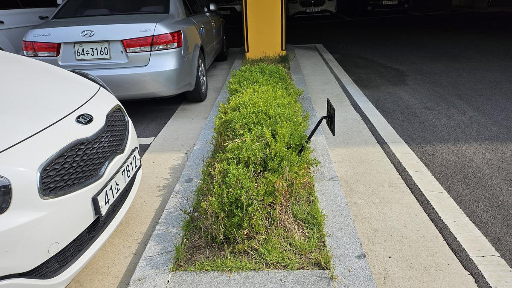
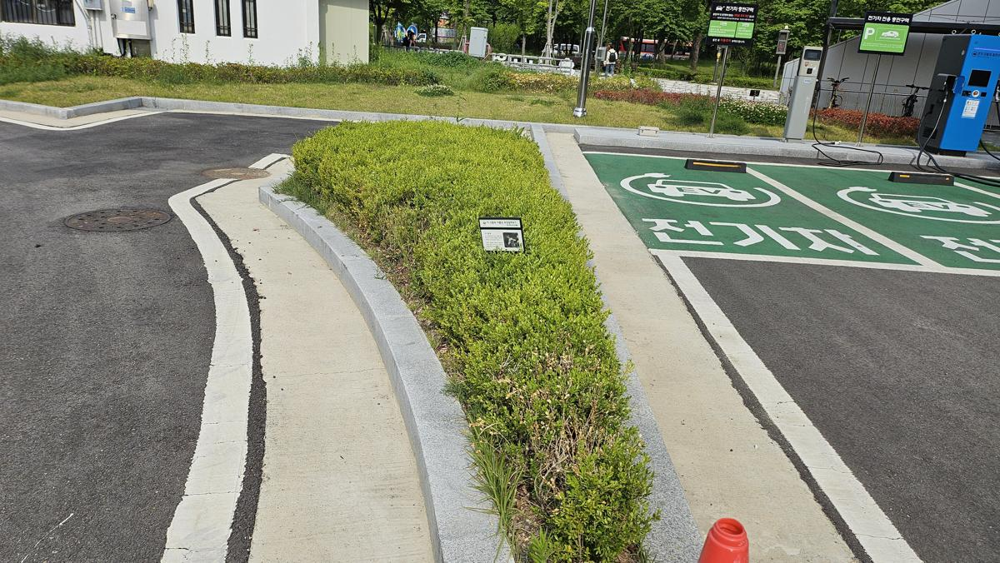
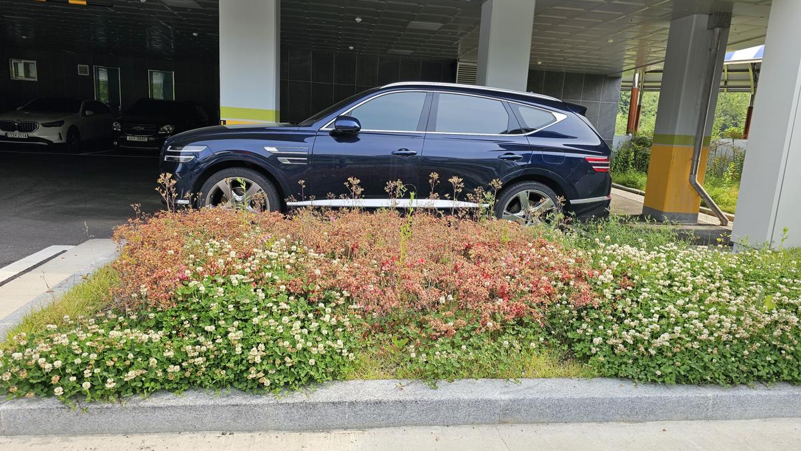
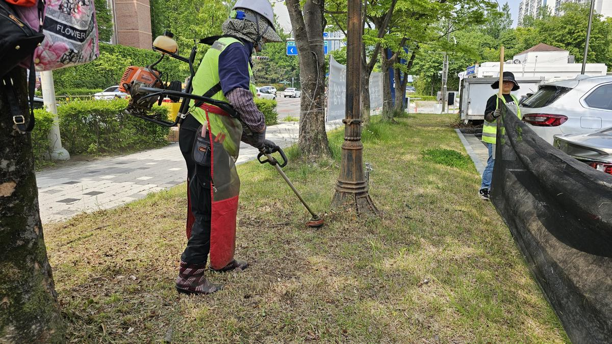
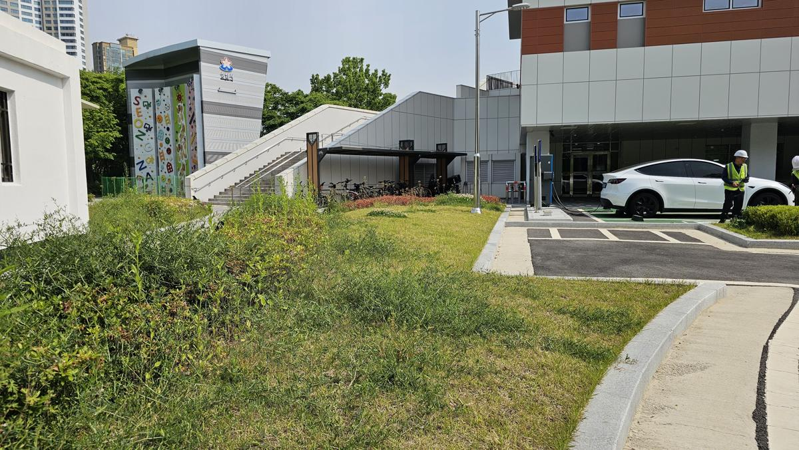
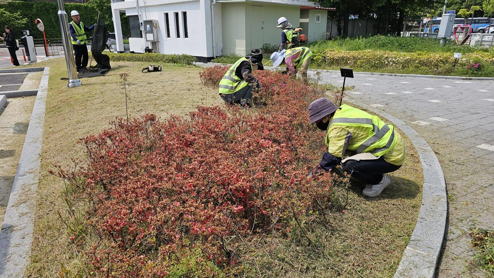
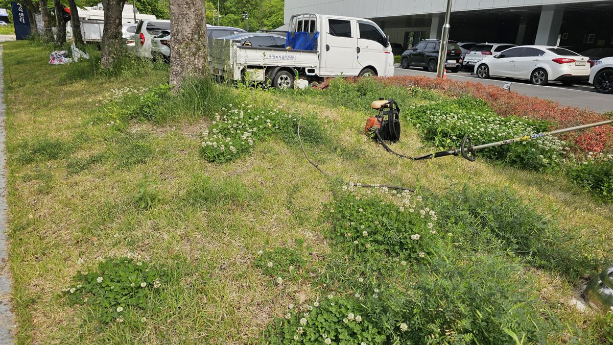
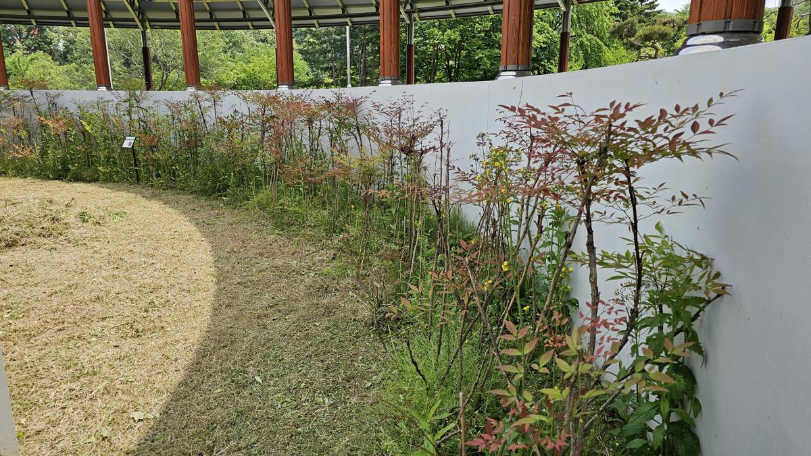

## [현장 문제]: 무성해진 잡초와 수형을 잃은 수목, 공간의 활력을 저해하다

도심 속 소중한 휴식처인 금곡공원의 봄은 생명력이 넘치지만, 동시에 세심한 관리가 필요한 시기이기도 합니다. 작업 전 금곡공원의 상태는 수목의 웃자람(徒長)으로 인해 본연의 수형이 무너져 있었으며, 화단과 보행로 주변에는 잡초가 무성하게 자라나 미관을 해칠 뿐만 아니라 해충의 서식처가 될 우려가 있는 상태였습니다.

_주차장 경계석 주변의 회양목이 웃자라 경계 라인이 흐트러진 모습입니다. 이는 단순한 미관 문제를 넘어 보행자와 운전자의 시야를 방해할 수 있습니다._

_화단 내부에 발생한 잡초들이 지피식물의 영양분을 탈취하고 있으며, 공원의 정갈한 이미지를 저해하고 있습니다._

---

## [전문가 진단/계획]: 생태적 건강과 시각적 질서의 회복

나무의사의 관점에서 진단한 결과, 현재 금곡공원은 **수관 내부의 통풍 불량**과 **지피층의 경쟁 식생(잡초) 과다** 상태였습니다.

1.  **전정 전략**: 수목의 생리적 특성을 고려하여 불필요한 가지를 제거하고, 광합성 효율을 높이는 동시에 공원의 시각적 개방감을 확보하기 위한 '수형 다듬기'를 계획했습니다.
2.  **예제초 전략**: 시설물 주변과 화단 내부의 잡초를 물리적으로 제거하여 수목의 생육 환경을 개선하고, 시민들이 안전하게 이용할 수 있는 쾌적한 보행 환경을 조성합니다.

---

## [시공/치료 과정]: 정교한 전정과 체계적인 예초 작업

본격적인 작업은 수목의 생장점을 고려한 정밀 전정부터 시작되었습니다.

_엔진 헤지트리머를 사용하여 회양목의 수관 라인을 정교하게 다듬고 있습니다. 일정한 높이와 각도를 유지하여 시각적 안정감을 부여하는 것이 핵심입니다._

_전기차 충전소 주변 등 시설물 인근의 수목 전정 모습입니다. 시설 이용에 불편함이 없도록 돌출된 가지를 정리하고 하단부의 잡초를 제거하여 청결한 상태를 유지합니다._

_보행로와 식재지의 경계 부분에 대한 예초 작업입니다. 예초기 사용 시 식재된 수목의 수피가 손상되지 않도록 고도의 숙련도가 요구되는 공정입니다._

_건물 외벽 및 구석진 공간의 잡초까지 꼼꼼하게 제거합니다. 이러한 디테일한 마무리가 공공기관의 신뢰도와 공간의 완성도를 결정짓습니다._

---

## [결과 및 관리 팁]: 다시 숨 쉬는 도심 속 녹색 쉼터

모든 작업을 마친 금곡공원은 수목 본연의 아름다운 수형을 되찾았으며, 잡초가 제거된 화단은 생명력 넘치는 녹색의 기운을 뿜어냅니다.

_작업 완료 후 정돈된 화단의 전경입니다. 수평과 수직의 조화가 이루어져 공원 전체에 품격 있는 질서가 부여되었습니다._

_주차장 경계 라인이 선명해진 모습입니다. 정기적인 전정은 수목 내부의 목질화를 방지하고 하단부 잎의 고사를 막아 건강한 생육을 돕습니다._

**💡 전문가의 관리 팁:**
전정 후에는 절단면을 통해 수분이 증발하거나 병균이 침입할 수 있으므로, 대형 수목의 경우 상처 도포제를 바르는 것이 좋습니다. 또한, 예초 후에는 제거된 풀들을 즉시 수거하여 부패로 인한 병해충 발생을 사전에 차단해야 합니다.

---

## [가치]: 지속 가능한 관리가 공간의 미래를 바꿉니다

조경 관리는 단순히 나무를 깎는 행위가 아닙니다. 그것은 **생명을 돌보고, 그 공간을 이용하는 사람들의 정서적 안정을 설계하는 일**입니다.

건강하게 관리된 금곡공원의 녹지는 주민들에게는 쾌적한 휴식을, 아이들에게는 안전한 놀이터를, 그리고 공공기관에는 철저한 관리의 신뢰를 제공합니다. **전략적인 수목 진단과 정교한 시공**이 결합될 때, 조경 공간의 가치는 시간이 흐를수록 더욱 깊어집니다.

지속 가능한 관리가 공간의 미래를 바꿉니다. 당신의 소중한 녹지 공간, 전문가의 손길로 새롭게 태어날 수 있습니다.

**의뢰 및 상담 문의: [당신의 조경 전략 파트너, 전략적 조경 컨설턴트]**
