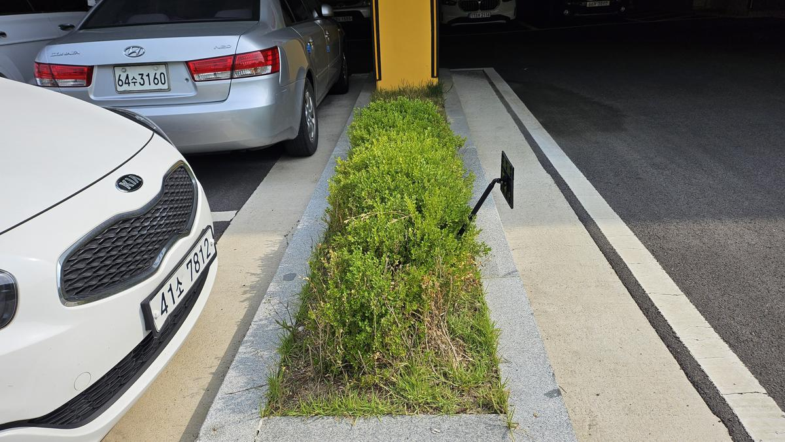
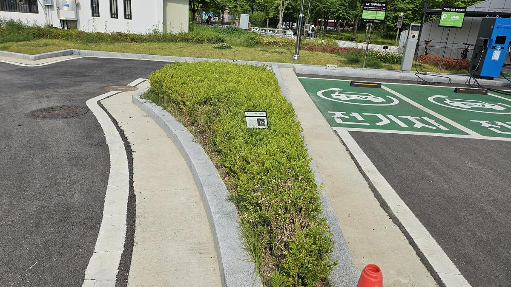
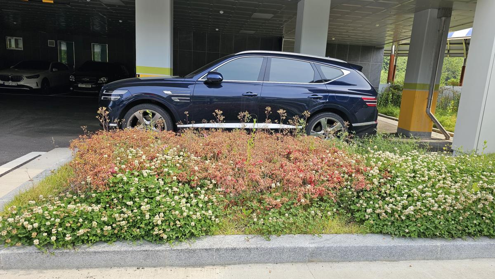
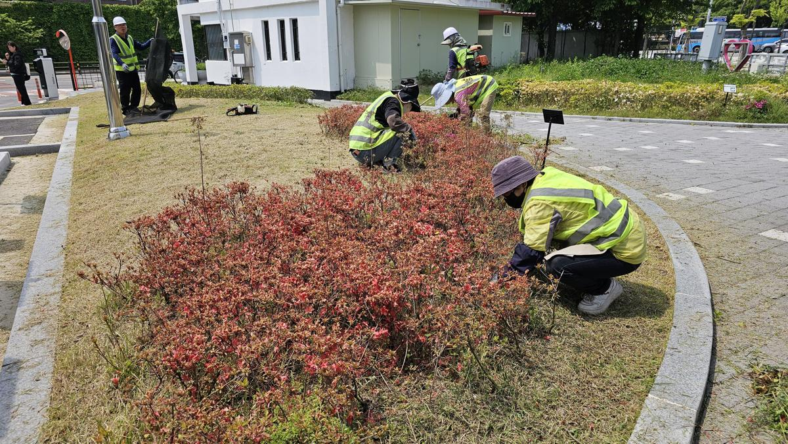
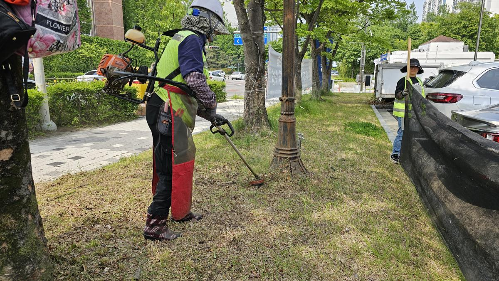
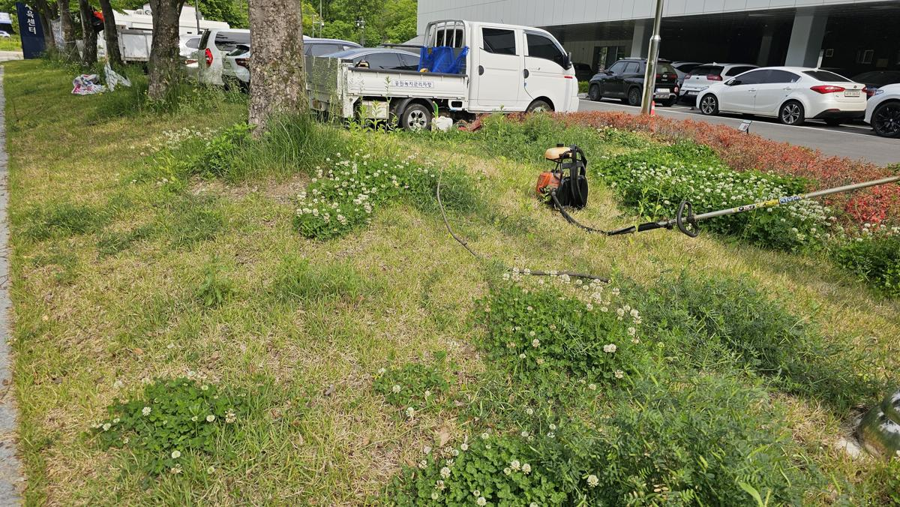
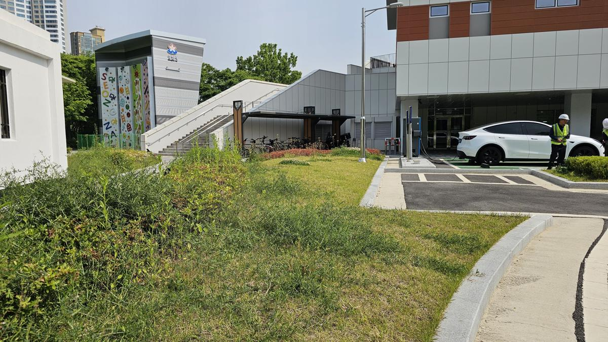
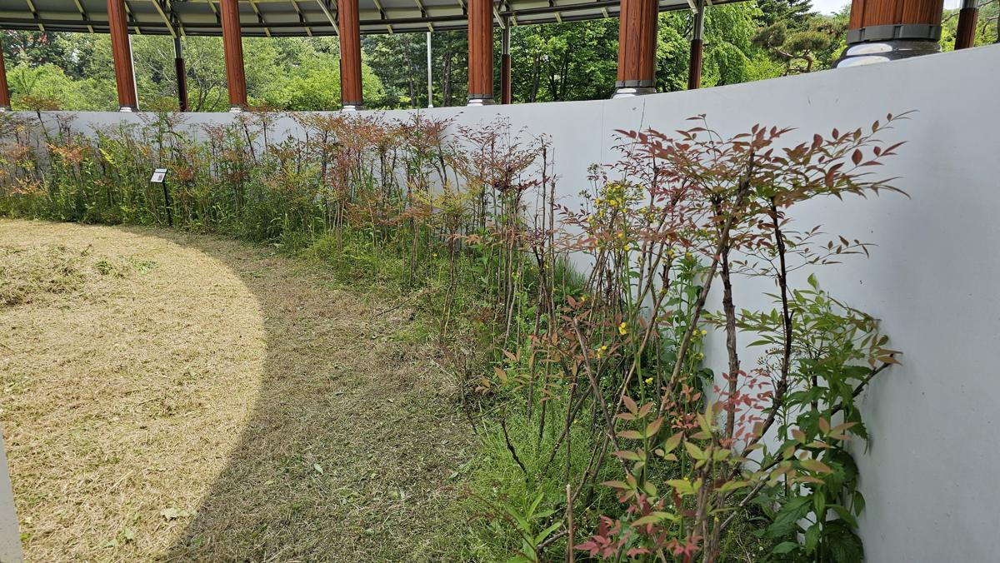

## 공사 개요

| 구분      | 내용                                                     |
| --------- | -------------------------------------------------------- |
| 대상지    | 금곡공원 및 부속 주차장·전기차 충전소 일원               |
| 현장 조사 | 2025년 5월 13일                                          |
| 작업 내용 | 관목 전정, 잔디·녹지대 예초, 화단 인력 제초, 잔재물 수거 |
| 투입 장비 | 견착식 예초기, 엔진 헤지트리머, 송풍기(블로워)           |

봄에서 초여름으로 넘어가는 시기는 잡초 생장이 가장 빠른 때입니다. 금곡공원은 잔디밭과 관목 식재지, 주차장 분리 화단이 섞여 있어 구간마다 다른 장비와 작업 방식이 필요한 현장이었습니다.

---

## 현장 조사 — 2025년 5월 13일

주차장 분리 화단은 폭이 좁아 잡초가 조금만 자라도 경계석 라인이 무너져 보입니다. 차량 진입 시 바퀴 위치를 가늠하는 기준선이기도 해서, 형태를 유지하는 것이 미관 이상의 문제였습니다.

전기차 충전 구역과 맞닿은 관목대는 이용객 통행이 잦은 곳입니다. 잡초가 지피 관목의 양분과 광을 빼앗으면 관목의 하부 잎부터 떨어져 결국 식재 밀도가 성기어집니다.

---

## 작업 방향

나무의사와 시공팀이 진단한 결과, 이 현장의 문제는 두 가지로 정리되었습니다.

1. **수관 내부 통풍 불량** — 관목이 웃자라 속가지가 겹치면서 내부 잎이 마르고 있었습니다. 헤지트리머로 면을 잡되, 한 번에 깊게 들어가지 않고 목질화된 속가지가 드러나지 않는 선에서 정리합니다.
2. **지피층 경쟁 식생 과다** — 잡초를 물리적으로 제거해 관목과 초화의 생육 공간을 확보하고, 이용객 보행 환경을 정리합니다.

---

## 시공 과정

토끼풀이 뒤덮인 잔디밭부터 착수했습니다. 토끼풀은 포복경으로 번져 잔디를 피압(被壓)하기 때문에, 꽃대가 오르기 전에 깎아 세력을 눌러 주어야 합니다.

예초는 안전 장구 착용이 기본입니다. 수목 근주(뿌리목) 주변은 금속 날이 수피를 때리면 형성층이 손상되어 그 자리가 그대로 상처로 남습니다. 근주 반경 30cm 이내는 **나일론 줄(예초 코드)** 로 교체해 작업하고, 개활지 잔디면에만 금속 날을 사용합니다.

관목 사이에 파고든 잡초는 기계로 처리할 수 없습니다. 관목의 잔가지와 잎을 다치지 않게 하려면 결국 사람 손으로 뽑아내야 합니다. 이 구간이 전체 공정에서 가장 시간이 많이 드는 작업입니다.

경사 녹지는 기계 진입이 어렵고 미끄러짐 위험이 있어 순서를 뒤로 두고 견착식 예초기로 처리했습니다. 경사면에서는 날의 회전 방향을 등지고 서서, 잘린 풀이 아래로 흐르도록 진행합니다.

---

## 시공 결과

예초와 제초를 마치자 잔디면과 식재지의 경계가 다시 살아났습니다. 관목의 윤곽이 드러나면서 애초 설계했던 식재 구성이 눈에 들어옵니다. 잘린 풀과 전정 잔가지는 그대로 두면 부패하면서 병해 발생원이 되므로 당일 수거해 반출했습니다.

**💡 전문가의 관리 팁**

굵은 가지를 자른 대형 수목은 절단면이 마르기 전에 도포제를 바르는 것이 좋습니다. 다만 관목 전정처럼 절단면이 작을 때는 도포제보다 **깨끗한 절단면**이 더 중요합니다. 예초 후에는 잔재물을 반드시 수거하고, 잔디는 한 번에 많이 깎기보다 초장의 1/3 이내로 자주 깎는 편이 뿌리 부담이 적습니다.

---

## 시공·진단 의뢰 문의

**느티나무병원 협동조합** — 산림청 등록 1종 나무병원 · 조경식재공사업

- 전화 **031-752-6000**
- 팩스 031-752-6001
- 이메일 coopneuti@naver.com
- 본점 경기도 성남시 수정구 태평로 104

공원·주차장·공공청사 녹지의 연간 유지관리(예초, 제초, 관목 전정, 병해충 방제)는 회차와 시기를 미리 잡아 두면 비용과 품질을 모두 잡을 수 있습니다. 현장 조사 후 연간 관리 계획과 견적을 함께 제시합니다. 관공서 **수의계약**은 실적증명서와 자격·면허 증빙을 즉시 제공합니다.

_(본 게시물의 사진은 모두 실제 시공 현장에서 촬영한 것입니다.)_
