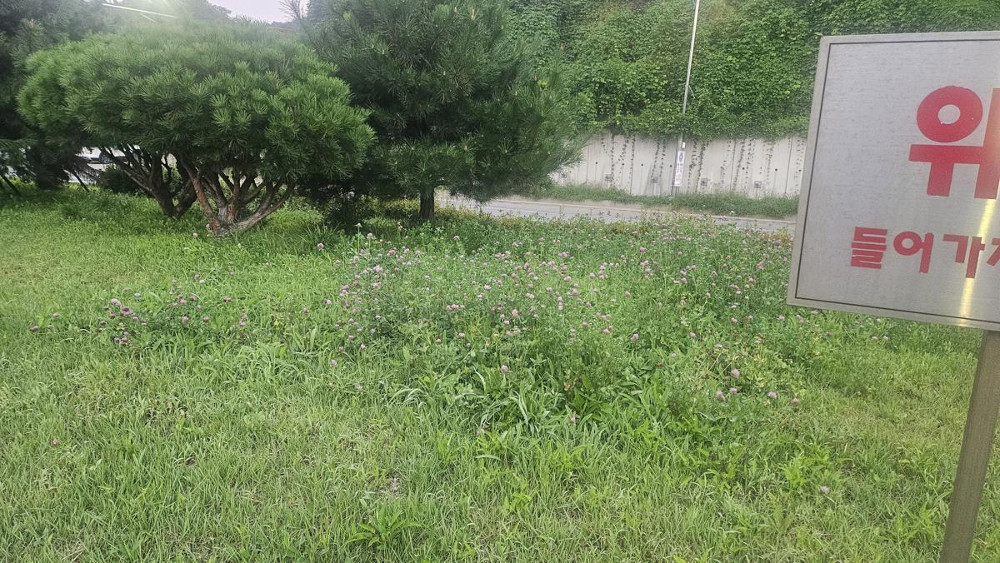
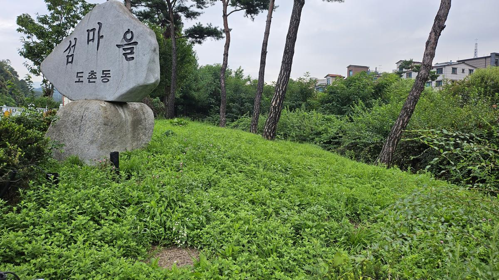
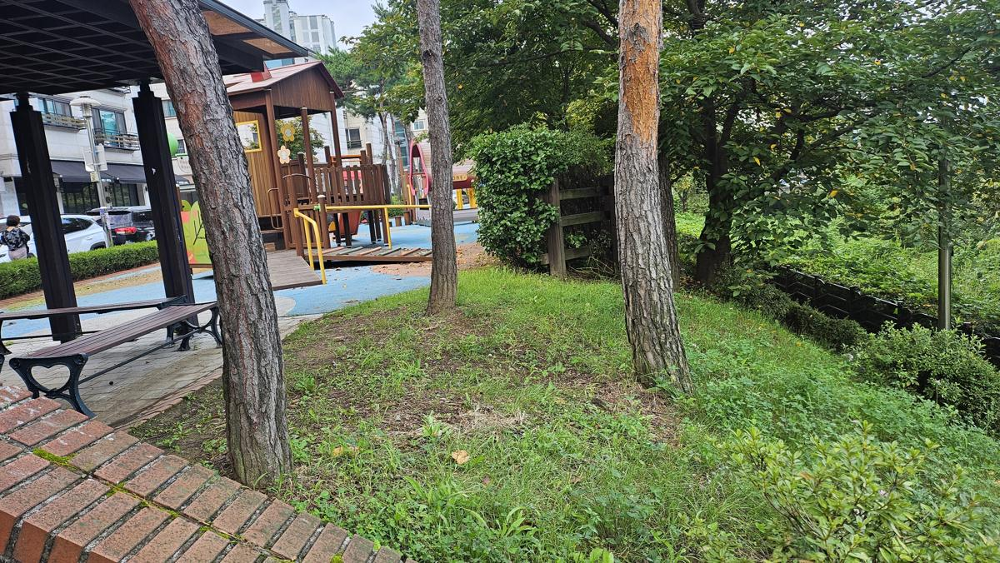
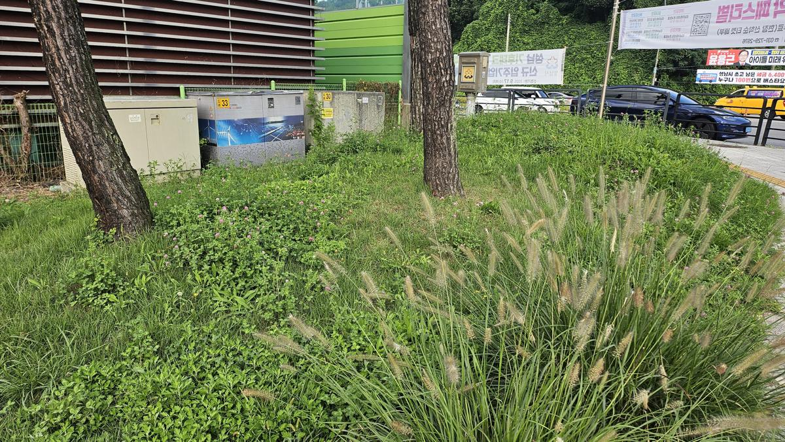
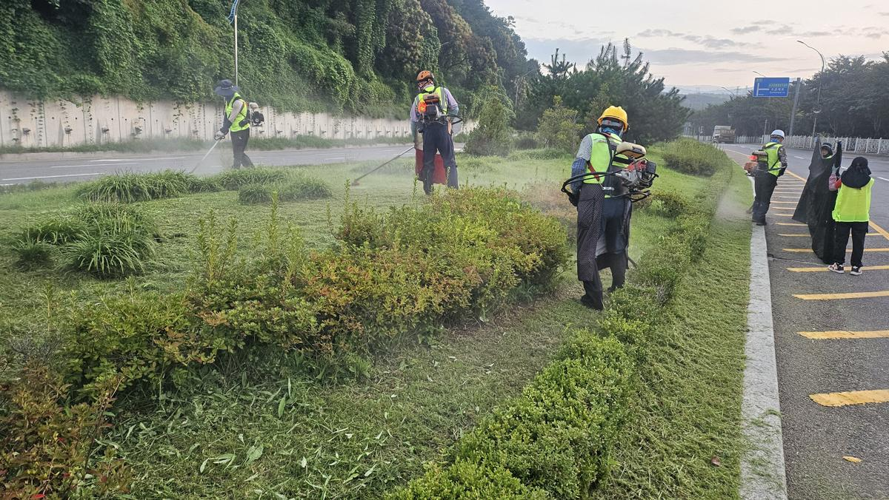
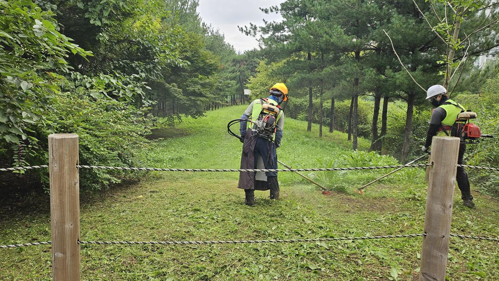
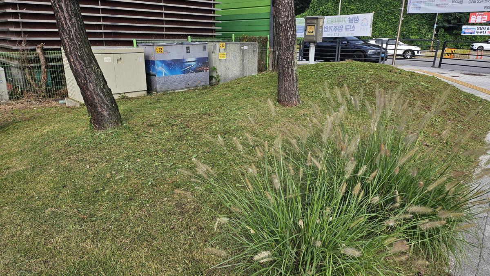
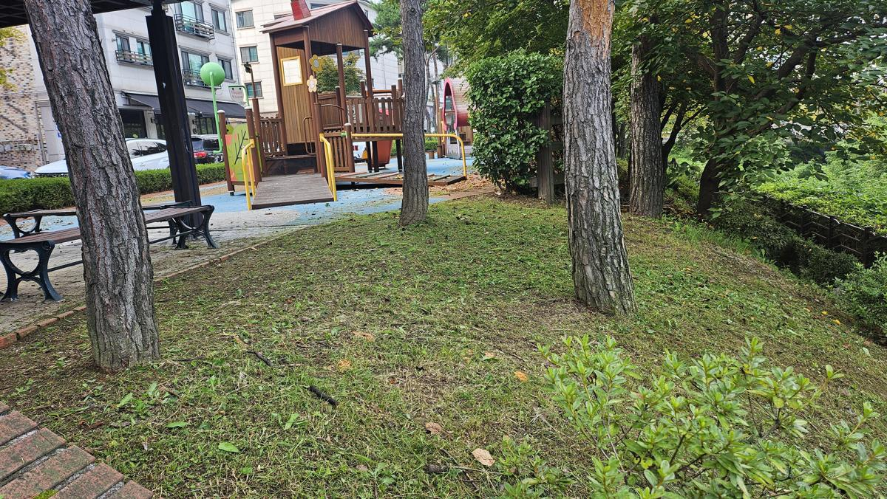
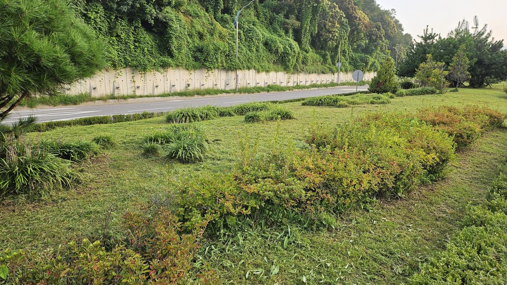

---

title: 녹지대 관리공사
year: 2025
job_main_category: 예초
site_type: 공원
client: 도촌동/갈현동
category: 조경식재
thumbnail_url: ../../uploads/녹지대_관리공사/20250916_083837.jpg

---

# 도촌동·갈현동 녹지대 관리공사 — 잡초에 묻힌 공원의 품격을 되찾다

9월 중순, 한여름의 폭발적인 생장이 남긴 흔적은 녹지대 곳곳에 고스란히 남아 있었습니다. 토끼풀이 잔디를 덮고, 강아지풀이 보도 경계까지 밀려 나오고, 놀이터 옆 잔디밭은 잡초와 구분이 되지 않는 상태. **도촌동과 갈현동 일대 공원 녹지대**에 대한 체계적인 예초 관리공사를 실시했습니다.

---

## 현장 진단 — "잔디가 보이지 않는 녹지대"

### 도촌동 진입부 녹지대

현장 도착 직후 가장 먼저 눈에 들어온 것은 **토끼풀(Trifolium repens)의 과밀 피복**이었습니다. 잔디(한국잔디 기준) 초장이 15cm 이상으로 자란 데다, 토끼풀이 지피를 완전히 점령하여 분홍빛 꽃대가 무수히 올라온 상태였습니다. 이 상태가 지속되면 잔디의 광합성이 억제되어 결국 잔디 자체가 소멸하는 **피압(被壓) 현상**으로 이어집니다.

### 도촌동 마을 표지석 주변

도촌동 마을의 상징인 '섬마을' 표지석 주변은 상황이 더 심각했습니다. **광엽 잡초(쇠비름, 명아주 등)**가 지면을 빽빽하게 덮어 표지석 하단이 거의 보이지 않을 정도였고, 배후의 소나무 식재지까지 잡초가 침투해 있었습니다. 마을의 첫인상을 결정짓는 공간이 방치된 인상을 주고 있었습니다.

### 놀이터 인접 녹지대

아이들이 뛰어노는 놀이터 바로 옆 녹지대입니다. 소나무 수관 아래 잔디밭에 잡초가 불균일하게 자라면서, 벤치 주변과 보행 동선까지 거친 느낌을 주고 있었습니다. 놀이터와 맞닿은 공간인 만큼, **진드기·해충의 서식 환경을 차단**하기 위해서라도 적기 예초가 반드시 필요한 구간이었습니다.

### 갈현동 도로변 녹지대

갈현동 도로변 녹지대는 **강아지풀(Setaria viridis)**이 이삭을 풍성하게 드리우며 보도 경계선까지 넘어온 상태였습니다. 전기 시설물(변압기함) 주변까지 잡초가 밀생하여 시설물 점검 접근성은 물론, 도로변 시인성(視認性)까지 저하시키고 있었습니다. 차량 운전자의 시야 확보와 보행자 안전을 위해 우선 정비가 필요한 구간이었습니다.

---

## 시공 과정 — 체계적인 예초와 잔재물 처리

### 도로변 녹지대 집중 예초

작업은 이른 아침 6시부터 시작되었습니다. 안전모·안면 보호대·반사 조끼를 착용한 작업자들이 **견착식 예초기**를 이용해 도로변 녹지대부터 순차적으로 진행했습니다. 사진에서 확인할 수 있듯, 관목(회양목 등) 사이사이에 침투한 잡초까지 예초기 날을 세밀하게 조절하며 제거하고 있습니다. 뒤편에서는 **송풍기(블로워)**를 이용해 예초 잔재물을 한곳으로 모으는 작업이 동시에 진행되었습니다.

> **기술 포인트**: 관목 근접부는 예초기 날이 수피를 손상시킬 수 있어, 나일론 줄(Nylon Line)로 교체하여 작업합니다. 금속 날은 개활지 잔디면에만 사용하여 효율과 안전을 동시에 확보합니다.

### 공원 경사지 예초 작업

공원 내부 경사지는 평지보다 작업 난이도가 높습니다. 경사면에서의 미끄러짐 위험과 함께, 나무 밑둥 주변의 노출근(露出根)을 손상시키지 않도록 각별한 주의가 필요합니다. 사진 속 작업자들은 **밧줄 경계 안쪽 소나무 숲 경사지**에서 예초기를 운용하며, 잔디면의 높이를 약 5cm 내외로 균일하게 맞추고 있습니다.

---

## 작업 결과 — Before & After

### 도로변 녹지대 (갈현동)

예초 전후의 변화가 가장 극적으로 드러나는 구간입니다.

**작업 전**, 강아지풀 이삭이 보도까지 늘어지고 토끼풀이 지면을 뒤덮어 녹지대의 경계조차 불분명했습니다. **작업 후**, 잔디면이 깔끔하게 드러나면서 전기 시설물 주변의 접근 공간이 확보되었고, 도로변에서 바라보는 녹지대의 윤곽이 선명해졌습니다. 강아지풀 군락은 의도적으로 보존하여 계절감 있는 경관 요소로 활용했습니다.

### 놀이터 인접 녹지대 (도촌동)

놀이터 옆 소나무 하부 녹지대의 변화입니다. **작업 전** 잡초가 뒤섞여 거칠었던 잔디밭이, **작업 후** 균일한 높이로 정리되면서 벤치 주변까지 깔끔한 인상으로 바뀌었습니다. 예초 잔재물이 지면에 얇게 남아 있는 것은 **자연 멀칭(Mulching) 효과**를 기대한 것으로, 수분 증발을 억제하고 토양 온도를 안정시키는 역할을 합니다.

### 도로변 녹지대 전경 (갈현동)

도로변 녹지대의 전경입니다. 예초 작업 후 **관목(회양목, 철쭉 등)의 수형 윤곽이 선명하게 드러나면서** 식재 설계 본래의 의도가 되살아났습니다. 잔디면과 관목 사이의 경계가 명확해지니, 녹지대 전체가 '관리되고 있는 공간'이라는 신뢰감을 줍니다.

---

## 전문가의 관리 팁

### 왜 9월 예초가 중요한가?

9월은 한국잔디(Zoysia japonica)가 **가을 휴면 준비**에 들어가는 시기입니다. 이때 잡초를 제거해주면:

1. **잔디의 광합성 효율 극대화** — 휴면 전 마지막으로 영양분을 뿌리에 저장하는 시기에 잡초와의 경쟁을 줄여줍니다.
2. **월동 잡초 억제** — 가을에 발아하는 냉지형 잡초(별꽃, 냉이 등)의 정착을 사전에 차단합니다.
3. **해충 서식지 제거** — 진드기, 모기 등이 월동 준비를 위해 긴 풀숲에 모이는 시기이므로, 예초를 통해 서식 환경을 제거합니다.

### 공원 녹지대 관리 주기 권장

| 시기 | 작업 내용 | 비고 |
|------|-----------|------|
| 4~5월 | 1차 예초 + 잡초 방제 | 잔디 생장 개시기 |
| 7~8월 | 2차 예초 (월 2회 권장) | 최대 생장기 |
| **9월** | **3차 예초 + 정밀 제초** | **휴면 전 마지막 관리** |
| 11월 | 낙엽 수거 + 월동 준비 | 병해충 월동처 제거 |

---

## 공간의 가치를 지키는 일

도촌동 '섬마을' 표지석 앞을 지나는 주민이 "우리 동네가 깨끗해졌네"라고 느끼는 순간, 갈현동 도로변을 지나는 운전자가 정돈된 녹지대를 보며 안전하다고 느끼는 순간, 놀이터 옆 벤치에 앉은 부모가 아이를 안심하고 내려놓는 순간 — **녹지대 관리의 진정한 가치**가 실현됩니다.

잡초를 깎는 것은 단순한 미화 작업이 아닙니다. 그것은 **잔디의 생존을 돕고, 해충의 서식지를 차단하며, 공간의 품격을 회복하는 전문적인 식물 관리 행위**입니다.

> **지속 가능한 관리가 공간의 미래를 바꿉니다.**
> 공원, 도로변, 공공시설 녹지대의 체계적인 예초 관리가 필요하시다면, 현장 진단부터 연간 관리 계획 수립까지 전문가와 상담하세요.