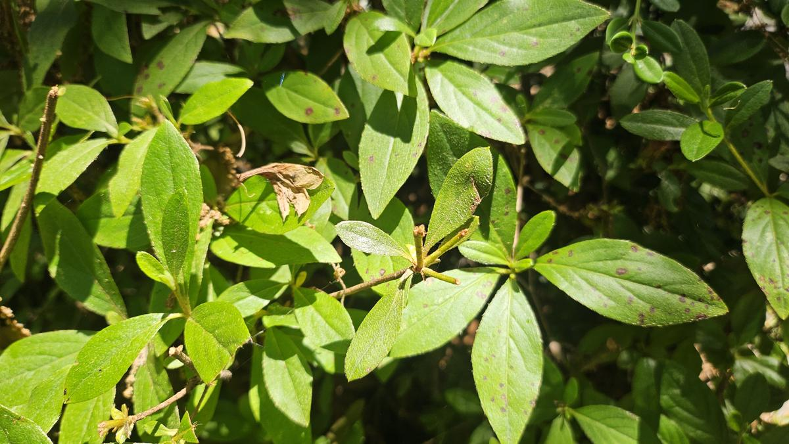
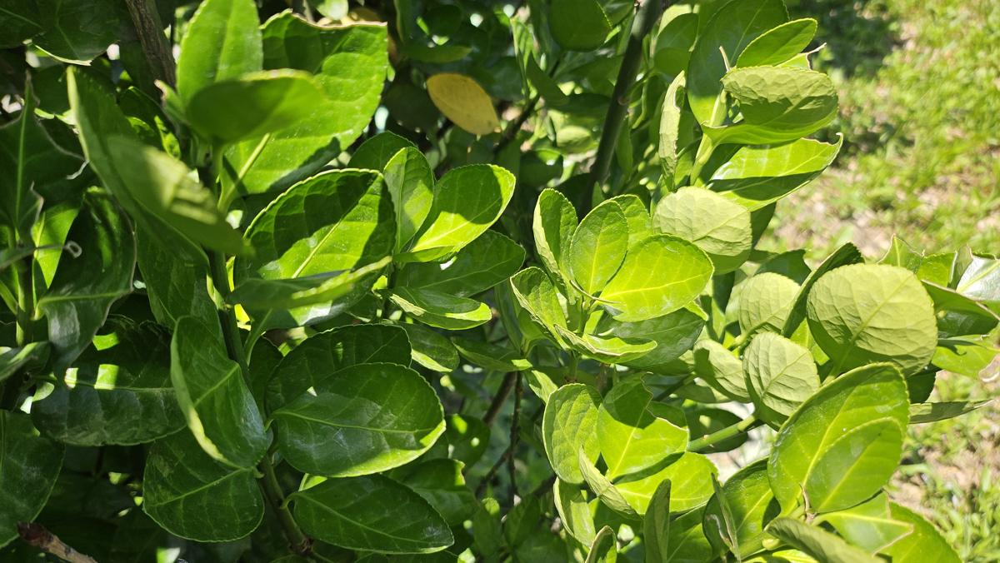
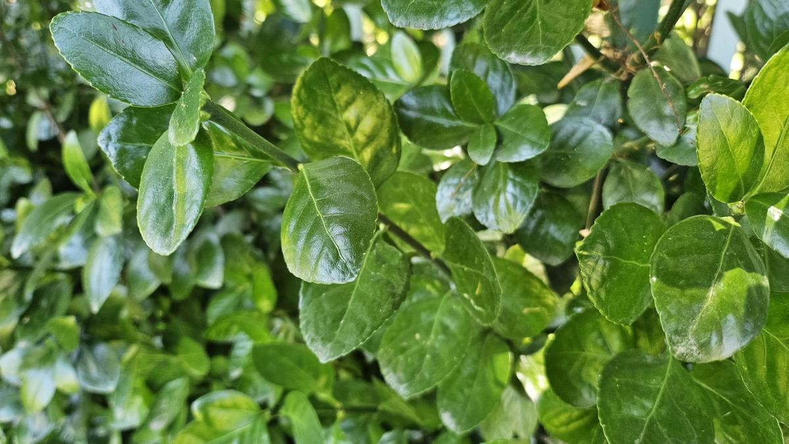
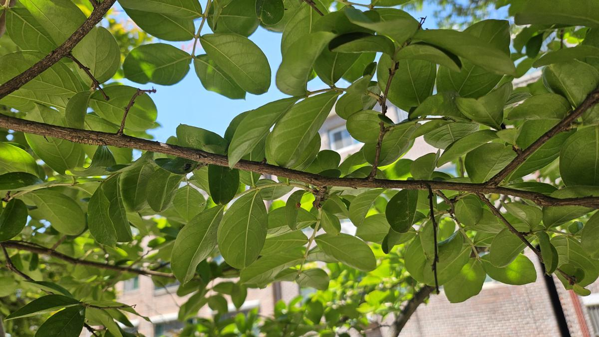
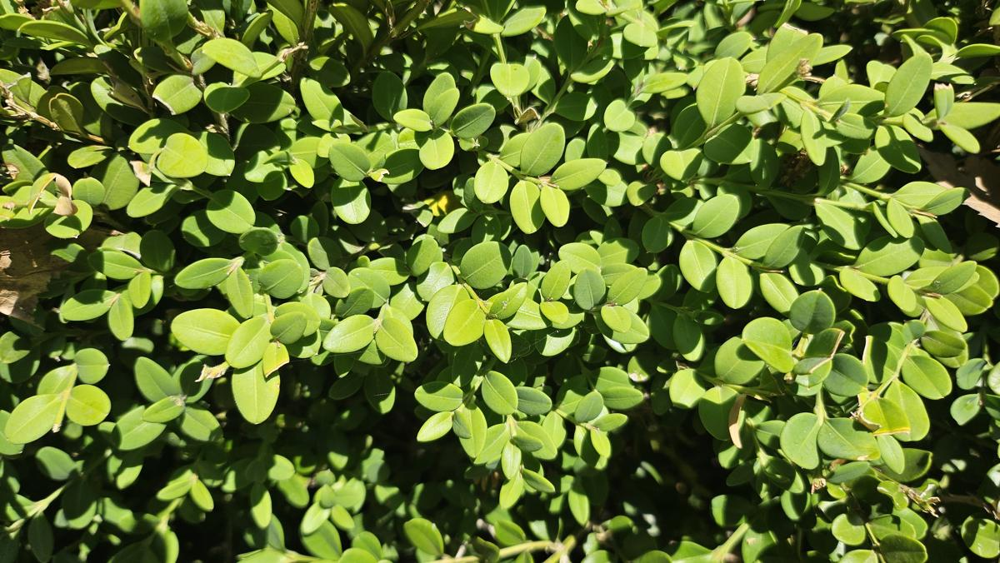
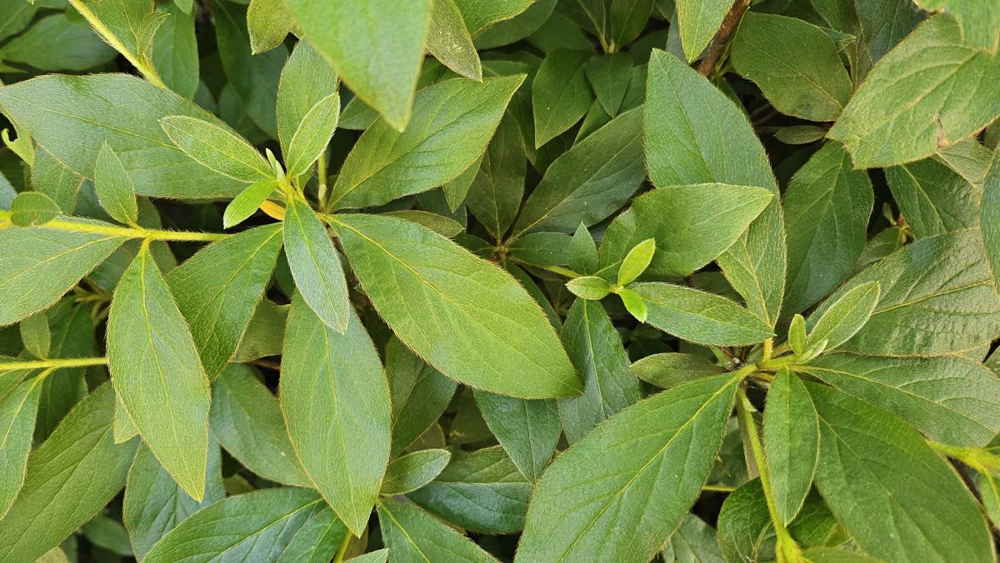
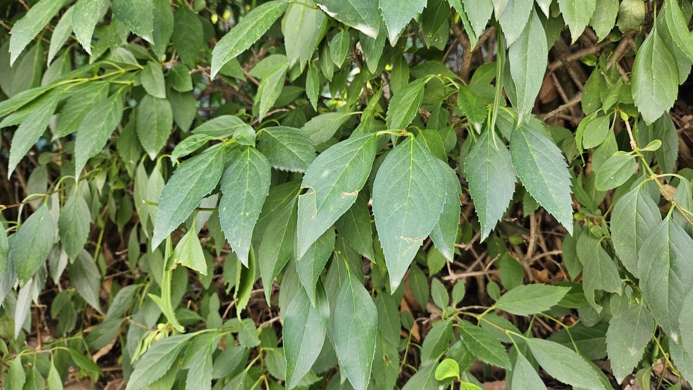
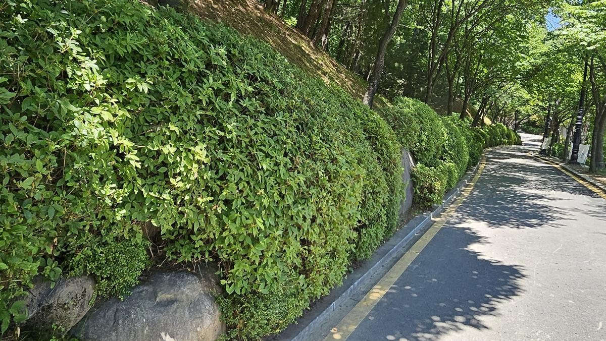

## [현장 문제] 방제 그 이후, 수목은 정말 건강해졌을까?

수목 병해충 방제는 약제를 살포하는 것으로 끝나지 않습니다. 진정한 나무의사라면 방제 후 해충의 밀도가 얼마나 감소했는지, 수목의 생리적 활력이 회복되었는지를 정밀하게 추적해야 합니다. 2024년 6월, 단대공원과 양지공원을 방문하여 지난 방제 작업의 효과를 분석하고 추가적인 위협 요소를 파악하기 위한 정밀 예찰을 실시했습니다.

_철쭉류 잎에서 발견된 갈색 반점. 이는 과거 병해충 피해 흔적과 생리적 스트레스가 복합적으로 나타난 현상으로, 정밀한 원인 분석이 필요합니다._

_일부 수목에서 관찰되는 엽록소 결핍 현상. 흡즙성 해충인 방패벌레나 응애의 잔류 피해 여부를 확인해야 하는 지점입니다._

---

## [전문가 진단] 잎의 뒷면이 말해주는 수목의 진실

단순히 멀리서 바라보는 '시각적 청결'은 수목 건강의 척도가 될 수 없습니다. 나무의사의 시선은 잎의 앞면보다 뒷면, 그리고 신초(새순)의 발달 상태에 머뭅니다.

_전문가에 의한 개별 수목 리프 체크(Leaf Check). 잎의 경도와 색상을 통해 수분 스트레스 지수를 가늠합니다._

_가장 중요한 공정인 잎 뒷면 예찰입니다. 방제 후 해충의 사체와 생존 개체수를 확인하여 방제 효율(Control Efficacy)을 데이터화합니다._

이번 예찰 결과, 주요 해충인 진딧물과 방패벌레의 밀도는 90% 이상 감소했음을 확인했습니다. 다만, 기온 상승에 따른 2차 발생 가능성이 포착되어 적기 방제(Time-to-Spray) 시점을 재설정했습니다.

---

## [예찰 및 분석 과정] 생명력을 되찾는 디테일의 힘

건강한 녹지는 철저한 데이터 관리에서 비롯됩니다. 우리는 공원 내 주요 수종인 회양목, 철쭉, 벚나무 등을 대상으로 전수 조사를 방불케 하는 정밀 진단을 이어갔습니다.

_회양목의 신초 발달 상태 확인. 방제 후 독성이 사라진 자리에 건강한 새 잎이 돋아나며 수형이 조밀해지고 있습니다._

_조팝나무류의 엽색 분석. 짙은 녹색은 광합성 효율이 극대화되었음을 의미하며, 이는 토양 내 영양 공급과 방제가 조화를 이룬 결과입니다._

_사철나무의 잎 표면 광택 확인. 왁스층이 두껍게 형성된 잎은 외부 병원균의 침입에 강한 저항성을 가집니다._

---

## [결과 및 관리 팁] 지속 가능한 공원의 미래

정밀 예찰을 통해 단대·양지공원의 수목들은 현재 매우 안정적인 회복기에 접어들었음을 확인했습니다.

1. **수분 관리**: 기온이 급격히 오르는 시기이므로, 방제 후 약해진 수목에 충분한 관수를 실시하여 대사 작용을 도와야 합니다.
2. **멀칭(Mulching)**: 뿌리 근처의 온도를 조절하고 잡초 발생을 억제하여 수목의 영양 경쟁력을 높여주어야 합니다.
3. **추가 예찰**: 장마 전후로 곰팡이성 병해(흰가루병 등) 발생 확률이 높으므로 지속적인 모니터링이 필수적입니다.

_관리가 완료된 양지공원의 산책로 전경. 건강한 수목이 만드는 쾌적한 미관은 시민들에게 정서적 안정과 쉼을 제공합니다._

---

## [가치] 공간의 품격은 건강한 나무로부터

공원은 도시의 허파이자 시민의 안식처입니다. 병해충으로 잎이 마르고 수형이 망가진 나무는 공공기관의 신뢰도를 떨어뜨릴 뿐만 아니라, 시민의 안전까지 위협할 수 있습니다.

저희는 단순한 방제 업체를 넘어, **수목의 생애 주기를 관리하는 전략 파트너**로서 공간의 가치를 지킵니다. 과학적인 예찰과 정밀한 처방, 그리고 진심 어린 사후 관리까지.

**지속 가능한 관리가 공간의 미래를 바꿉니다.** 지금 여러분의 소중한 녹지를 전문가의 시선으로 진단받으세요.

**[조경 전략 컨설팅 및 수목 진단 의뢰: 000-0000-0000]**
