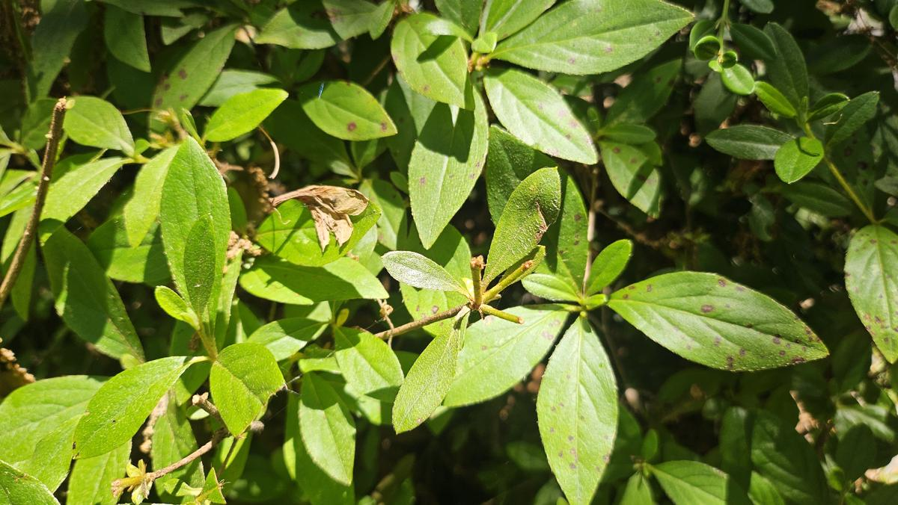
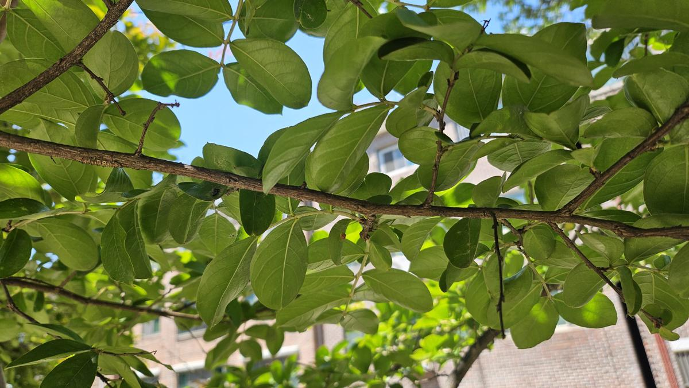
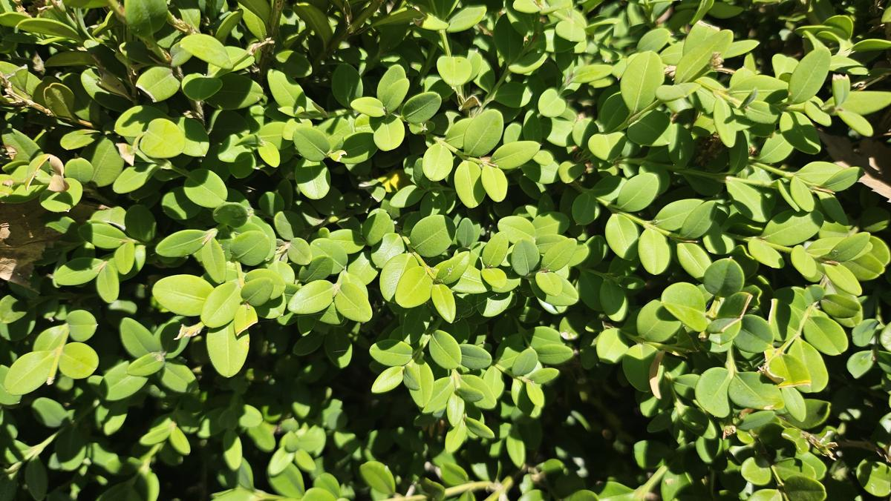
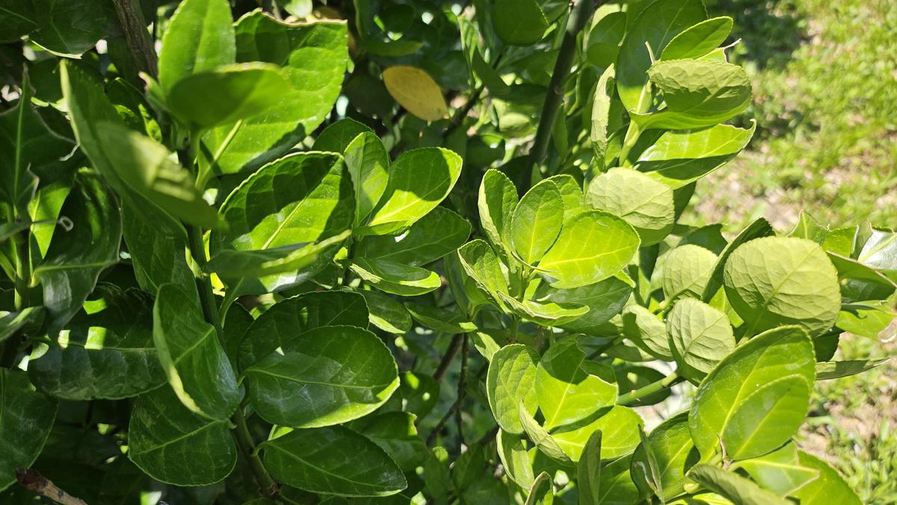
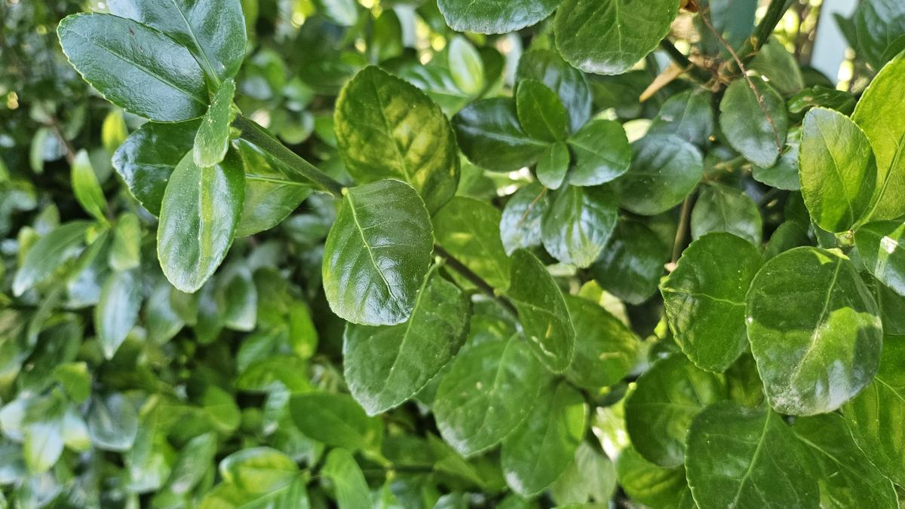
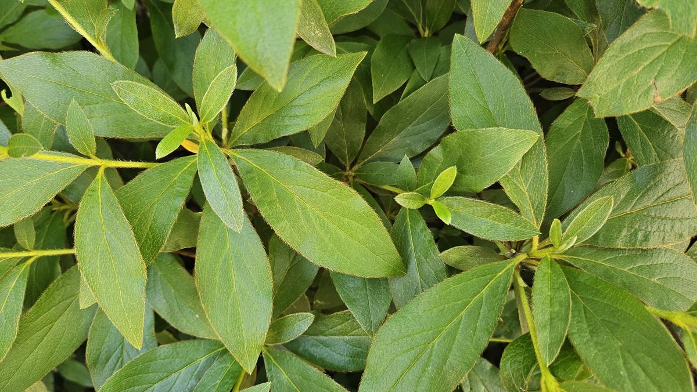
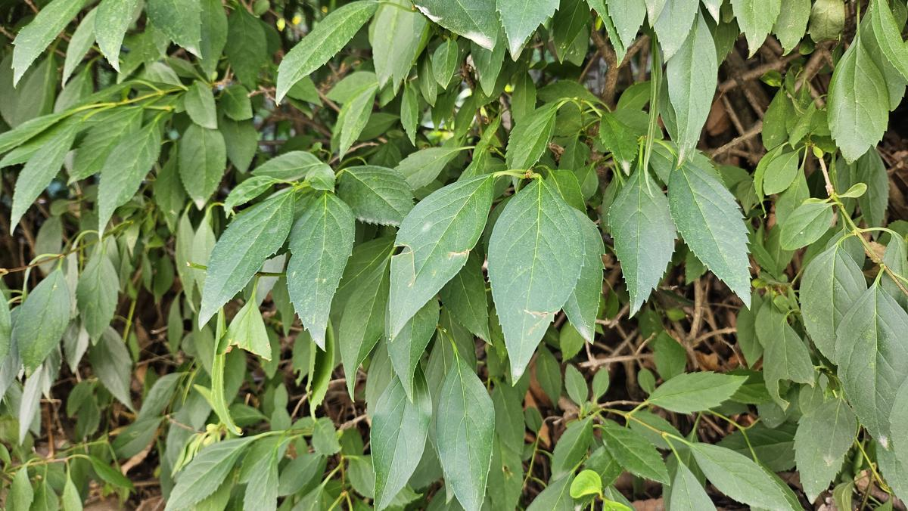
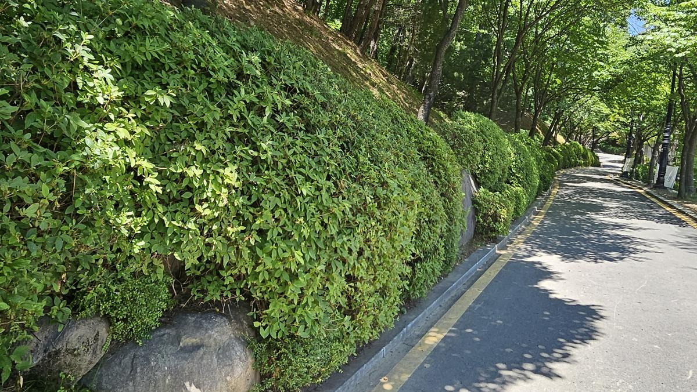

## 공사 개요

| 구분           | 내용                                                                   |
| -------------- | ---------------------------------------------------------------------- |
| 대상지         | 성남시 단대공원, 양지공원                                              |
| 예찰일         | 2024년 6월 4일                                                         |
| 작업 내용      | 방제 후 사후 예찰, 해충 밀도 조사, 방제 효과 분석, 차기 방제 시기 산정 |
| 주요 대상 수종 | 철쭉류, 회양목, 사철나무, 배롱나무 등                                  |

수목 병해충 방제는 약제를 살포하는 것으로 끝나지 않습니다. 방제 후 해충 밀도가 얼마나 줄었는지, 수목의 생리적 활력이 회복되었는지를 추적해야 다음 방제의 시기와 약제를 결정할 수 있습니다. 2024년 6월, 단대공원과 양지공원을 방문해 지난 방제 작업의 효과를 분석하고 추가 위협 요소를 확인하는 사후 예찰을 실시했습니다.

---

## 피해 흔적 확인

철쭉류 잎에서 확인된 갈색 반점입니다. 철쭉방패벌레의 흡즙 피해와 점무늬성 병해가 겹칠 때 나타나는 전형적인 양상으로, 원인을 갈라 보아야 처방이 달라집니다. 방패벌레 피해는 잎 앞면이 백색으로 탈색되고 뒷면에 검은 배설물이 붙는 것이 특징이고, 병해는 반점 가장자리에 뚜렷한 경계가 생깁니다.

## 예찰 방법 — 잎 뒷면을 본다

멀리서 보는 '시각적 청결'은 수목 건강의 척도가 되지 않습니다. 나무의사의 시선은 잎의 앞면보다 뒷면, 그리고 신초(새순)의 발달 상태에 머뭅니다.

가장 중요한 공정은 잎 뒷면 예찰입니다. 응애·진딧물·방패벌레는 모두 잎 뒷면에 붙어 즙을 빨기 때문에, 뒷면을 확인해야 생존 개체와 사체를 구분할 수 있습니다. 이렇게 확인한 밀도를 방제 전 조사값과 비교해 **방제 효율(control efficacy)** 을 산출합니다.

이번 예찰 결과, 주요 해충인 진딧물과 방패벌레의 밀도는 방제 전 대비 90% 이상 감소했음을 확인했습니다. 다만 기온 상승에 따른 2차 발생 가능성이 포착되어 차기 적기 방제 시점을 다시 잡았습니다.

---

## 수종별 회복 상태

회양목은 신초 발달 상태로 건강을 판단합니다. 회양목명나방 피해를 입으면 신초 부위가 거미줄처럼 얽히며 잎이 갈변하는데, 이번 조사에서는 그런 흔적 없이 새 잎이 고르게 전개되어 수형이 조밀해지고 있었습니다.

사철나무의 신초 전개 상태입니다. 흡즙성 해충 피해가 남아 있으면 새 잎이 오그라들거나 변색된 채로 나오는데, 잎이 정상적인 크기와 색으로 펼쳐진다는 것은 방제 이후 수세가 회복되고 있다는 신호입니다.

사철나무 잎 표면의 광택을 확인합니다. 큐티클(왁스)층이 두껍게 형성된 잎은 병원균 침입과 건조에 대한 저항성이 높습니다. 수세가 떨어지면 이 광택부터 흐려집니다.

관목류의 엽색을 확인합니다. 잎맥 사이가 노랗게 뜨는 엽맥간 황화가 없고 색이 고르게 짙다는 것은, 광합성 기능과 뿌리의 양분 흡수가 함께 정상이라는 뜻입니다.

낙엽 관목류는 잎 가장자리 톱니와 잎맥 주변부터 피해가 시작됩니다. 이 부위를 확대해 확인하면 아직 육안으로 드러나지 않은 초기 흡즙 흔적을 잡아낼 수 있습니다.

---

## 예찰 결과 및 후속 관리

정밀 예찰 결과 단대·양지공원의 수목들은 안정적인 회복기에 접어들었음을 확인했습니다. 후속 관리는 다음 세 가지로 정리했습니다.

1. **관수 관리** — 기온이 급격히 오르는 시기이므로, 방제로 일시적 부담을 받은 수목에 충분히 관수해 대사 작용을 돕습니다.
2. **멀칭** — 근권부 지온을 조절하고 잡초 발생을 억제해 수목의 양분 경쟁 부담을 줄입니다.
3. **추가 예찰** — 장마 전후로 흰가루병·점무늬병 등 곰팡이성 병해 발생 확률이 높아지므로 모니터링을 이어 갑니다.

**💡 나무의사의 관리 팁**

방제는 '몇 번 쳤는가'보다 '언제 쳤는가'가 결과를 가릅니다. 해충의 부화 시기(약충기)를 맞추면 저농도 약제로도 방제가 되지만, 시기를 놓치면 성충기에 고농도로 여러 번 쳐야 하고 그만큼 수목과 환경에 부담이 갑니다. 사후 예찰은 다음 방제의 적기를 잡기 위한 필수 공정입니다.

---

## 시공·진단 의뢰 문의

**느티나무병원 협동조합** — 산림청 등록 1종 나무병원 · 조경식재공사업

- 전화 **031-752-6000**
- 팩스 031-752-6001
- 이메일 coopneuti@naver.com
- 본점 경기도 성남시 수정구 태평로 104

병해충 방제는 나무의사의 진단서와 처방을 근거로 약제·시기·농도를 정합니다. 공원·아파트·학교의 연간 방제 계획 수립과 사후 예찰까지 함께 수행합니다. 관공서·공공기관 **수의계약**은 실적증명서와 자격·면허 증빙을 견적서와 함께 제공합니다.

_(본 게시물의 사진은 모두 실제 시공 현장에서 촬영한 것입니다.)_
