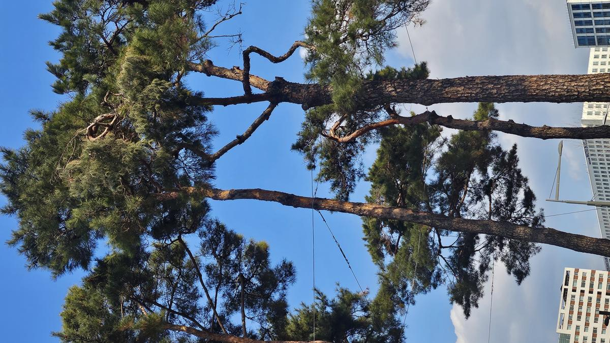
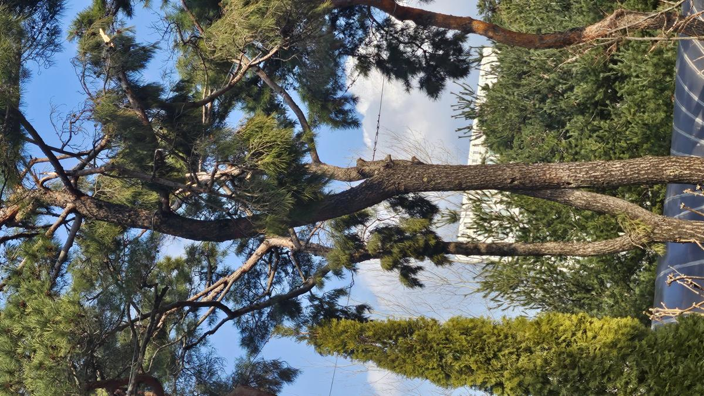
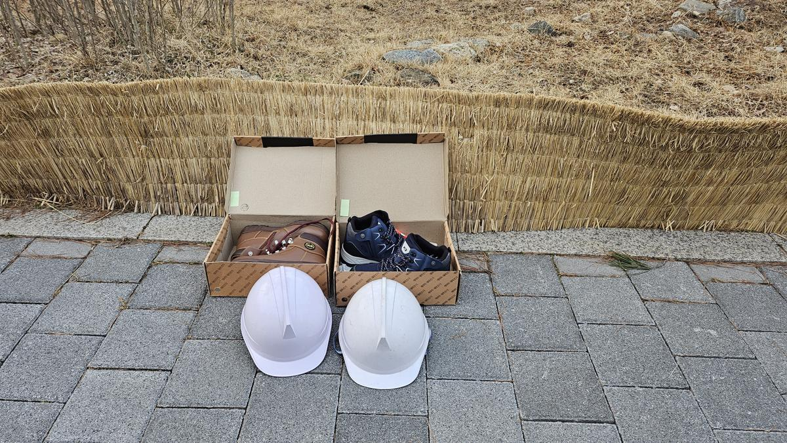
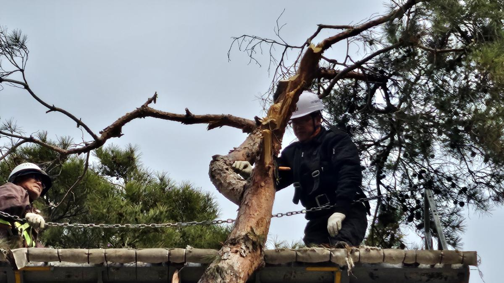
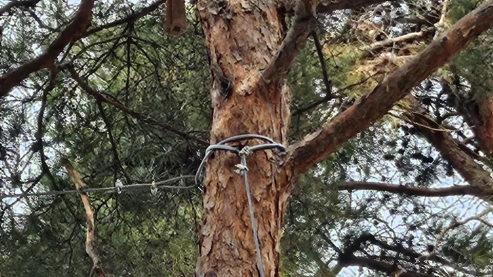
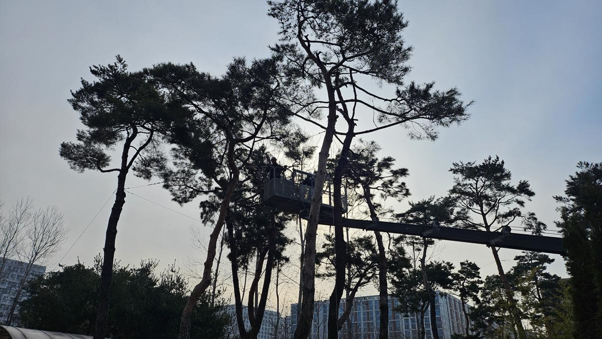
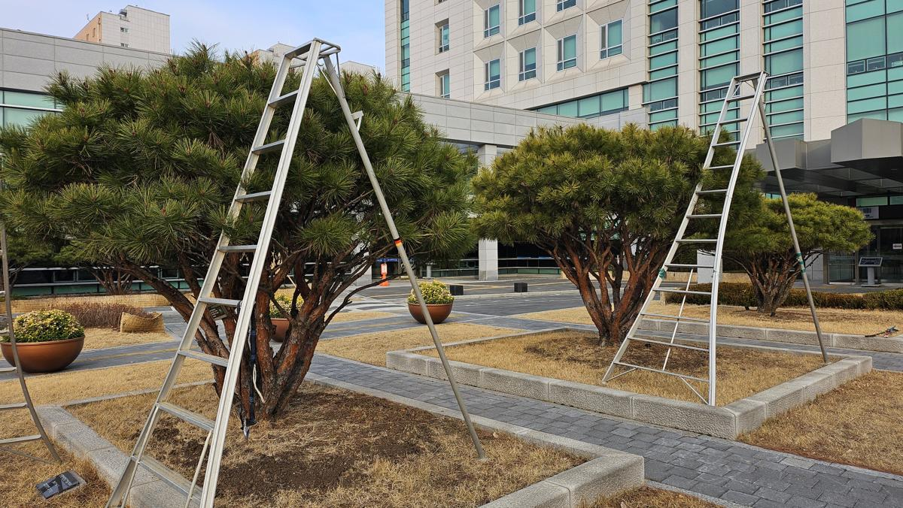
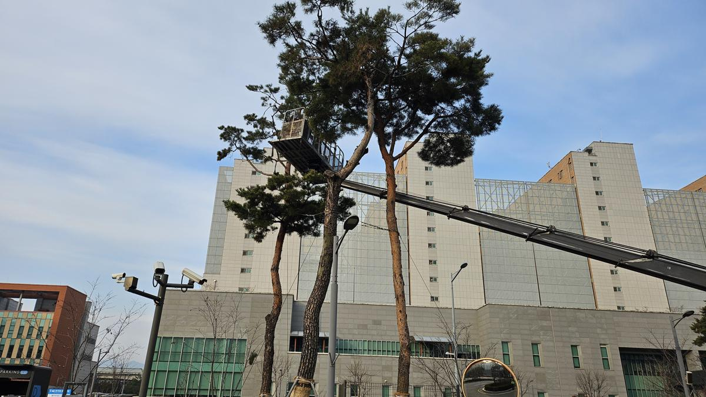
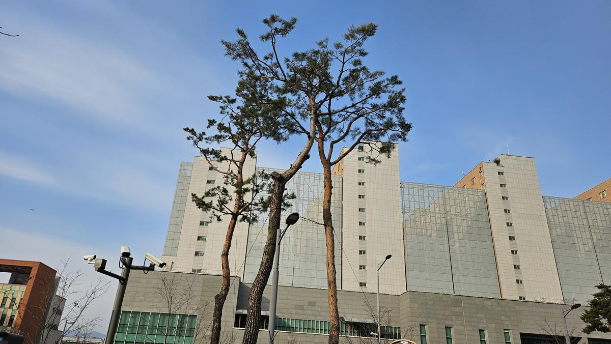
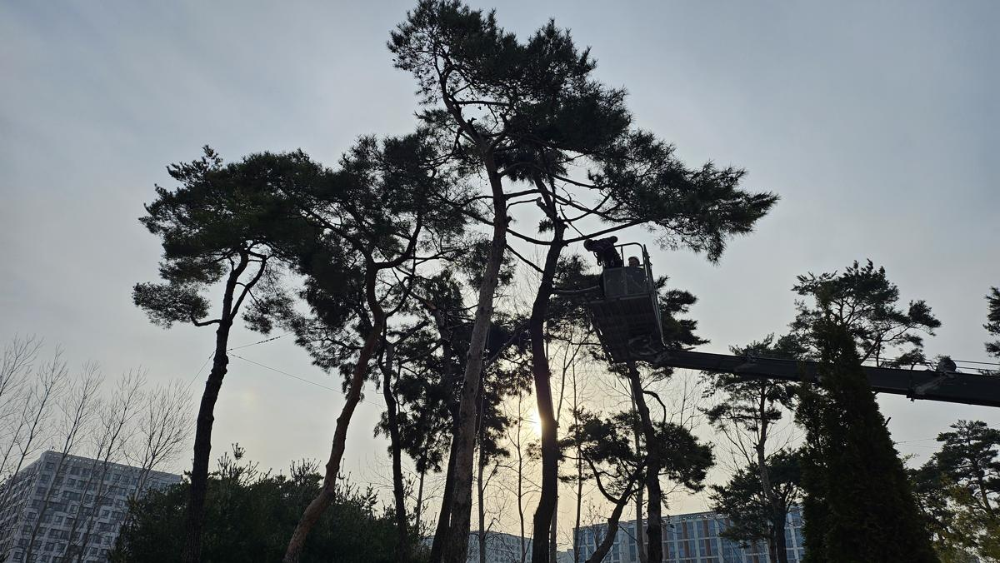

## 공간의 가치를 결정하는 소나무의 생태적 품격

공공기관의 조경은 단순한 녹지 그 이상의 의미를 갖습니다. 특히 **동부검찰청**과 같은 기관에서 소나무는 '절개'와 '신뢰'를 상징하는 핵심적인 시각적 요소입니다. 하지만 관리가 소홀해진 소나무는 수형이 흐트러질 뿐만 아니라, 내부 가지의 밀생으로 인한 통풍 불량, 광합성 효율 저하 등 생태적 건강성 위기에 직면하게 됩니다.

이번 프로젝트는 동부검찰청의 상징인 소나무들의 생리적 활력을 회복하고, 기관의 위상에 걸맞은 정갈한 미관을 구현하는 데 초점을 맞추었습니다.

_전정 작업 전, 수관 내부까지 햇빛이 도달하지 못해 하단부 가지가 쇠약해진 상태의 소나무 전경입니다._

---

## [현장 진단] 수형의 비틀림과 생리적 스트레스 포착

나무의사의 관점에서 본 작업 전 소나무들은 전형적인 **'관리 공백'**의 징후를 보이고 있었습니다.

1. **수관 밀생(Crowded Canopy):** 가지가 지나치게 엉켜 있어 병해충(응애, 깍지벌레 등)이 서식하기 최적의 환경이 조성되었습니다.
2. **도장지 및 역지 발생:** 영양분이 불필요한 가지로 분산되어 소나무 특유의 곡선미가 가려지고 있었습니다.
3. **하단부 고사 현상:** 상부의 과도한 잎들이 그늘을 만들어 아래쪽 가지들이 점차 생명력을 잃어가는 상태였습니다.

_복잡하게 얽힌 가지들은 수목의 호흡을 방해하고 시각적인 답답함을 유발합니다._

---

## [전문가 처방] 수목 생리를 고려한 정밀 전정 계획

단순히 길이를 맞추는 '이발'식 전정이 아닌, 나무의 미래 성장을 설계하는 **'전략적 전정'**을 시행했습니다.

- **솎음전정(Thinning):** 수관 내부의 통풍과 채광을 확보하여 내측 잎의 고사를 방지합니다.
- **수형 교정:** 소나무 고유의 수피(Bark)와 곡선이 드러나도록 불필요한 잔가지를 제거하여 미적 가치를 극대화합니다.
- **안전 우선 시공:** 고소작업차와 전문 등반 기술을 활용하여 수목의 손상을 최소화하고 작업자의 안전을 확보합니다.

_정밀한 작업을 위해 준비된 전문 장비와 안전 보호구는 시공의 신뢰도를 높이는 기본입니다._

---

## [시공 과정] 생명력을 불어넣는 정교한 손길

본격적인 작업은 수관 상부부터 하부로 내려오며 진행되었습니다. 고소작업차를 이용하여 사람의 손이 닿기 어려운 최상단부의 밀생된 가지들을 먼저 정리했습니다.

_고소작업차를 활용해 수관 상부의 광합성 효율을 높이기 위한 정밀 솎음 작업을 진행 중입니다._

_가지 하나하나의 생육 방향을 고려하여 절단면을 최소화하는 기술적 전정을 시행합니다._

전정 시 가장 중요한 것은 **'지륭(Branch Ridge)'**을 보호하는 것입니다. 가지가 줄기와 만나는 부위를 정확히 파악하여 절단해야 나무 스스로 상처를 치유하는 능력을 극대화할 수 있습니다.

_절단면의 깔끔한 마무리는 수목의 2차 감염을 예방하는 핵심 공정입니다._

---

## [결과 및 가치] 신뢰의 공간, 건강한 녹지로의 재탄생

작업이 완료된 동부검찰청의 소나무들은 이제 소나무 본연의 웅장함과 정갈함을 뽐내고 있습니다.

_동부검찰청의 상징물과 조화를 이루며 한층 깊어진 품격을 보여주는 소나무의 모습입니다._

_하늘이 투영될 정도로 확보된 수관 사이의 공간은 나무의 호흡을 원활하게 하고 시각적 쾌적함을 선사합니다._

이번 전정 작업을 통해 얻은 가치는 다음과 같습니다.

- **생태적 건강:** 통풍과 채광 확보로 병해충 저항력 강화 및 수명 연장.
- **심미적 완성도:** 기관의 권위와 신뢰를 뒷받침하는 명품 수형 완성.
- **안전성 확보:** 강풍이나 적설 시 부러질 위험이 있는 약한 가지 사전 제거.

_정돈된 수형은 방문객과 근무자들에게 정서적 안정감과 신뢰감을 전달합니다._

---

## 지속 가능한 관리가 공간의 미래를 바꿉니다

나무는 살아있는 생명체이기에 시공만큼이나 사후 관리가 중요합니다. 오늘 다듬은 소나무 한 그루가 10년 뒤, 100년 뒤 동부검찰청의 역사를 증언하는 명품 수목으로 거듭날 수 있도록 저희는 생태적 진심을 다합니다.

**당신의 공간에 있는 나무는 건강합니까?**
전문적인 수목 진단과 전략적 조경 관리가 필요하다면, 나무의사의 예리한 시선과 조경 전략가의 감각을 더한 컨설팅을 경험해 보십시오.

_지속 가능한 녹지 관리, 그것이 바로 공간의 가치를 높이는 가장 확실한 투자입니다._
