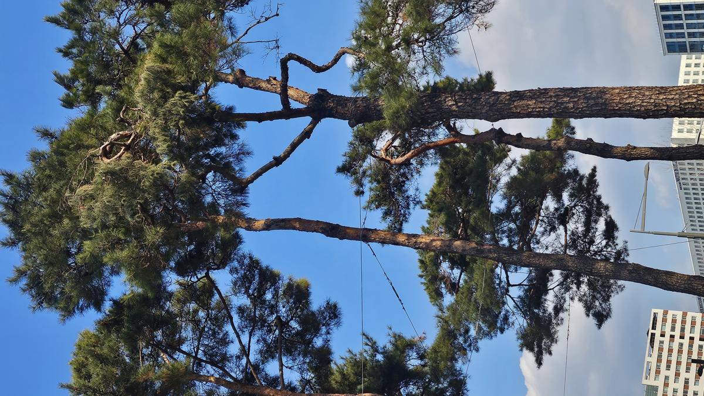
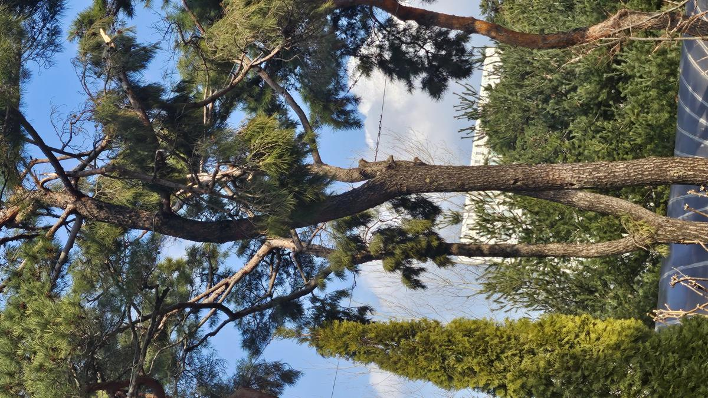
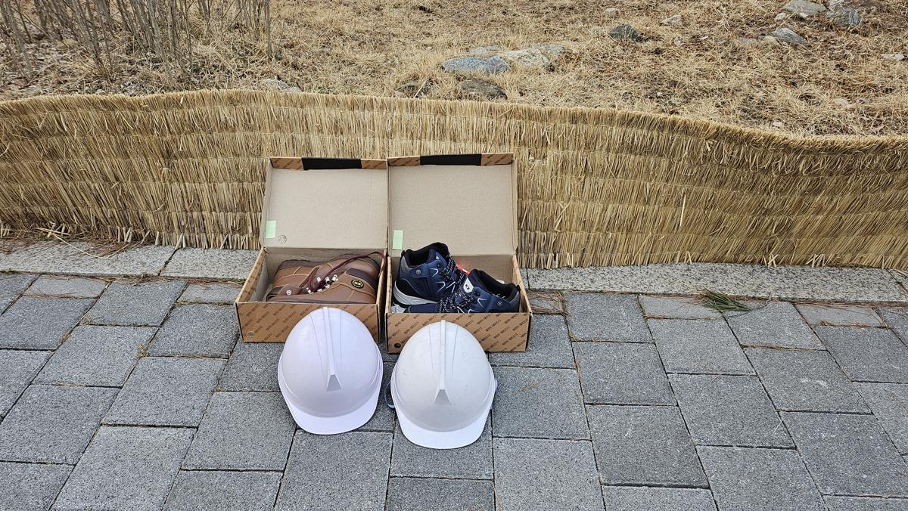
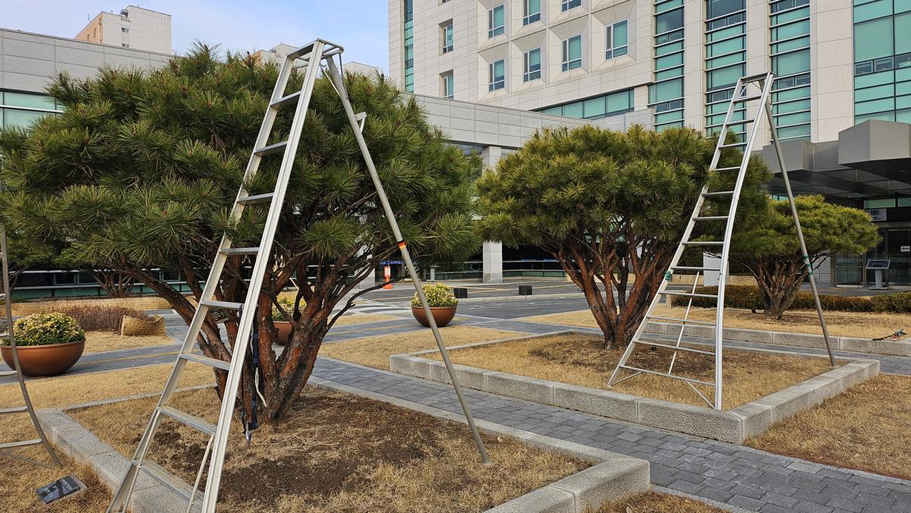
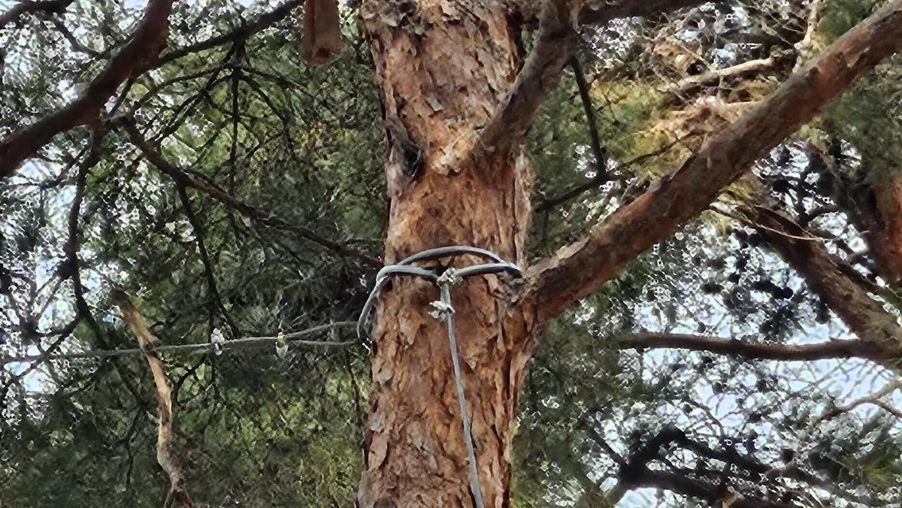
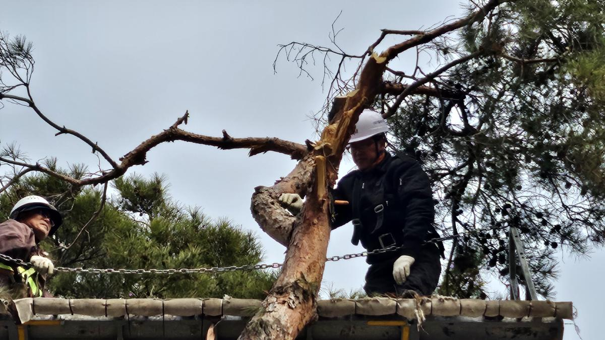
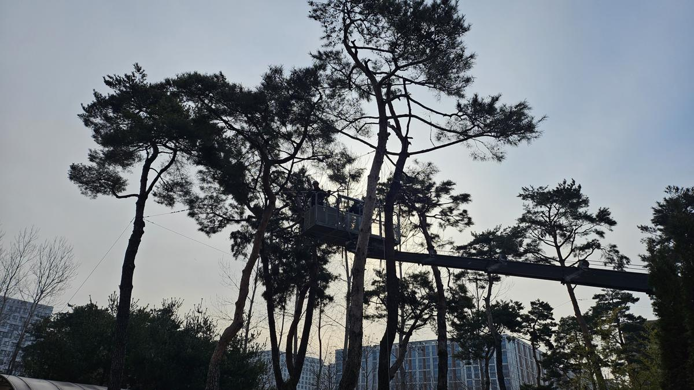
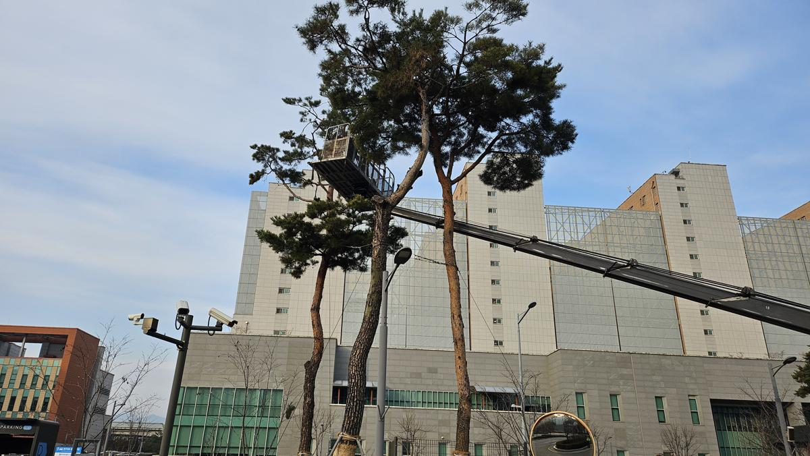
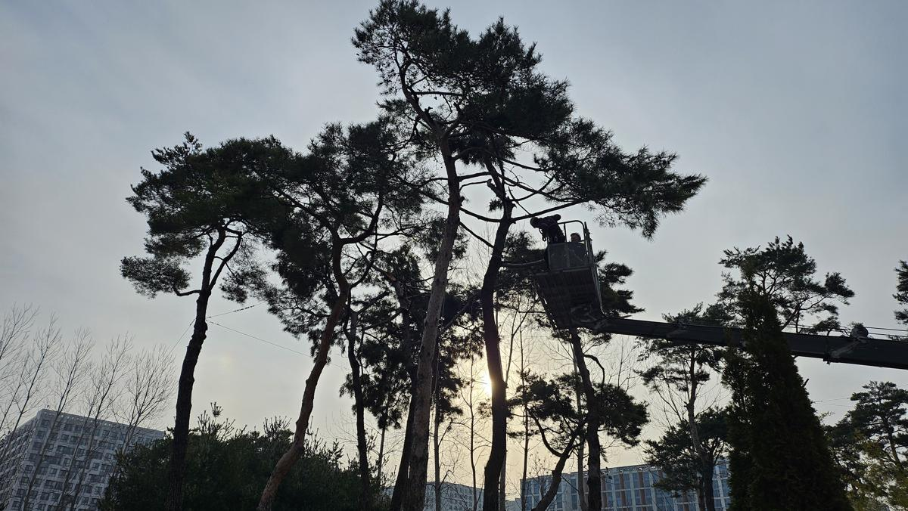
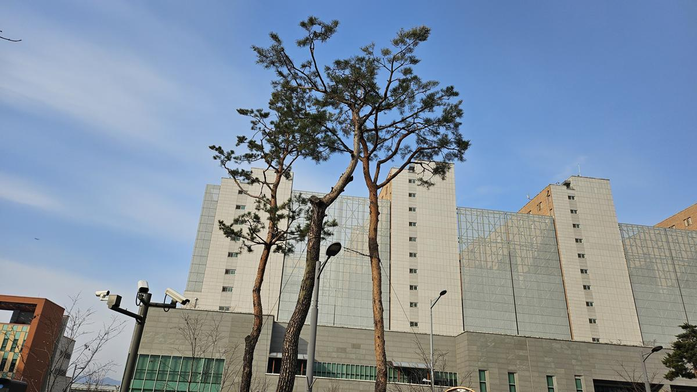

## 공사 개요

| 구분      | 내용                                                          |
| --------- | ------------------------------------------------------------- |
| 대상지    | 동부검찰청 청사 전면 및 후면 녹지                             |
| 작업 기간 | 2025년 3월 6일 사전 조사 → 3월 8일 본 시공                    |
| 작업 내용 | 대형 소나무 솎음전정, 고사지·부러진 가지 제거, 반송 수형 정리 |
| 투입 장비 | 고소작업차, 리깅 로프·활차, 사다리, 엔진톱·전정톱             |

공공기관 청사의 소나무는 관리 상태가 곧바로 눈에 띄는 수목입니다. 동부검찰청 소나무는 여러 해 손이 닿지 않아 수관이 밀생하고 상부에 고사지가 남아 있었습니다. 3월 6일 나무의사가 현장을 조사해 제거 범위를 정하고, 3월 8일 본 시공을 진행했습니다.

---

## 현장 조사 — 3월 6일

수고가 높고 가지가 도로·보행로 위로 뻗어 있어, 절단한 가지를 그대로 떨어뜨릴 수 없는 조건이었습니다. 나무의사와 시공팀이 함께 올라가 가지별 하중과 낙하 경로를 확인했습니다.

조사 결과 확인된 문제는 세 가지였습니다.

1. **수관 밀생** — 가지가 지나치게 엉켜 통풍이 막히고, 응애·깍지벌레가 서식하기 쉬운 환경이 형성되어 있었습니다.
2. **도장지·역지 발생** — 위로 곧게 뻗은 도장지와 안쪽으로 자란 역지에 양분이 분산되어 소나무 특유의 가지 흐름이 가려져 있었습니다.
3. **상부 고사지** — 수관 상부에 이미 말라 죽은 가지가 남아 있어 강풍·적설 시 낙하 위험이 있었습니다.

---

## 시공 과정 — 3월 8일

작업은 안전 점검과 보호구 지급으로 시작했습니다. 청사 이용객 동선을 피해 이른 아침에 착수하고, 작업 구역에는 통행 제한을 두었습니다.

청사 전면 화단의 반송(다간형 소나무)은 수고가 낮아 사다리 작업으로 진행했습니다. 다간형 수목은 줄기마다 세력이 달라, 강한 줄기를 눌러 주고 약한 줄기를 살리는 방향으로 솎아야 전체 균형이 잡힙니다.

후면 대형목은 **리깅(rigging)** 방식으로 처리했습니다. 수간에 지지점을 잡고 로프와 활차를 설치한 뒤, 절단한 가지를 로프로 받아 천천히 내립니다. 아래 시설물과 보행로를 손상시키지 않으면서 작업자 부담도 줄이는 방식입니다.

굵은 고사지는 한 번에 자르지 않고 끝에서부터 구간별로 나누어 무게를 줄여 나갑니다. 마지막 밑둥 절단은 **삼단 절단법**으로 진행해 수피가 세로로 찢겨 내려가는 것을 막습니다.

사람 손이 닿지 않는 최상단부부터 밀생한 가지를 솎아 내려옵니다. 위에서 아래로 진행해야 남길 가지의 양을 보면서 절단량을 조절할 수 있습니다.

전정에서 가장 중요한 것은 **지륭(枝隆, branch collar)** 을 보호하는 일입니다. 가지가 줄기와 만나는 부위를 정확히 짚어 그 바깥쪽에서 절단해야, 나무가 스스로 유합 조직을 만들어 상처를 닫을 수 있습니다. 지륭을 파고들어 자르면 상처가 아물지 않고 부후균 침입 통로가 됩니다.

---

## 시공 결과

작업을 마친 소나무는 고사지가 정리되고 수관 사이로 하늘이 비칠 만큼 공간이 열렸습니다. 이번 시공으로 얻은 결과는 다음과 같습니다.

- **생육 환경 개선** — 통풍과 채광이 확보되어 병해충 발생 여건이 줄었습니다.
- **수형 정리** — 도장지·역지를 제거해 소나무 본래의 가지 흐름이 드러났습니다.
- **안전 확보** — 강풍·적설 시 부러질 위험이 있던 고사지를 사전에 제거했습니다.

**💡 나무의사의 관리 팁**

소나무 전정 적기는 11월~이듬해 3월의 휴면기입니다. 절단면이 큰 경우 도포제를 바르기보다 **절단면을 정확한 위치에서 매끄럽게 마무리하는 것**이 유합에 훨씬 유리합니다. 전정 이후 2~3년 주기로 순 정리(순따기·순지르기)를 이어 가면 한 번에 강전정할 일이 생기지 않습니다.

---

## 시공·진단 의뢰 문의

**느티나무병원 협동조합** — 산림청 등록 1종 나무병원 · 조경식재공사업

- 전화 **031-752-6000**
- 팩스 031-752-6001
- 이메일 coopneuti@naver.com
- 본점 경기도 성남시 수정구 태평로 104

대형목 전정, 고사지 제거, 리깅 작업은 장비와 숙련도가 함께 필요한 공정입니다. 현장 여건에 맞는 공법과 안전 계획을 포함해 견적을 드립니다. 관공서·공공기관 **수의계약**은 실적증명서와 자격·면허 증빙을 견적서와 함께 제공합니다.

_(본 게시물의 사진은 모두 실제 시공 현장에서 촬영한 것입니다.)_
