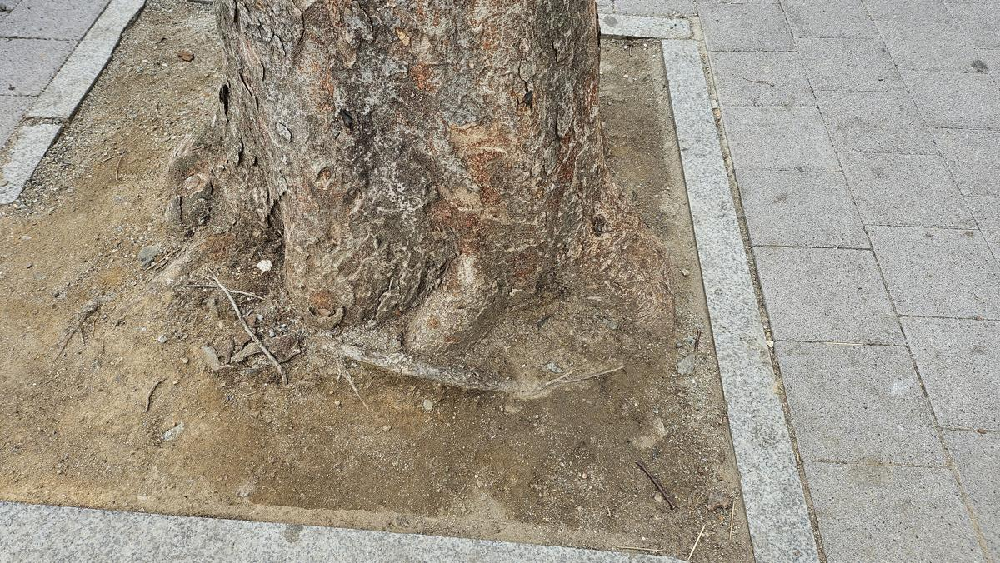
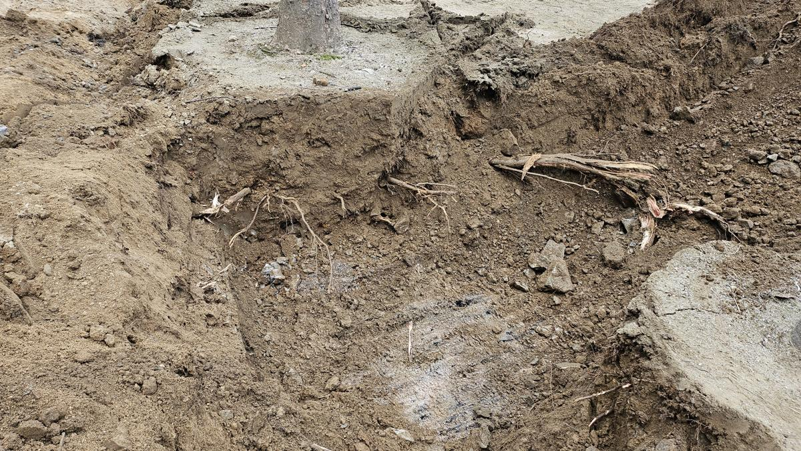
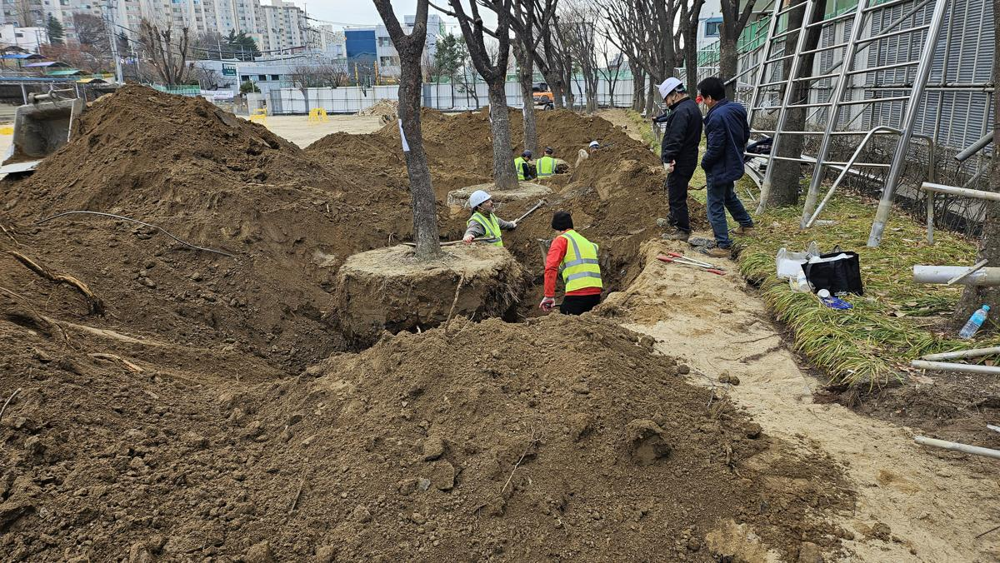
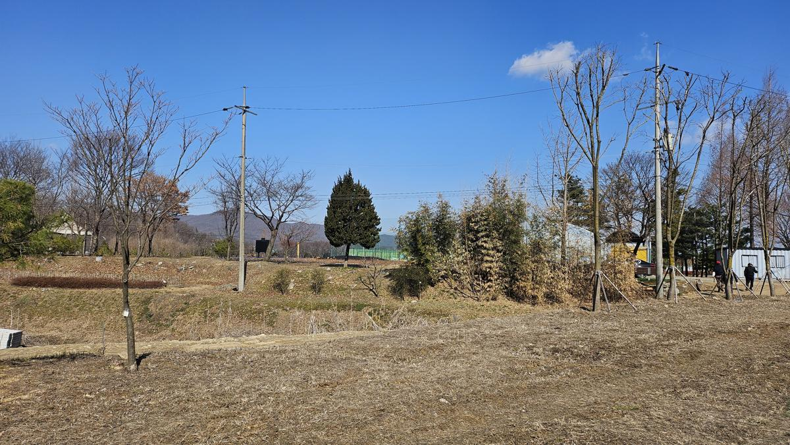
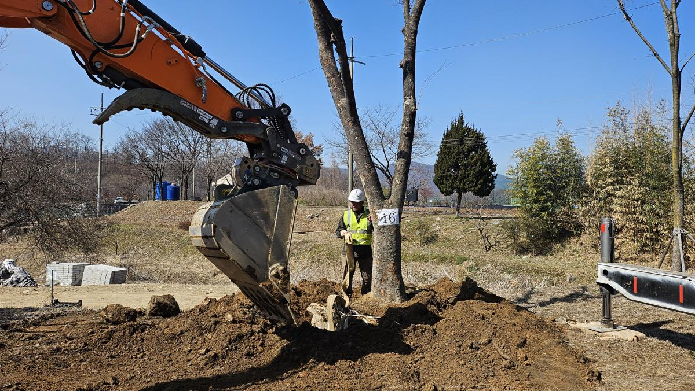
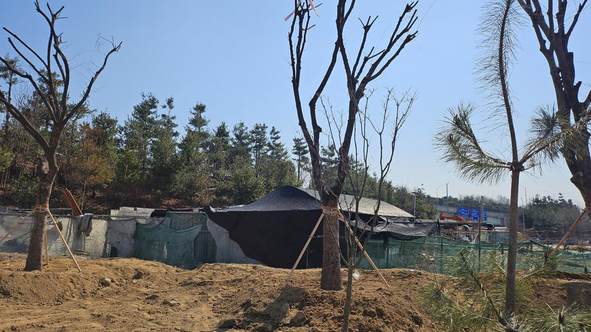

## [현장 문제]: 50년의 시간을 품은 거목, 새로운 터전이 필요하다

성남 상원초등학교 운동장 한편에는 학교의 역사와 함께해온 50년 이상의 대형 수목들이 자리하고 있었습니다. 아이들에게는 시원한 그늘을, 학교에는 품격 있는 경관을 선사하던 소중한 자산입니다. 하지만 이번 축구장 조성 사업으로 인해 이 거목들은 이식이라는 중대한 기로에 서게 되었습니다.

노거수(老巨樹)의 이식은 단순한 '옮겨심기'가 아닙니다. 수십 년간 뻗어 내린 뿌리 생태계를 보존하면서 새로운 환경에 적응시키는, 고도의 기술력이 요구되는 '수술'과도 같은 작업입니다.

_이식 전 수목의 근원부 상태를 점검합니다. 50년의 세월만큼 비대해진 근주와 지표면으로 노출된 뿌리의 활력도를 확인하여 분뜨기(Root Balling)의 범위를 결정합니다._

---

## [전문가 진단/계획]: 생존율 극대화를 위한 '정밀 분뜨기' 전략

나무의사의 관점에서 가장 우려되는 부분은 노거수의 낮은 회복력입니다. 이를 해결하기 위해 본 팀은 다음과 같은 기술적 전략을 수립했습니다.

1.  **표준 규격 이상의 분 확보**: 근원직경(R)의 4~6배 이상으로 분을 크게 확보하여 세근(가는 뿌리)의 손실을 최소화합니다.
2.  **토양 이물질 제거**: 오랜 세월 학교 운동장에 매립되어 있던 폐기물들이 뿌리 발달을 저해하고 있음을 포착, 이식 과정에서 이를 정화하기로 합니다.
3.  **수형 조절 및 증산 억제**: 이식 후 수분 스트레스를 줄이기 위해 정교한 전정 작업을 병행합니다.

_본격적인 굴취 작업에 들어갑니다. 뿌리분이 깨지지 않도록 인력과 장비를 동원하여 섬세하게 주변 토양을 제거합니다._

_굴취 과정에서 발견된 지중 매립물입니다. 이러한 이물질들은 수목의 심근 발달을 방해하고 배수 불량을 초래하는 원인이 됩니다. 이식은 이러한 생육 저해 요소를 제거하는 기회이기도 합니다._

---

## [시공 과정]: 중장비와 숙련공의 협업, 안전한 이동

대형 수목 이식은 06급, 08급 굴착기와 대형 크레인의 정교한 협업이 필수적입니다. 자칫 실수가 발생하면 수십 년 된 나무의 수피가 벗겨지거나 분이 깨져 고사로 이어질 수 있기 때문입니다.

_숙련된 작업자들이 뿌리분을 마포와 고무바를 이용해 단단히 결속합니다. 이는 운반 중 진동에 의한 분열을 방지하는 핵심 공정입니다._

_대형 크레인을 이용한 인양 작업입니다. 수목의 무게 중심을 정확히 파악하여 수평을 유지하며, 수피 보호를 위해 완충재를 충분히 사용합니다._

_성남시 양묘장으로 향하는 대형 트럭에 상차된 모습입니다. 가지가 도로 시설물에 걸리지 않도록 결속하고, 이동 중 수분 증발을 막기 위한 조치를 취합니다._

---

## [결과 및 관리 팁]: 성남시 양묘장에서 시작되는 제2의 생애

상원초등학교의 거목들은 이제 성남시 양묘장의 비옥한 토양에 안전하게 안착했습니다. 이곳에서 충분한 요양과 관리를 거쳐 다시 시민들의 곁으로 돌아갈 준비를 하게 됩니다.

_양묘장에 도착하여 식재 구덩이를 정비합니다. 배수가 원활하도록 바닥면을 고르고, 양질의 마사토와 유기질 비료를 혼합하여 최적의 생육 환경을 조성합니다._

_수목을 수직으로 세우고 뿌리 사이사이에 흙이 빈틈없이 채워지도록 '물죽치기' 작업을 병행하며 식재합니다._

_식재 완료 후 견고한 지주목을 설치하여 전도 사고를 예방했습니다. 이제 이 나무들은 전문적인 관리를 받으며 새로운 생명력을 회복할 것입니다._

---

## [가치]: 지속 가능한 관리가 공간의 미래를 바꿉니다

이번 상원초등학교 수목 이식 프로젝트는 단순한 조경 공사가 아닙니다. **학교의 역사를 보존하고, 예산을 절감하며, 생태적 가치를 이어가는 '지속 가능한 조경 전략'**의 본보기입니다.

50년 된 나무 한 그루가 주는 정서적 안정감과 미세먼지 저감 효과는 돈으로 환산할 수 없는 가치를 지닙니다. 저희는 나무의사의 전문성으로 그 가치가 끊기지 않도록 생명의 길을 연결합니다.

**당신의 공간에 있는 나무는 안녕하십니까?**
전문적인 진단과 전략적인 관리가 필요하다면, 수목의 미래를 바꾸는 파트너와 상의하십시오.

**지속 가능한 관리가 공간의 미래를 바꿉니다.**
