## 공사 개요

| 구분      | 내용                                                                  |
| --------- | --------------------------------------------------------------------- |
| 대상지    | 성남 상원초등학교 (축구장 조성 부지) → 성남시 양묘장                  |
| 작업 기간 | 2024년 3월 6일 ~ 3월 10일 (5일간)                                     |
| 작업 내용 | 분뜨기(굴취), 뿌리 절단면 정리, 크레인 양중·상차, 양묘장 식재 및 지주 |
| 투입 장비 | 06·08급 굴착기, 25톤 러프테레인 크레인, 카고 트럭                     |

상원초등학교 운동장 한편에는 학교와 함께해 온 50년 이상의 대형 수목들이 있었습니다. 아이들에게 그늘을, 학교에 경관을 만들어 주던 나무들입니다. 축구장 조성 사업이 결정되면서 이 나무들은 베어지는 대신 **성남시 양묘장으로 이식**하는 방향으로 정리되었습니다.

노거수 이식은 단순한 옮겨심기가 아닙니다. 수십 년간 뻗어 내린 뿌리 생태계를 최대한 보존한 채 새 환경에 적응시키는, 활착률이 곧 성패인 공정입니다. 더구나 학교는 작업 공간이 좁고 학생 동선과 겹치기 때문에, 장비를 어디에 세우고 어떤 순서로 움직이느냐가 공기와 안전을 함께 좌우합니다.

---

## 1. 이식 전 조사 — 3월 6일

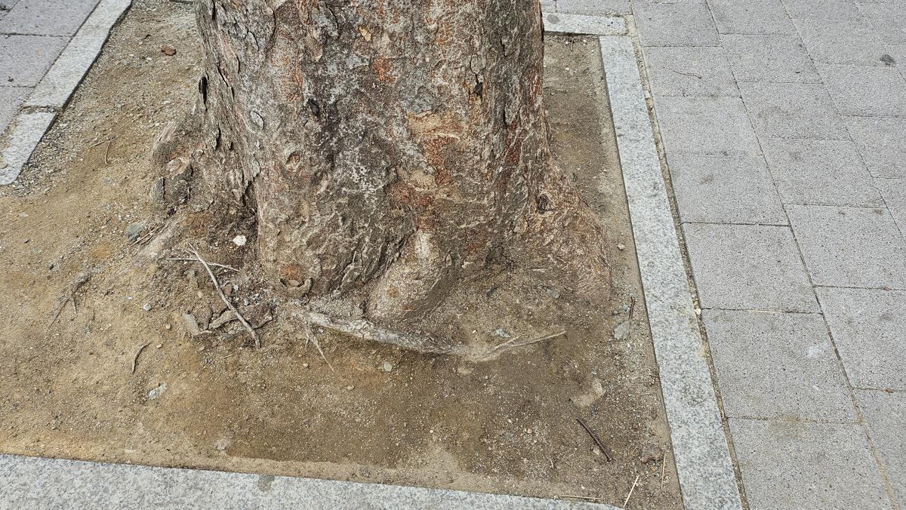

이식 전 근원부 상태를 먼저 점검합니다. 50년 세월만큼 비대해진 근주와 지표로 노출된 뿌리의 활력을 확인해 **분뜨기(root balling) 범위**를 결정합니다.

지표로 드러난 뿌리와 다져진 토양은 그 자체가 생육 저하의 신호이기도 합니다. 포장재에 둘러싸여 자란 수목은 토양 답압(踏壓)으로 공극이 사라져 뿌리 호흡이 어렵고, 그 결과 뿌리가 얕게 퍼지며 지표로 밀려 올라옵니다. 뿌리가 한쪽으로 편중된 경우도 많아, 실제로 파 보기 전까지 분의 형태를 단정할 수 없습니다.

### 활착률을 결정하는 세 가지 원칙

1. **표준 규격 이상의 분 확보** — 근원직경(R)의 4~6배 이상으로 분을 크게 떠 세근 손실을 최소화합니다.
2. **지중 매립물 제거** — 오랜 세월 운동장에 묻혀 있던 폐기물이 뿌리 발달을 막고 있었습니다. 이식은 이런 생육 저해 요소를 걷어 낼 기회이기도 합니다.
3. **수형 조절로 증산 억제** — 뿌리가 줄어든 만큼 잎도 줄여야 합니다. 이식 전 전정으로 증산량을 낮춰 수분 스트레스를 줄입니다.

---

## 2. 분뜨기 — 3월 7일

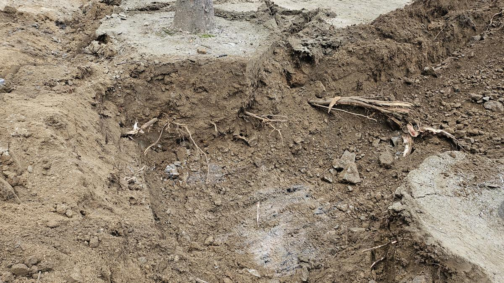

분뜨기는 나무 둘레를 도랑처럼 파 내려가며 진행합니다. 굵은 뿌리는 삽이나 장비로 뜯지 않고 전정톱·전지가위로 **매끄럽게 절단**해야 합니다. 찢긴 절단면은 부패의 출발점이 되고, 깨끗한 절단면에서는 새 뿌리(발근)가 나옵니다.

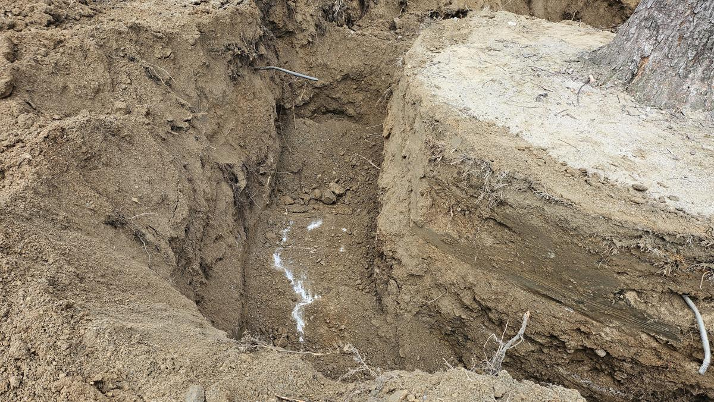

파 내려가는 과정에서 흙 속에 묻힌 **지중 매립물**이 드러났습니다. 운동장 조성 당시 묻힌 것으로 보이는 폐자재 층입니다. 이런 층은 물길을 막아 배수 불량을 만들고, 뿌리가 아래로 뻗지 못하게 해 심근 발달을 방해합니다.

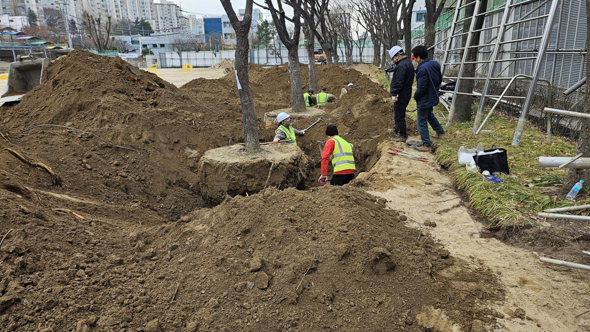

인력과 장비를 병행해 뿌리분의 형태를 잡아 갑니다. 분의 어깨는 넓게, 아래는 좁게 다듬어 인양 시 분이 무너지지 않게 만듭니다.

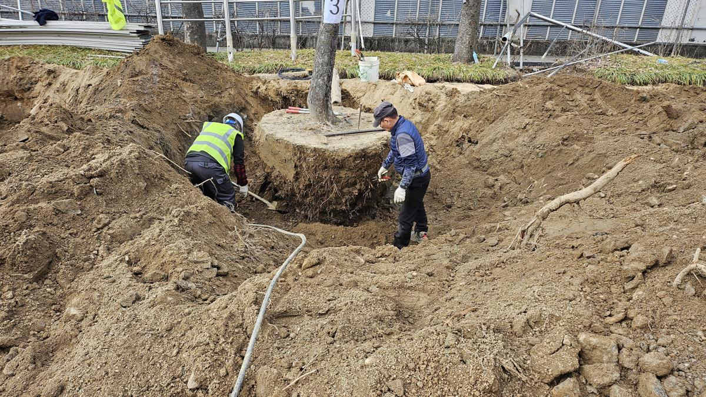

뿌리분 표면을 다듬고 노출된 뿌리 절단면을 정리합니다. 장비에 뜯겨 찢어진 단면은 그대로 두면 부패가 안쪽으로 번지므로, 날카로운 도구로 다시 매끄럽게 잘라 줍니다. 형태가 잡히면 **녹화마대와 고무바**로 결속해 운반 중 진동에 의한 분열을 막습니다.

---

## 3. 장비 운용 — 좁은 학교 부지에서

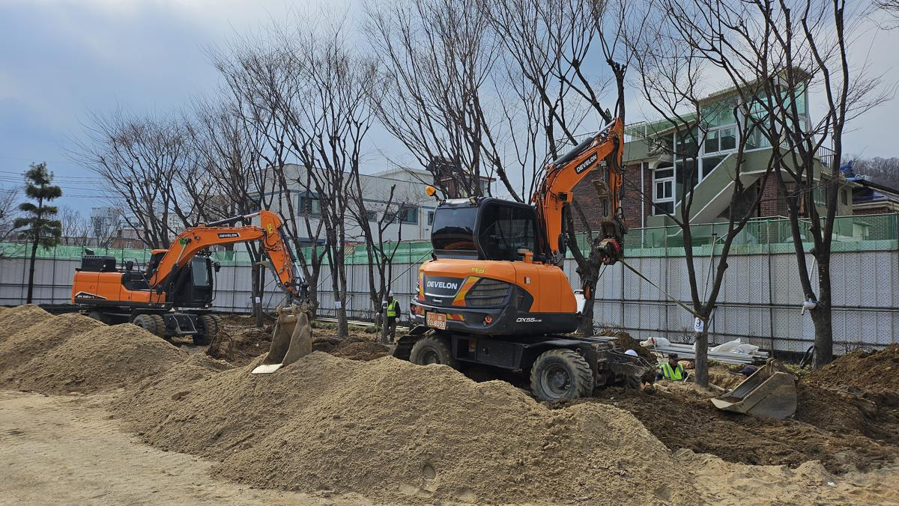

06급·08급 굴착기 두 대를 투입해 한 대는 굴취, 한 대는 잔토 처리를 맡았습니다. 대형목 이식에서 장비 배치는 힘의 문제가 아니라 동선의 문제입니다. 장비가 서로의 선회 반경을 침범하지 않도록 작업 구역을 나누고, 학생 통행 구간에는 가설 울타리를 세워 완전히 분리했습니다.

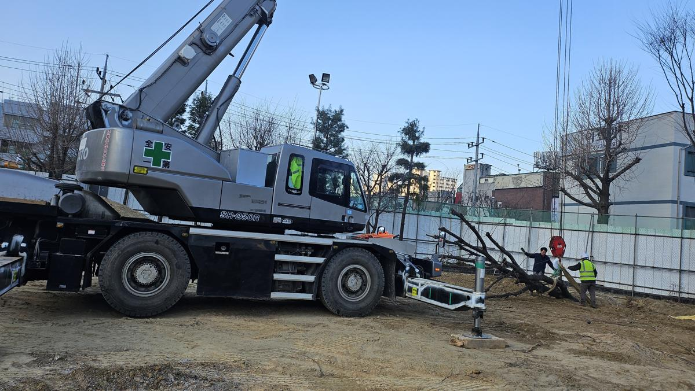

대형목 인양에는 25톤 러프테레인 크레인을 투입했습니다. 크레인 작업에서 가장 중요한 것은 붐을 올리기 전 단계입니다. 아웃트리거를 완전히 전개하고 지반 지지력을 확인해야 하며, 지반이 무르면 받침판을 깔아 침하를 막습니다.

수목 인양 시에는 무게 중심을 정확히 잡아야 합니다. 중심이 어긋나면 나무가 기울면서 수피가 슬링에 쓸리거나, 최악의 경우 분이 깨져 그동안의 작업이 무의미해집니다. 슬링 접촉부에는 반드시 완충재를 덧댑니다.

---

## 4. 양묘장 안착 — 3월 8일 ~ 3월 10일

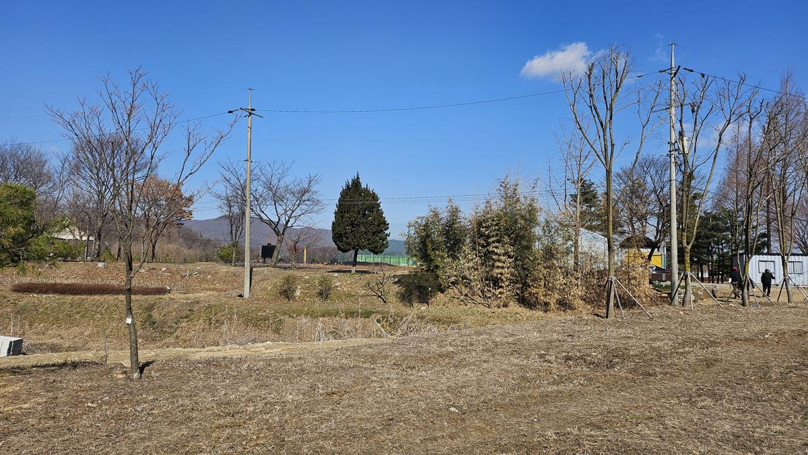

상원초등학교의 거목들이 옮겨 갈 곳은 성남시 양묘장입니다. 이곳에서 활착 기간을 거친 뒤 다시 시민들의 생활권 녹지로 돌아가게 됩니다.

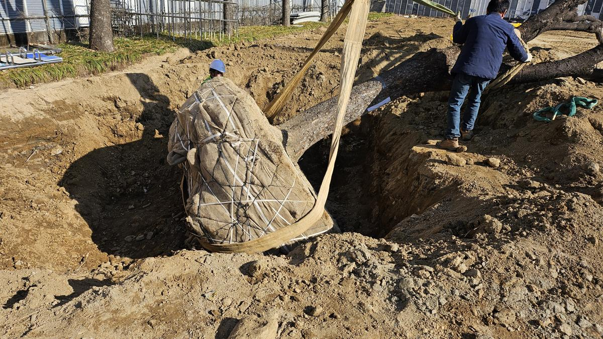

식재 구덩이는 뿌리분 지름의 1.5배 이상으로 파고, 바닥면을 고른 뒤 양질의 마사토와 유기질 비료를 혼합해 채웁니다. 결속된 뿌리분을 슬링으로 들어 구덩이에 안치할 때는 **기존에 심겨 있던 깊이**를 그대로 맞추는 것이 핵심입니다. 근원부가 지표보다 낮게 묻히는 **심식(深植)** 은 이식목 고사의 가장 흔한 원인입니다.

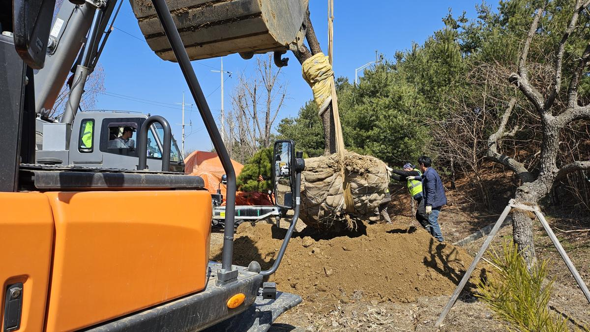

수목의 정면(가장 잘 보이는 방향)과 수직도를 잡는 것도 이 단계에서 끝내야 합니다. 흙이 들어간 뒤에는 방향을 되돌릴 수 없습니다.

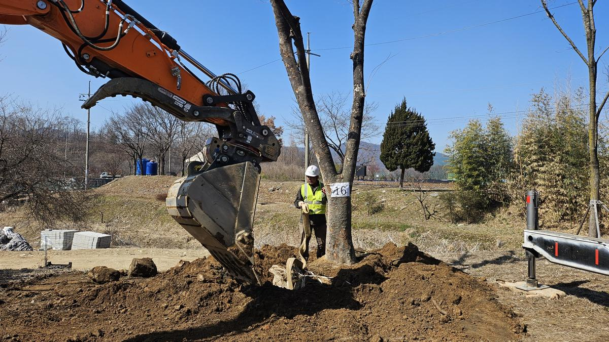

되메우기는 흙을 한 번에 채우지 않고 층층이 나누어 넣으면서 물을 부어 다지는 **물죽 치기(water settling)** 를 병행합니다. 뿌리분과 새 흙 사이에 공극이 남으면 그 부분의 뿌리가 말라 죽습니다.

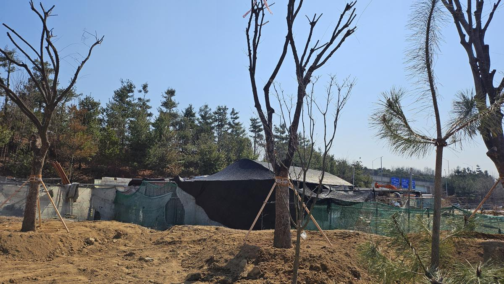

마지막은 지주 설치입니다. 뿌리를 새로 낼 때까지 흔들림을 잡아 주어야 하는데, 나무가 흔들리면 어렵게 낸 새 뿌리가 계속 끊깁니다. 지주는 수피가 쓸리지 않도록 완충재를 대고 결속합니다.

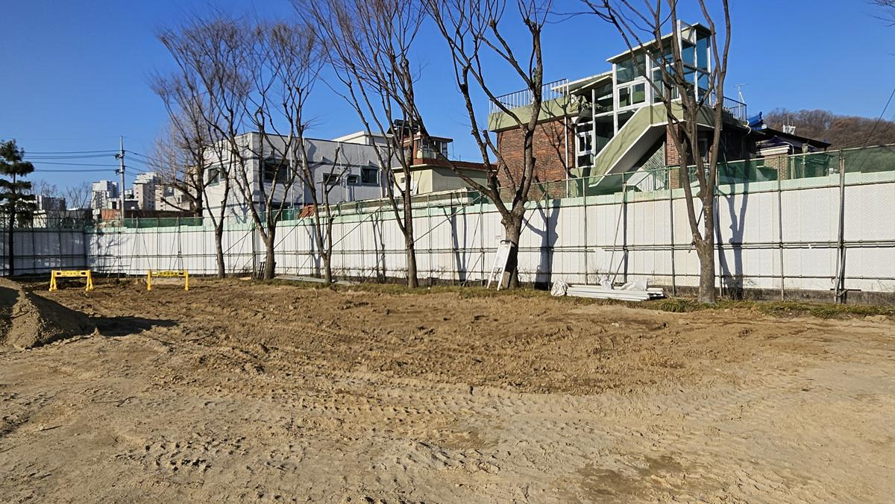

장비 자국을 고르고 잔재물을 걷어 내는 마무리 정지 작업은 미관 문제만이 아닙니다. 다져진 자국에 물이 고이면 그대로 이식목의 배수 불량으로 이어집니다.

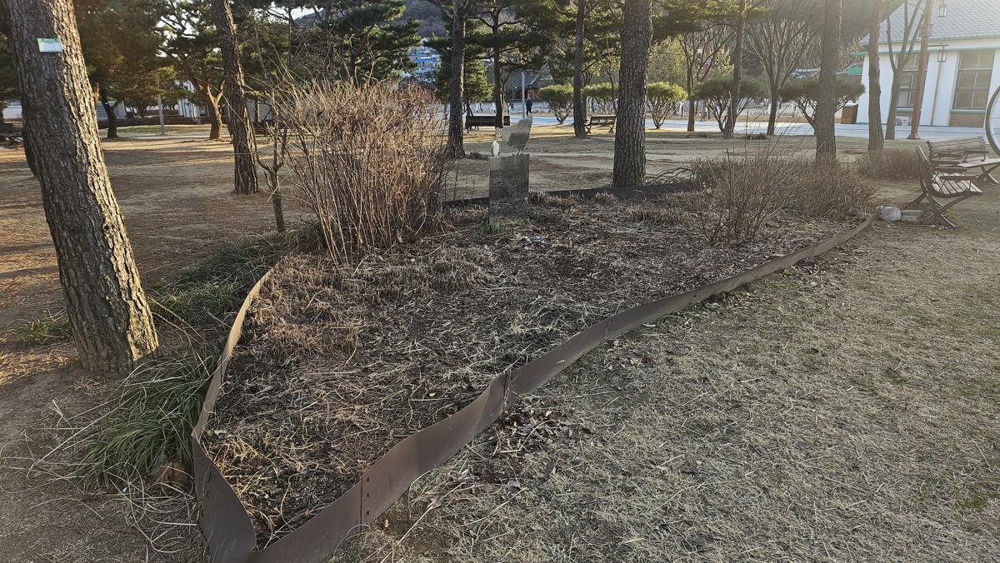

---

## 사후 관리

5일에 걸친 작업으로 상원초등학교의 거목들은 성남시 양묘장에 안전하게 안착했습니다.

**💡 나무의사의 관리 팁**

이식 후 첫 1년은 나무가 '몸살'을 앓는 시기입니다.

- **관수** — 가뭄 시기에는 주 1~2회, 표면만 적시지 말고 뿌리분 전체가 젖도록 깊게 줍니다.
- **엽면 시비·수간주사** — 잎 색이 옅어지면 뿌리가 아직 양분을 충분히 못 올린다는 신호입니다. 근권부 관주나 수간주사로 보완합니다.
- **지주 점검** — 태풍기 전후로 결속 상태를 확인하고, 활착이 확인되는 2~3년 뒤 해체해야 나무가 스스로 버티는 힘(자립근)을 기릅니다.

학교 부지의 수목은 아이들이 매일 지나는 공간에 서 있습니다. 매년 태풍기 전 **가지 고사 여부와 근원부 기울기**만 점검해도 대부분의 안전사고는 예방할 수 있습니다.

## 베지 않고 옮긴다는 것

이번 공사는 단순한 조경 공사가 아니라, **학교의 역사를 남기고 예산을 아끼며 생태 자산을 이어 가는 선택**이었습니다. 50년 된 나무 한 그루를 새로 사서 심으려면 큰 비용이 들지만, 그 나무가 만들어 온 그늘과 시간은 애초에 살 수 없는 것입니다.

---

## 시공·진단 의뢰 문의

**느티나무병원 협동조합** — 산림청 등록 1종 나무병원 · 조경식재공사업

- 전화 **031-752-6000**
- 팩스 031-752-6001
- 이메일 coopneuti@naver.com
- 본점 경기도 성남시 수정구 태평로 104

부지 개발·시설 공사로 수목 이전이 필요하신 경우, 이식 가능 여부 판단(수종·수령·근계 상태)부터 굴취·양중·운반·가식·사후 활착 관리까지 나무의사가 계획을 세워 진행합니다. 현장 조사 후 장비 계획과 안전 계획을 포함한 견적을 드립니다. 관공서·학교 **수의계약**은 실적증명서와 자격·면허 증빙을 견적서와 함께 제공합니다.

_(본 게시물의 사진은 모두 실제 시공 현장에서 촬영한 것입니다.)_
