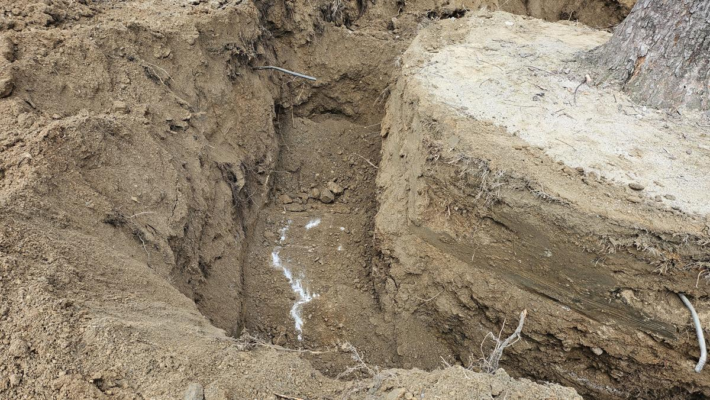
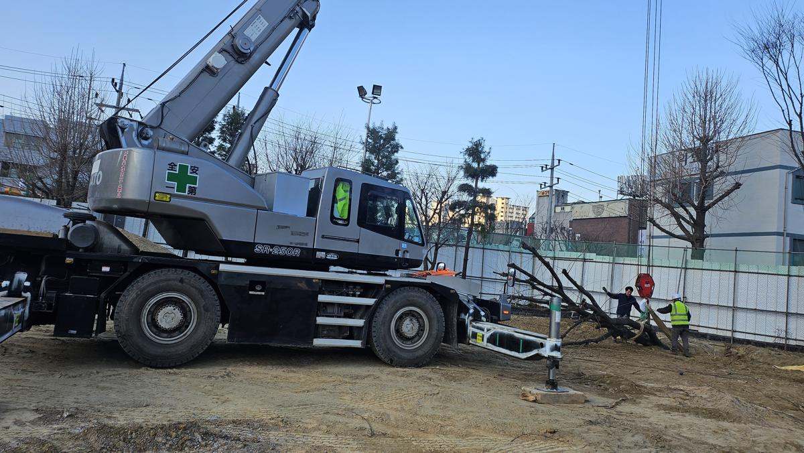
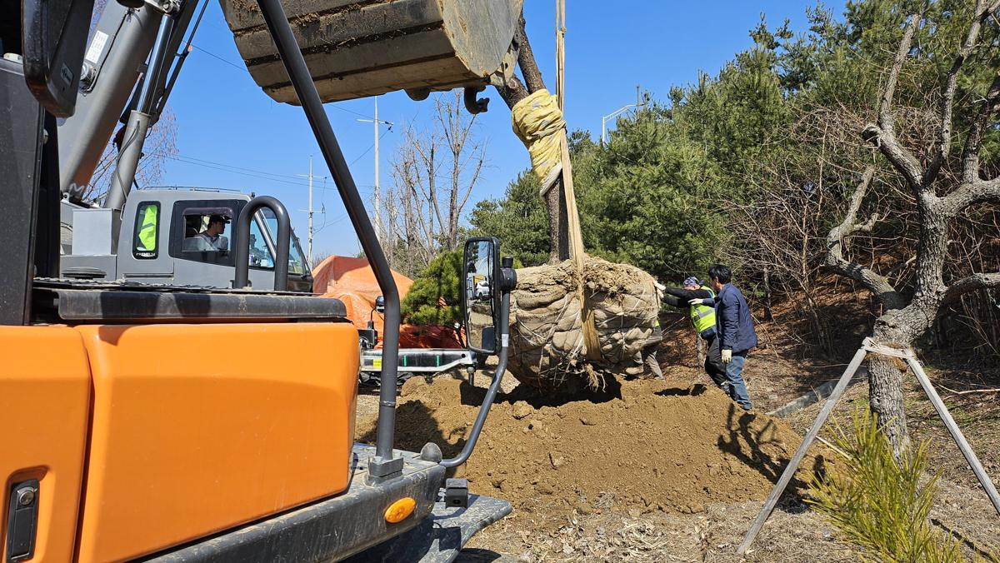
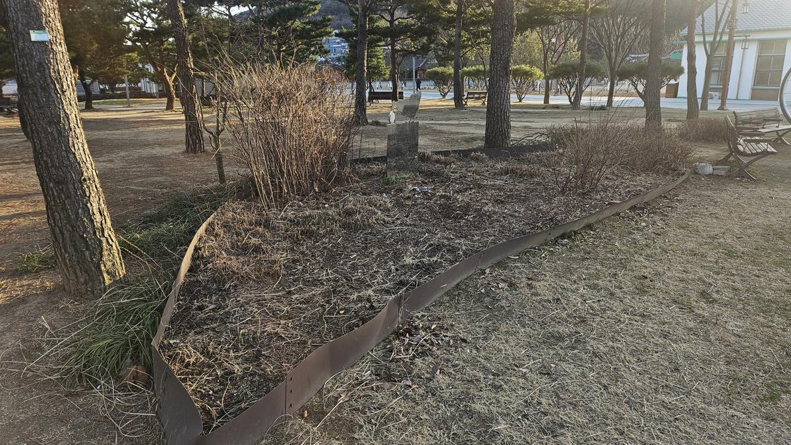

## [현장 문제] 생육 공간의 한계와 수목의 비명

학교는 아이들이 자연과 교감하며 생태 감수성을 키우는 소중한 공간입니다. 하지만 상원초등학교의 일부 수목들은 식재 간격의 불균형과 토양 답압(눌림 현상)으로 인해 뿌리 호흡에 어려움을 겪고 있었습니다.

나무의사로서 진단한 결과, 단순히 영양제를 주입하는 수준을 넘어 **수목의 생육 환경을 근본적으로 재배치하는 이식 작업과 토양 개량**이 시급한 상황이었습니다. 아이들의 안전을 확보하면서도 수목의 생명력을 회복시키기 위한 정교한 전략을 수립했습니다.

---

## [전문가 진단 및 계획] 지속 가능한 학교 숲을 위한 설계

이번 프로젝트의 핵심은 **'스트레스 최소화'**입니다. 대형 수목을 이동시킬 때는 뿌리의 손상을 줄이는 굴취 기술과 이식 후 빠르게 적응할 수 있는 토양 환경 조성이 필수적입니다.

1.  **정밀 굴취(Root Balling):** 세근(가는 뿌리)을 최대한 보존하여 이식 후 활착률을 높입니다.
2.  **장비 운용 전략:** 학교라는 특수성을 고려하여 학생들의 동선과 안전을 최우선으로 한 대형 크레인 및 굴착기 배치 계획을 세웠습니다.
3.  **토양 물리성 개선:** 이식지 토양의 배수성과 통기성을 확보하기 위한 심토 파쇄 및 유기물 공급을 병행합니다.

---

## [시공 과정] 생명을 옮기는 정교한 손길

### 1. 정밀 굴취와 뿌리분 보호

수목 이식의 성패는 '분뜨기'에서 결정됩니다. 나무의 크기에 비례하여 충분한 직경의 뿌리분을 확보하고, 마대와 고무줄을 이용해 견고하게 결속합니다.

### 2. 대형 장비를 활용한 안전한 양중

학교 내 좁은 공간에서 대형 수목을 이동시키기 위해 25톤 크레인과 소형 굴착기를 협업시켰습니다. 이는 단순한 힘의 논리가 아닌, 수형의 비틀림을 방지하기 위한 무게 중심 계산이 동반된 공정입니다.

### 3. 새로운 터전으로의 안착

이식지에 도착한 수목은 기존에 심겨 있던 깊이를 정확히 측정하여 '심식(깊게 심기)'되지 않도록 주의합니다. 심식은 뿌리 질식의 주요 원인이기 때문입니다.

---

## [결과 및 관리 팁] 다시 숨 쉬는 상원초등학교 녹지

모든 수목은 제 자리를 찾았으며, 적절한 관수와 지주대 설치를 통해 안정화 단계에 접어들었습니다.

**💡 학교 숲 관리 Tip:**
이식 후 1년은 '몸살'을 앓는 시기입니다. 가뭄 시기에는 주 1~2회 깊은 관수를 실시하고, 잎의 색이 연해진다면 전문가의 진단을 통해 수관주사 등 영양 공급을 고려해야 합니다.

---

## [가치] 지속 가능한 관리가 공간의 미래를 바꿉니다

조경은 단순히 나무를 심는 행위가 아닙니다. **생태적 건강성을 회복시켜 그 공간을 이용하는 사람들에게 정서적 안정과 안전을 선물하는 전략적 투자**입니다.

상원초등학교의 아이들은 이제 더 넓고 쾌적해진 나무 그늘 아래서 안전하게 뛰어놀며 계절의 변화를 관찰할 것입니다. 건강하게 관리된 녹지는 학교의 신뢰도를 높이고, 아이들에게는 살아있는 생태 교과서가 됩니다.

**당신의 공간에 있는 나무는 안녕한가요? 전문적인 진단과 시공이 필요하다면 전략적 조경 파트너를 찾으세요.**

