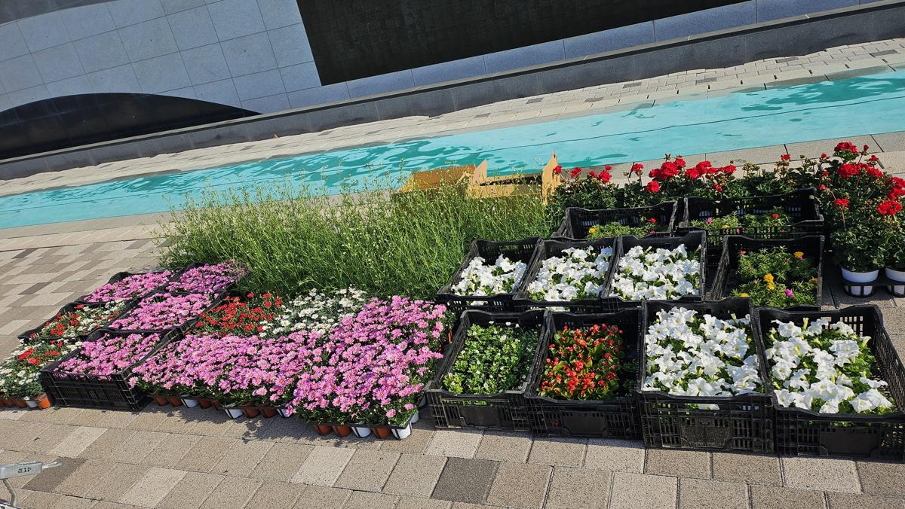
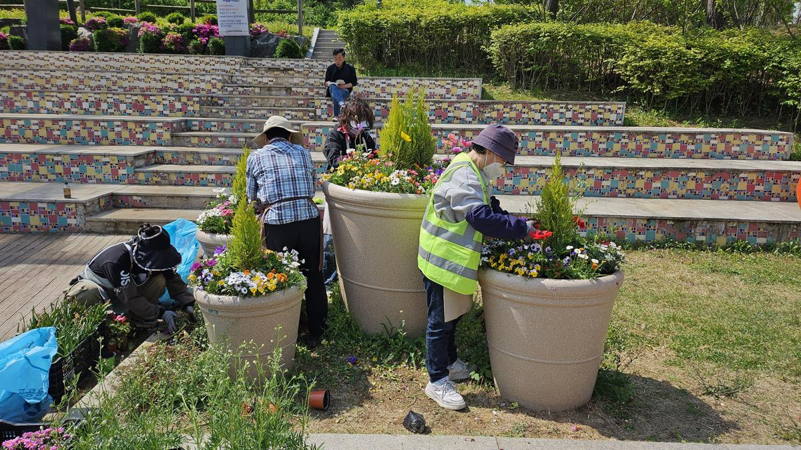
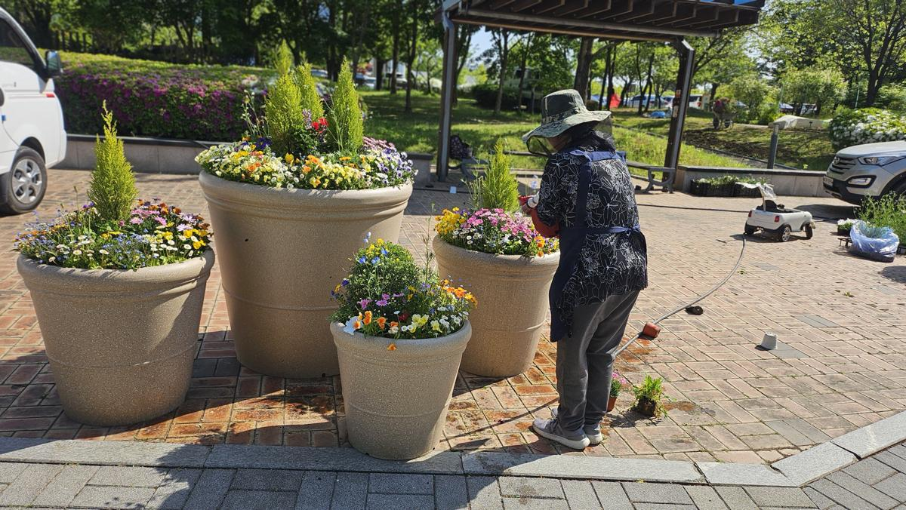
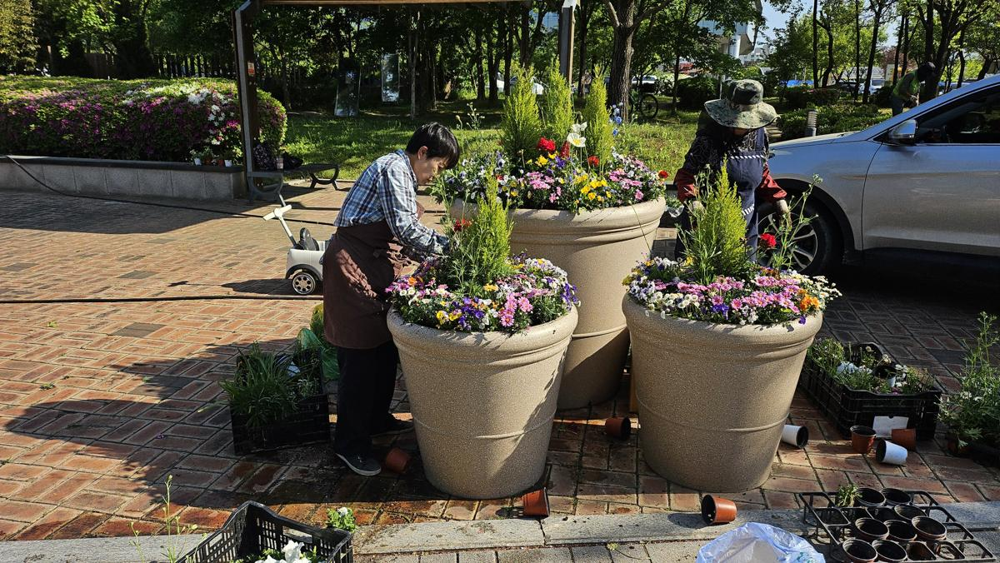
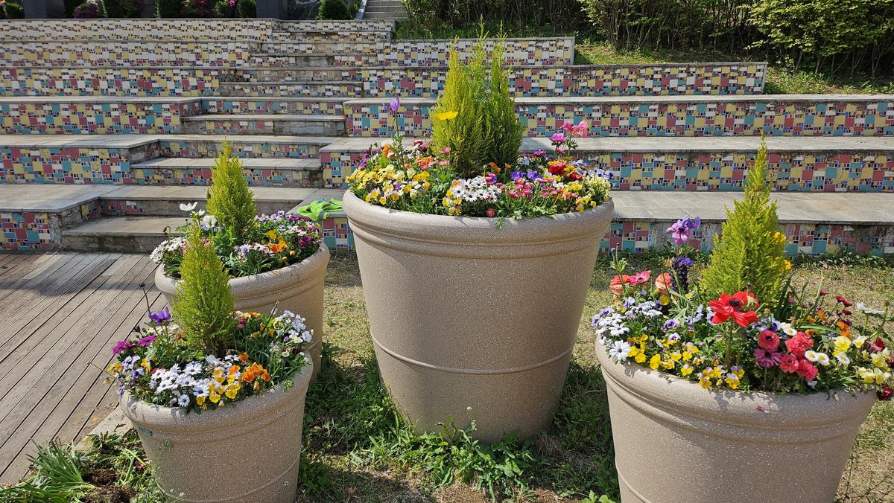
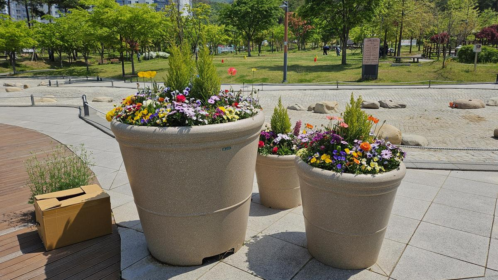
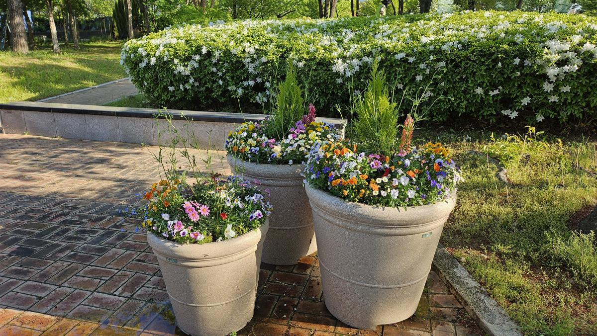

## 공사 개요

| 구분      | 내용                                                       |
| --------- | ---------------------------------------------------------- |
| 대상지    | 성남시 수정구·중원구 주요 공원                             |
| 작업일    | 2025년 4월 30일                                            |
| 작업 내용 | 대형 플랜터 토양 개량, 봄 계절초화 식재, 관수 및 정리      |
| 주요 식재 | 율마, 팬지·비올라, 제라늄, 페튜니아, 임파첸스, 메리골드 등 |

계절이 바뀌는 전환기의 공원에는 이전 계절 초화가 시들어 빈 화분만 남는 '경관 공백기'가 생깁니다. 이번 공사는 수정구·중원구 주요 공원의 대형 플랜터를 봄 초화로 교체하고, 화분 내 토양을 함께 개량하는 작업이었습니다.

---

## 자재 검수

식재 당일 아침, 반입된 묘종을 종류별로 정렬해 검수합니다. 엽색이 진하고 도장(웃자람)되지 않았으며 병해충 흔적이 없는 개체만 사용합니다. 포트에서 뿌리가 과도하게 뭉친(root-bound) 묘종은 식재 후 뿌리가 밖으로 뻗지 못해 활착이 늦어지므로 걸러 냅니다.

## 식재 계획 — 수직과 수평의 구성

1. **수종 선정** — 여름으로 갈수록 고온다습해지는 조건을 고려해 내서성이 있는 초화류를 골랐습니다. 중심부에는 수직선을 만드는 **율마(Goldcrest Wilma)** 를 세워 시선을 잡고, 주변부에 팬지·비올라·제라늄 등을 배치해 볼륨을 채웠습니다.
2. **토양 개량** — 대형 플랜터의 기존 토양은 양분 용탈과 답압으로 물리성이 떨어진 상태였습니다. 마사토와 부엽토를 섞어 배수성과 보수성을 함께 잡았습니다. 화분은 지면보다 배수가 빠르고 건조도 빠르기 때문에, 두 성질의 균형이 특히 중요합니다.

---

## 시공 과정

식재는 중심의 율마를 먼저 세워 축을 잡고, 바깥쪽으로 초화를 채워 나갑니다. 뿌리분이 부서지지 않도록 포트에서 조심스럽게 빼고, 심은 뒤에는 공동(air pocket)이 남지 않도록 흙을 눌러 채웁니다. 초기 고사율을 좌우하는 것은 결국 이 마무리 디테일입니다.

간격도 미리 계산합니다. 지금 빽빽하게 심으면 당장은 풍성해 보이지만, 한 달 뒤 서로 경합해 통풍이 막히고 아랫잎부터 무릅니다.

식재 직후 관수는 '물을 주는' 작업이 아니라 **뿌리와 토양을 밀착시키는** 공정입니다. 수압을 낮춰 토양이 파이지 않도록 하고, 화분 아래로 물이 빠져나올 때까지 충분히 줍니다. 표면만 적시면 뿌리 주변에 마른 층이 남아 활착이 늦어집니다.

빈 포트와 남은 흙을 걷어 내고 포장면을 청소하는 것으로 한 개소의 작업이 끝납니다.

---

## 시공 결과

무채색의 계단과 보도블록을 배경으로 화분의 색채가 뚜렷하게 드러납니다. 율마의 연두색 수직선이 화분마다 반복되면서, 여러 개소에 흩어진 화분이 하나의 시리즈로 읽힙니다.

화분은 한 자리에 몰아 두기보다 동선의 결절점에 나누어 놓습니다. 계단 앞, 광장 진입부, 벤치 옆처럼 사람이 걸음을 멈추는 지점에 두어야 꽃이 실제로 보입니다.

**💡 전문가의 관리 팁**

- **데드헤딩(deadheading)** — 시든 꽃을 제때 따 주면 식물이 결실에 에너지를 쓰지 않고 새 꽃눈을 만드는 데 집중해, 개화 기간이 눈에 띄게 길어집니다.
- **관수 시각** — 정오를 피해 이른 아침이나 늦은 오후에 관수합니다. 한낮에 잎에 물이 맺히면 일소(잎 데임) 피해가 생기고, 물 손실도 큽니다.
- **화분 특성** — 대형 화분은 지면보다 지온이 빠르게 오릅니다. 한여름에는 지면 화단보다 관수 주기를 짧게 잡아야 합니다.

---

## 시공·진단 의뢰 문의

**느티나무병원 협동조합** — 산림청 등록 1종 나무병원 · 조경식재공사업

- 전화 **031-752-6000**
- 팩스 031-752-6001
- 이메일 coopneuti@naver.com
- 본점 경기도 성남시 수정구 태평로 104

계절초화 식재는 심는 순간보다 이후 관리가 결과를 만듭니다. 봄·가을 교체 식재와 개화기 유지관리(관수·데드헤딩·시비·병해충 점검)를 묶어 연간 단위로 견적을 드립니다. 관공서 **수의계약**은 실적증명서와 자격·면허 증빙을 견적서와 함께 제공합니다.

_(본 게시물의 사진은 모두 실제 시공 현장에서 촬영한 것입니다.)_
