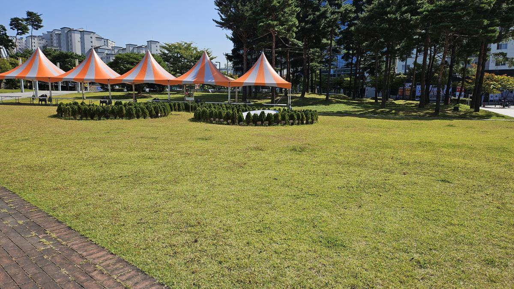
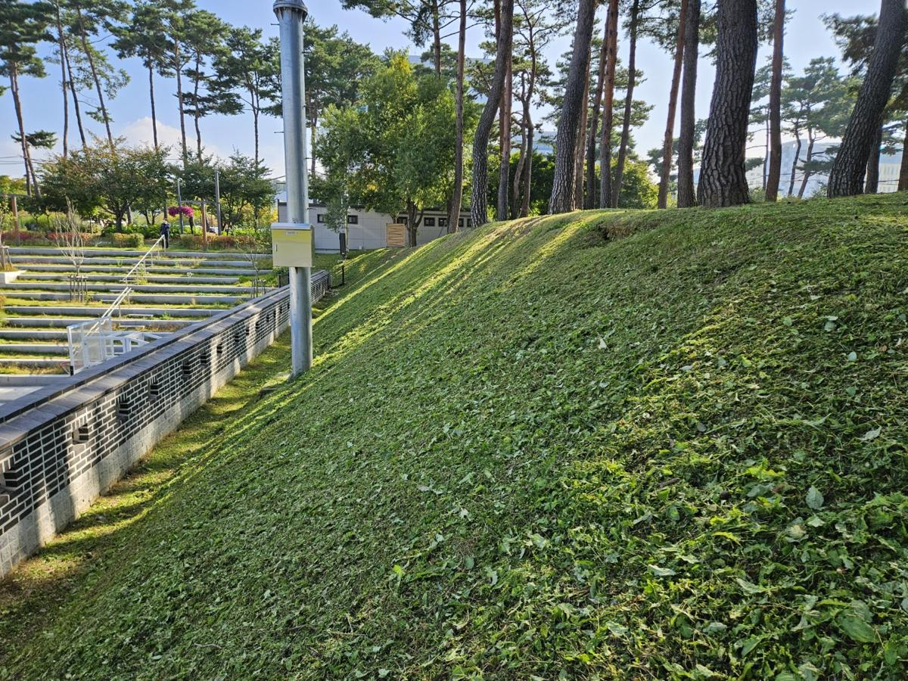
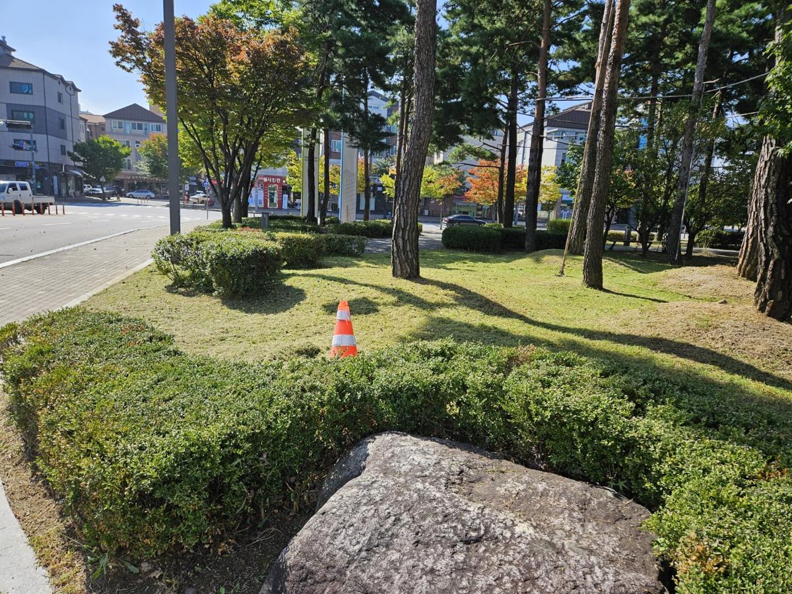
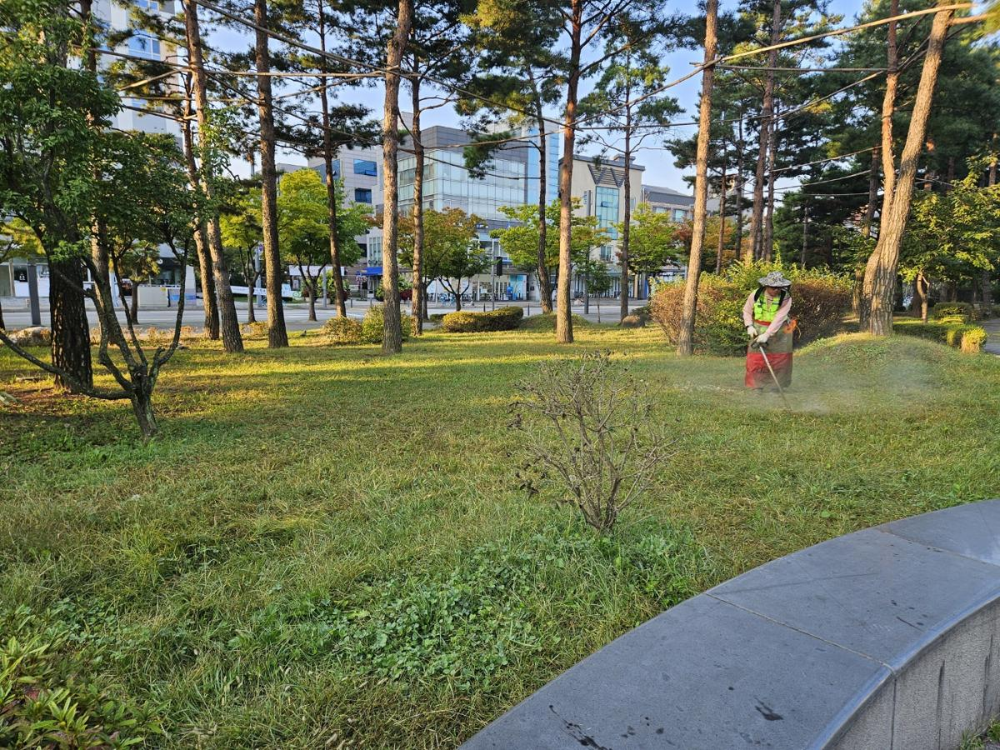
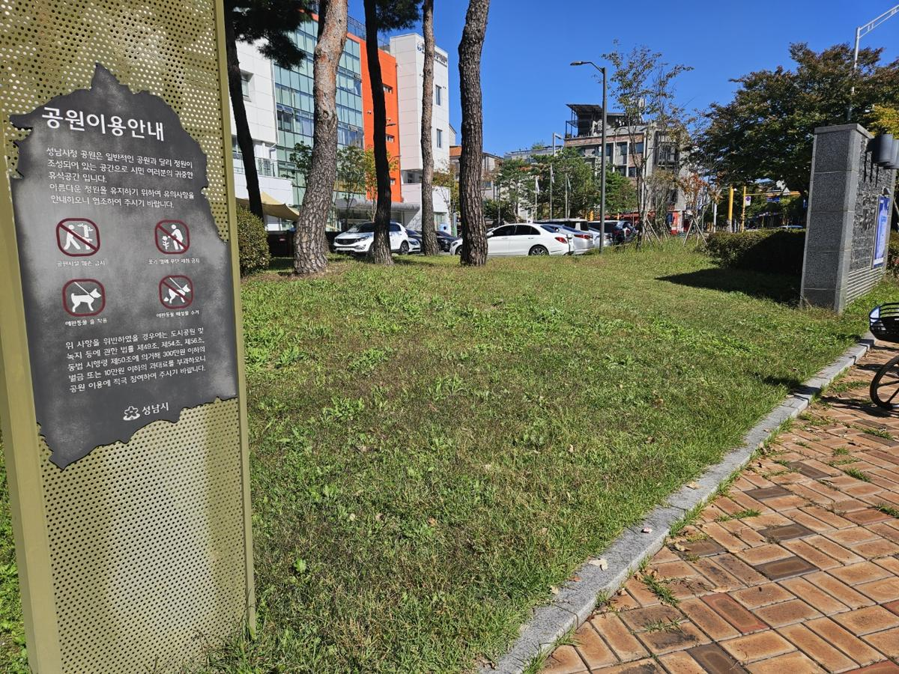
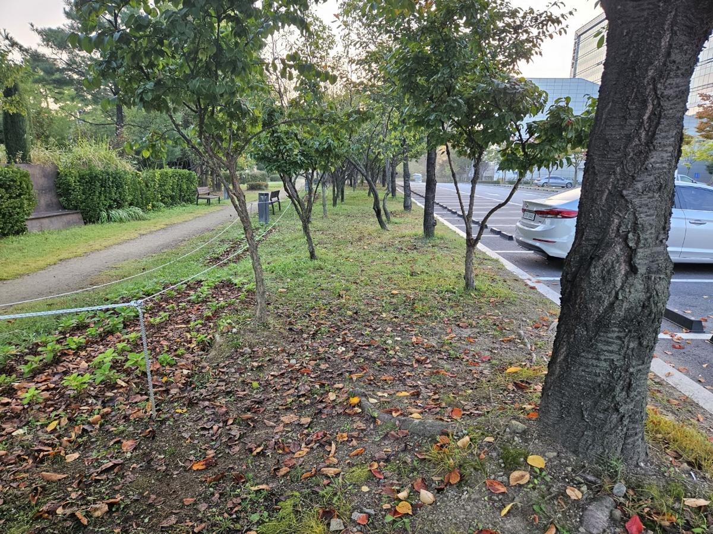
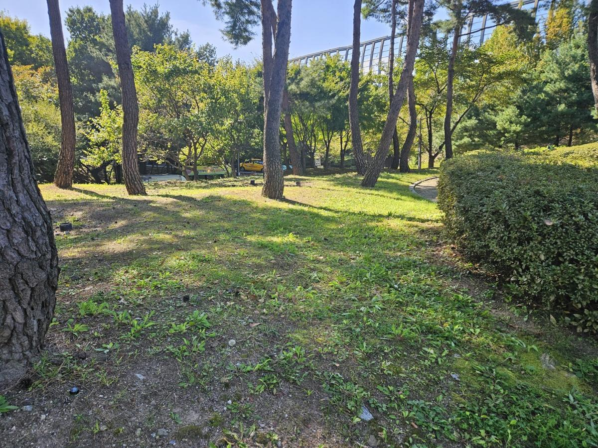
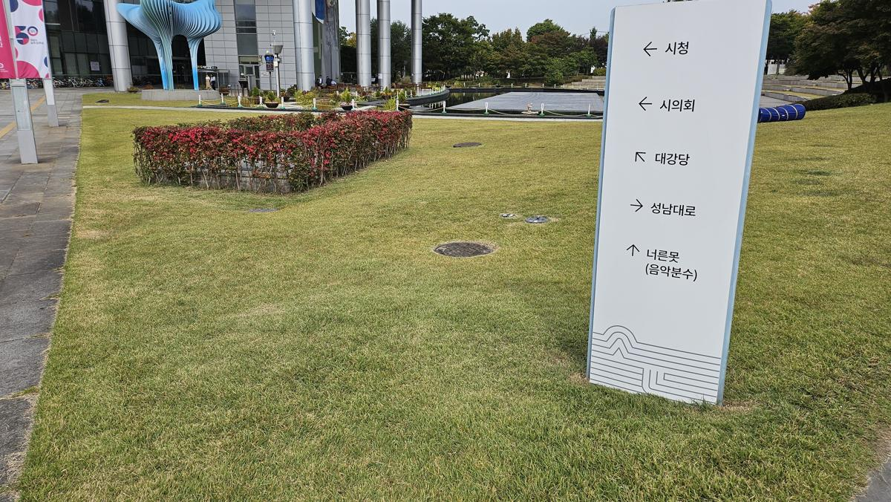
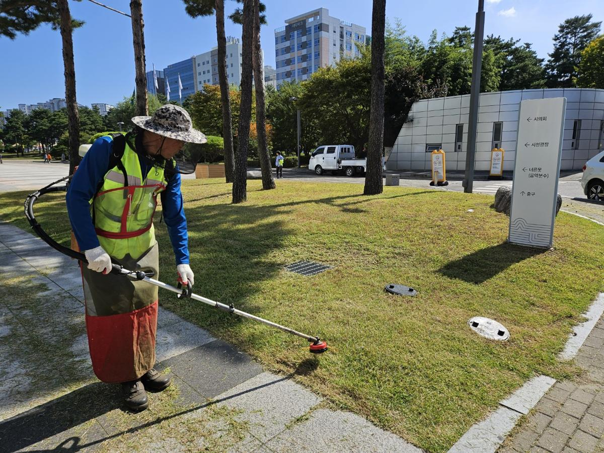

## [현장 문제] 도시의 얼굴, 시청사의 녹지가 보내는 신호

공공기관의 조경은 단순히 건물을 꾸미는 요소를 넘어, 해당 지자체의 관리 역량과 시민을 대하는 태도를 상징합니다. 이번에 방문한 시청사 및 시청공원은 광범위한 면적의 잔디가 식재되어 있었으나, 하절기를 지나며 잔디의 초장이 길어지고 잡초와의 경합이 심화된 상태였습니다.

_작업 전, 시청 광장 내 잔디가 무질서하게 자라나 미관을 해치고 보행 동선을 불분명하게 만들고 있습니다._

잔디가 적정 높이를 초과하여 방치될 경우, 하부의 통기성이 저하되어 '테이크올 패치(Take-all patch)'나 '라지 패치(Large patch)' 같은 병해의 원인이 됩니다. 또한, 시각적으로도 공공기관 특유의 정갈함이 사라져 시민들에게 불안정한 인상을 줄 수 있습니다.

## [전문가 진단/계획] 생리적 활력과 시각적 질서의 회복

나무의사의 관점에서 잔디깎이는 단순한 '이발'이 아닙니다. 이는 잔디의 **분얼(Tillering, 포기나누기)**을 촉진하여 밀도를 높이고, 지표면의 수분 증발을 조절하는 정교한 생리적 처방입니다.

1.  **예고(Mowing Height) 설정**: 시청사의 이용 빈도와 잔디 상태를 고려하여 30~50mm의 최적 예고를 설정했습니다.
2.  **엣지 디테일(Edge Trimming)**: 수목 주변, 안내판 하부, 보도블록 경계 등 기계가 닿기 힘든 곳의 정밀 작업을 계획했습니다.
3.  **예찰 및 병해 진단**: 작업 중 잔디의 생육 불량지를 파악하여 토양 답압 상태를 점검하기로 했습니다.

_공원 내부 산책로 주변, 잔디와 잡초가 혼재되어 수관 하부의 생태적 건강성이 위협받는 구간을 집중 관리 대상으로 선정했습니다._

## [시공 과정] 정교한 기술이 만드는 녹색 카펫

### 1. 광장 및 평지 구간 고속 예초

넓은 광장은 균일한 높이 유지가 핵심입니다. 작업자의 숙련된 감각으로 일정한 속도를 유지하며 잔디의 단면이 찢어지지 않도록 예리하게 연마된 날을 사용합니다.

_자주식 잔디깎이를 이용하여 광장의 잔디를 일정한 높이로 절삭하며 시각적 개방감을 확보하는 과정입니다._

### 2. 경사면 및 수목 주변 정밀 예초

시청공원의 특징인 경사면(Slope)과 소나무 군락지는 기계 진입이 어렵습니다. 이곳은 견착식 예초기를 사용하여 지형의 굴곡을 따라 섬세하게 작업합니다.

_경사면 작업은 안전과 기술이 동시에 요구됩니다. 지면 밀착도를 높여 잔디의 생장점을 보호하며 작업을 진행합니다._

_수목의 근주(뿌리목) 부분은 수피 손상을 방지하기 위해 나일론 커터를 병행 사용하여 안전하게 잡초를 제거합니다._

### 3. 시설물 주변 엣지 마감

안내판이나 벤치 하부의 잔디는 자칫 소홀하기 쉽지만, 이곳의 마감 처리가 전체 조경의 완성도를 결정합니다.

_안내판 주변의 잔디를 정교하게 다듬어 공공기관의 신뢰도를 높이는 디테일한 시공을 진행했습니다._

### 4. 잔디 부산물 수거 및 청소

깎인 잔디(Clippings)를 그대로 두면 '대치(Thatch)'층이 형성되어 배수를 방해하고 병균의 온상이 됩니다. 강력한 블로워를 사용하여 부산물을 완벽히 제거합니다.

_강력한 송풍기를 사용하여 보행로와 잔디 위의 부산물을 제거, 쾌적한 보행 환경을 조성합니다._

## [결과 및 관리 팁] 다시 찾은 녹색의 품격

작업 후 시청사와 공원은 마치 잘 가꾸어진 정원처럼 변모했습니다. 잔디의 높이가 균일해지자 숨어있던 수목의 수형이 돋보이고, 공간 전체에 생명력이 감돕니다.

_작업 완료 후의 전경. 정갈하게 정리된 잔디가 시청사의 건축미를 더욱 돋보이게 합니다._

_경사면 또한 일정한 결을 유지하며 정리되어 시각적 안정감을 제공합니다._

**💡 전문가의 관리 팁:**
잔디는 한 번에 길이를 많이 자르는 것보다, **'1/3 원칙'**을 지켜 자주 깎아주는 것이 스트레스를 줄이는 비결입니다. 또한, 예초 후에는 충분한 관수를 통해 절단면의 회복을 도와야 병해를 예방할 수 있습니다.

## [가치] 지속 가능한 관리가 공간의 미래를 바꿉니다

건강하게 관리된 잔디는 단순히 보기 좋은 것에 그치지 않습니다. 열섬 현상을 완화하고, 시민들에게 정서적 안정을 제공하며, 공공기관에 대한 신뢰를 구축하는 보이지 않는 자산입니다.

전략적인 수목 진단과 정교한 조경 관리는 공간의 가치를 지속적으로 상승시킵니다. **지속 가능한 녹지 관리, 전문가의 손길이 닿을 때 비로소 완성됩니다.**

---

**조경 전략 컨설팅 및 수목 진단 의뢰**
공간의 품격을 높이는 건강한 녹지, 지금 시작하세요.
