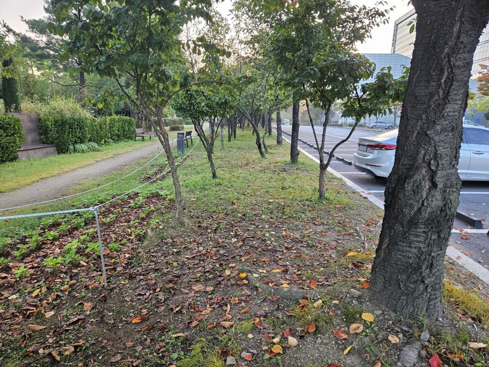
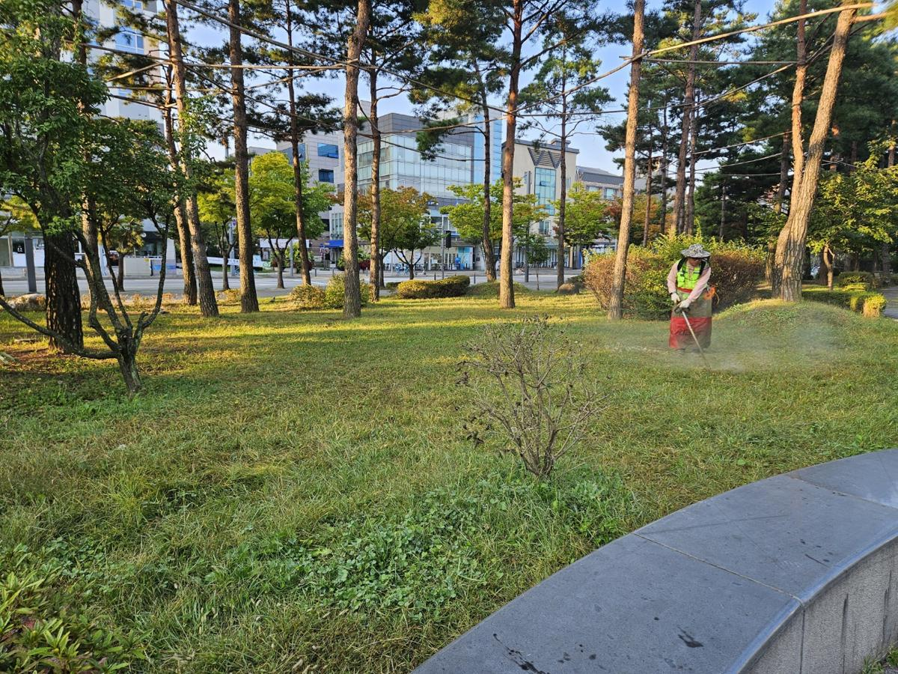
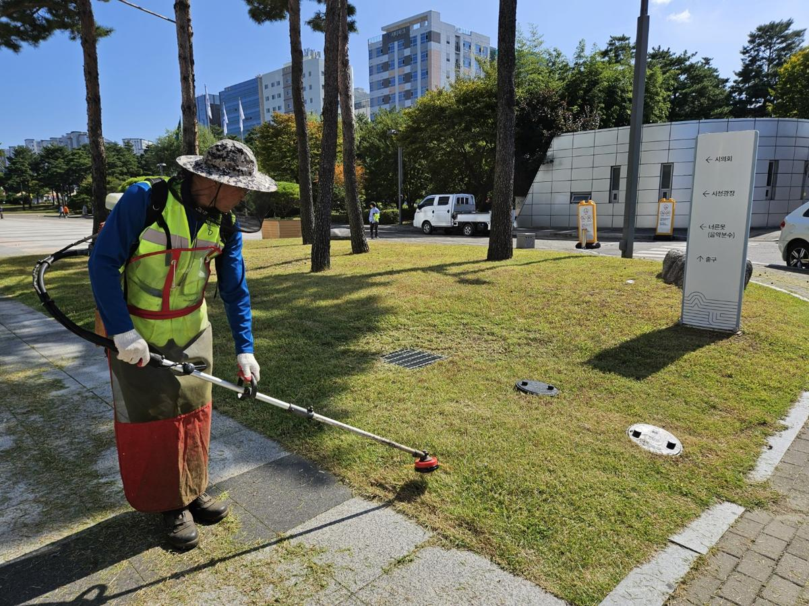
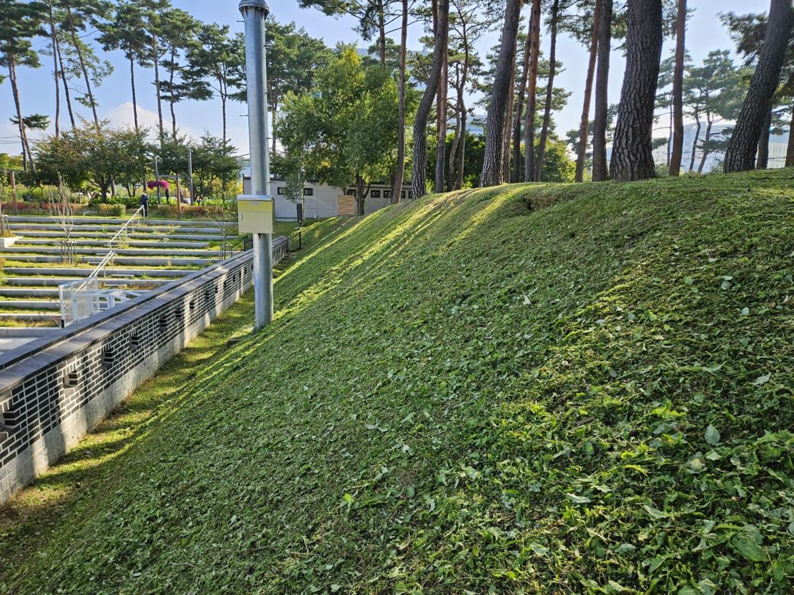
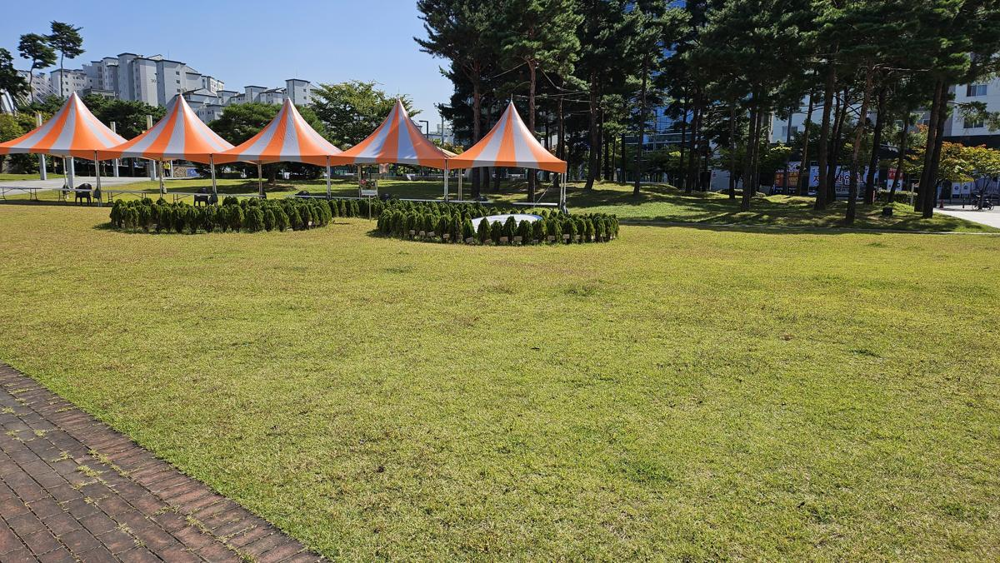
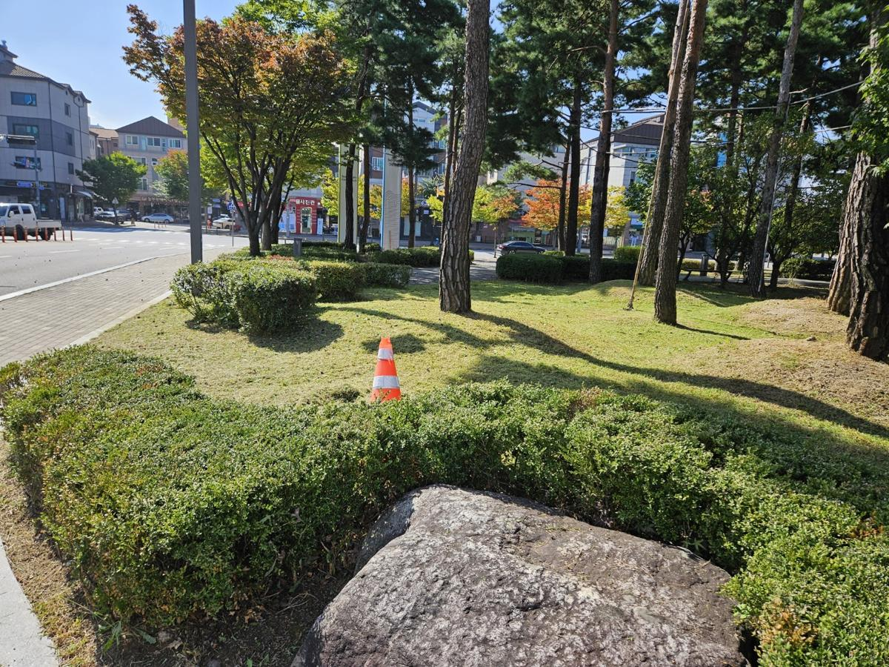
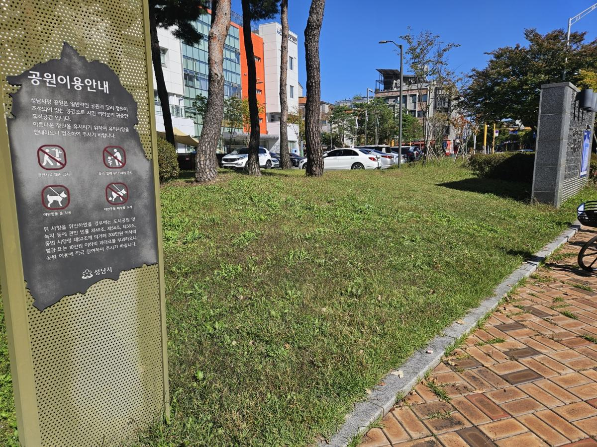
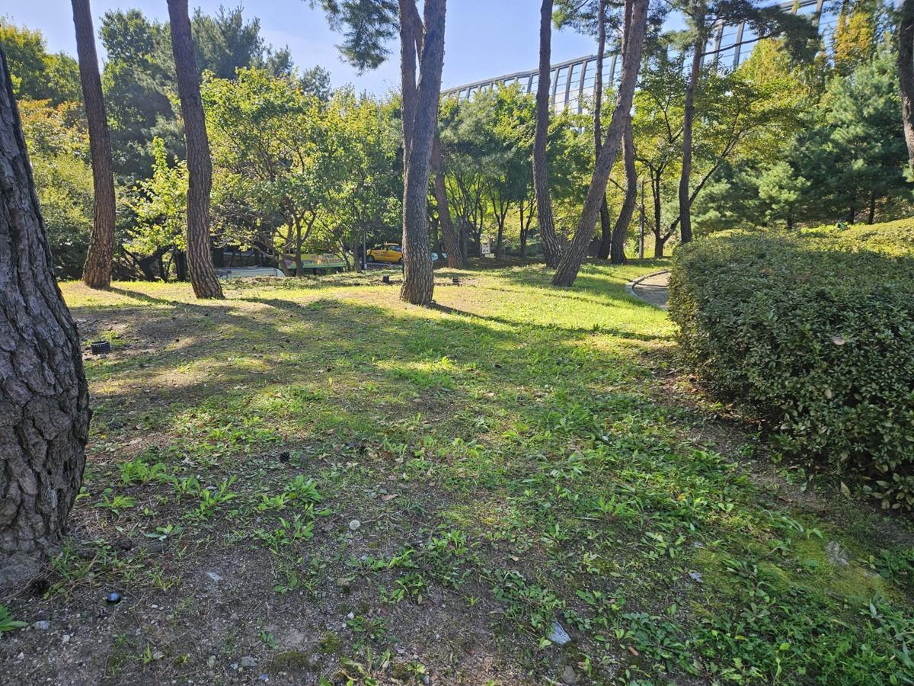
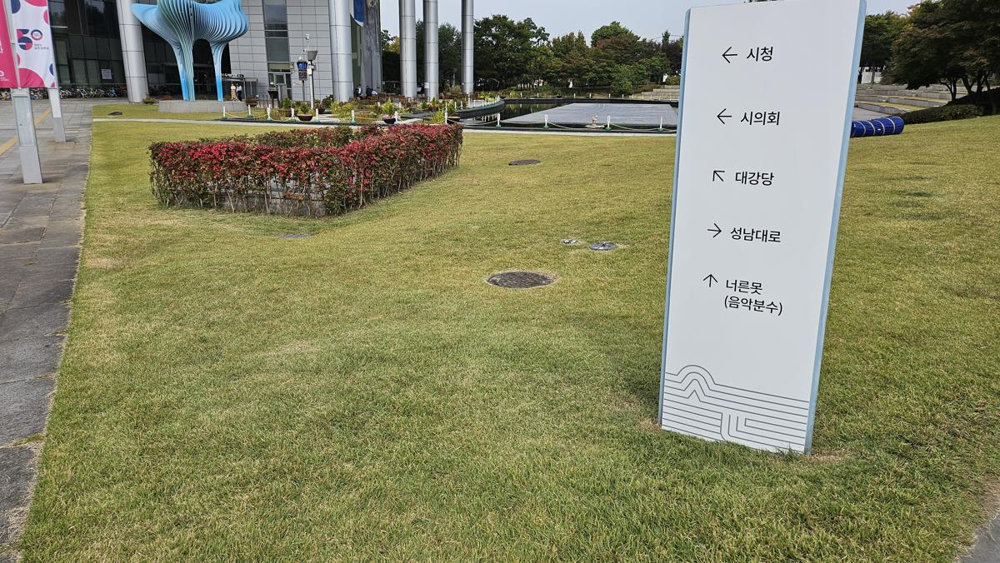

## 공사 개요

| 구분      | 내용                                                            |
| --------- | --------------------------------------------------------------- |
| 대상지    | 성남시청사 및 시청공원 일원                                     |
| 작업 기간 | 2023년 10월 6일 ~ 10월 13일                                     |
| 작업 내용 | 잔디 예초, 시설물 주변 정밀 예초, 경사면 예초, 예초 부산물 수거 |
| 투입 장비 | 자주식 잔디깎이, 견착식 예초기(금속 날·나일론 줄 병행), 송풍기  |

공공기관의 잔디는 관리 상태가 그대로 드러나는 면(面)입니다. 시청사와 시청공원은 잔디 면적이 넓고 광장·경사면·수목 하부·시설물 주변이 섞여 있어, 구간별로 다른 장비와 작업 방식을 적용해야 하는 현장이었습니다.

---

## 현장 상태

하절기를 지나며 잔디 초장이 길어지고 잡초와의 경합이 심해진 상태였습니다. 특히 수목 하부와 도로변 열식지에는 낙엽과 잡초가 함께 쌓여 있었습니다.

잔디가 적정 높이를 넘겨 방치되면 하부 통기성이 떨어지면서 **라지패치(large patch)** 같은 병해가 발생하기 쉬운 조건이 만들어집니다. 잘린 풀과 낙엽이 쌓여 만들어지는 **대치(thatch)층** 도 배수를 막고 병원균의 온상이 됩니다.

## 작업 계획

1. **예고(刈高) 설정** — 이용 빈도와 잔디 상태를 고려해 30~50mm의 예고를 설정했습니다. 한 번에 짧게 깎기보다 **1/3 원칙**(초장의 1/3 이내만 자르기)을 지키는 편이 잔디 부담이 적습니다.
2. **엣지 처리** — 수목 근주, 안내판 하부, 보도블록 경계 등 기계가 닿지 않는 곳을 인력으로 정리합니다.
3. **부산물 수거** — 깎은 잔디와 낙엽은 당일 수거해 대치층 형성과 병해 발생을 차단합니다.

---

## 시공 과정

### 개활지 잔디면

넓은 면은 균일한 높이 유지가 핵심입니다. 일정한 속도를 유지하며, 예리하게 연마된 날을 사용해 잔디 단면이 찢어지지 않게 합니다. 무딘 날로 깎으면 절단면이 으깨지면서 갈변하고, 그 상처가 병 침입 경로가 됩니다.

### 시설물 주변 정밀 예초

안내 사인, 맨홀, 벤치 하부처럼 기계가 들어가지 못하는 곳의 마감이 전체 완성도를 결정합니다. 이 구간은 나일론 줄로 교체해 시설물과 수목 수피를 보호하며 작업합니다. 수목 근주에 금속 날이 닿으면 형성층이 손상되어 그 자리가 그대로 상처로 남습니다.

### 경사면과 부산물 수거

경사면은 기계 진입이 어려워 견착식 예초기로 처리합니다. 잘린 풀은 사면 아래로 흐르므로, 예초를 마친 뒤 송풍기로 한곳에 모아 수거합니다. 이 부산물을 그대로 두면 사면 배수구를 막고 부패하면서 병해 발생원이 됩니다.

---

## 시공 결과

광장 잔디면이 균일하게 정리되면서 행사 공간과 통행 동선의 경계가 다시 살아났습니다.

잔디 높이가 균일해지자 그 위에 서 있는 수목의 수형과 생울타리의 선이 살아납니다. 잔디는 그 자체가 주인공이라기보다, 다른 조경 요소를 받쳐 주는 바탕면입니다.

**💡 전문가의 관리 팁**

잔디는 한 번에 많이 자르기보다 **1/3 원칙**을 지켜 자주 깎는 것이 스트레스를 줄이는 방법입니다. 예초 후에는 충분히 관수해 절단면 회복을 돕고, 부산물은 반드시 수거합니다. 봄·가을에는 통기 작업(에어레이션)과 배토를 병행하면 대치층이 쌓이는 속도를 늦출 수 있습니다.

---

## 시공·진단 의뢰 문의

**느티나무병원 협동조합** — 산림청 등록 1종 나무병원 · 조경식재공사업

- 전화 **031-752-6000**
- 팩스 031-752-6001
- 이메일 coopneuti@naver.com
- 본점 경기도 성남시 수정구 태평로 104

청사·공원·아파트 단지의 잔디 관리는 연간 예초 회차를 미리 잡아 두는 편이 비용과 잔디 상태 모두에 유리합니다. 현장 조사 후 면적·구간별 관리 계획과 견적을 함께 제시합니다. 관공서·공공기관 **수의계약**은 실적증명서와 자격·면허 증빙을 견적서와 함께 제공합니다.

_(본 게시물의 사진은 모두 실제 시공 현장에서 촬영한 것입니다.)_
