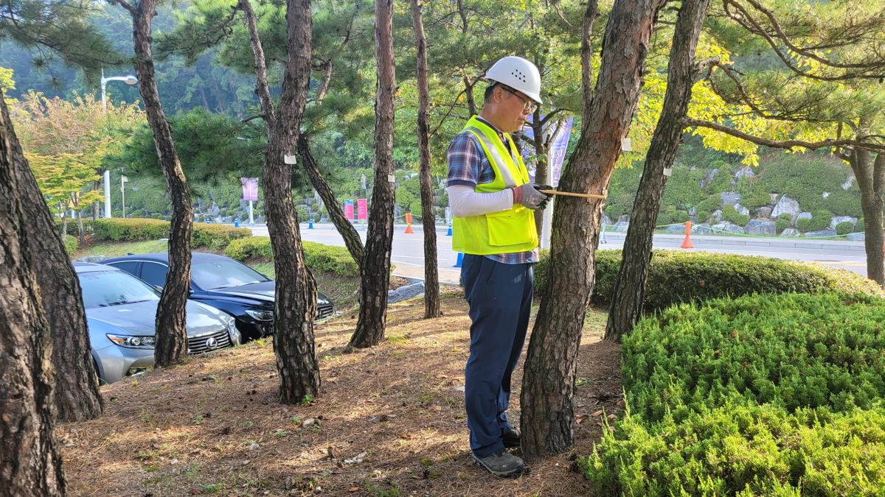
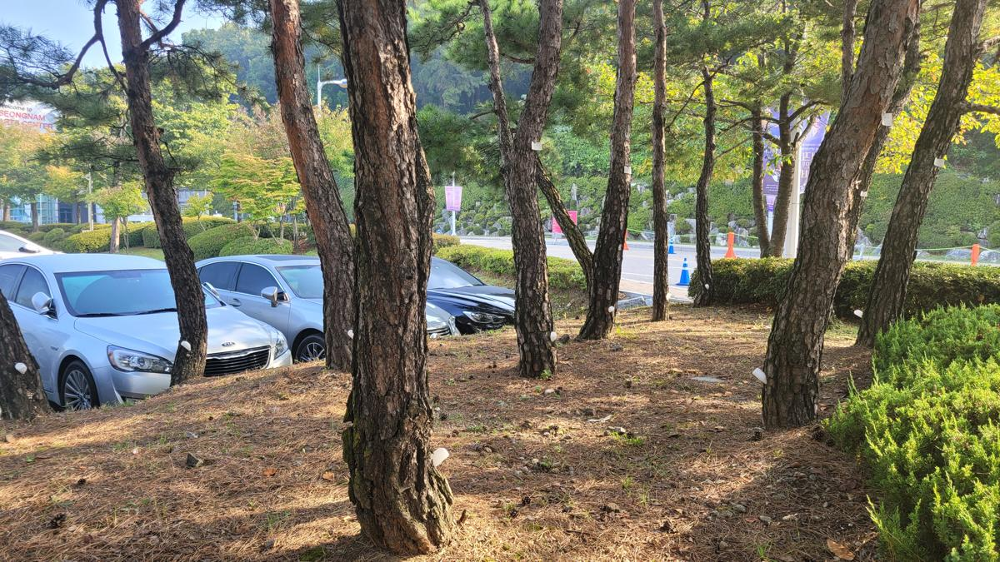
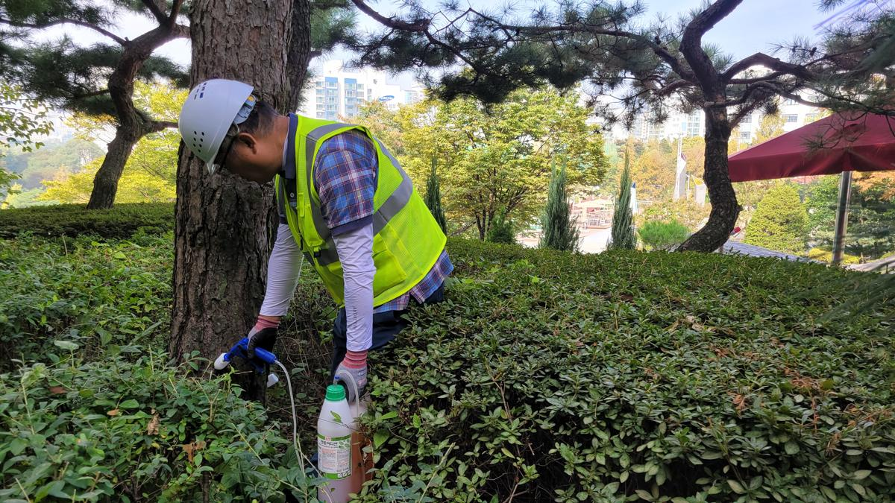

### [현장 진단] 문화와 예술의 공간, 그 생태적 기초를 점검하다

아트센터와 같은 공공 문화 공간에서 수목은 단순한 장식물이 아닙니다. 방문객에게 정서적 안정을 제공하고, 건축물의 미학을 완성하는 '살아있는 조형물'입니다. 하지만 도심 속 인공 지반과 기후 변화는 나무의 면역력을 약화시키는 주요 원인이 됩니다.

이번 프로젝트는 아트센터 내 주요 수목들의 수세(Tree Vigor) 저하를 막고, 잠재적인 병해충 피해를 예방하기 위한 **정밀 수간주사 처방**을 중심으로 진행되었습니다.

_본격적인 시공에 앞서 수목의 흉고직경(DBH)을 정밀하게 측정합니다. 이는 약제의 정확한 투입량을 결정하는 가장 기초적이면서도 중요한 데이터입니다._

---

### [전문가 진단 및 계획] 왜 수간주사인가?

수관 살포(약제 살포)는 광범위한 방제에 효과적이지만, 시민들이 이용하는 아트센터 특성상 약제 비산으로 인한 민원 발생과 환경 오염의 우려가 있습니다. 이에 나무의사 컨설팅을 통해 **수간주사(Trunk Injection)** 공법을 채택했습니다.

1.  **정밀 타격**: 약제를 수간(줄기)에 직접 주입하여 증산 작용을 통해 수관 전신으로 빠르게 이동시킵니다.
2.  **환경 친화적**: 외부로 약제가 유출되지 않아 방문객의 안전을 완벽하게 보장합니다.
3.  **지속성**: 수체 내에 직접 보유되어 방제 및 영양 공급 효과가 장기간 지속됩니다.

_수목의 생리적 특성을 고려하여 선별된 약제와 주입 장비를 세팅합니다. 식물의 혈관에 직접 작용하는 만큼 청결과 정밀도가 생명입니다._

---

### [시공 과정] 생명을 살리는 정밀한 손길

수간주사는 나무의 통도 조직(Xylem)을 정확히 파악하여 천공하는 것이 핵심입니다. 너무 깊으면 목질부가 손상되고, 너무 얕으면 약제가 흡수되지 않습니다.

_수간 하단부에 적정 각도로 천공 작업을 진행합니다. 형성층 손상을 최소화하기 위해 날카로운 전용 비트를 사용하며, 수종별 반응에 맞춘 깊이 조절이 필수적입니다._

_천공된 부위에 주입기를 삽입합니다. 이때 수간 내부의 압력과 약제의 침투 속도를 실시간으로 모니터링하며 작업의 완성도를 높입니다._

_대형 수목의 경우, 수관 전체에 고른 영양 공급이 이루어질 수 있도록 다각도에서 주입 포인트를 설정합니다. 이는 수세 회복의 균형을 맞추기 위한 전략적 배치입니다._

_경사지에 위치한 수목 또한 지형적 특성을 고려하여 주입 각도를 미세하게 조정합니다. 어떤 환경에서도 나무가 약제를 온전히 받아들일 수 있도록 최적의 조건을 만듭니다._

---

### [결과 및 가치] 지속 가능한 관리가 공간의 미래를 바꿉니다

모든 주입 작업이 완료된 후, 천공 부위는 수목 전용 상처 도포제를 사용하여 2차 감염을 철저히 차단했습니다. 이번 수간주사 처방을 통해 아트센터의 수목들은 잎의 색택이 선명해지고, 외부 스트레스에 견디는 자생력이 크게 향상될 것입니다.

_치료를 마친 수목들이 아트센터의 전경과 어우러져 건강한 생명력을 뿜어내고 있습니다._

**나무의사의 한마디:**
조경 관리는 단순히 보기 좋게 가꾸는 것을 넘어, 생태적 건강성을 유지하여 자산 가치를 보존하는 전략적 행위입니다. 건강한 나무가 있는 공간은 사람을 불러 모으고, 그곳에 머무는 시간의 품격을 높여줍니다.

지속 가능한 수목 관리, 전문가의 정밀한 진단에서 시작하십시오.

---

**[관리 팁]**
수간주사 이후에는 충분한 관수를 통해 나무의 증산 작용을 도와주는 것이 약제 확산에 큰 도움이 됩니다. 특히 가뭄이 심한 시기에는 토양 수분 관리에 유의해 주시기 바랍니다.
