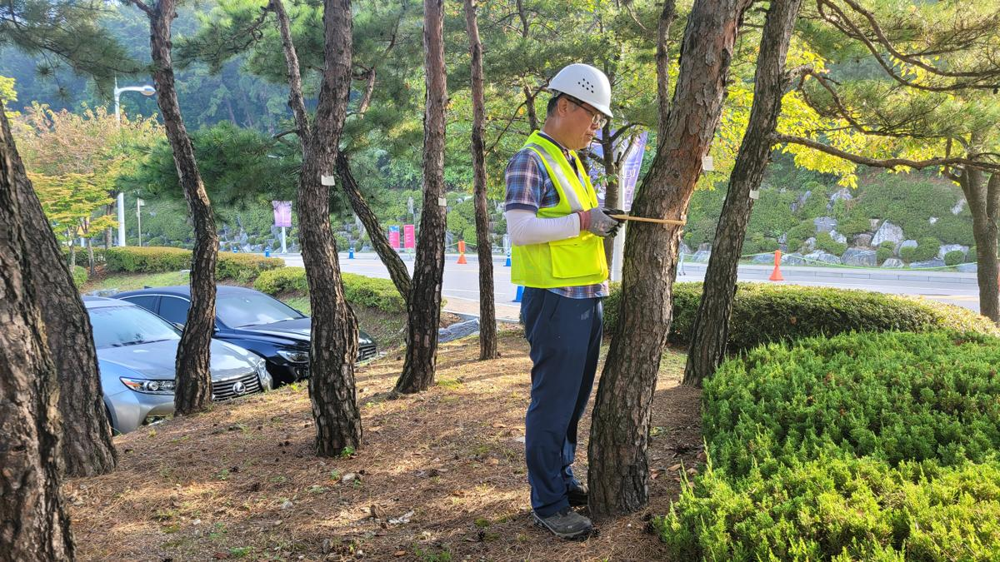
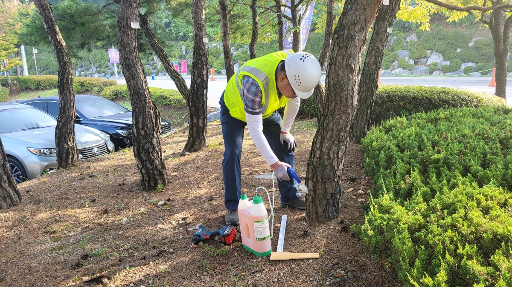
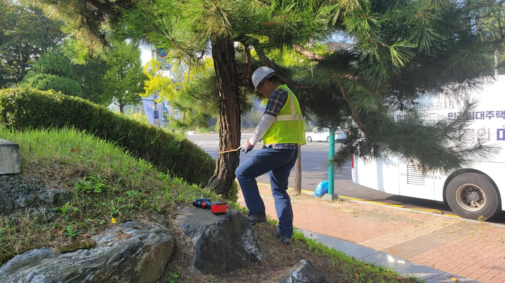
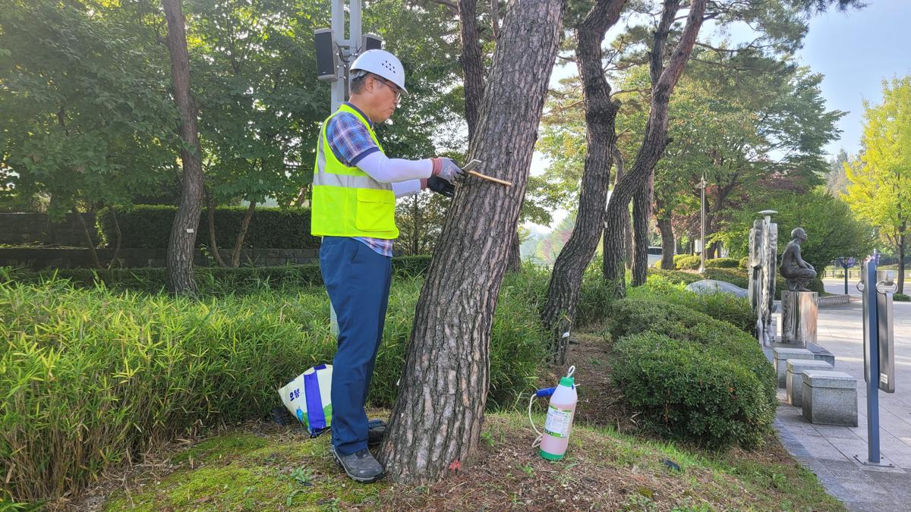
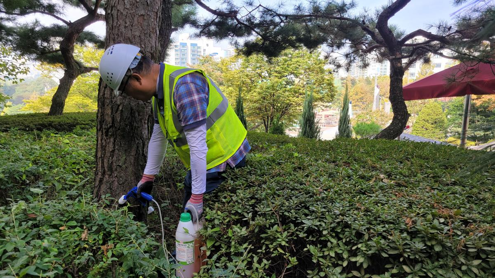
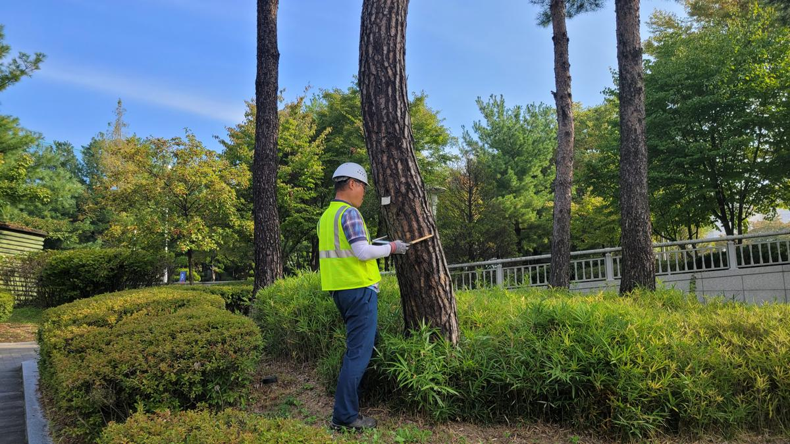
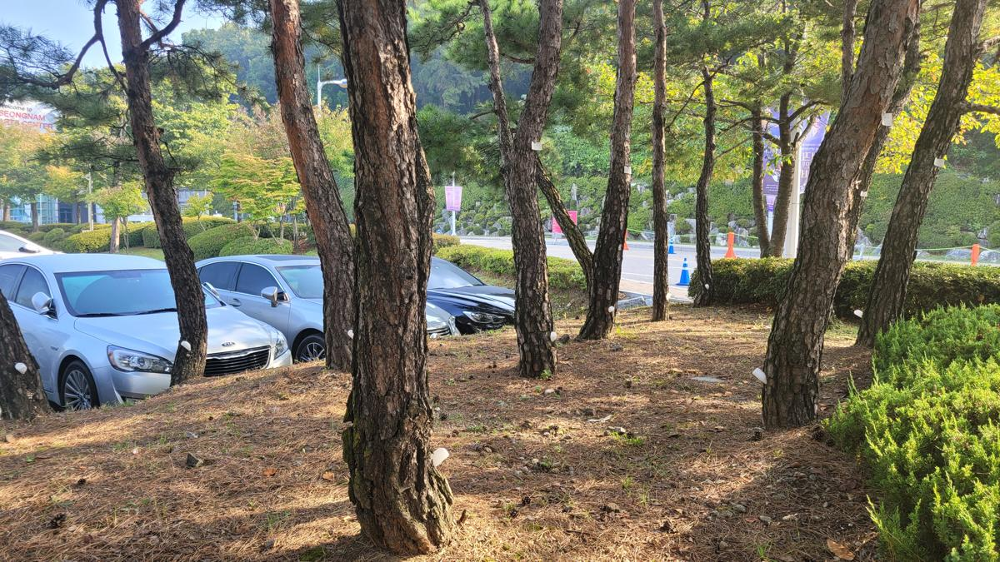

## 공사 개요

| 구분      | 내용                                                           |
| --------- | -------------------------------------------------------------- |
| 대상지    | 아트센터 일원 (진입 광장, 도로변 식재지, 경사 녹지)            |
| 작업일    | 2022년 10월 1일                                                |
| 작업 내용 | 흉고직경 조사, 수간 천공, 수간주사 약제 주입, 천공부 도포 처리 |
| 대상 수종 | 소나무                                                         |

아트센터처럼 사람이 상시 드나드는 문화 공간에서 수목은 건축물의 배경이자 방문객이 가장 먼저 마주하는 요소입니다. 다만 도심 인공 지반과 복사열은 나무의 수세를 꾸준히 갉아먹습니다. 이번 공사는 아트센터 소나무의 수세 저하를 막고 흡즙성 해충 피해를 예방하기 위한 **수간주사 처방**으로 진행했습니다.

---

## 왜 수간주사인가

수관 살포(약제 살포)는 넓은 면적을 빠르게 처리할 수 있지만, 이용객이 많은 시설에서는 약제 비산에 따른 민원과 환경 부담이 따릅니다. 나무의사 판단에 따라 **수간주사(trunk injection)** 공법을 채택했습니다.

1. **약제 비산 없음** — 수간에 직접 주입하므로 외부로 약제가 흩어지지 않아 방문객 동선을 통제할 필요가 없습니다.
2. **전신 이행** — 증산 작용을 따라 약제가 수관 전체로 이동합니다.
3. **지속성** — 수체 내에 머물러 방제와 양분 공급 효과가 상대적으로 오래 갑니다.

다만 수간주사는 나무에 구멍을 내는 시술입니다. 필요한 만큼만, 정확한 위치에, 최소 직경으로 천공하는 것이 원칙입니다.

---

## 시공 과정

시공에 앞서 나무별 **흉고직경(DBH, 지상 1.2m 높이의 줄기 지름)** 을 측정합니다. 약제 투입량과 주입 지점 개수를 결정하는 기준값이므로, 이 조사를 건너뛰면 과다 주입이나 과소 주입이 됩니다.

천공은 통도 조직(물관부)에 정확히 닿아야 합니다. 너무 깊으면 심재까지 상하고, 너무 얕으면 약제가 흡수되지 않습니다. 수간 하부에 약 30~45도 각도로 내려 뚫어 약제가 중력의 도움을 받도록 하고, 형성층 손상을 줄이기 위해 날이 선 전용 비트를 사용합니다.

천공부에 주입기를 삽입합니다. 삽입부가 헐거우면 약제가 밖으로 새고, 너무 세게 박으면 주변 목질부가 갈라집니다. 삽입 후에는 약제가 실제로 빨려 들어가는지 확인합니다.

수간이 굵은 대형목은 한 지점만으로 수관 전체에 약제가 고르게 퍼지지 않습니다. 흉고직경에 비례해 주입 지점을 여러 곳으로 나누고, 원주 방향으로 균등하게 배치해 한쪽으로 쏠리지 않게 합니다.

경사지에 선 나무는 줄기가 기울어 있어 주입 각도를 지형에 맞춰 조정합니다. 각도가 어긋나면 약액이 역류해 흘러내립니다.

---

## 시공 결과

주입기를 설치하면 나무의 증산량에 따라 약제가 천천히 빨려 들어갑니다. 흡수가 끝난 뒤 주입기를 회수하고, 천공부는 수목 전용 도포제로 막아 2차 감염과 부후균 침입을 차단했습니다.

**💡 나무의사의 관리 팁**

수간주사는 나무가 물을 끌어올리는 힘으로 약제를 흡수합니다. 따라서 **토양이 건조하면 흡수 자체가 되지 않습니다.** 시술 전후로 충분히 관수해 증산 작용을 도와주면 약제 확산 속도와 효과가 크게 달라집니다. 또한 같은 자리에 반복 천공하지 않도록 시술 이력을 기록해 두고, 다음 시술 때는 위치를 옮겨야 수간에 부담이 누적되지 않습니다.

---

## 시공·진단 의뢰 문의

**느티나무병원 협동조합** — 산림청 등록 1종 나무병원 · 조경식재공사업

- 전화 **031-752-6000**
- 팩스 031-752-6001
- 이메일 coopneuti@naver.com
- 본점 경기도 성남시 수정구 태평로 104

수간주사는 모든 나무·모든 병해에 맞는 처방이 아닙니다. 나무의사가 현장에서 수세와 피해 원인을 먼저 진단한 뒤, 수간주사·수관 살포·토양 관주 중 적합한 공법을 선택해 처방합니다. 관공서·공공기관 **수의계약**은 실적증명서와 자격·면허 증빙을 견적서와 함께 제공합니다.

_(본 게시물의 사진은 모두 실제 시공 현장에서 촬영한 것입니다.)_
