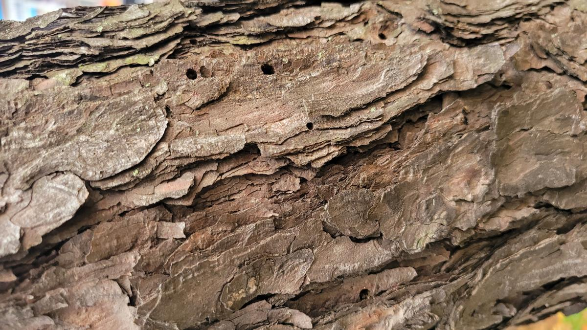
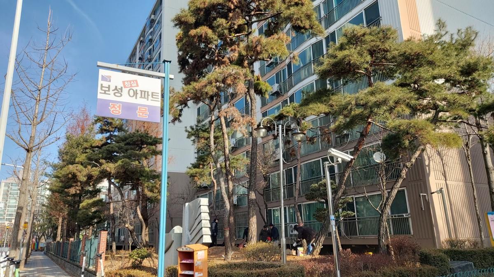
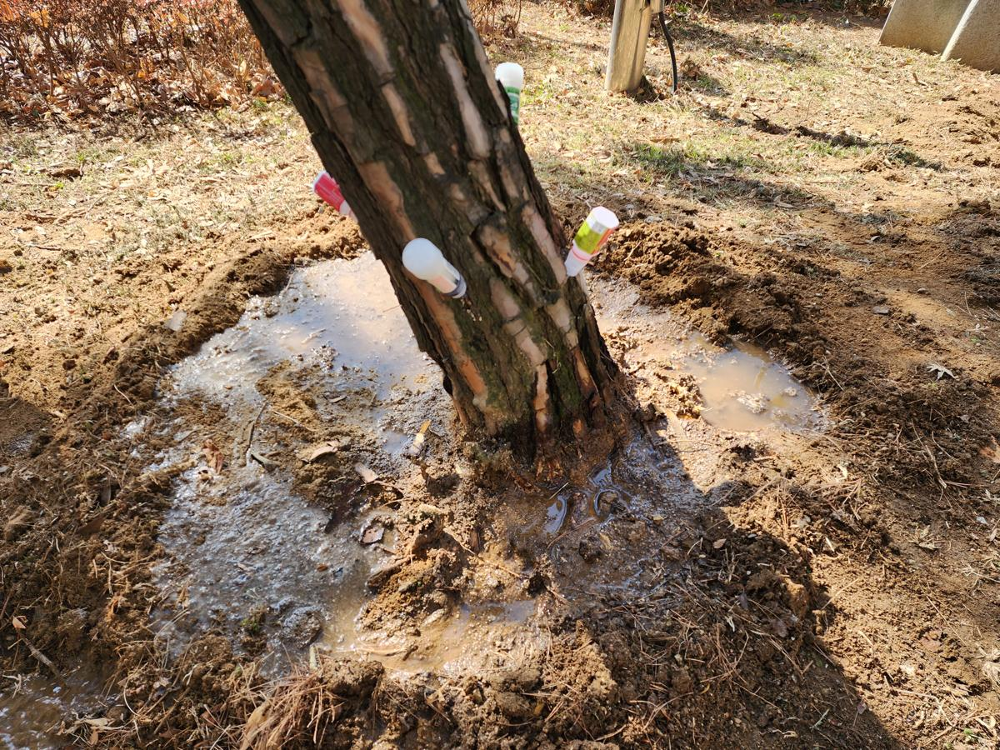
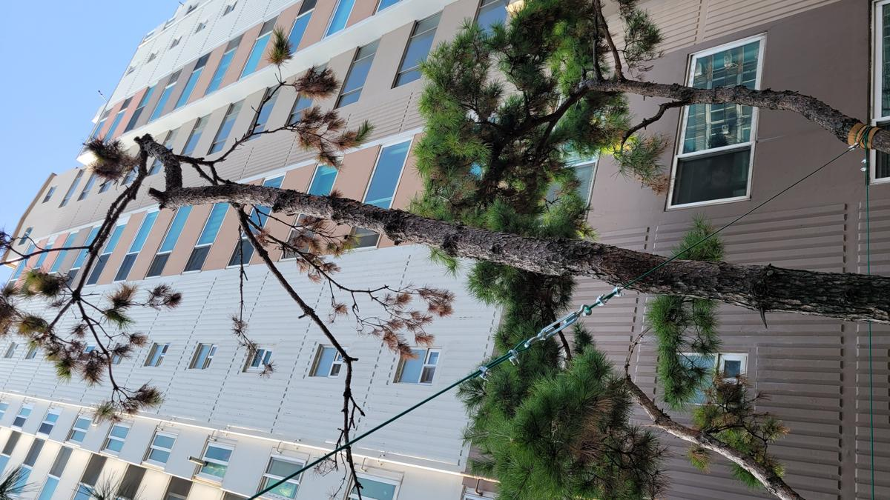
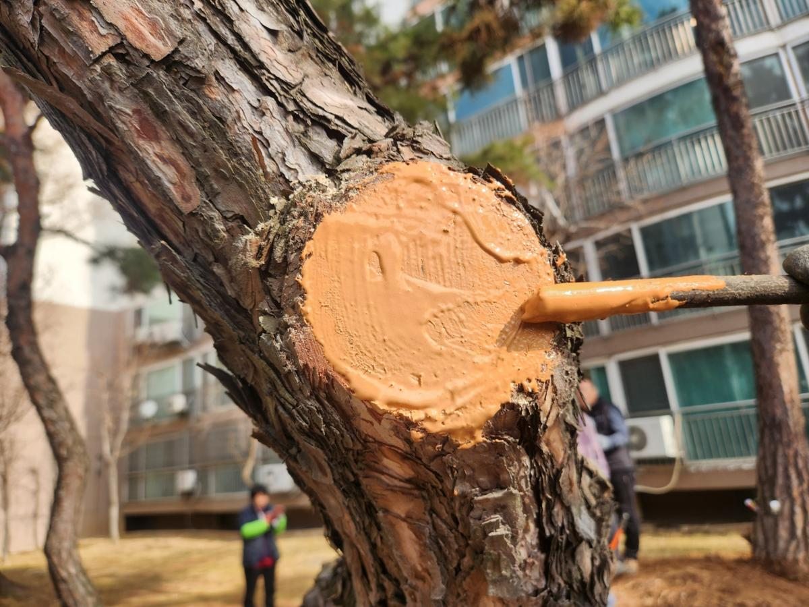
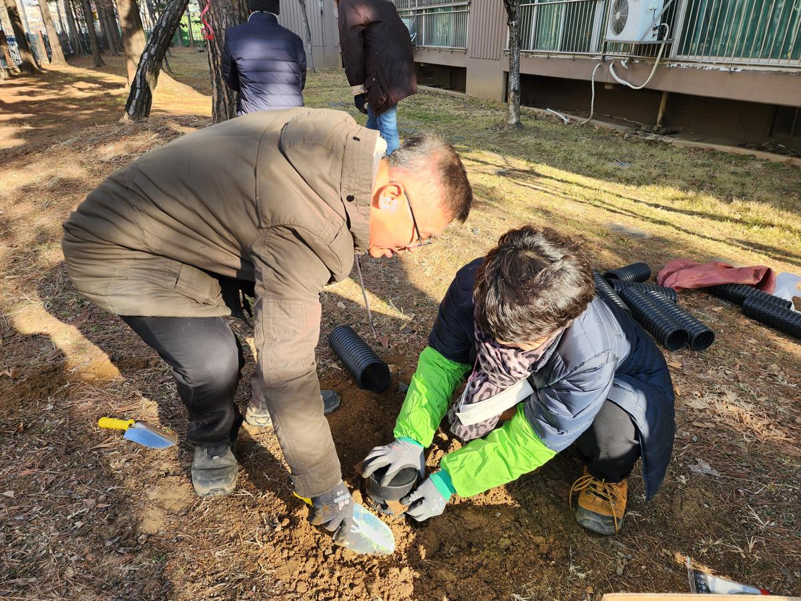
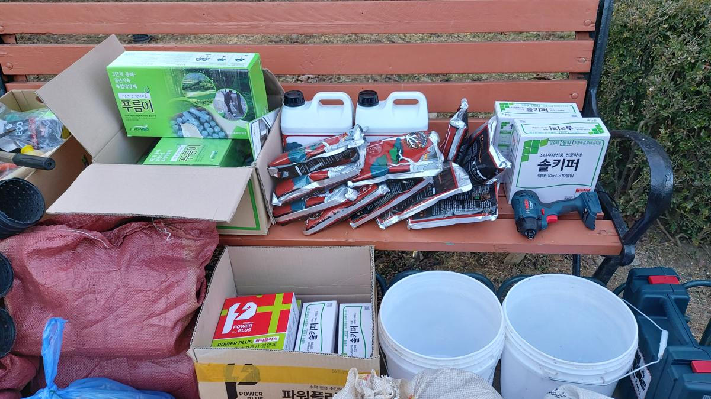
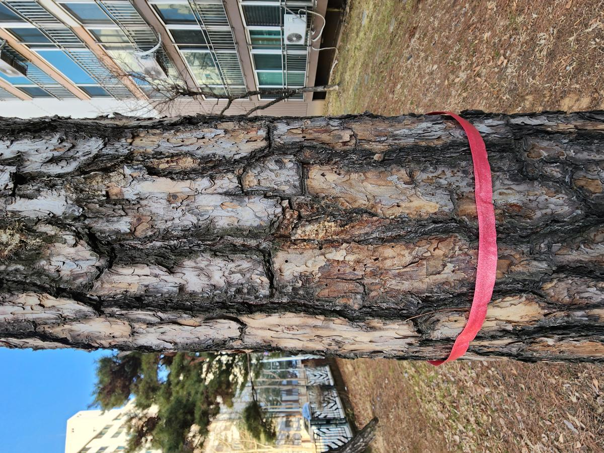
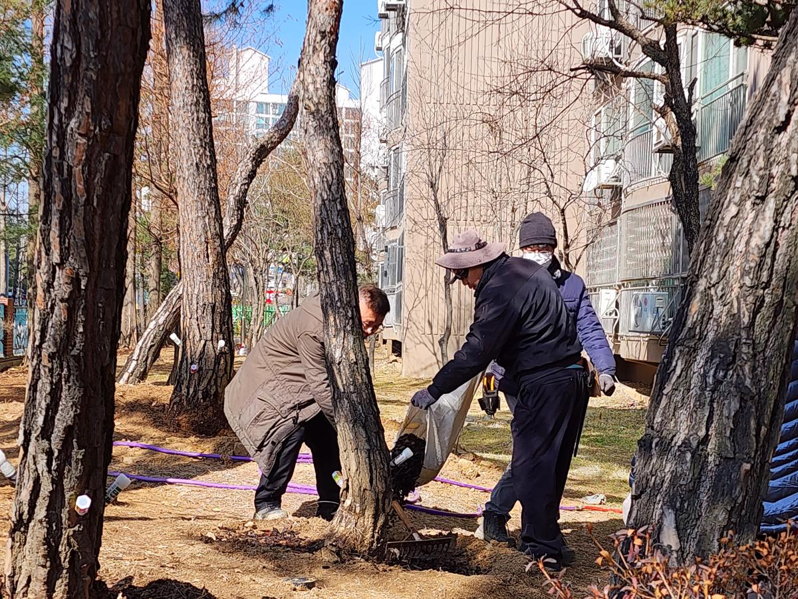

아파트 단지 내 수목은 단순한 조경 시설물이 아닙니다. 주민들에게는 정서적 안정을 주는 쉼터이자, 단지의 자산 가치를 결정짓는 중요한 생명 자산입니다. 하지만 도심 속 아파트는 인위적인 토양 환경과 미세먼지 등으로 인해 나무가 자라기에 결코 녹록지 않은 환경입니다.

오늘은 **평택보성아파트**에서 진행한 소나무 정밀 진단 및 수세 회복 프로젝트를 통해, 나무의사가 어떻게 공간의 생명력을 되살리는지 그 과정을 공유합니다.

### [현장 문제] 소리 없이 찾아오는 위기, 수세 약화

평택보성아파트의 소나무들은 잎의 색이 변하고 상단부 가지가 고사하는 등 전형적인 수세 약화 현상을 보이고 있었습니다. 나무의 외형만 보고 판단하는 것이 아니라, 정확한 원인 파악을 위해 정밀 진단 장비를 투입했습니다.

_T.S Meter를 활용하여 수목 내 수분 보유량과 전기전도도를 측정, 생리적 활성도를 과학적으로 분석합니다._

_수피를 정밀 관찰한 결과, 소나무좀 등 천공성 해충의 침입 흔적인 배설물과 수액 유출 흔적을 포착했습니다._

### [전문가 진단] 복합적 처방의 필요성

진단 결과, 오랜 기간 다져진 토양으로 인한 **배수 불량 및 산소 부족**, 그리고 약해진 틈을 타 침입한 **천공성 해충**이 주요 원인이었습니다. 단순히 약을 뿌리는 것에 그치지 않고, 뿌리 환경 개선과 직접적인 영양 공급을 병행하는 '복합 처방'을 결정했습니다.

### [시공/치료 과정] 생명력을 불어넣는 정밀 공정

#### 1. 수관주사 및 약제 처방

해충의 생활사를 고려하여 수간에 직접 약제를 주입합니다. 이는 주변 환경 오염을 최소화하면서 나무 전체에 빠르게 약효를 전달하는 가장 효율적인 방법입니다.

_수관주사를 통해 고농축 영양제와 살충제를 주입하여 내부에서부터 치유를 시작합니다._

#### 2. 토양 개량 및 심토 시비

딱딱하게 굳은 토양은 뿌리의 호흡을 방해합니다. 엔진 오거를 이용해 심토까지 구멍을 뚫고, 물리성을 개선하는 토양 개량제와 완효성 비료를 투입했습니다.

_강력한 오거 장비로 뿌리 근처의 토양을 천공하여 산소 공급 통로를 확보하고 영양분을 깊숙이 전달합니다._

_천공된 구멍에 수세 회복을 돕는 특수 배합 토양과 비료를 채워 넣는 과정입니다._

#### 3. 외과수술 및 상처 보호

고사한 가지를 제거한 단면은 병균의 침입 경로가 됩니다. 이를 방지하기 위해 살균 처리 후 도포제를 꼼꼼히 발라줍니다.

_전정 후 상처 부위에 오렌지색 인공 수피(도포제)를 발라 수분 증발을 막고 부후균 침입을 차단합니다._

### [결과 비교] 눈으로 확인하는 변화

가장 극적인 변화는 고사가 진행되던 수관 상단부에서 나타났습니다. 치료 전후의 모습을 비교해 보면 전문적인 관리의 중요성을 실감할 수 있습니다.

| **Before (치료 전)**                                           | **After (치료 및 관리 중)**                                    |
| :------------------------------------------------------------- | :------------------------------------------------------------- |
|  |  |
| 잎이 갈변하고 수관 상부가 앙상하게 드러난 모습                 | 수세가 회복되며 엽색이 짙어지고 안정감을 찾은 모습             |

### [가치] 지속 가능한 관리가 공간의 미래를 바꿉니다

모든 시공이 완료된 후, 충분한 관주 작업을 통해 약제가 뿌리까지 잘 흡수되도록 마무리했습니다.

_시공 후 충분한 수분 공급은 토양 개량제의 활성화를 돕고 나무의 스트레스를 완화합니다._

건강을 되찾은 소나무는 이제 평택보성아파트 주민들에게 다시금 쾌적한 그늘과 맑은 공기를 선사할 것입니다. 나무는 정직합니다. 전문가의 손길이 닿는 만큼, 그리고 진심으로 돌보는 만큼 그 생명력으로 보답합니다.

**지속 가능한 수목 관리는 단순한 비용이 아닌, 우리 주거 환경의 가치를 높이는 가장 확실한 투자입니다.** 수목의 건강에 이상이 느껴진다면, 더 늦기 전에 나무의사의 정밀 진단을 받아보시길 권장합니다.

---

**전략적 조경 컨설팅 & 나무병원**
공간의 가치를 높이는 푸른 생명력, 우리가 함께 지킵니다.
