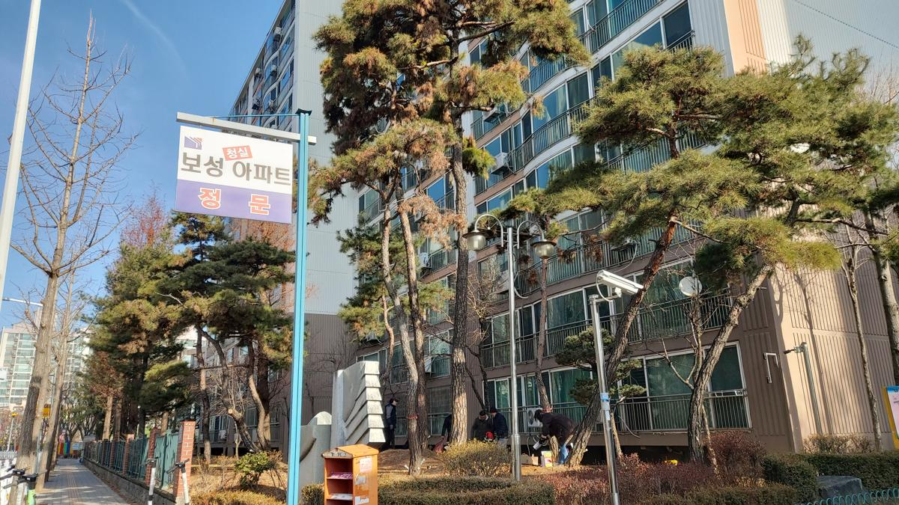
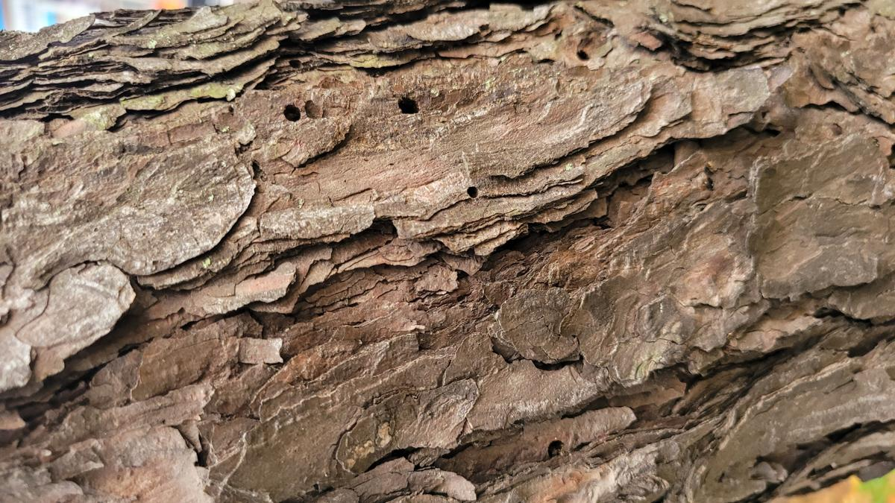
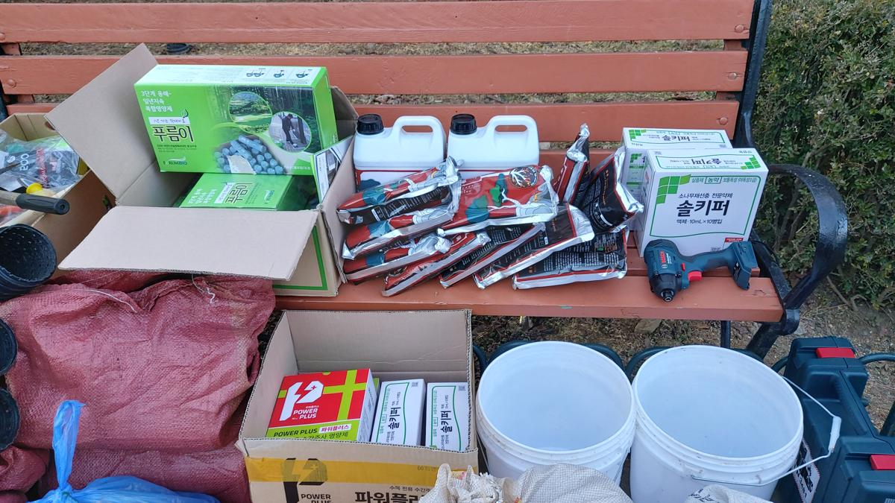
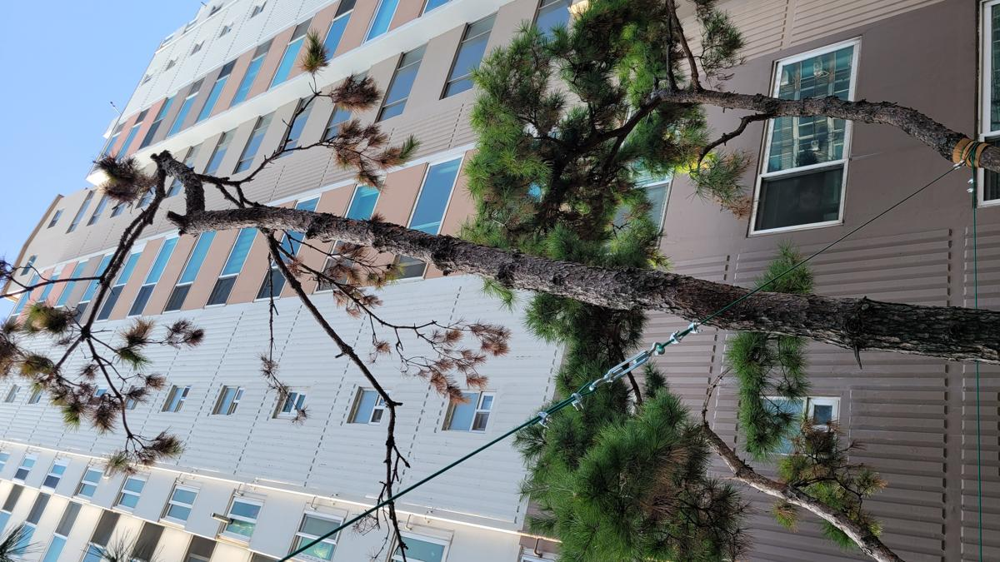
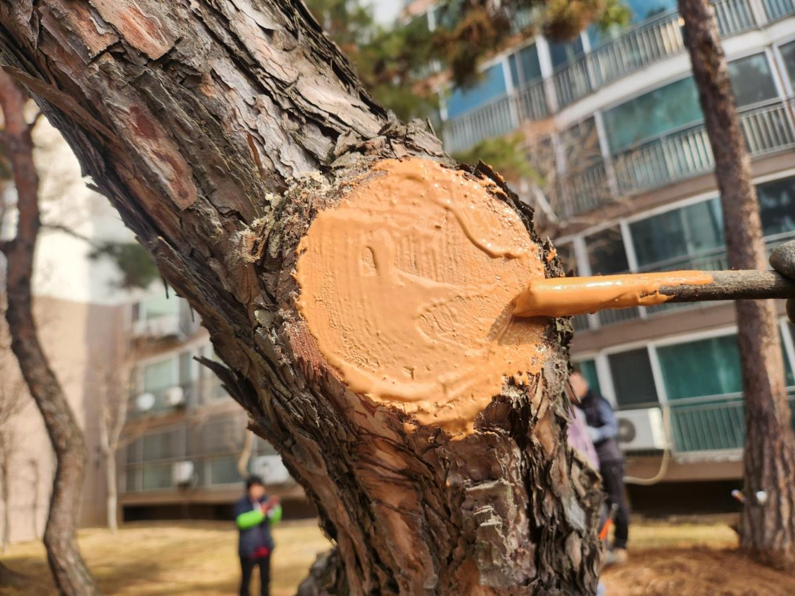
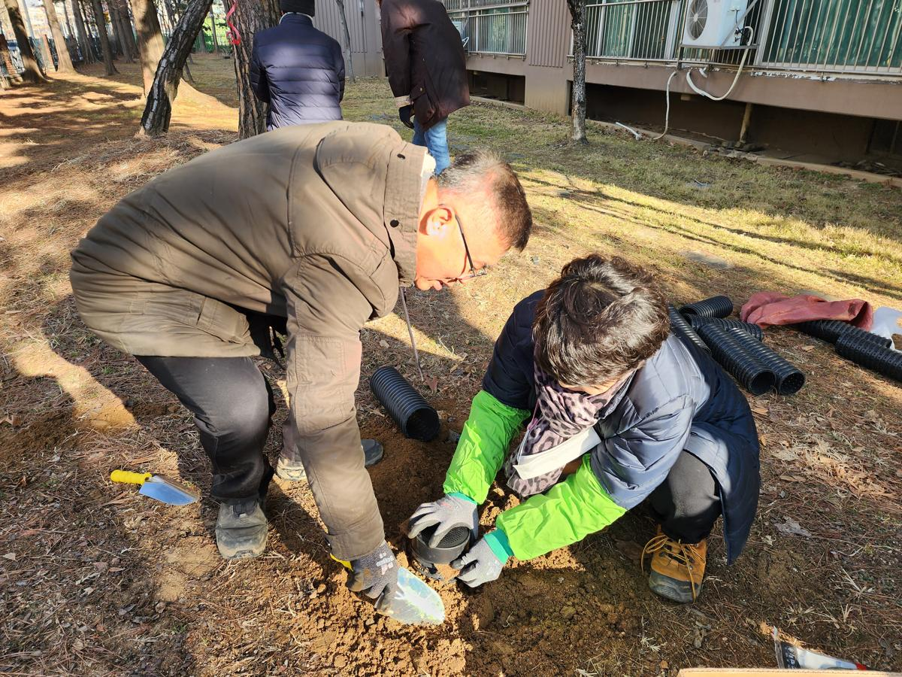
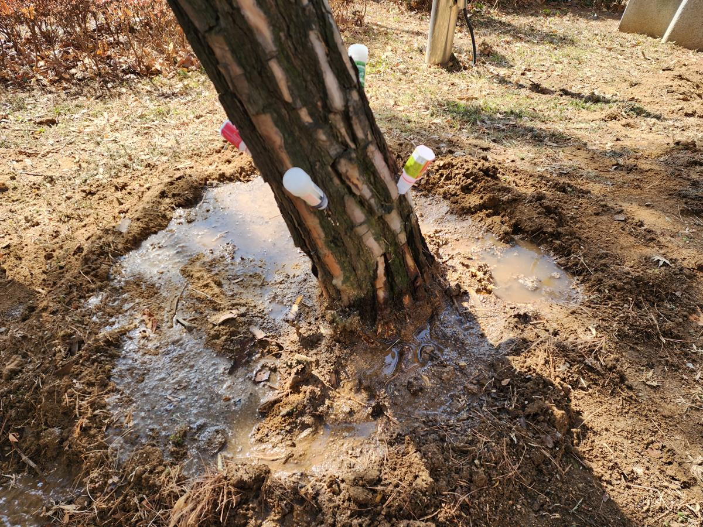
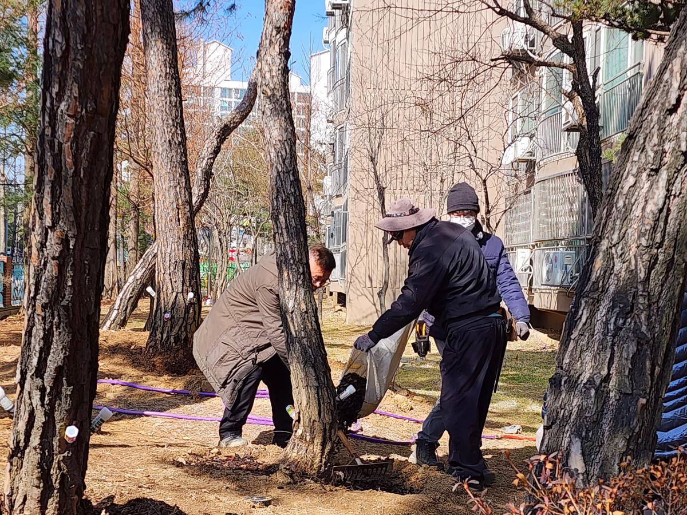

## 공사 개요

| 구분      | 내용                                                                          |
| --------- | ----------------------------------------------------------------------------- |
| 대상지    | 평택보성아파트 단지 내 소나무 식재지                                          |
| 작업일    | 2022년 11월 23일                                                              |
| 작업 내용 | 수세 진단, 수간주사, 유공관 설치 및 심토 시비, 고사지 전정 및 도포 처리, 관주 |
| 대상 수종 | 소나무                                                                        |

아파트 단지의 수목은 조경 시설물이 아니라 주민이 매일 마주하는 생활 환경이자, 단지 관리 수준을 그대로 보여 주는 지표입니다. 다만 아파트는 나무가 자라기에 좋은 환경이 아닙니다. 지하 주차장 상부 인공 지반, 오랜 보행으로 다져진 토양, 제한된 근권 면적이 겹치면 나무는 서서히 힘을 잃습니다.

---

## 현장 상태

평택보성아파트의 소나무들은 잎 색이 옅어지고 상부 가지 일부가 고사하는 전형적인 **수세 약화** 증상을 보이고 있었습니다. 외형만 보고 처방하지 않고, 수피와 근원부, 토양 상태를 함께 확인했습니다.

수피에서 확인된 작은 구멍들입니다. 소나무좀 같은 천공성 해충은 수세가 떨어진 나무를 먼저 찾아옵니다. 즉, 이 구멍은 원인이 아니라 **결과**입니다. 해충만 잡고 뿌리 환경을 그대로 두면 이듬해 같은 일이 반복됩니다.

## 진단 — 원인은 뿌리에 있다

진단 결과 두 가지가 겹쳐 있었습니다.

1. **토양 답압에 따른 배수 불량·산소 부족** — 다져진 토양은 공극이 사라져 뿌리가 숨을 쉬지 못합니다. 근권 환경이 나빠지면 수세가 떨어지고, 그 틈으로 해충이 들어옵니다.
2. **천공성 해충 침입** — 약해진 나무에 2차적으로 발생한 피해입니다.

그래서 약제 주입만으로 끝내지 않고, **뿌리 환경 개선 + 직접 양분 공급 + 상처 처리**를 함께 진행하는 복합 처방을 세웠습니다.

---

## 시공 과정

착수 전 자재를 한자리에 정리하고 수량과 규격을 확인합니다. 처방한 약제와 실제 투입 약제가 일치하는지 확인하는 것은 나무의사 시공의 기본 절차입니다.

### 1. 고사지 전정과 상처 처리

먼저 이미 말라 죽은 가지를 제거합니다. 고사지는 회복되지 않을 뿐 아니라 부후균의 서식처가 되고, 낙하 시 아래를 지나는 주민에게 위험합니다. 굵은 가지는 로프로 받아 내려 아래 시설물과 화단을 보호했습니다.

굵은 가지의 절단면은 병원균의 침입 통로가 됩니다. 살균 처리 후 도포제를 발라 수분 증발을 막고 부후균 침입을 차단했습니다.

### 2. 토양 개량 및 심토 시비

굳은 토양은 뿌리 호흡을 막습니다. 근권 범위를 따라 심토까지 천공한 뒤 **유공관(有孔管)** 을 세워 넣어 지표에서 뿌리층까지 산소가 통하는 길을 냈습니다. 관 내부와 주변에는 토양 개량제와 완효성 비료를 채워, 관수할 때마다 양분이 뿌리층으로 내려가도록 했습니다.

### 3. 수간주사

수간에 직접 약제를 주입하는 **수간주사**입니다. 주변 환경에 약제를 흩뿌리지 않으면서 나무 전체로 약효를 보내는 방법으로, 주민이 상시 통행하는 아파트 단지에 적합합니다. 흉고직경에 맞춰 주입 지점을 원주 방향으로 나누어 배치하고, 약제가 한쪽으로만 올라가지 않도록 했습니다.

> 흔히 '수관주사'라고 부르지만, 정확한 명칭은 줄기(수간)에 주입하는 **수간주사**입니다.

### 4. 마무리 관주

모든 시공을 마친 뒤 충분한 관주로 마무리했습니다. 관주는 두 가지 역할을 합니다. 토양 개량제와 비료를 뿌리층까지 내려보내고, 수간주사 약제가 증산 작용을 타고 이동하도록 돕는 것입니다. 토양이 마른 상태에서는 어떤 처방도 제 효과를 내지 못합니다.

---

## 사후 관리

**💡 나무의사의 관리 팁**

수세 회복은 한 번의 시공으로 끝나지 않습니다. 나무의 반응은 대체로 **다음 해 봄 신초에서** 먼저 나타납니다.

- **이듬해 봄** — 신초 길이와 엽색을 확인합니다. 신초가 짧고 색이 옅으면 추가 처방이 필요합니다.
- **관수** — 유공관을 설치한 뒤에는 관을 통해 물을 주면 뿌리층까지 직접 닿습니다. 여름 가뭄기에 특히 효과가 큽니다.
- **근권 보호** — 나무 밑동 주변 통행을 줄이고 멀칭을 유지하면 토양이 다시 다져지는 속도를 늦출 수 있습니다.

아파트 단지 수목은 관리 주체가 바뀌면서 이력이 끊기는 경우가 많습니다. 시공 이력과 처방 내용을 기록으로 남겨 두면, 다음 관리자가 같은 진단을 처음부터 반복하지 않아도 됩니다.

---

## 시공·진단 의뢰 문의

**느티나무병원 협동조합** — 산림청 등록 1종 나무병원 · 조경식재공사업

- 전화 **031-752-6000**
- 팩스 031-752-6001
- 이메일 coopneuti@naver.com
- 본점 경기도 성남시 수정구 태평로 104

수목의 잎 색이 옅어지거나 가지가 마르기 시작했다면, 원인을 특정하기 전에 약을 치는 것은 대체로 비용만 늘립니다. 나무의사가 현장에서 수세·근권·병해충을 함께 진단한 뒤 처방합니다. 아파트 입주자대표회의·관리사무소 발주 건도 견적서와 함께 실적증명서 및 자격·면허 증빙을 제공합니다.

_(본 게시물의 사진은 모두 실제 시공 현장에서 촬영한 것입니다.)_
