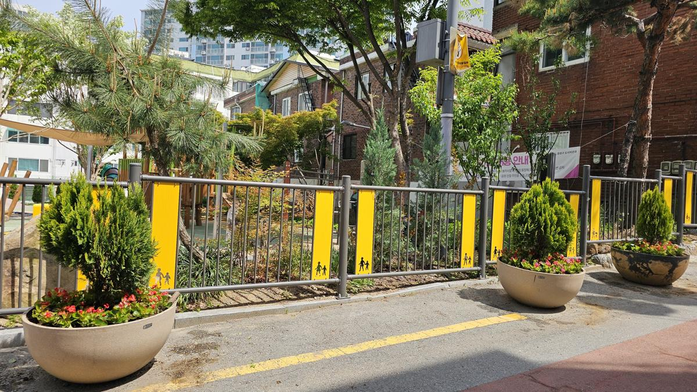
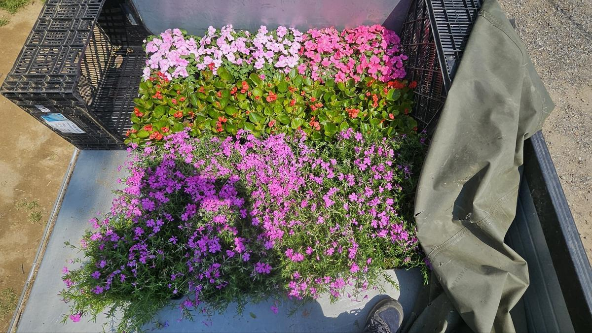
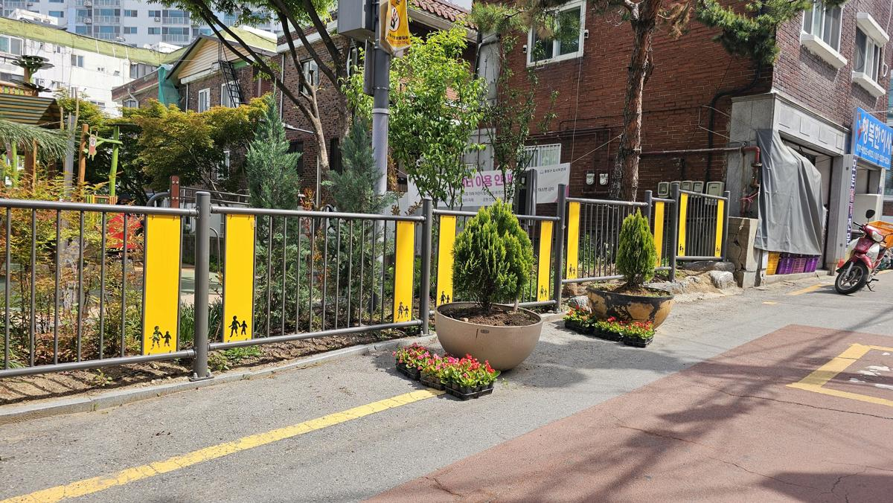
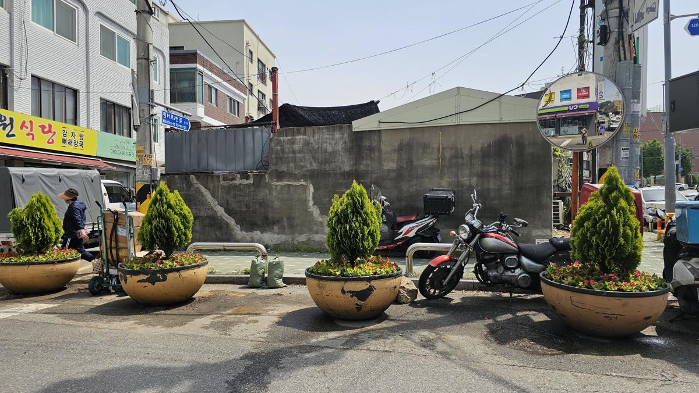
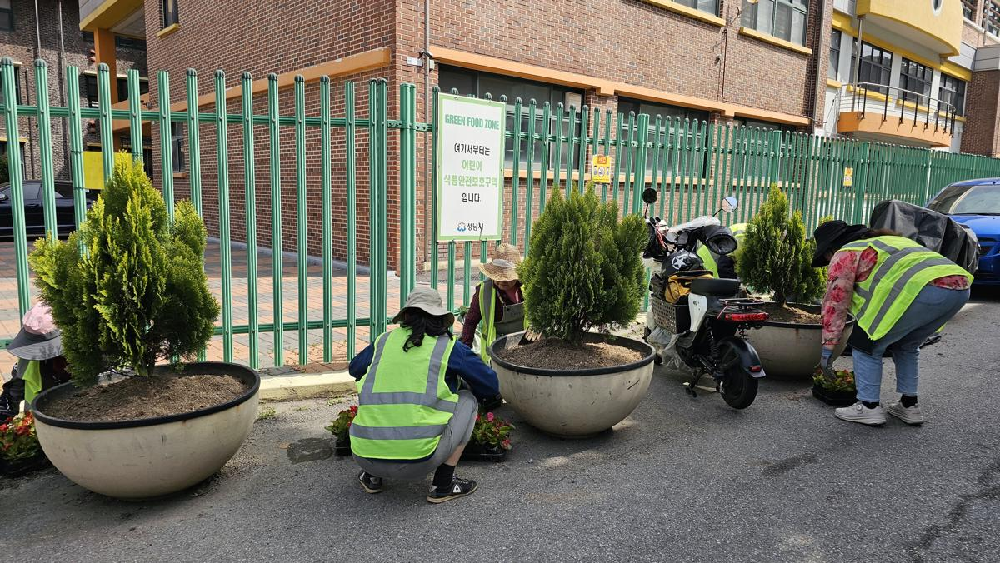
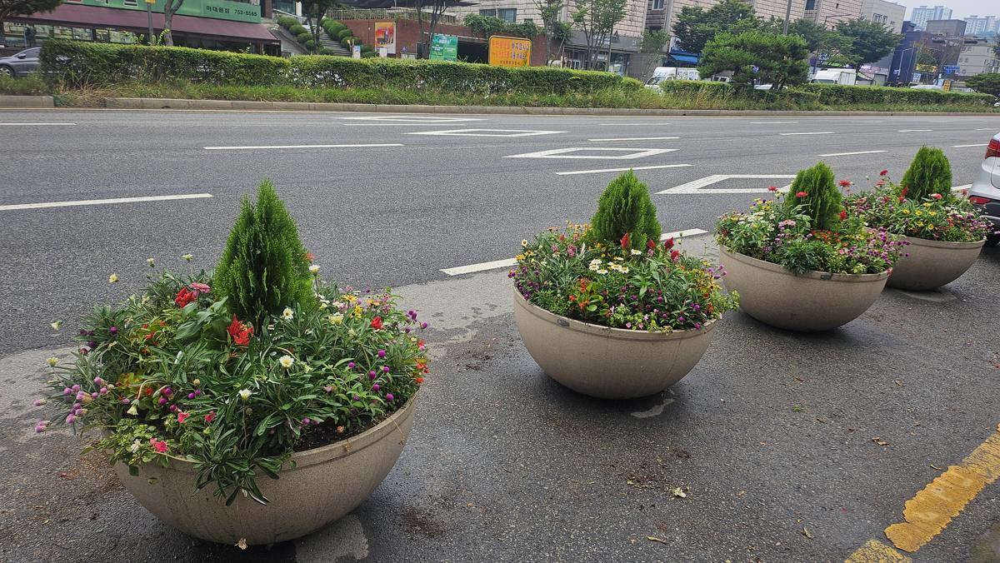
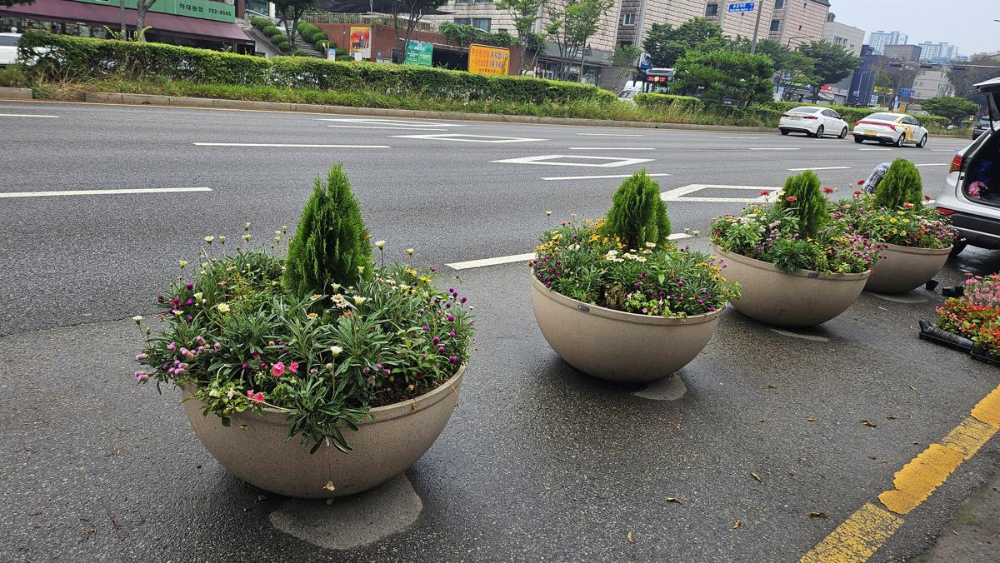

안녕하세요. 수목의 생리적 건강을 진단하고 공간의 미적 가치를 설계하는 **전략적 조경 컨설턴트**입니다.

도시의 가로 경관은 그 지역의 첫인상을 결정짓는 중요한 요소입니다. 특히 아스팔트와 보도블록으로 둘러싸인 도심 환경에서 '계절꽃'은 단순한 장식을 넘어, 시민들에게 정서적 안정을 제공하고 도시의 생명력을 증명하는 지표가 됩니다. 오늘은 성남시 하대원동 일대에서 진행된 **2025년 계절꽃 식재 및 가로 환경 정비 사례**를 통해, 전문가의 손길이 닿은 녹지가 어떻게 공간의 품격을 높이는지 소개해 드리겠습니다.

### [현장 문제: 생동감을 잃은 도심의 대형 화분]

식재 전 하대원동 가로변의 대형 화분들은 지난 계절의 흔적만이 남은 채 토양이 노출되어 있었습니다. 도심 가로 화분은 일반 지반보다 수분 증발이 빠르고, 자동차 배기가스 등 외부 스트레스에 취약합니다.

### [전문가 진단 및 계획: 수종 선정과 토양 개량]

나무의사로서 이번 프로젝트에서 가장 집중한 부분은 **'지속 가능한 아름다움'**입니다. 단순히 예쁜 꽃을 심는 것에 그치지 않고, 도심 환경에서도 강한 생명력을 유지할 수 있도록 다음과 같은 전략을 세웠습니다.

1.  **토양 치환 및 개량**: 고갈된 양분을 보충하기 위해 유기물이 풍부한 상토를 혼합하여 토양의 보수성과 통기성을 확보했습니다.
2.  **수종의 층위 설계**: 중심부에는 수직적 요소를 주는 율마(Goldcrest) 등을 배치하고, 주변부에는 색감이 화려한 초화류를 배치하여 입체적인 시각 효과를 극대화했습니다.
3.  **생리적 적응 고려**: 직사광선과 건조에 강한 베고니아, 페튜니아 등을 선별하여 식재 후 몸살을 최소화했습니다.

### [시공 과정: 정교한 식재와 초기 활착 관리]

조경은 디테일에서 결정됩니다. 식재 시 뿌리분이 손상되지 않도록 주의하며, 적정 식재 밀도를 유지하여 통풍 불량으로 인한 병해충 발생을 사전에 차단했습니다.

특히 학교 주변 '그린 푸드 존(Green Food Zone)'과 어린이 보호구역 인근은 아이들의 생태 감수성을 자극할 수 있도록 더욱 다채로운 색감을 배치했습니다. 이는 운전자의 주의력을 높여 안전 사고 예방에도 기여하는 심리적 효과가 있습니다.

식재 직후의 관수는 뿌리와 토양 사이의 공극을 메워주는 가장 중요한 공정입니다. 미세 살수를 통해 토양 입자가 뿌리에 밀착되도록 유도했습니다.

### [결과 및 관리 팁: 만개한 도심의 정원]

작업 완료 후, 삭막했던 거리는 화사한 색채로 가득 찼습니다. 건강하게 관리된 꽃들은 보행자에게는 즐거움을, 운전자에게는 쾌적한 시야를 제공합니다.

**💡 전문가의 관리 팁:**
여름철 대형 화분은 지면보다 온도가 높게 올라갑니다. 이른 아침이나 해 질 녘에 관수하여 수분 증발을 막고, 시든 꽃(Deadheading)을 주기적으로 제거해주면 새로운 꽃눈 형성이 촉진되어 더 오랫동안 아름다움을 유지할 수 있습니다.

### [가치: 지속 가능한 관리가 공간의 미래를 바꿉니다]

단순히 꽃을 심는 행위는 누구나 할 수 있습니다. 하지만 **식물의 생리적 특성을 이해하고, 공간의 기능적 가치를 고려한 전문적인 식재**는 오직 전문가만이 가능합니다.

하대원동의 이번 계절꽃 식재는 주민들에게는 정서적 풍요를, 공공기관에는 신뢰받는 행정의 이미지를 심어주었습니다. 잘 관리된 녹지는 자산 가치를 높일 뿐만 아니라, 그 공간에 머무는 사람들의 삶의 질을 바꿉니다.

당신의 공간에도 생명력 넘치는 전략적 조경이 필요하십니까? **지속 가능한 관리가 공간의 미래를 바꿉니다.** 지금 전문가와 상의하십시오.

---

**[의뢰 및 상담 문의]**
전략적 조경 컨설턴트 / 나무의사 전문 진단 및 시공
