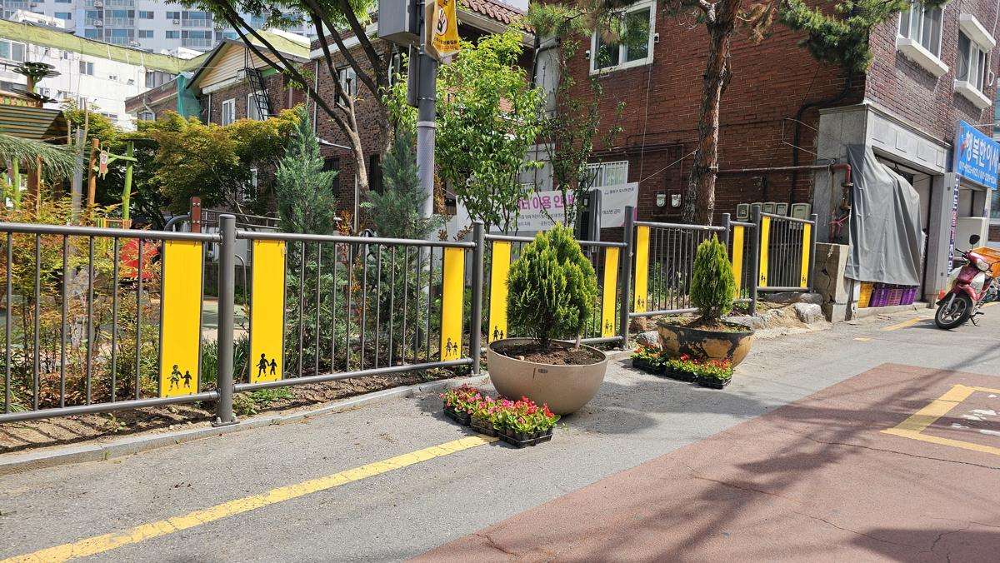
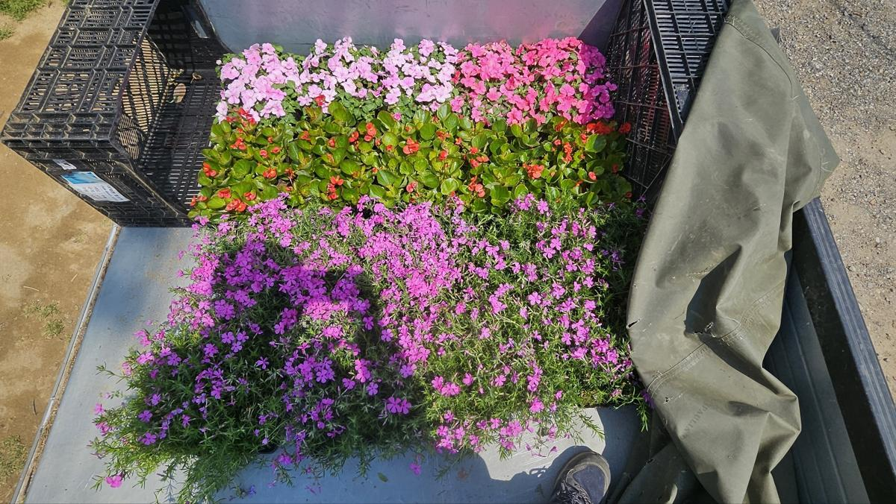
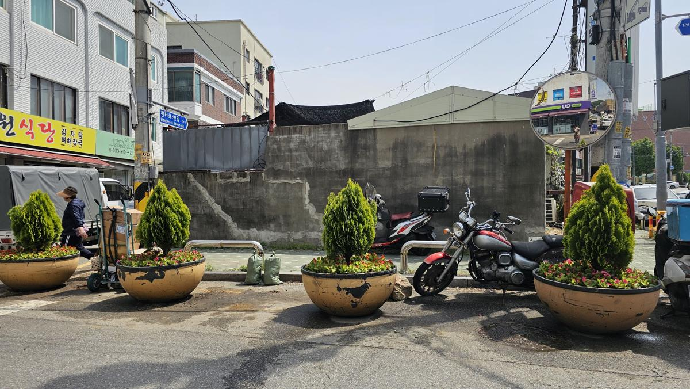
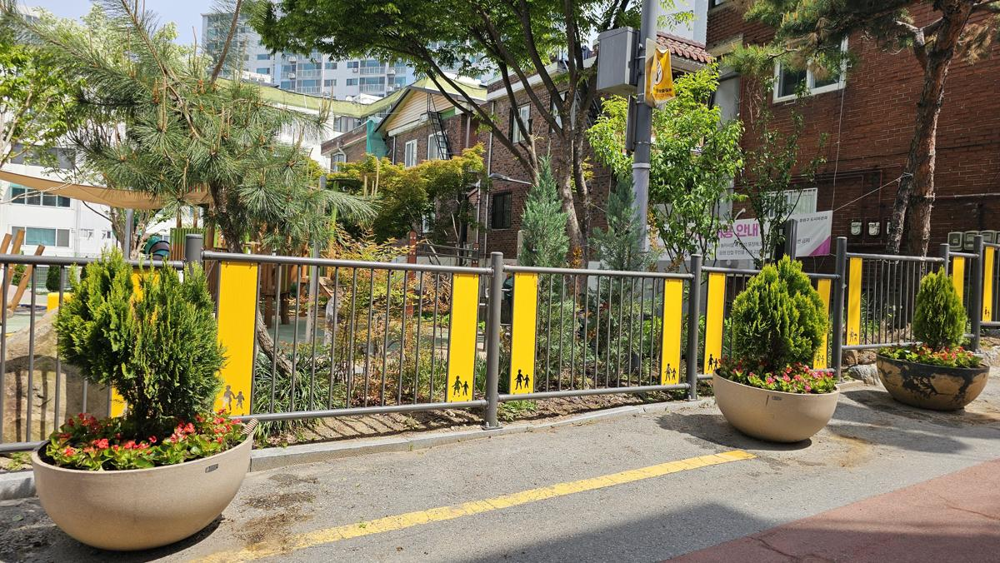
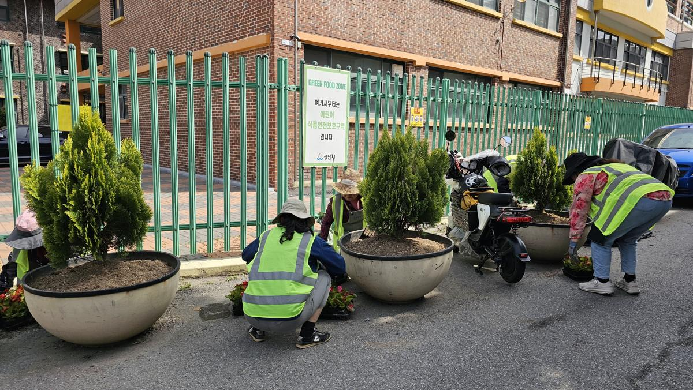
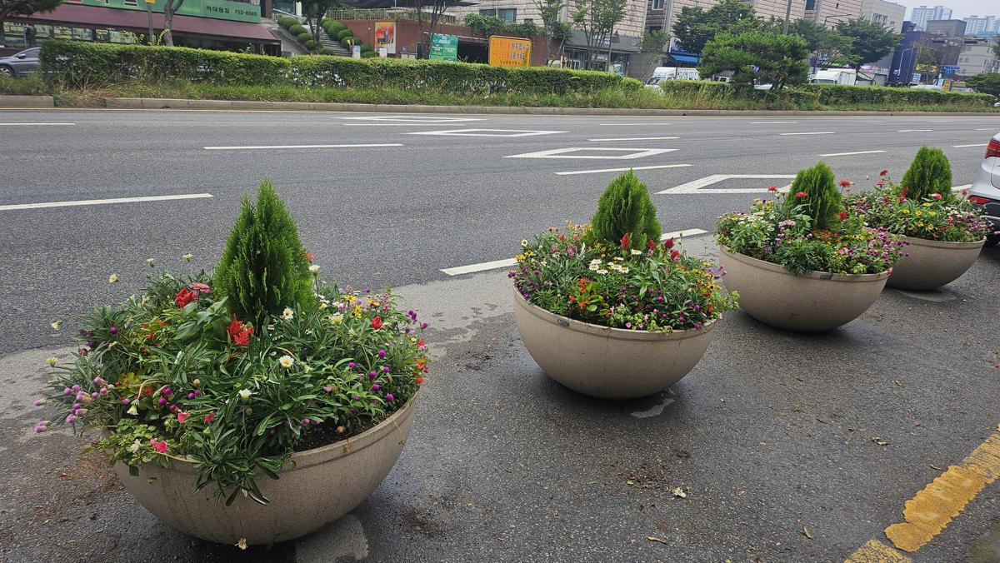
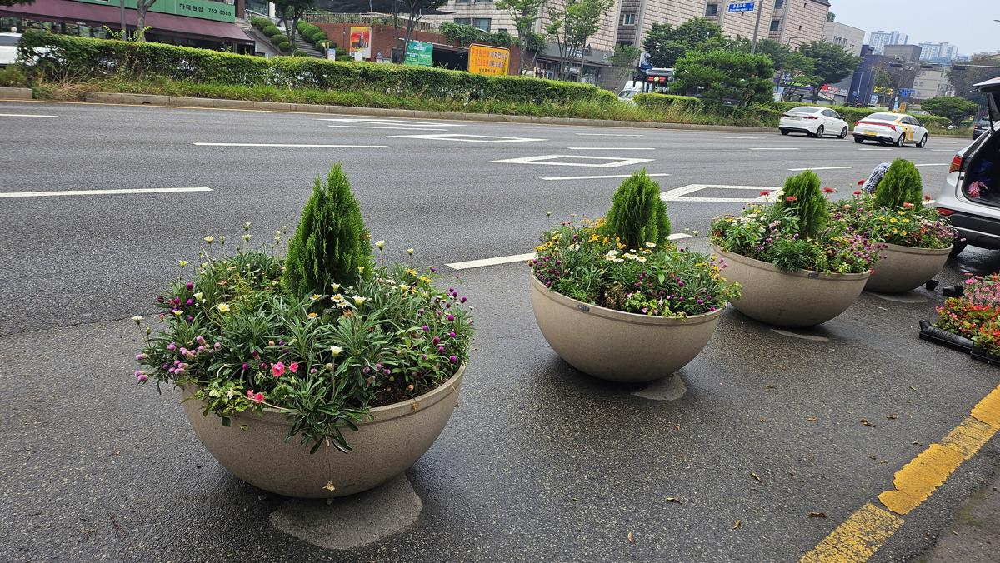

## 공사 개요

| 구분      | 내용                                                       |
| --------- | ---------------------------------------------------------- |
| 대상지    | 성남시 하대원동 가로변, 어린이보호구역, 그린푸드존 일원    |
| 작업 기간 | 2025년 5월 1일 자재 반입 → 5월 10일 식재 → 7월 사후 점검   |
| 작업 내용 | 대형 가로 화분 토양 개량, 계절초화 식재, 관수 및 활착 관리 |
| 주요 식재 | 율마, 페튜니아, 베고니아, 임파첸스, 버베나 등              |

가로 경관은 그 동네의 첫인상을 결정합니다. 아스팔트와 보도블록으로 둘러싸인 도심에서 계절꽃은 장식을 넘어, 그 거리가 관리되고 있다는 신호로 읽힙니다. 이번 공사는 하대원동 가로변 대형 화분의 계절초화 교체 식재입니다.

---

## 현장 상태

지난 계절 초화를 걷어 낸 화분은 골격이 되는 율마만 남고 흙이 드러난 상태였습니다. 도심 가로 화분은 지면 화단보다 조건이 훨씬 나쁩니다.

- 화분 벽이 직사광선을 받아 **지온이 빠르게 오르고** 수분 증발이 큽니다.
- 토량이 제한적이라 **양분 용탈**이 빠릅니다.
- 차량 배기가스와 분진이 잎에 직접 쌓입니다.

## 식재 계획

1. **토양 치환 및 개량** — 고갈된 기존 토양에 유기물이 풍부한 상토를 혼합해 보수성과 통기성을 함께 확보했습니다.
2. **층위 구성** — 중심부에 수직 요소인 율마를 두고, 주변부에 색감이 강한 초화를 배치해 낮은 눈높이에서도 입체적으로 보이도록 했습니다.
3. **내서·내건성 수종 선정** — 직사광선과 건조에 강한 베고니아, 페튜니아 등을 골라 식재 후 몸살을 줄였습니다.

반입한 묘종은 엽색이 진하고 뿌리 발달이 양호한 개체만 사용합니다. 잎이 웃자라 늘어진 묘종은 화분에 옮긴 뒤 첫 더위에 그대로 주저앉습니다.

---

## 시공 과정

학교 주변 **그린푸드존**과 어린이보호구역 인근은 색감을 특히 다채롭게 배치했습니다. 아이들 눈높이에서 계절 변화를 볼 수 있도록 한 것이기도 하지만, 화분 자체가 보행로와 차도를 물리적으로 구분해 주는 역할도 합니다.

식재 시에는 뿌리분이 부서지지 않게 포트에서 빼고, 통풍이 확보되도록 적정 밀도를 지킵니다. 빽빽하게 심으면 당장은 풍성해 보여도 장마철에 아랫잎부터 무릅니다. 식재 깊이는 관수할 때 흙이 넘치지 않도록 화분 테두리보다 2~3cm 낮게 잡습니다.

식재 직후의 관수는 뿌리와 토양 사이의 공극을 메우는 공정입니다. 미세 살수로 토양 입자가 뿌리에 밀착되도록 유도하고, 화분 아래로 물이 빠질 때까지 충분히 줍니다.

---

## 시공 결과

식재를 마치자 삭막했던 골목과 가로변에 색이 들어왔습니다. 어린이보호구역 펜스의 노란색과 화분 초화의 색이 함께 보이면서 구역 인지성도 높아졌습니다.

식재가 끝나면 절반이 끝난 것입니다. 나머지 절반은 활착 관리입니다.

두 달 뒤인 7월 사후 점검 사진입니다. 초화가 화분 테두리 밖으로 늘어질 만큼 자라 활착이 확인되었습니다. 식재 자체보다 **초기 두 주간의 관수 관리**가 이 결과를 만듭니다.

**💡 전문가의 관리 팁**

여름철 대형 화분은 지면보다 지온이 높게 오릅니다. 이른 아침이나 해 질 녘에 관수해 증발 손실을 줄이고, 시든 꽃은 **데드헤딩**으로 주기적으로 제거해 주면 새 꽃눈 형성이 촉진되어 개화 기간이 길어집니다. 화분은 양분 용탈이 빠르므로 한 달에 한 번 정도 액비를 보충하면 개화 상태가 눈에 띄게 유지됩니다.

---

## 시공·진단 의뢰 문의

**느티나무병원 협동조합** — 산림청 등록 1종 나무병원 · 조경식재공사업

- 전화 **031-752-6000**
- 팩스 031-752-6001
- 이메일 coopneuti@naver.com
- 본점 경기도 성남시 수정구 태평로 104

가로 화분·플랜터의 계절초화 식재는 봄·가을 교체와 개화기 유지관리(관수, 데드헤딩, 시비, 병해충 점검)를 묶어 연간 단위로 계약하는 편이 관리 품질과 비용 모두에 유리합니다. 현장 조사 후 개소별 수량과 관리 회차를 반영한 견적을 드립니다. 관공서 **수의계약**은 실적증명서와 자격·면허 증빙을 견적서와 함께 제공합니다.

_(본 게시물의 사진은 모두 실제 시공 현장에서 촬영한 것입니다.)_
