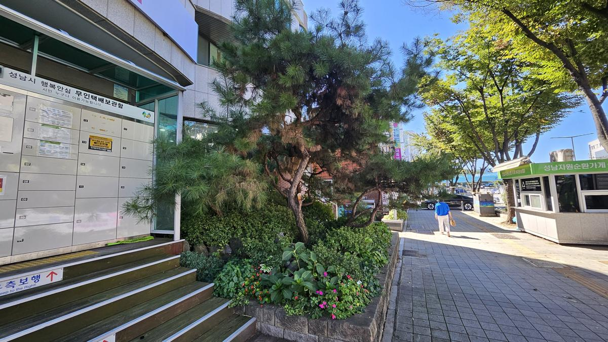
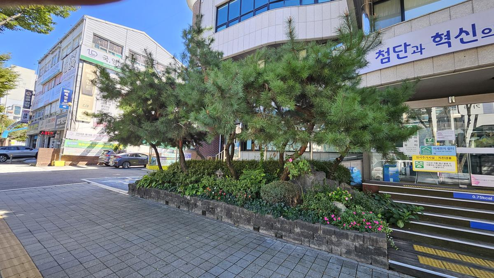
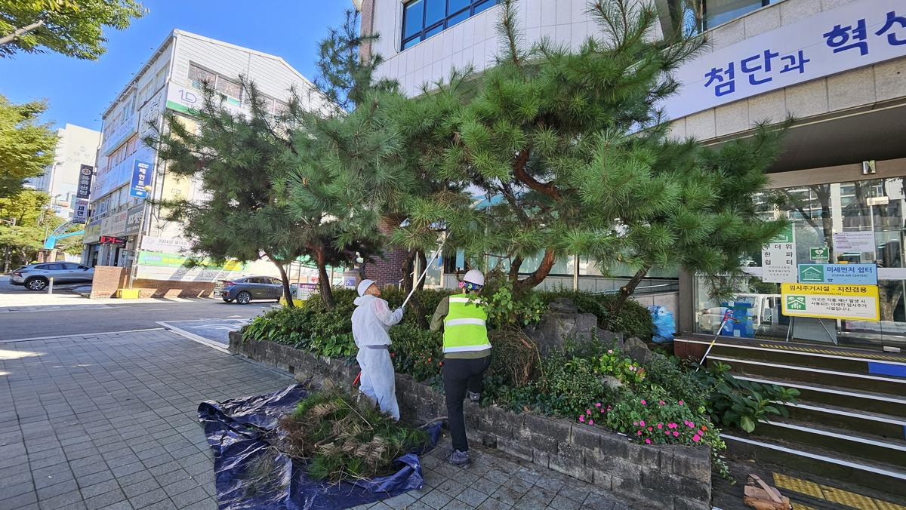
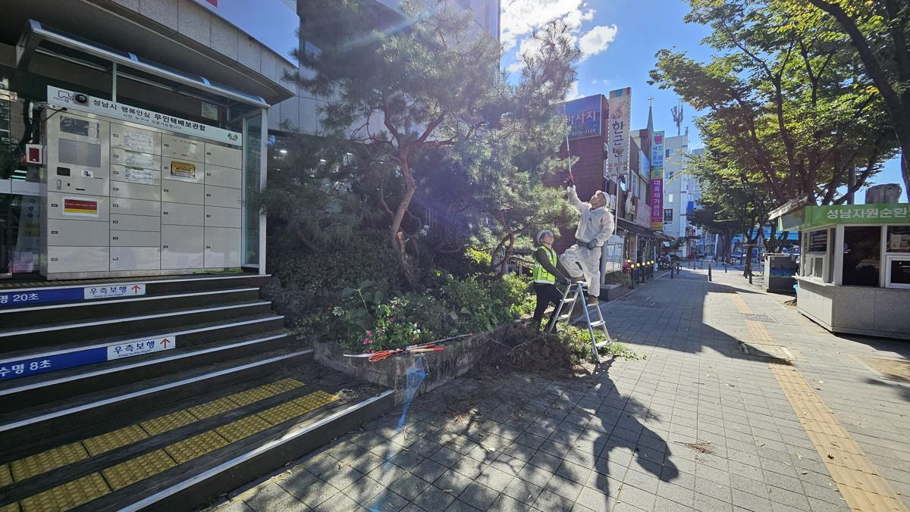
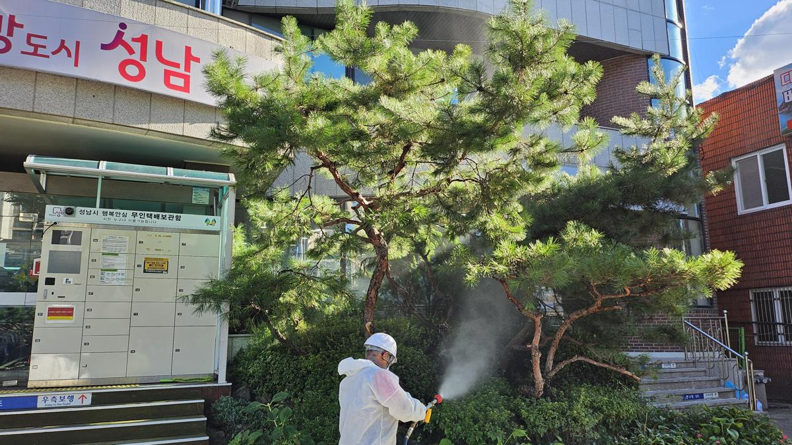
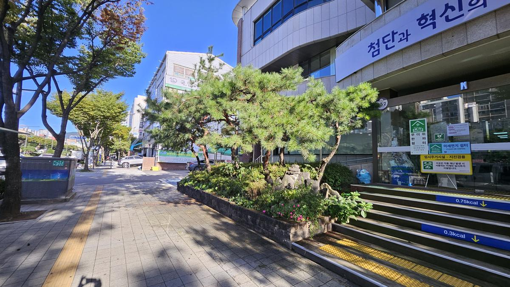
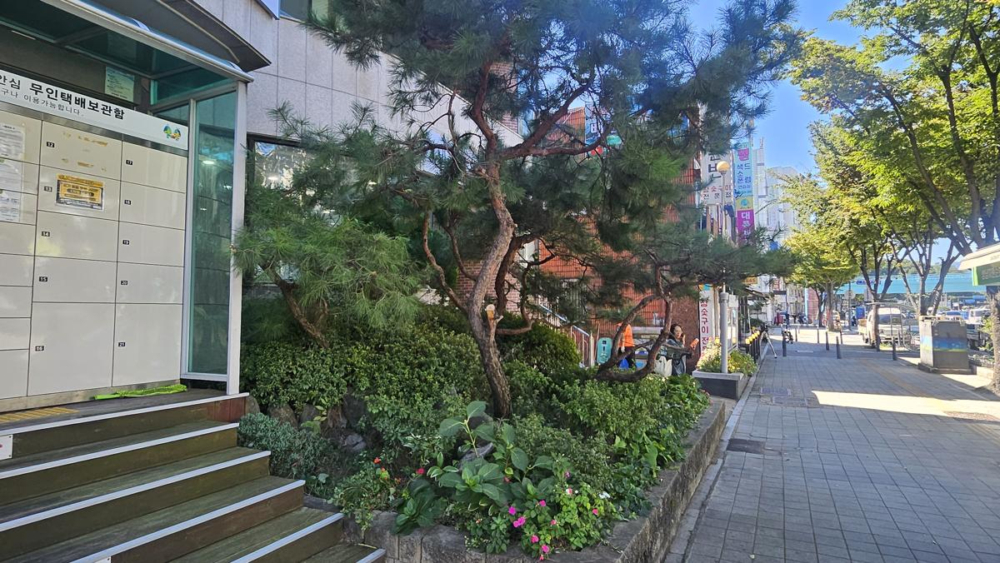
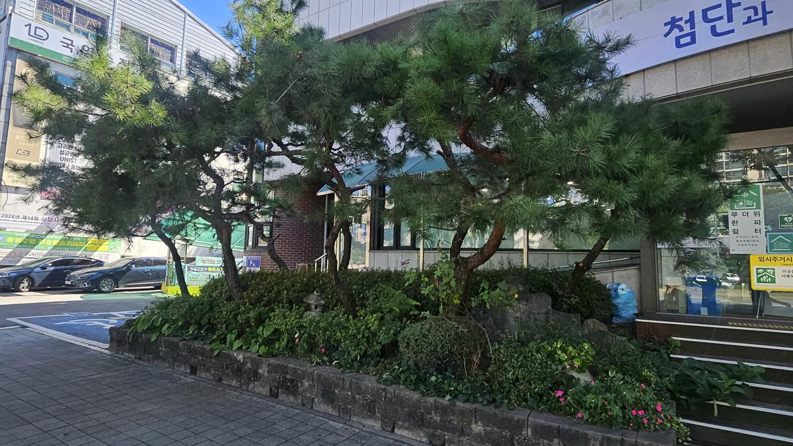

## [현장 문제] 생기를 잃어가는 도심의 파수꾼

성남시 하대원동의 주민 접점 공간, 행정복지센터 인근의 소나무들이 위기에 처했습니다. 사계절 내내 푸르름을 자랑해야 할 소나무의 엽색이 갈변하고, 수관 전체로 고사가 진행되고 있는 상태였습니다. 

*진단 전 현장 전경: 소나무 하단부와 측면 수관에서 뚜렷한 갈변 현상이 관찰됩니다.*

도심 속 고사목은 단순히 미관을 해치는 것에 그치지 않습니다. 고사한 가지가 낙하하여 보행자의 안전을 위협할 수 있으며, 특히 소나무재선충병이나 기타 전염성 병해충의 매개처가 될 위험이 있어 신속하고 전문적인 조치가 필요합니다.

*근접 촬영 결과: 침엽의 탈락과 수분 공급 중단으로 인한 조직 괴사가 심각한 수준입니다.*

---

## [전문가 진단/계획] 나무의사의 정밀 분석과 처방

현장을 확인한 결과, 해당 소나무들은 급격한 기후 변화와 도심 내 복사열로 인한 생리적 스트레스가 누적된 상태에서 2차 병해충의 침입을 받은 것으로 판단되었습니다. 

**[진단 근거 및 처방]**
1. **고사 부위 판별**: 이미 조직이 완전히 괴사한 고사목 및 고사지는 즉시 제거하여 건전한 조직으로의 전이를 차단합니다.
2. **수형 조절**: 고사지 제거 시 남은 수관의 균형을 고려하여 심미적 가치를 유지합니다.
3. **예방적 방제**: 인근의 건강한 수목으로 병해충이 확산되지 않도록 고농도 약제 살포 및 수관 방제를 병행합니다.

*제거 대상 수목의 수간 상태 확인: 수피의 들뜸과 수액 흐름 정체를 확인하여 제거 범위를 확정합니다.*

---

## [시공/치료 과정] 정교한 수술과 철저한 방제

작업은 주민들의 통행 안전을 확보한 상태에서 전문 인력에 의해 진행되었습니다. 단순한 절단이 아닌, 나무의 생리 구조를 이해하는 전문가의 손길이 필요한 공정입니다.

*방제복 착용 및 작업 준비: 약제 노출 방지와 안전한 시공을 위해 철저한 복장을 갖추고 작업을 시작합니다.*

*고지 전정 작업을 통한 고사지 제거: 장비를 활용하여 상부의 고사한 가지를 정밀하게 제거하여 수관 내 통풍을 개선합니다.*

고사목 제거 후에는 즉시 약제 방제를 실시했습니다. 이는 남아있는 수목들의 면역력을 높이고, 잠재적인 해충의 활동을 억제하기 위한 필수적인 과정입니다.

*수관 살포 방제: 미세 입자 살포기를 사용하여 잎 뒷면과 수피 사이사이까지 약제가 침투하도록 정밀 방제를 시행합니다.*

---

## [결과 및 관리 팁] 다시 찾은 쾌적함과 안전

이틀간의 집중적인 관리를 통해 하대원동의 녹지 공간은 다시금 생명력을 되찾았습니다. 고사목이 제거된 자리에는 시야가 확보되어 공간이 더욱 넓고 쾌적해 보이는 효과까지 얻었습니다.

*작업 완료 후 전경: 고사 부위가 말끔히 정리되어 소나무 본연의 수려한 수형이 돋보입니다.*

*정리된 하층 식생: 수목 하부의 초화류와 관목들도 정비되어 전체적인 조경의 완성도가 높아졌습니다.*

**[향후 관리 팁]**
* **수분 관리**: 고사목 제거 후 남은 수목들은 일시적인 스트레스를 받을 수 있으므로, 가뭄 시 충분한 관수가 필요합니다.
* **정기 모니터링**: 잎의 색깔 변화나 수피의 구멍 유무를 정기적으로 관찰하여 병해충 재발을 조기에 발견해야 합니다.

---

## [가치] 지속 가능한 관리가 공간의 미래를 바꿉니다

조경은 설치보다 **'관리'**가 본질입니다. 방치된 고사목은 자산 가치를 떨어뜨리고 안전사고의 원인이 되지만, 전문가의 적절한 개입은 공간에 새로운 숨결을 불어넣습니다. 

하대원동 주민들이 매일 마주하는 이 작은 숲이 정서적 안정을 주는 쉼터가 되고, 행정기관의 신뢰도를 높이는 품격 있는 공간으로 남을 수 있도록 저희는 오늘도 나무의 마음으로 현장을 지킵니다.

**수목의 건강이 곧 공간의 건강입니다. 전문적인 수목 진단과 관리가 필요하시다면 언제든 전략적 조경 파트너를 찾으십시오.**