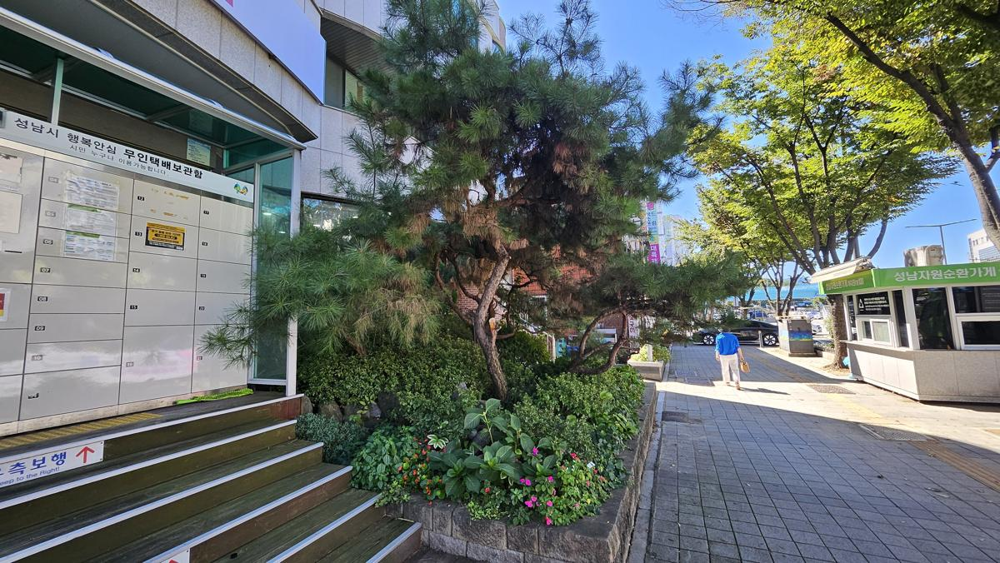
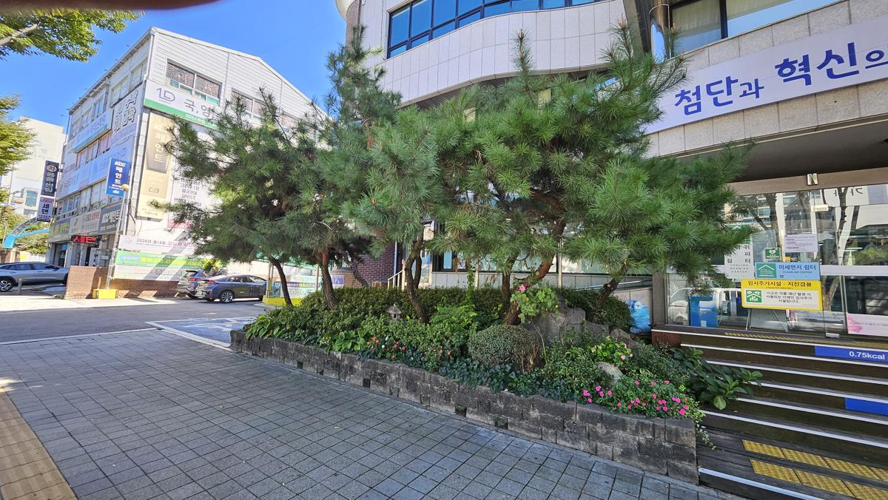
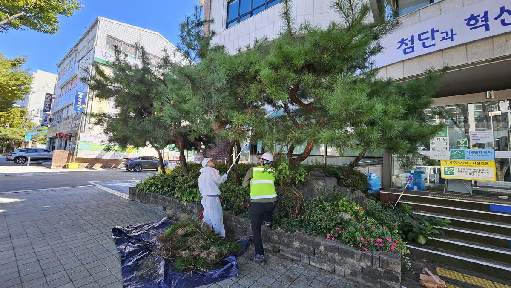
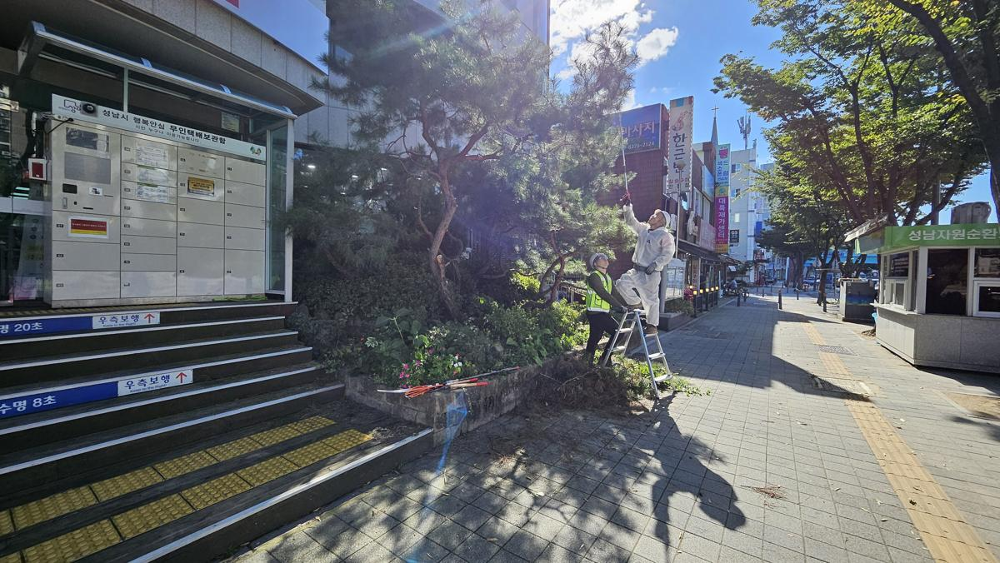
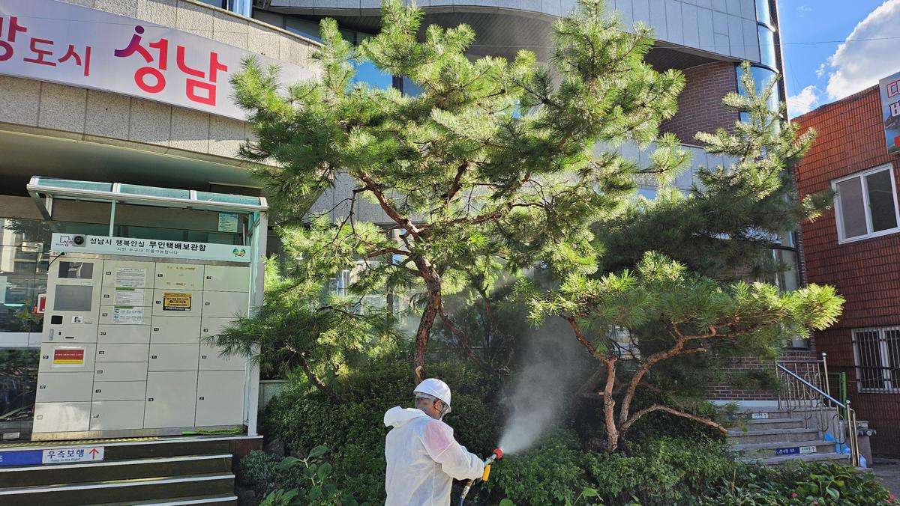
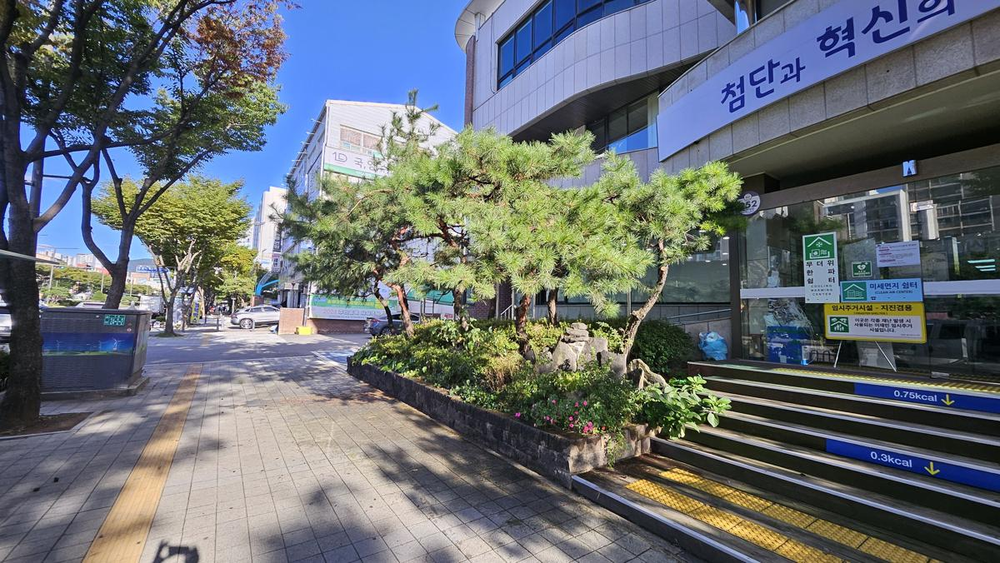
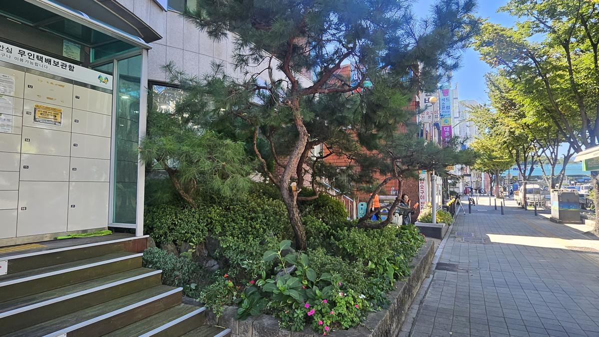
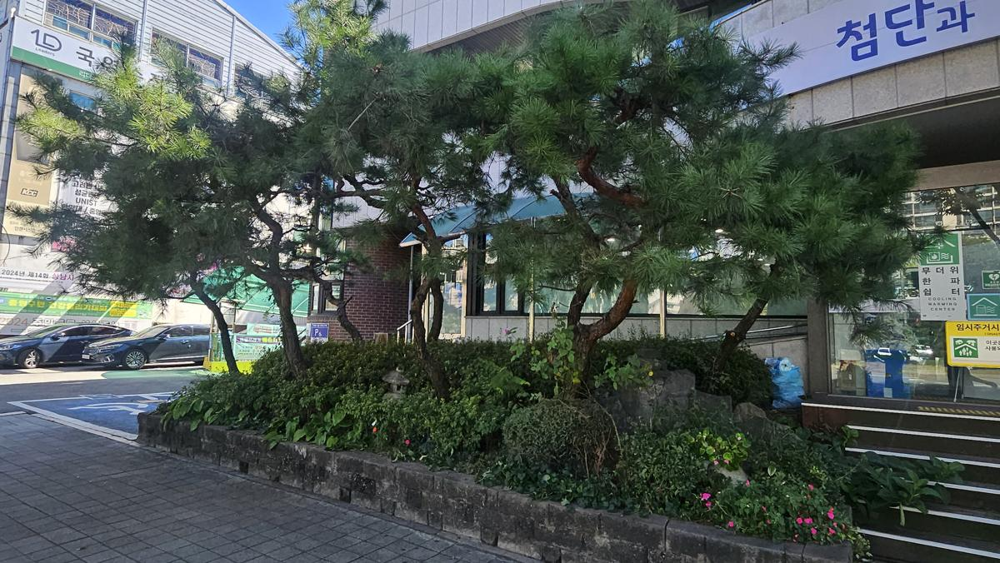

## 공사 개요

| 구분      | 내용                                                         |
| --------- | ------------------------------------------------------------ |
| 대상지    | 성남시 하대원동 행정복지센터 인근 가로 식재지                |
| 작업 기간 | 2024년 9월 23일 ~ 9월 24일 (2일간)                           |
| 작업 내용 | 고사지 제거, 수관 정리, 동력분무기 수관 방제, 하층 식생 정비 |
| 투입 장비 | 고지가위·고지톱, 사다리, 동력분무기, 방제복                  |

행정복지센터 앞은 주민 왕래가 가장 많은 자리입니다. 그 앞의 소나무가 갈변하고 있다면 미관 문제만이 아니라 안전 문제이기도 합니다. 마른 가지는 예고 없이 떨어지고, 고사한 소나무는 다른 병해충의 서식처가 됩니다.

---

## 현장 상태

수관 하단부와 측면에서 뚜렷한 갈변이 관찰되었습니다. 사계절 푸르러야 할 소나무의 침엽이 갈색으로 변했다는 것은, 그 가지로 가는 물길이 이미 끊겼다는 뜻입니다.

가지가 보행로 바로 위로 뻗어 있어, 마른 가지의 낙하 위험이 있는 구조였습니다.

## 진단 및 처방

현장 확인 결과, 여름철 고온과 도심 복사열로 인한 생리적 스트레스가 누적된 상태에서 2차 병해충 피해가 겹친 것으로 판단했습니다. 처방은 세 가지로 정리했습니다.

1. **고사 부위 판별과 제거** — 이미 조직이 괴사한 가지는 회복되지 않습니다. 즉시 제거해 부후균이 건전 부위로 번지는 것을 차단합니다.
2. **수형 균형 유지** — 고사지를 제거하면 한쪽만 비어 보이므로, 남는 수관의 균형을 보면서 제거 범위를 정합니다.
3. **예방 방제** — 인근 건전목으로 병해충이 번지지 않도록 수관 방제를 병행합니다.

---

## 시공 과정 — 9월 23일

작업은 보행 안전 확보부터 시작했습니다. 보도에 방수포를 깔아 잘린 가지와 잎이 바닥에 흩어지지 않게 받고, 통행 구간을 정리한 뒤 착수했습니다.

높은 위치의 고사지는 사다리와 고지가위로 처리했습니다. 절단은 지륭(枝隆)을 보호하는 위치에서 이루어져야 합니다. 지륭을 파고들면 상처가 아물지 못하고 그 자리로 부후가 진행됩니다. 고사지 제거는 죽은 조직을 걷어 내는 동시에 **수관 내부 통풍을 여는** 효과도 있습니다.

고사지 제거 직후 수관 방제를 실시했습니다. 방제복과 보호구를 착용하고, 통행이 적은 시간대에 진행했습니다. 잎 앞면만 적시는 살포는 의미가 없습니다. 흡즙성 해충은 잎 뒷면에 붙어 있으므로 **잎 뒷면과 수피 틈**까지 약액이 닿도록 분무 방향과 거리를 조절합니다.

---

## 시공 결과

당일 작업을 마친 모습입니다. 잘린 가지와 잎은 그날 전량 수거해 반출했습니다. 고사지를 방치하면 그 자체가 병해충의 월동처가 되므로 현장에 남기지 않는 것이 원칙입니다.

이튿날 다시 현장을 찾아 절단면 상태와 약해 여부를 확인하고, 하층 관목과 초화까지 정비했습니다.

고사 부위가 정리되자 소나무 본래의 가지 흐름이 드러났습니다. 시야가 트이면서 행정복지센터 진입부 전체가 넓어 보이는 효과도 함께 얻었습니다.

**💡 나무의사의 관리 팁**

- **관수** — 고사지를 제거한 나무는 일시적으로 부담을 받습니다. 가뭄기에는 근권 전체가 젖도록 깊게 관수합니다.
- **정기 관찰** — 잎 색 변화, 수피의 작은 구멍, 수지(진) 흐름 여부를 계절마다 확인하면 재발을 조기에 잡을 수 있습니다.
- **소나무재선충병 주의** — 소나무가 짧은 기간에 전체적으로 시들고 잎이 아래로 처지면 재선충병을 의심해야 합니다. 이 경우 자체 처리하지 말고 즉시 관할 지자체 산림부서 또는 나무병원에 신고·의뢰해야 합니다. 감염목의 무단 이동은 법으로 제한됩니다.

---

## 시공·진단 의뢰 문의

**느티나무병원 협동조합** — 산림청 등록 1종 나무병원 · 조경식재공사업

- 전화 **031-752-6000**
- 팩스 031-752-6001
- 이메일 coopneuti@naver.com
- 본점 경기도 성남시 수정구 태평로 104

고사목·고사지는 방치할수록 제거 비용과 안전 위험이 함께 커집니다. 나무의사가 현장에서 고사 범위와 원인을 진단하고, 제거·방제·수세 회복 중 필요한 처방만 제시합니다. 관공서·공공기관 **수의계약**은 실적증명서와 자격·면허 증빙을 견적서와 함께 제공합니다.

_(본 게시물의 사진은 모두 실제 시공 현장에서 촬영한 것입니다.)_
