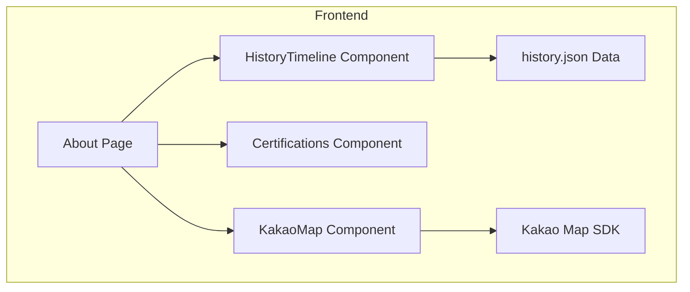

# Implementation Report: 회사소개 페이지 고도화

## Summary
기존의 회사소개 페이지를 전문가다운 신뢰감과 현대적인 감각이 조화된 페이지로 전면 업그레이드했습니다. '나무를 치료하는 병원'이라는 브랜드 정체성을 강화하기 위해 중후하고 전문적인 디자인 톤을 적용하였으며, 연혁 타임라인, 인증 내역, 지도 API 연동을 통해 정보의 깊이와 신뢰도를 확보했습니다.

## Architecture Update

## Performance/Quality Results
| Metric | Before | After |
| :--- | :--- | :--- |
| 디자인 톤 | 일반적인 웹사이트 스타일 | 전문적/중후한 기업 브랜드 스타일 |
| 정보 구성 | 텍스트 위주의 단순 나열 | 타임라인, 그리드 배지, 지도 등 시각화 |
| 모바일 최적화 | 기본 반응형 | 섹션별 맞춤형 반응형 레이아웃 및 애니메이션 |
| 신뢰도 요소 | 텍스트 형태의 인증 언급 | 배지 스타일의 인증/특허 섹션 명시 |

## Technical Decisions
- **Dark-Theme Accents:** 미션과 비전 섹션에 다크 배경을 적용하여 시각적 긴장감을 주고 전문적인 이미지를 강조했습니다.
- **Data-Driven Timeline:** 연혁 데이터를 JSON으로 분리하여 향후 유지보수가 용이하도록 설계했습니다.
- **Dynamic Script Loading:** 지도 API 로딩 시 Next.js의 클라이언트 사이드 특성을 고려하여 `useEffect` 내에서 동적으로 스크립트를 로드하고 `autoload=false` 옵션을 통해 초기화 시점을 제어했습니다.
- **Typography:** `font-black`과 `tracking-tighter`를 조합한 굵직한 타이포그래피를 사용하여 기업의 무게감을 표현했습니다.
