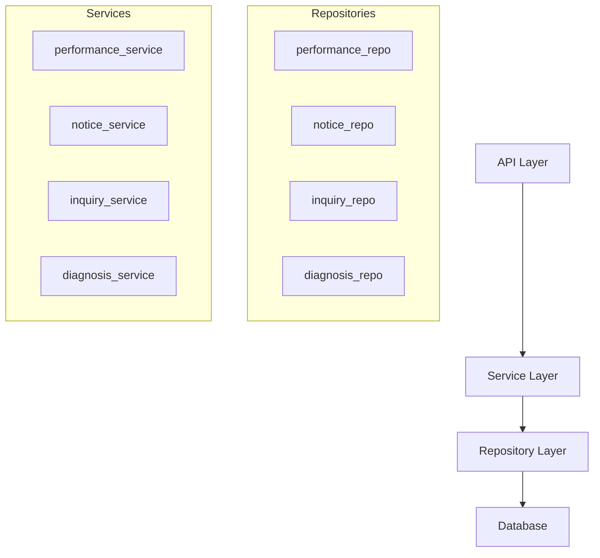

# Implementation Report: Backend Refactoring

## Summary
백엔드 아키텍처를 Layered Architecture (API - Service - Repository) 패턴으로 리팩토링했습니다. 이를 통해 비즈니스 로직과 데이터 접근 로직이 명확히 분리되었으며, 코드의 재사용성과 테스트 용이성이 향상되었습니다.

## Architecture Update

## Performance/Quality Results
| Metric | Before | After |
| :--- | :--- | :--- |
| **Logic Separation** | Mixed in endpoints | API - Service - Repo |
| **DB Access** | Direct in endpoints | Encapsulated in Repos |
| **Testing** | 15/17 passing | 17/17 passing (fixed parser & mocks) |
| **Code Duplication** | High (DB queries) | Low (Generic CRUDBase) |

## Technical Decisions
- **CRUDBase Pattern:** 공통 CRUD 작업을 처리를 위해 Generic 클래스를 도입하여 중복 코드를 최소화했습니다.
- **Service Layer Responsibility:** 파일 삭제 로직 및 통계 계산과 같은 비즈니스 로직을 서비스 계층으로 이동시켜 API 엔드포인트를 단순화했습니다.
- **Dependency Injection:** FastAPI의 `Depends`를 활용하여 데이터베이스 세션을 주입하고, 싱글톤 서비스 인스턴스를 사용하도록 구성했습니다.
- **Async Handling:** SQLAlchemy 2.0의 비동기 기능을 적극 활용하고, `selectinload`를 통해 관계형 데이터를 효율적으로 로드했습니다.
