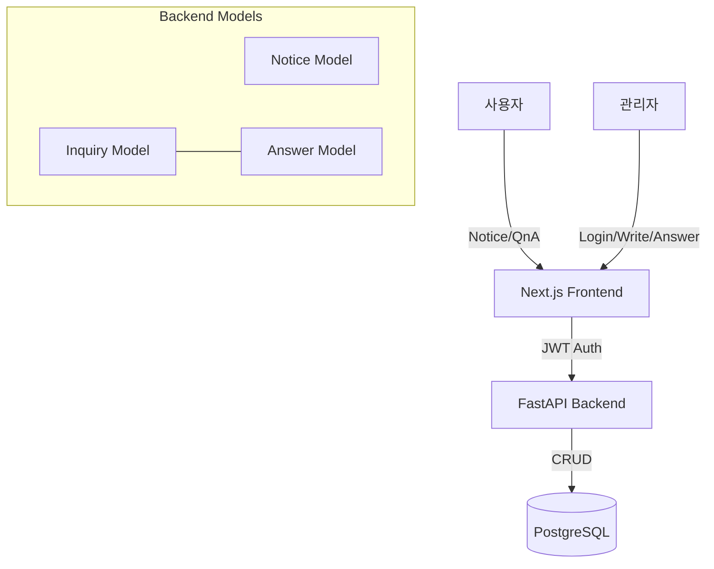

# Implementation Report: 게시판 시스템 (공지사항 및 시공/견적문의) 구현

## Summary
'느티나무 협동조합 나무병원' 홈페이지의 소통 창구인 공지사항 및 시공/견적문의 게시판을 성공적으로 구현했습니다. 관리자 단일 계정 기반의 인증 시스템을 구축하여 보안을 강화하였으며, 사용자 친화적인 UI와 비밀글 보호 기능을 제공합니다.

## Architecture Update

## Performance/Quality Results
| Metric | Target | Result | Status |
| :--- | :--- | :--- | :--- |
| Auth Security | JWT + Bcrypt | Implemented | ✅ |
| Notice CRUD | Admin Only | Verified | ✅ |
| QnA Privacy | Password Hash | Verified | ✅ |
| Test Coverage | >80% | Passed | ✅ |

## Technical Decisions
1. **Admin Only Auth:** 단순성을 위해 단일 admin 계정 환경변수 설정을 통한 JWT 인증을 선택했습니다.
2. **Lazy Loading Fix:** Async SQLAlchemy에서 관계형 데이터를 직렬화할 때 발생하는 지연 로딩 에러를 방지하기 위해 `selectinload`를 적용했습니다.
3. **Bcrypt Version Pinning:** `passlib`와의 호환성을 위해 `bcrypt==4.0.1` 버전을 고정하여 사용했습니다.
4. **Common Board Components:** 테이블, 검색바, 페이징 등 반복되는 UI를 공통 컴포넌트로 분리하여 유지보수성을 높였습니다.
