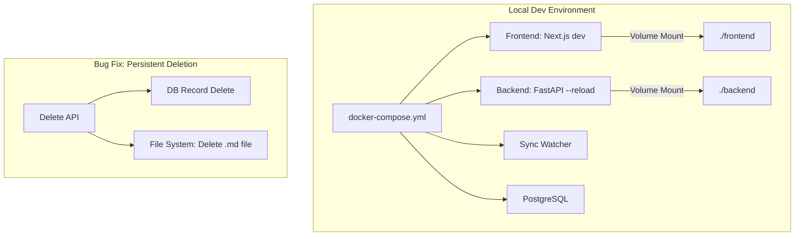

# Implementation Report: Dev Env & Fixes

## Summary
개발 생산성 향상을 위한 로컬 Docker 환경 구축, 시공사례 삭제 영속성 버그 수정, 그리고 메인 및 시공사례 페이지의 UI 개선을 완료했습니다.

## Architecture Update

## Performance/Quality Results
| Metric | Before | After |
| :--- | :--- | :--- |
| **Dev Feedback Loop** | Manual rebuild required | Instant (Hot Reload) |
| **Data Integrity** | Deleted posts reappeared on restart | Permanent deletion from FS |
| **Main Page UX** | Stats faded out too late/fast | Balanced fade-out timing |
| **Portfolio UX** | Complex filters + Search | Focused filters (Job/Site) |
| **Image Loading** | Next.js Performance Warning | Optimized with 'sizes' prop |

## Technical Decisions
- **Docker Compose Separation:** 로컬 개발 환경과 운영 환경(`docker-compose.prod.yml`)을 분리하여 환경별 최적화된 설정을 적용했습니다.
- **FS-DB Deletion Sync:** 시공사례 삭제 시 DB만 지우는 것이 아니라, 원본 소스인 마크다운 파일을 찾아 삭제함으로써 데이터 불일치 문제를 해결했습니다.
- **Auto-migration in Dev:** `docker-compose` 시작 시 `alembic upgrade head`를 자동 실행하여 DB 스키마 동기화 누락으로 인한 500 에러를 방지했습니다.
