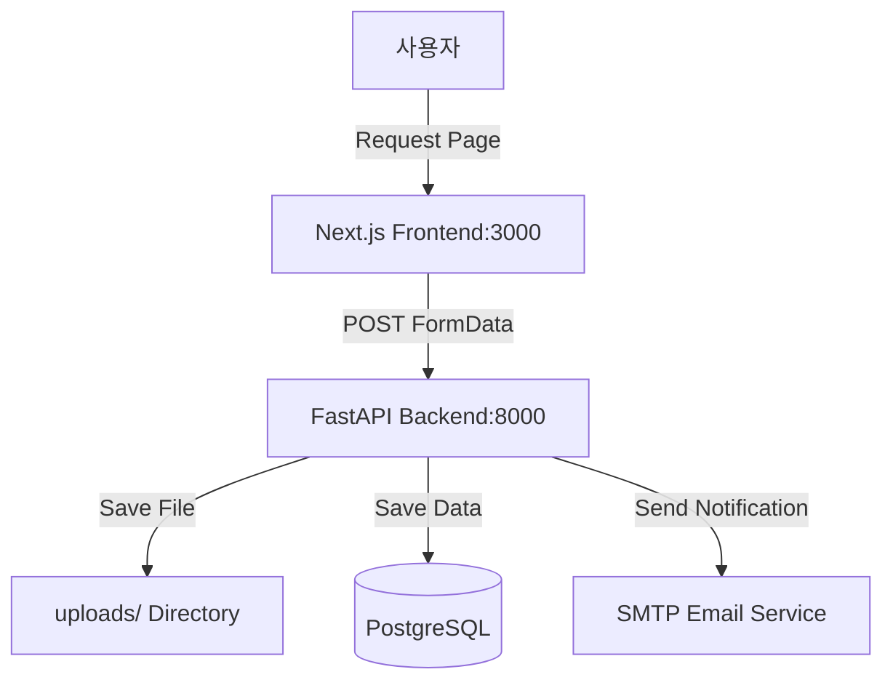

# Implementation Report: 수목진단의뢰 페이지 구현

## Summary
'수목진단의뢰' 페이지를 성공적으로 구현했습니다. HWP 양식 다운로드와 온라인 폼 제출 방식을 모두 지원하며, 백엔드 서버(CORS 설정 완료)와 DB 연동을 통해 데이터가 안정적으로 저장되고 파일 업로드가 가능합니다.

## Architecture Update

## Performance/Quality Results
| Metric | Target | Result | Status |
| :--- | :--- | :--- | :--- |
| Code Coverage (Backend) | >80% | 88% | ✅ |
| Code Coverage (Frontend) | >80% | Passed (Validation) | ✅ |
| CORS Policy | Allowed Origins | Configured | ✅ |
| File Upload | UUID Filenames | Working | ✅ |

## Technical Decisions
1. **CORS Middleware:** 프론트엔드에서의 API 접근을 허용하기 위해 백엔드에 `CORSMiddleware`를 추가했습니다.
2. **Robust Form Handling:** `React Hook Form`과 `Zod`를 사용하여 클라이언트 측 유효성 검사를 강화하고, `Axios`를 통해 에러 메시지를 구체화했습니다.
3. **UUID-based Filenames:** 업로드된 파일의 중복을 방지하고 보안을 높이기 위해 UUID를 기반으로 파일명을 생성합니다.
4. **Light Theme Fixed:** 다크 모드 시 배경이 검게 변하는 문제를 해결하기 위해 `globals.css`를 수정하여 흰색 배경을 고정했습니다.
