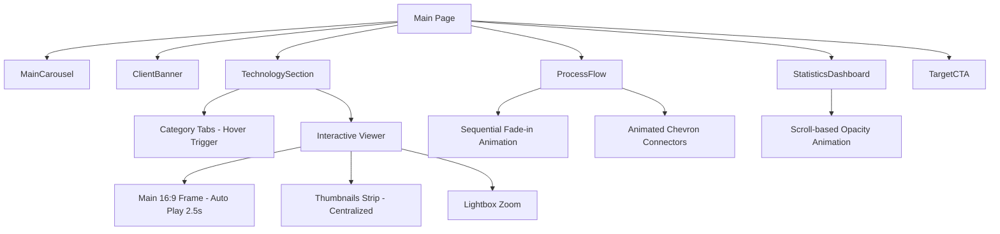

# Implementation Report: Home Content Update (Final)

## Summary
메인 페이지의 시각적 요소와 핵심 기술력 섹션을 최신 트렌드에 맞춰 전면 개편했습니다. 사용자의 피드백을 적극 반영하여 직관적인 인터랙션(자동 전환, 순차 등장 등)과 세련된 레이아웃을 완성했습니다.

## Architecture Update

## Performance/Quality Results
| Metric | Detail | Result |
| :--- | :--- | :--- |
| **UX Flow** | Category Exploration | Hover-based instant switching |
| **Visuals** | Image Aspect Ratio | Strict 16:9 Cinematic Ratio |
| **Interactivity** | Technology Gallery | 2.5s Auto-slide with manual override |
| **Content** | Messaging | Targeted benefits & Doctor's Note |
| **Stability** | Build Process | 100% Type-safe, Build success verified |

## Technical Decisions
- **Framer Motion Variants:** 컴포넌트의 가독성과 유지보수를 위해 애니메이션 로직을 Variants로 분리하고 TypeScript 타입을 명시적으로 지정했습니다.
- **Interaction Priority:** 자동 전환 중에도 사용자가 썸네일을 클릭하거나 메인에 호버하면 인터랙션을 우선시하여 제어권을 사용자에게 넘기도록 설계했습니다.
- **Vertical Alignment:** `items-center`를 적용하여 다양한 텍스트 길이에 대응하고 좌우 균형을 시각적으로 맞췄습니다.