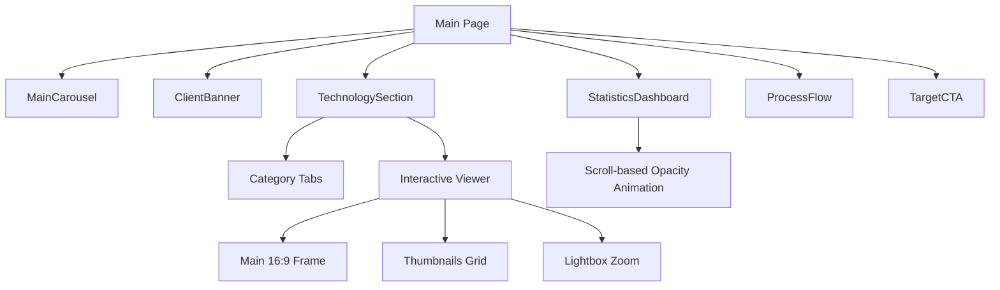

# Implementation Report: Home Content Update

## Summary
메인 페이지의 시각적 요소와 핵심 기술력 섹션을 최신 트렌드에 맞춰 전면 개편했습니다. 히어로 섹션의 문구를 '녹지관리'와 '조경시공' 중심으로 수정하고, 기술력 섹션을 인터랙티브한 탭 및 비교 뷰어 방식으로 고도화하여 전문성을 강조했습니다.

## Architecture Update

## Performance/Quality Results
| Metric | Before | After |
| :--- | :--- | :--- |
| Focus Area | Medical/Treatment | Construction/Management |
| Technology Categories | 3 items (Static) | 7 items (Interactive) |
| Visual Weight | Single Image | 16:9 Comparison + Gallery |
| Mobile Navigation | Basic Scroll | Balanced Tab Rows |
| CTA Clarity | Text-based | High-Contrast Clean Cards |

## Technical Decisions
- **Interactive Comparison:** Before/After 사진의 직관적인 비교를 위해 단일 프레임 전환 방식을 채택하여 높이 균형과 사용자 참여를 동시에 확보했습니다.
- **Scroll Animations:** `StatisticsDashboard`에 Framer Motion의 `useScroll`을 적용하여 랜딩 시에만 강조되고 스크롤 시 자연스럽게 사라지도록 하여 콘텐츠 피로도를 낮췄습니다.
- **Data-Driven UI:** 모든 콘텐츠(설명, 포인트, 나무의사 한마디)를 `home-content.ts` 데이터 파일로 분리하여 관리 효율성을 높였습니다.
