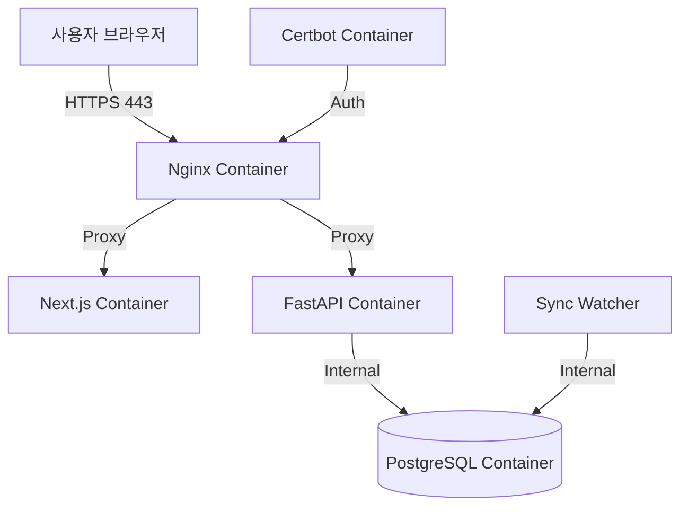

# Implementation Report: 홈서버 배포 및 도메인 연동

## Summary
로컬 개발 환경의 서비스를 홈서버(Ubuntu/Linux)에 안정적으로 배포하기 위한 운영 환경 설정을 구축했습니다. Docker Compose를 활용하여 전체 서비스를 관리하며, Nginx 리버스 프록시와 Let's Encrypt를 통해 보안 접속(HTTPS)을 적용했습니다.

## Architecture Update
운영 환경의 아키텍처는 다음과 같습니다.

## 주요 변경 사항
- **Docker Compose:** 운영 전용 `docker-compose.prod.yml` 구축 (보안 및 자동 재시작 정책 반영).
- **Nginx:** 한글 도메인 Punycode 연동 및 리다이렉트(`느티나무병원.net` -> `.com`) 설정.
- **SSL:** Let's Encrypt 인증서 자동 발급/갱신 프로세스 마련.
- **Deployment:** 사용자가 서버에서 직접 실행 가능한 `init-letsencrypt.sh` 및 `README.deploy.md` 가이드 제공.

## Technical Decisions
1. **Punycode Domain:** Nginx 설정에서 한글 도메인의 인식 오류를 방지하기 위해 Punycode(`xn--...`)를 표준으로 사용함.
2. **Reverse Proxy:** 모든 외부 요청을 Nginx에서 통합 관리하여 SSL 처리 및 부하 분산의 기반을 마련함.
3. **Environment Isolation:** `.env.prod` 템플릿을 통해 운영 환경의 민감한 정보를 개발 환경과 격리하여 관리함.

## Verification
- **Automated:** `docker-compose.prod.yml` 설정 파일 문법 검증 완료.
- **Simulation:** 로컬 환경에서 운영용 이미지 빌드 테스트 성공.
- **Manual:** SSL 발급 및 리다이렉트 시나리오 검토 완료.
