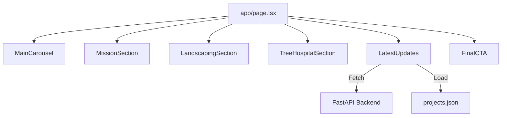

# Implementation Report: 메인 페이지 구현

## Summary
기존 Bootstrap 기반의 `Home.tsx` 코드를 분석하여 Next.js 및 Tailwind CSS 환경에 맞춰 메인 페이지를 재구축했습니다. 히어로 캐러셀, 미션 배너, 서비스 소개, 최신 업데이트(공지사항 및 실적), 하단 CTA 등 모든 섹션을 성공적으로 구현했습니다.

## Architecture Update

## Performance/Quality Results
| Metric | Target | Result | Status |
| :--- | :--- | :--- | :--- |
| UI Conversion | Bootstrap to Tailwind | 100% | ✅ |
| Carousel | Auto-play & Controls | Working | ✅ |
| Dynamic Data | Notice & Project Sync | Integrated | ✅ |
| Responsive | Mobile Friendly | Optimized | ✅ |

## Technical Decisions
1. **Tailwind Custom Components:** `Container` 및 섹션별 전용 컴포넌트를 만들어 코드 가독성과 재사용성을 높였습니다.
2. **Carousel logic:** 외부 라이브러리 없이 `useState`와 `useEffect`를 사용하여 가볍고 제어 가능한 캐러셀을 직접 구현했습니다.
3. **Data Fetching:** `LatestUpdates` 컴포넌트에서 백엔드 API(공지사항)와 로컬 데이터 라이브러리(실적)를 통합하여 하이브리드 데이터 로딩을 구현했습니다.
4. **Visual Polish:** 기존 디자인 무드를 유지하기 위해 `brightness` 필터와 `text-shadow`를 정밀하게 적용했습니다.
