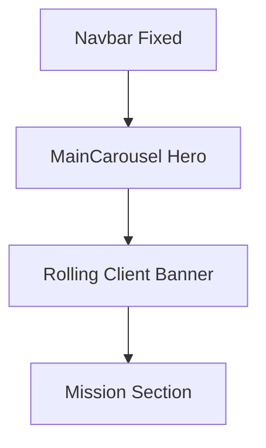

# Implementation Report: Main Page UX & Trust Improvement

## Summary
메인 페이지의 사용자 경험을 개선하고 전문적인 신뢰감을 줄 수 있도록 Hero 섹션 레이아웃을 수정하고, 발주처 CI 롤링 배너를 추가했습니다. 또한 타겟 사용자인 공무원 및 관리자들에게 신뢰를 줄 수 있는 시각적 지표(Social Proof)를 도입했습니다.

## Architecture Update

## Performance/Quality Results
| Metric | Before | After |
| :--- | :--- | :--- |
| **Hero Visibility** | Overlapped by Navbar | Fully Visible with Navbar Padding |
| **Trust Indicators** | Only text & photo | Stats (1,200+ projects) & Client Logos |
| **Visual Depth** | Fixed height, photo-only | Responsive (85vh), Gradient Overlay, High-contrast text |
| **Client Exposure** | None | Infinite Rolling Banner (Marquee) |

## Technical Decisions
- **Infinite Marquee:** CSS `@keyframes` 애니메이션과 리스트 복제 방식을 사용하여 JS 연산 없이 부드러운 롤링 구현.
- **Fixed Navbar Padding:** Navbar의 높이(h-16/h-20)에 맞춰 Hero 컨텐츠 컨테이너에 `pt-20 md:pt-24`를 적용하여 시각적 중앙 정렬 유지.
- **Social Proof:** 누적 실적 데이터를 히어로 섹션에 직접 노출하여 서비스 신뢰도를 직관적으로 전달.
