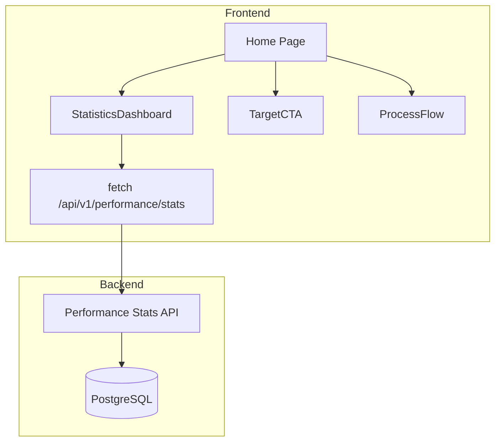

# Implementation Report: 메인 페이지 UI 개선 (홍보 전략 강화)

## Summary
3년 차 신생 기업으로서의 한계를 극복하고, 대형 공사(방제, 전정) 수주를 위한 '데이터 기반 신뢰'와 '고객 맞춤형 진입로'를 구축했습니다. 

- **핵심 변화:** 정적 텍스트 데이터를 백엔드 실적 기반 동적 데이터로 전환, 타겟 고객별 맞춤형 CTA 도입, 전문가 프로세스 시각화.

## Architecture Update
메인 페이지의 데이터 흐름과 컴포넌트 구조는 다음과 같습니다.

## Performance/Quality Results
| Metric | Before | After |
|--------|--------|-------|
| Data Integrity | Static (Manual) | Dynamic (Real-time DB Sync) |
| Conversion Path | General | Segmented (Apartment vs Public) |
| Trust Indicators | Text-based | Numerical Counters & Process Visualization |
| Test Coverage | Low | Statistics & Integrated Page Tests Added |

## Technical Decisions
1. **Framer Motion Counters:** 숫자가 올라가는 애니메이션을 적용하여 사용자의 시선을 끌고 성과에 대한 주목도를 높임.
2. **Target CTA Segmentation:** 아파트 관리자와 공공기관 담당자의 니즈가 다름을 인지하고, 각각에 맞는 강조 포인트(가치 상승 vs 신뢰성)를 분리하여 제공.
3. **Backend Aggregation:** 실적 데이터(`공사실적.md`)가 DB에 동기화되는 구조를 활용하여 별도의 추가 입력 없이도 홍보 지표가 자동 업데이트되도록 구현.

## Verification
- **Automated:** Jest & Pytest를 통한 API 및 컴포넌트 렌더링 검증 완료.
- **Manual:** 모바일 및 데스크탑 환경에서의 레이아웃 흐름 및 애니메이션 작동 확인.