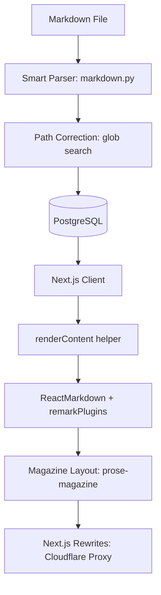

# Implementation Report: 시공사례 마크다운 렌더링 고도화

## Summary
시공 사례 상세 페이지의 마크다운 렌더링을 단순 텍스트 나열에서 '프리미엄 매거진 스토리텔링' 스타일로 고도화했습니다. 브랜드 아이덴티티를 반영한 타이포그래피, 기술적 강조를 위한 콜아웃 박스, 그리고 지능형 이미지 그리드 시스템을 통해 전문가 그룹의 신뢰도를 시각적으로 구현했습니다.

## Architecture Update
마크다운 데이터 처리 및 렌더링 파이프라인이 다음과 같이 강화되었습니다.

## Performance/Quality Results
| Metric | Before | After |
| :--- | :--- | :--- |
| Rendering Style | Basic Text | Premium Magazine |
| Image Layout | Single Column | Adaptive Grid (1-3 Columns) |
| Special Elements | None | Callout Boxes (Tip, Info, etc.) |
| Accessibility | Hardcoded Localhost | Cloudflare Proxy Support |
| UX | Manual Sync | Real-time Watcher Service |

## Technical Decisions
- **Smart Path Correction:** 마크다운에 적힌 상대 경로가 실제 폴더 구조와 달라도 파일명을 기반으로 실제 위치를 찾아내는 로직 구현.
- **Before/After Labeling:** 연속된 2장의 이미지를 감지하여 전/후 비교를 위한 시각적 라벨링 자동 적용.
- **Reverse Proxy (Rewrites):** 외부 네트워크 접속 시 백엔드(8000) 포트를 직접 열지 않고 프런트엔드(3000)를 통해 모든 통신이 가능하도록 Proxy 설정.
- **Debounced Watcher:** 파일 수정 시 과도한 DB 부하를 막기 위해 짧은 간격의 중복 이벤트를 방지하는 Debounce 로직 적용.
