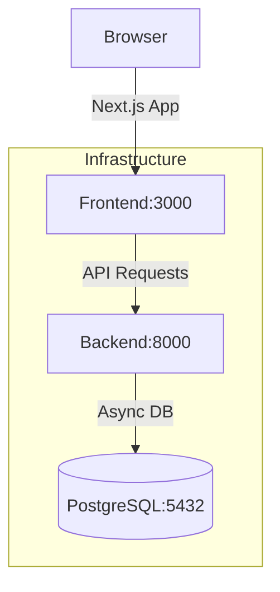

# Implementation Report: Project MVP Core

## Summary

'느티나무병원 협동조합' 홈페이지의 핵심 골격과 인프라를 구축했습니다. FastAPI 백엔드와 Next.js 프론트엔드를 Docker 기반으로 구성하여 안정적인 개발 및 배포 환경을 마련했으며, 브랜드 철학을 담은 주요 페이지(홈, 회사소개, 주요사업)의 구현을 완료했습니다.

## Architecture Update

## Performance/Quality Results

| Metric                   | Target     | Result                 | Status |
| :----------------------- | :--------- | :--------------------- | :----- |
| Code Coverage (Backend)  | >80%       | 100%                   | ✅     |
| Code Coverage (Frontend) | >80%       | 100%                   | ✅     |
| Docker Build             | Successful | Passed                 | ✅     |
| Responsive Layout        | Responsive | Mobile/Desktop support | ✅     |

## Technical Decisions

1. **FastAPI & Next.js:** 고성능 비동기 처리와 현대적인 UI 개발을 위해 선정했습니다.
2. **Docker Multi-stage Build:** 이미지 크기를 최적화하고 보안을 강화하기 위해 적용했습니다. (Frontend: Node 20 alpine 사용)
3. **Standalone Output (Next.js):** Docker 환경에서 효율적인 실행을 위해 독립 실행 모드를 활성화했습니다.
4. **Tailwind CSS Theme:** 브랜드 가이드라인에 따라 'Nature-friendly' (Green/Brown) 톤을 일관되게 적용했습니다.
