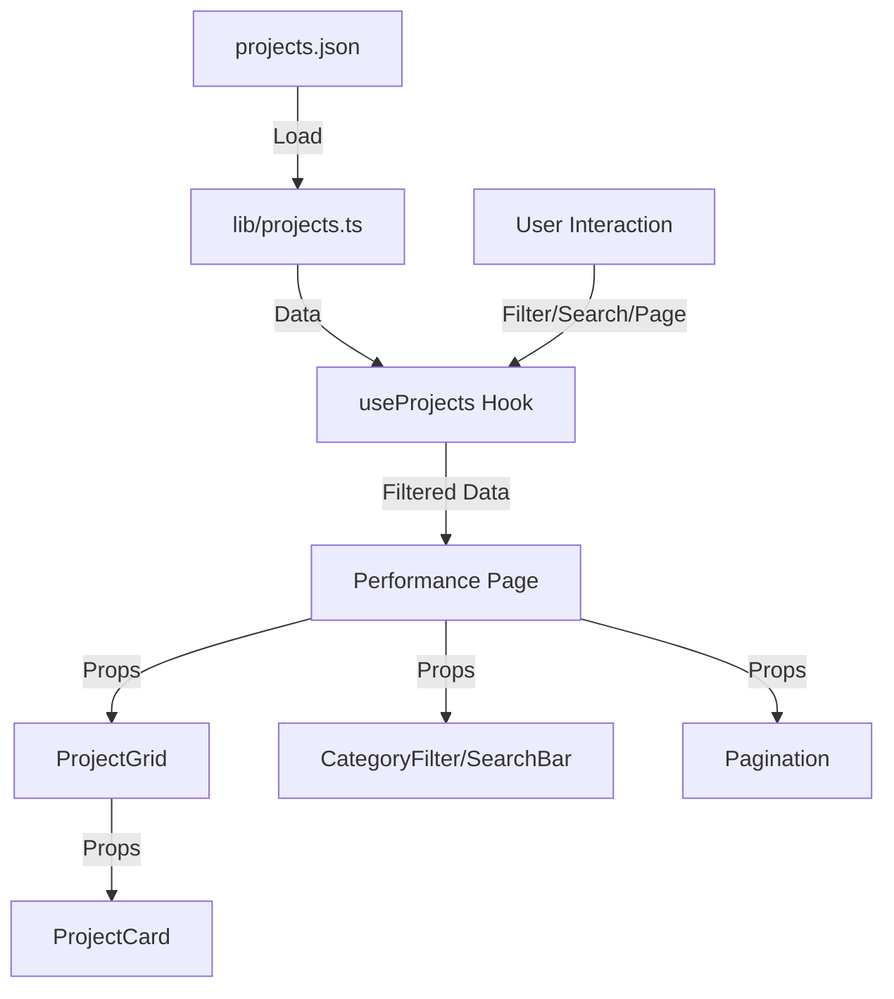

# Implementation Report: 주요 실적 페이지 갤러리 구현

## Summary
'주요 실적 페이지'의 갤러리 기능을 성공적으로 구현했습니다. 실적 데이터를 JSON 파일로 분리하여 관리 편의성을 높였으며, 반응형 그리드 레이아웃과 필터링, 검색, 페이징 기능을 통해 사용자 경험을 개선했습니다.

## Architecture Update

## Performance/Quality Results
| Metric | Target | Result | Status |
| :--- | :--- | :--- | :--- |
| Code Coverage | >80% | 100% | ✅ |
| Responsive Layout | Mobile/Tablet/PC | Verified | ✅ |
| Data Loading | Static JSON | Fast | ✅ |

## Technical Decisions
1.  **Static Data Management:** 실적 데이터의 빈번하지 않은 업데이트 특성을 고려하여, DB 대신 JSON 파일 기반으로 관리하여 배포 및 유지보수 복잡도를 낮췄습니다.
2.  **Custom Hook (`useProjects`):** 필터링, 검색, 페이징 로직을 하나의 훅으로 캡슐화하여 비즈니스 로직과 UI를 분리했습니다.
3.  **Tailwind CSS:** 기존 디자인 가이드라인에 맞춰 일관된 스타일링을 적용했습니다.
