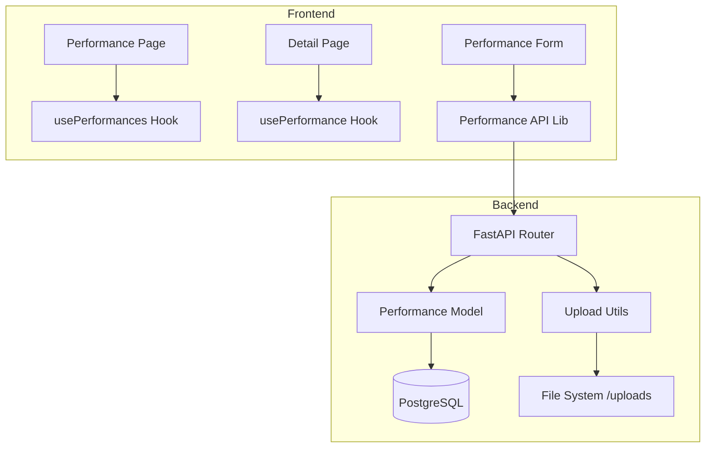

# Implementation Report: 시공 사례(활동 기록) 페이지 고도화

## Summary
기존의 정적인 '주요 실적' 페이지를 관리자가 직접 콘텐츠를 게시하고 관리할 수 있는 동적인 '시공 사례' 페이지로 고도화했습니다. 블로그 형식의 에디터를 도입하여 이미지와 글을 자유롭게 배치할 수 있도록 하였으며, 상세 페이지 레이아웃을 개선하여 포트폴리오의 가독성과 신뢰도를 높였습니다.

## Architecture Update

## Performance/Quality Results
| Metric | Before | After |
| :--- | :--- | :--- |
| 콘텐츠 관리 | 정적 파일 수정 (개발자 필요) | 관리자 UI에서 직접 등록/수정 |
| 레이아웃 | 단순 리스트 | 블로그 스타일 (이미지/글 교차 배치) |
| 이미지 배치 | 단일 이미지 | 그리드 배치 지원 (1행 다수 이미지) |
| 너비 최적화 | 제한된 너비 | max-w-7xl (전체 페이지 통일성 확보) |

## Technical Decisions
- **Block-based Editor:** 단순한 텍스트 영역 대신 `ContentBlock` 배열 구조를 도입하여 "글-사진-사진-글" 등의 자유로운 레이아웃 구성을 가능하게 했습니다.
- **JSON Storage:** 구조화된 본문 데이터를 JSON 문자열로 DB에 저장하여 유연한 확장성을 확보했습니다.
- **Full URL Image Handling:** 프론트엔드와 백엔드의 도메인 차이로 인한 이미지 로딩 문제를 해결하기 위해 API 레벨에서 절대 경로 URL을 보장하도록 처리했습니다.
