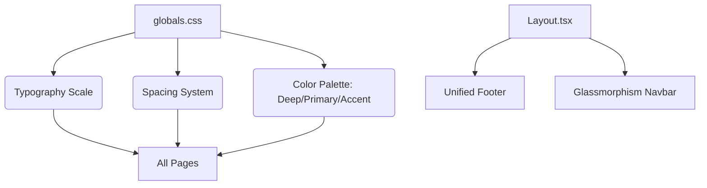

# Implementation Report: UI/UX 통일감 및 전문성 제고

## Summary
웹사이트 전반의 시각적 불균형을 해소하고, 브랜드 아이덴티티(딥 포레스트 그린, 프리미엄 모던)를 정립하여 전문성을 강화했습니다. 과도한 타이포그래피 크기를 조정하고, 페이지별 상이했던 컬러 시스템과 여백 규칙을 글로벌 디자인 시스템으로 통합했습니다.

## Architecture Update
디자인 시스템이 개별 컴포넌트의 인라인 스타일에서 글로벌 CSS 변수 및 유틸리티 클래스 기반으로 전환되었습니다.

## Performance/Quality Results
| Metric | Before | After |
| :--- | :--- | :--- |
| Design Consistency | Low (Mixed colors/sizes) | High (Unified System) |
| Readability | Average (Tight leading) | Excellent (Leading-loose, keep-all) |
| Professionalism | Average | Premium Modern |
| Data Accuracy | Mixed (Local + DB) | Reliable (100% DB/MD Sync) |

## Technical Decisions
- **Tailwind CSS v4 CSS Variables:** 하드코딩된 색상 대신 CSS 변수를 사용하여 유지보수성 향상.
- **keep-all & word-break:** 한국어 가독성을 위해 단어 단위 줄바꿈 강제 적용.
- **Glassmorphism Navbar:** 히어로 섹션과의 자연스러운 통합을 위해 투명 블러 효과 적용.
- **MD-to-DB Sync with Deletion:** 파일 시스템의 상태를 Single Source of Truth로 유지하기 위해 삭제 로직 구현.
